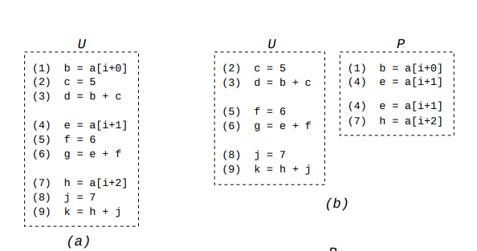
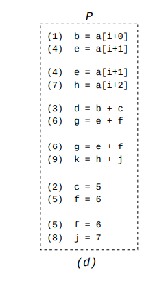
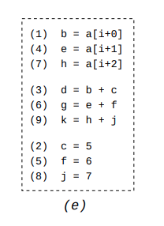
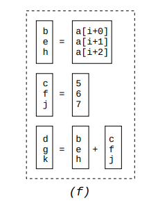

+++
title = "Exploiting Superword Level Parallelism with Multimedia Instruction Sets"
[extra]
bio = """
 Ankush Rayabhari is a first-year MS student in Computer Science at Cornell who
 is interested in databases and compilers.
"""
[[extra.authors]]
name = "Ankush Rayabhari"
+++

This week's paper [Exploiting Superword Level Parallelism
with Multimedia Instruction Sets](https://groups.csail.mit.edu/cag/slp/SLP-PLDI-2000.pdf)
tries to explore a new way of exploiting single-instruction, multiple data or
SIMD operations on a processor. It was written by Samuel Larsen and Saman 
Amarasinghe and appeared in PLDI 2000.

## Background

As applications process more and more data, processors now include so called 
SIMD registers and instructions, to enable more parallelism. These registers are
extra wide: a 512-bit wide register can hold 16 32-bit words. Instructions on
these registers perform the same operation on each of the packed data types.

For example, on Intel processors, the instruction `vaddps` adds each of the 
corresponding packed data elements together.
```
Instruction: vaddps zmm, zmm, zmm
Operation:
  FOR j := 0 to 15
    i := j*32
    dst[i+31:i] := a[i+31:i] + b[i+31:i]
  ENDFOR
```

Just having these instructions doesn't mean applications can make use of them.
Unless developers choose to handwrite assembly code or use libraries 
that do so, it's up to the compiler to identify and exploit opportunities to use 
these features. This paper proposes a new set of algorithms for that.

## Previous/Related Approaches

- **Vector parallelism:** At the time of this paper, existing vector compilers 
  generally targeted loops  as they provide a natural opportunity to run the 
  same operation on multiple pieces of data. They do this by using loop 
  transformations. For example, by applying loop fission and scalar expansion, 
  the following loop
  ```
  for (i=0; i<16; i++) {
    localdiff = ref[i] - curr[i];
    diff += abs(localdiff);
  }
  ```
  can be transformed into
  ```
  for (i=0; i<16; i++) {
    T[i] = ref[i] - curr[i];
  }
  for (i=0; i<16; i++) {
    diff += abs(T[i]);
  }
  ```
  While the first loop can use SIMD instructions to perform the subtraction of 
  multiple iterations at once, the second loop can't.

  Generalizations of this involve executing multiple iterations of a loop in 
  parallel though use of multiple cores.

- **Instruction level parallelism:** Here, multiple instructions are executed in 
  a single cycle. SIMD instructions are one way of accomplishing this. All 
  processors these days also feature
  [superscalar execution](https://en.wikipedia.org/wiki/Superscalar_processor) 
  where rather than have a single instruction execute, multiple instructions 
  are executed each cycle. This is very similar to using SIMD instructions but 
  requries no developer changes and is processor dependent. Techniques such as 
  loop fission and loop unrolling can increase parallelism by reducing data
  dependencies.

## Superword Level Parallelism

Superword level parallelism is the type of parallelism that the authors target. 
This can be thought of as the SIMD subset of instruction level parallelism. It 
is a sequence of short SIMD operations where the source and result data are 
packed into a SIMD register. Additional operations to pack the initial data into 
the source registers and some more operations to unpack the result might be
needed.

The authors devise a simple algorithm to convert a basic block that has
opportunities for SLP into one that exploits SIMD registers and instructions.
Broadly, the algorithm looks for sets of independent (no data dependencies),
isomorphic (same operation) statements to merge together.

### Algorithm

The algorithm proceeds in 4 steps:

1. First, identify pairs of independent memory loads from adjacent locations.
   These are natural candidates for SIMD loads. This is generally done by some
   enabling analysis as an initial step. We add these adjacent loads to a pack, 
   effectively the list of independent, isomorphic instructions that we 
   want to combine into a single SIMD instruction. We store all these packs in a
   set.

   
2. We now need to extend this set to contain non-memory operations. Since we
   want to take advantage of loaded data, we look for operations that use the 
   packed data that we loaded before. We do this by following the uses and defs 
   on the list of instructions that we packed. We can combine two statements 
   into the current set if:
   - The statements do the same operation on independent data.
   - It is beneficial to execute these at once rather than as multiple 
     instructions. If the data is already packed, then there's no additional 
     cost. However, if the data is not packed we have to take into account the 
     cost of moving them into the SIMD register.
   - The positions of the values in the SIMD register is consistent with the 
     previous packed statements. This is what the paper calls alignment.
   - To simplify the search space for the next part, we 
     only allow a statement to occupy the beginning or end instruction in a 
     pack list once. This way, we don't have to choose between multiple options 
     later down the line. For multiple choices, we use the cost model to
     determine the most profitable one.

   
3. Now that we have pairs of instructions that can be executed by a single SIMD
   instruction without any issues, we can combine multiple of these pairs into 
   an even wider SIMD instruction. Taking advantage of the last bullet above, 
   we only combine two lists if we have the exact same beginning and end 
   instruction. For example, we can merge the pack containing `(1) (4)` and 
   `(4) (7)` to a pack containing `(1) (4) (7)`.

   
4. The last part is to actually generate the concrete SIMD instructions.
   Since statement groups could depend on data defined by a previous one, we
   need to generate the instructions in a topological ordering of the data
   dependency graph. The original instruction order works so the scheduling 
   phase generates instructions in the order of the original basic block. To 
   deal with cycles, we simply revert the pack and use regular instructions 
   instead.

   

This routine will take in a single basic block and then convert it to a basic
block with SIMD instructions.

By simply unrolling loops, we can apply this to loops to get a vector parallel 
version.

## Performance Comparison

The authors chose to use a benchmark suite that consists of multimedia and 
scientific programs. These process heavy amounts of data, e.g., 
matrix multiplication or color conversion. Their experimental platform was a 
Motorola processor with an AltiVec co-processor, i.e., all vector instructions 
work on the coprocessor and all sequential operations on the main unit. Any 
movement between the vector registers and sequential registers must pass 
through memory.

They don't really compare with any other baseline implementations. They mention 
previous versions of this in their related work section but it would have been 
nice to see how many opportunities SLP can exploit over the loop transformation 
version. However, they do show which opportunities come from vectorizable 
(loop based) opportunities versus just SLP, which still shows large improvement,
just not as large.

One claim that they put forth (albeit a reasonable one) is that their approach
is more robust than the previous loop transformation techniques. It would be
have been good to see this experimentally verified in their chosen benchmarks.

## Limitations

The authors do a good job of highlighting several points that limit the 
effectiveness of vectorization.
- At the time, several architectures had different implementations of vector
  instructions. Additionally, they don't have first party support but use a 
  side-unit to achieve this.
- At the time, there was a lack of support for proper packing/unpacking. 
  Additionally, you can't move values between scalar and vector registers, 
  forcing you to use memory.

Looking to future work, LLVM 
[implemented](https://llvm.org/docs/Vectorizers.html#the-slp-vectorizer) the SLP 
vectorization algorithm. Additionally, a few of the same authors have worked on 
[improving](https://arxiv.org/pdf/1804.08733.pdf) the relaxed assumptions,
the reduced search space and greedy scheduling, by using techniques such as 
integer linear programming solvers.

## Questions

* How much of the burden of vectorization speedups should be on the compiler?
  Given the popularity of data processing libraries like NumPy that feature 
  already vectorized functions, should this area continue to be a focus of
  research?

* What has changed in the hardware support for vectorization since the release
  of the paper? Have the hardware limitations that the authors note in section 6
  been resolved?
  
