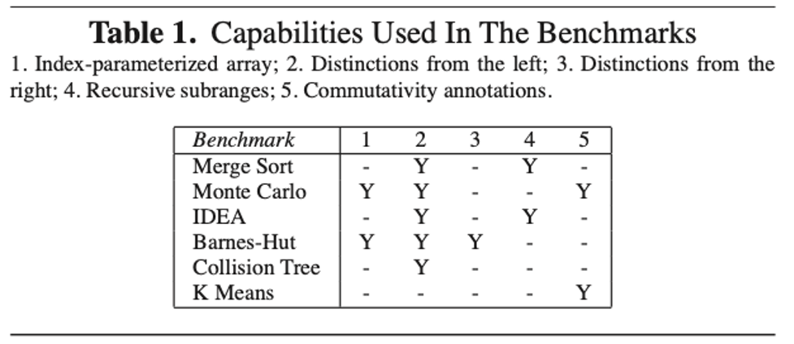
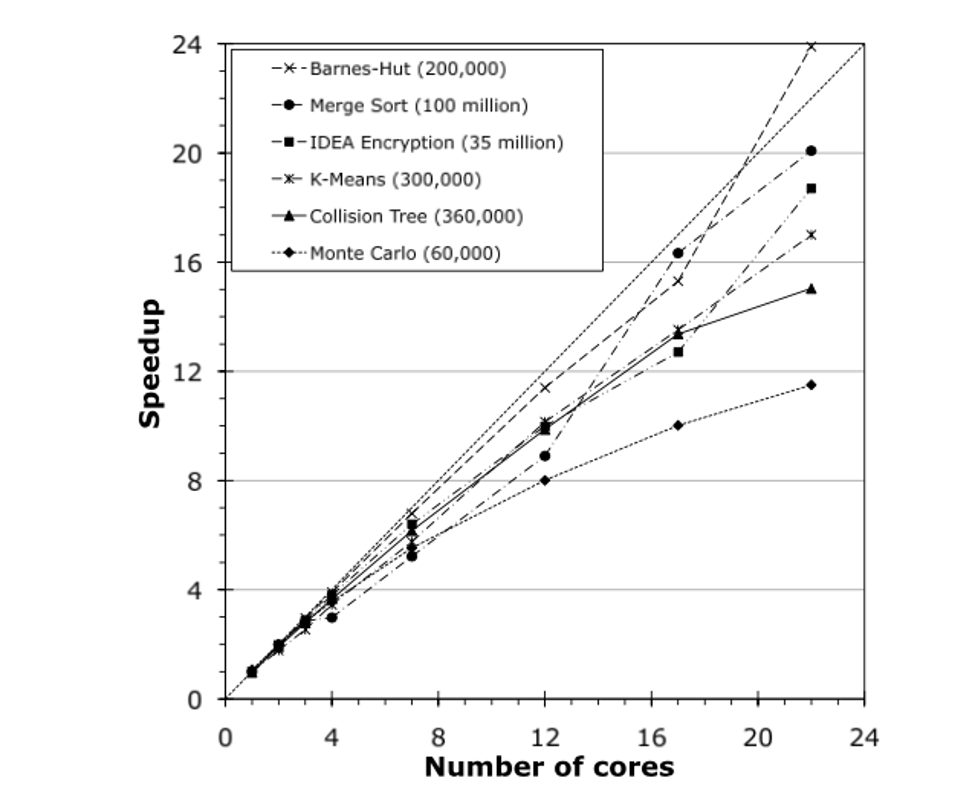
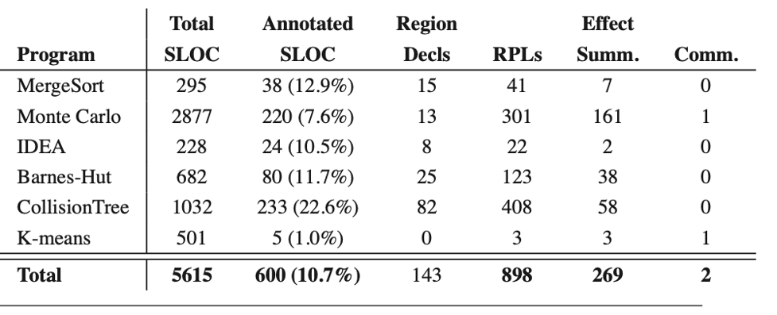

+++
title = "A Type and Effect System for Deterministic Parallel Java"
[extra]
bio = "
  [Hanchen Jin](https://hj424.github.io/) is a 4th year PhD student in Computer Systems Lab at Cornell. His reserach interest is compute architecture, hardware-software co-design, parallel computing with dedicated accelerators, and High-Level Synthesis (HLS).
"""
latex = true
[[extra.authors]]
name = "Hanchen Jin"
+++

## Background:
With the death of Moores’ Law around 2000, to further improve the compute power, the advent of multicore processors demands the behavior of parallel programming. And the dominant model is the multithreaded shared memory programming. It is inherently complex due to the possible thread interleavings that caused the nondeterministic program behaviors. This nondeterminism causes subtle bugs including data races, atomicity violations and deadlocks.

To avoid the nondeterminism, the parallel programmer applies locks and semaphores to enforce the deterministic programming. But this task is tedious, error prone, and challenging.

## Motivation
Many computational algorithms require deterministic behavior, but today’s shared-memory parallel programming model force programmers to implement these algorithms in a nondeterministic notation. And the programmers have to ensure the deterministic results by themselves, which is complex and error-prone.

## Solutions
(1) Deterministic-by-default programming model [1]  
This mode guarantees deterministic outputs in the given inputs unless the nondeterministic behavior is explicitly requested by the programmer in disciplined ways. But this guarantee determinism is only available for some restricted styles of parallel programming like data-level parallelism (DLP), and not available for imperative object-oriented languages like Java, C++, and C#. Because in such languages, object references, aliasing, and updates to mutable state obscure the data dependences between parts of a program, which makes hard to prove the real dependencies for program’s synchronization.

(2) A Type and Effect System [2,3]  
A type and effect system allows the programmer to give the names to distinct parts of the heap and specify the accesses to the heap in different parts of the program. Thus the compiler can check with simple modular analysis and properly synchronize threads running in parallel to ensure determinism. This type and effect system enables the runtime checks thus eliminates unnecessary runtime checks. An type and effect system can also be supplemented with runtime speculation [4,5] or other runtime checks [6,7] to enable greater expressivity.

Thus, the authors choose this method to simplify the parallel programming in Java by introducing deterministic semantics.

## Contribution

(1) The authors describe an region-based type and effect system that provides several new features (RPLs, index-parameterized arrays, subarrays, and invocation effects) over previous systems for expressing deterministic parallel algorithms. These feature guarantee determinism at compile-time.

Specifically, they introduce region path lists (RPLs), which enable more flexible effect summaries including effects on nested structures. They introduce an index-parameterized array type that allows references to provably distinct objects to be stored in an array while still permitting arbitrary aliasing of the objects through references outside the array. They also define the notions of subarrays and partition operations to enable in-place parallel divide and conquer operations on arrays. They also introduce an invocation effect with simple commutativity annotations to permit the parallel invocation of operations that may interfere at the level of reads and write, but still commute logically, i.e., produce the same logical behavior.

(2) The authors develop a formal definition of the static and dynamic semantics and a detailed proof that the system allows sound static inference about noninterference of effects.

(3) The authors describe a language called Deterministic Parallel Java (DPJ) that incorporates the new type and effect system, which supports the full flexibility of the sequential subset of Java.

(4) The authors demonstrate that a practical type of effect system can simplify parallel programming by guaranteeing deterministic semantics with modular, compile-time type checking even in a rich, concurrent object-oriented language such as Java. They study six real-word parallel programs writing in DPJ and shows good performance gains (coming close to or beating equivalent, nondeterministic multithreaded programs where those are available).

## Basic Features in DPJ
(1) Region names: a filed region declaration declares a new name r (called a field region name), which is associated with the static class.

(2) Region parameters: class and method region parameters which is similar to Java generic parameters. It enables us to create multiple instances of the same class with their data in different regions.

(3) Disjointness constraints: to control aliasing of region parameters. The programmer may write a disjointness constraint of the form P1 # P2, where P1 and P2 are parameters that are required to be disjoint.

(4) Partitioning the heap: use “in” to partition the heap into regions.

(5) Method effect summaries: every must conservatively summarize it heap effects, either read or write (write imply read).

(6) Expressing parallelism: cobegin block executes each statement in its body as a parallel task. Forreach loop is used in conjunction with arrays.

## New Features in DPJ
### 1. Region Path Lists (RPLs)
(1) Specifying Single Regions 
Each PRL names a single region, or set of memory locations, on the heap. The set of all regions partitions the heap, i.e., each memory location lies in exactly one region. The regions are arranged in a tree with a special region root as the root node. We say that one region is nested under another if the first is a descendant of the second in the tree.
(2) Specifying Sets of Regions 
To express recursive parallel algorithm, we must specify effects on sets of regions (e.g., all regions under R). A partially specified RPL contains the symbol “\*” (star) as an RPL element, standing for some unknown sequence of names. An RPL that contains no * is fully specified.
(3) Subtyping and Type Casts 
Partially specified RPLs are also useful for subtyping, with signals like “=” and “<=” to denote set inclusion. DPJ allows any type cast that would be legal for the types obtains by erasing the region variables.

### 2. Index-Parameterized Arrays
We can define a special array type with the restriction that an object reference value o assigned to cell n (where n is a natural number constant) of such an array has a runtime type that is parameterized by n. If accesses through cell n touch only region n (even by following a chain of references), then the accesses through different cells are guaranteed to be disjoint. Such an array is being called index-parameterized array. 

To represent such arrays, the authors introduce two language constructs:  
(1) An array PRL element written [e], where e is an integer expression. 
(2) An index-parameterized array type that allows programmer to write the region and type of array cell e using the array RPL element [e]. For example, programmers can specify that cell e resides in region Root:[e] and has type C<Root:[e]> 

### 3. Subarrays
A familiar pattern for writing divide and conquer recursion is to partition an array into two or more disjoint pieces and give each array to a subtask.  
(1) DPJ provides a class DPJArray that wraps an ordinary Java array and provides a view into contiguous segment of it, parameterized by start position S and length L. 
(2) DPJ provides a class DPJPartition, representing an indexed collection of DPJArray objects, all of which point into mutually disjoint segments of the original array. 
(3) To support recursive computations, the authors extend the syntax of RPLs by allowing a final local variable z of class type to appear at the head of an RPL which ensures that different partitions get different regions. 

### 4. Commutativity Annotations
(1) Classes may contain declarations of the form m commuteswith m’, where m and m’ are method names, indicating that any pair of invocations of the named methods may be safely done in parallel, regardless of the read and write effects of the methods. 
(2) To represent and check effects soundly in the present of commutativity annotations, the effect system provides a novel invocation effect of the form invokes m with E, which records that an invocation of method m occurred with underlying effects E. 

In summary, the authors formalized a subset of DPJ, called CoreDPJ as a sequential language. For more details about the syntax, static and dynamic semantics, please refer to the paper. 

## Evaluation
The authors extended Sun’s javac compiler which compiles DPJ into common Java source. And they built a runtime system for DPJ using the ForkJoinTask framework that will be added to the java.util.concurrent standard library in Java 1.7 [8]. The benchmark used for evaluation are parallel merge sort, two codes from the Java Grande parallel benchmark suite (a Monte Carlo financial simulation and IDEA encryption), the force computation from the Barnes-Hut n-body simulation, k-means clustering from the STAMP benchmarks, and a tree-based collision detection algorithm from a large, real-world open source game engine called JMonkey.

### Expressiveness and Coverage
The authors use DPJ to express all available parallelism for the benchmarks (Merge Sort, Monte Carlo, IDEA, K-Means, and Collision Tree), which shows the expressiveness of DPJ.

### Perforamnce
The experiment platform is as follows: a Dell R900 multiprocessor running Red Hat Linux with 24 cores, comprising four six-core Xeon CPU, with a total of 48GB main memory.

The figure shows the DPJ version speed up compared with the equivalent sequential version of the program. As we can learn from the figure, the actual speedup is reasonable compared with the ideal performance gain, thus proves that the DPJ adds negligible runtime overhead for achieving determinism.

### Porting Effort
The following table shows the efforts required for changing the Java source code to the equivalent version in DPJ. Programmer need to modify about 10% of the original code, and most of them are about writing RPL arguments when instantiating types, followed by writing method effect summaries.

## Limitations 
1. Programmer are required to use the correct semantics to enforce the correctness and determinism of the program. For instance, the commuteswith should be used mostly by library and framework code that is written by experienced programmers and extensively tested.

2. When exploring some kind of parallelism in DPJ, programmers are required to relocate the data layout for achieving better performance. For example, to achieve good cache performance in Barness-Hut, the body code that runs in parallel should be copied to the new destination region at the point of re-insertion.

## Questions
1. Have you ever written any multi-threaded programs in any programming languages? How did you divide up the workload and enforce the synchronization?

2. Have you ever try multi-threading in Java? What is the key limitation of writing concurrent program in the current Java programming model?

3.  Do you think Java is the best language for multi-thread programming? How about use C++ which offers more low-level control of the memory layout?

4. The authors in this paper provides the new features to help the programmer building the programs running in parallel. But the overall effort of writing, testing, and debugging a program with any parallel programming model is dominated by the time required to understand the parallelism and share patterns, and to debug the parallel code. Thus, probably the program synthesis technique could be our final goal? 

## References
[1] R. Bocchino, V. Adve, S. Adve, and M. Snir. Parallel programming must be deterministic by default. First USENIX Workshop on Hot Topics in Parallelism (HotPar), 2009. 
[2] A. Greenhouse and J. Boyland. An object-oriented effects system. ECOOP, 1999. 
[3] J. Boyland. The interdependence of effects and uniqueness. Workshop on Formal Techs. for Java Programs, 2001. 
[4] M. K. Prabhu and K. Olukotun. Using thread-level speculation to simplify manual parallelization. PPOPP, 2003.<br/
[5] C. von Praun, L. Ceze, and C. Cas ̧caval. Implicit parallelism with ordered transactions. PPOPP, 2007.<br/
[6] Z. Anderson, D. Gay, R. Ennals, and E. Brewer. SharC: Checking data sharing strategies for multithreaded C. PLDI, 2008. 
[7] M. Snir. Parallel Programming Language 1 (PPL1), V0.9, Draft. Technical Report UIUCDCS-R-2006-2969, U. Illinois, 2006. 
[8] Concurrency JSR-166 Interest Site: http://gee.cs.oswego.edu/dl/concurrency-interest 

