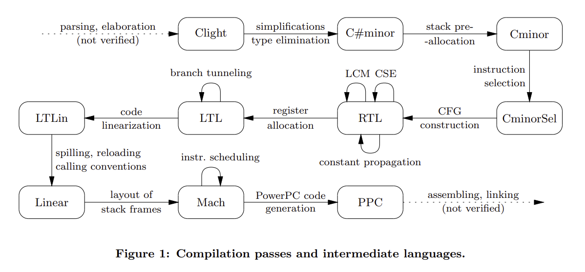

+++
title = "CompCert: the Double-Edged Sword of Verification"
[extra]
latex = true
bio = """
Priya Srikumar is a senior undergraduate at Cornell University. 
They like researching compilers, verification, and programming languages!"""
[[extra.authors]]
name = "Priya Srikumar"
link = "https://priyasrikumar.github.io/"
+++ 

"[Formal verification of a realistic compiler][compcert]" presents CompCert as the first formally verified C compiler. The "realistic" moniker comes from the fact that the compiler's source language is a significant subset of C that is used to write embedded systems code. Its target language is for a processor that is commonly used in avionics. But what does it mean to verify a compiler? Let's get into it!

## Source Language 

CompCert works with a subset of the C language. It does not support `long long` and `long double` extended precision arithmetic, `goto` statements, `struct` and `union` parameters, unstructured switch statements such as [Duff's device][duff], programs using `setjump`, threaded programs, or functions with varying argument numbers. CompCert transforms programs in C into [Clight][clight], which has a deterministic big-step operational semantics. Expressions with side effects and block-scoped variables are not supported in Clight, but can be compiled with CompCert through desugaring in the parsing process.

## Target Language

CompCert can generate assembly for PowerPC in 32-bit mode. Today, it can also generate assembly for RISC-V, ARM v6+ with the VFP coprocessor for floating-point arithmetic, and x86 with the SSE2 extension for integer-vector operations. 

## CompCert Structure 

There are 25 passes that comprise CompCert. The first 3 convert C to Clight. There are 19 compiler backend passes at present, 8 of which perform optimizations. The last 3 turn CompCert's internal representation into assembly code which is then linked to generate an executable. Here's the system visualization from the original paper: 
### Frontend

CompCert uses a user-configured preprocessor to interpret macros and preprocessor directives, making no guarantees about the relationship between the preprocessed output and the source code. CompCert uses [Menhir][menhir] to create lexing and parsing automata; lexing is unverified, but parsing has been proven to accept the same language as the C grammar Menhir used to generate the lexer and parser. For instance, if the grammar recognizes [ISO-C-99][c99] (henceforth C99), then the parser automaton is a verified C99 parser. After the C program is parsed into a C AST, an unverified pass typechecks the AST and demarcates reserved registers, linker sections, and definitions to be used in a given section, transforming the C AST into a *CompCert C* AST. 

### Backend

The passes I'll cover are all verified and implemented in Coq (we'll understand what it means to verify a pass in just a few sections!). Feel free to skim or skip this if the system diagram is granular enough. 

The __first pass__ translates CompCert C into Clight by desugaring unsupported expressions and variables. 

The __second pass__ rewrites the Clight program into one that ensures function parameters are temporary variables on the stack at the time the function is called. 

The __third pass__ translates Clight into the [C#minor][csminor] intermediate representation, simplifying loop and `switch` statements in addition to resolving address computation and overloaded function applications. 

The __fourth pass__ translates C#minor into Cminor, where the only addressable variable a function takes is the stack. Cminor is the last intermediate language in the compiler that is independent of computer architecture. Work on [separation logic for Cminor][cmsl] to support reasoning about concurrency as well as the development of a [verified static analyzer for C#minor][csmsa] make Cminor an attractive target for other C compilers. 

The __fifth pass__ translates Cminor into CminorSel, which performs instruction selection on sequences of operations that can be done in one instruction (for instance, an add instruction with a constant becomes an immediate-add instruction for 32-bit Intel architecture). Loads and stores are also translated into the target architecture's addressing conventions. If the target language doesn't support required operations, such as 64-bit arithmetic, this pass will fail and compilation will be aborted.

The __sixth pass__ generates a CFG from CminorSel with nodes in [RTL][rtl]; it looks like a [graph of instructions][rtlv]. Included is a size-based heuristic to select which branch of an `if` statement is the fallthrough one. 

Now, we can start optimizing the RTL code. The following passes transform the RTL CFG.

The __seventh pass__ transforms ignored or immediately used function calls into tail calls, which do not need a new stack frame to be allocated. This transformation can remove transitions in the CFG, such as returning a function call result directly instead of a variable assigned to it and used only to return the result. That'll throw a wrench in our proof of correctness, but more on that later. 

The __eighth pass__ performs function inlining based on the presence of the `inline` keyword at the call site. Recursive functions are inlined once, and recursive calls are not inlined (especially since inlining a function that increases the caller's stack block beyond the largest integer causes compilation to fail). Since this pass can eliminate CFG nodes, proving correctness needs to be adjusted.  

The __ninth pass__ renumbers the CFG nodes in post-order with respect to their edges, in order to make the following static analyses more efficient. The algorithm used is Kildall's, outlined in pseudocode [here][kildall]. 

The __tenth pass__ performs constant propagation. This pass may also replace instruction operators in the case that some arguments are statically known. Since the number of transitions may change, correctness needs to take this into account. 

The __eleventh pass__ executes common subexpression elimination, although it's not performed on function calls. Originally, this pass was not very aggressive: it didn't consider `x + y` and `y + x` equivalent. This has since been amended by improving their dataflow equation solver. There's also support for CSE for builtin function invocations that do not modify memory or registers. 

The __twelfth pass__ is dead code elimination. This may make a nonterminating program terminate. For example, suppose a variable is assigned to an integer divided by zero, but that variable is never used. This pass will turn the variable assignment into a `nop`. Again, this requires a notion of correctness that allows this change to occur.

The __thirteenth pass__ removes unused global variables. 

The __fourteenth pass__ takes the optimized RTL CFG and transforms it into an [LTL][ltl] CFG, which uses machine registers and stack slots and has basic blocks as nodes instead of individual instructions. Register allocation is done via the [iterated register coalescing algorithm][irca]. The algorithm is implemented in OCaml; if it succeeds, the LTL AST translation is [validated][vregalloc] with respect to the original function. Translation validation is different from verification in the sense that the implementation of the transformation itself is not verified; rather, its outputs are checked for semantic equivalence with its inputs.

The __fifteenth pass__ does branch tunneling, which makes uninterrupted branch and conditional branch sequences fall through to the last destination in the sequence. Again, correctness needs to be reevaluated given that the number of transitions may change. 

The __sixteenth pass__ linearizes the LTL CFG by replacing graph edges with jumps (unless a jump would be equivalent to falling through to the following instruction). In order to minimize the number of jumps inserted, an OCaml program picks a block ordering that maximizes fall-throughs. A Coq program then goes over the blocks in that order to generate an instruction sequence. Since program transitions may change in this translation, correctness needs to be adjusted here too.

The __seventeenth pass__ removes unused labels. 

The __eighteenth pass__ modifies the linearized code at call and return points to conform to the target architecture's conventions.

The __nineteenth pass__ outputs an AST corresponding to one of the target assembly languages. 

### Getting to Executable Assembly

An OCaml function prints the target assembly AST with proper register and instruction names. This output is then assembled into an object file with an assembler, and linked with other object files (separately compiled or in the same pass). `gcc` is the most common external assembler and linker used to do this. These three passes are unverified. 

# CompCert Correctness Claims

CompCert promises that it will not mistranslate code it compiles successfully. Specifically, the executable it generates will not perform any action that the source code could not perform given that an executable was able to be generated. 

## Semantic Preservation, Intuitively

*Semantic preservation* requires that the compiled code's behavior (generally, the trace of all I/O and mutable operations as well as the exit code) is a refinement (or subset) of the source code's behavior, where refinement may include the removal of diverging dead code, as in the twelfth pass. What does this look like formally? 

## Proving Compiler Correctness

Let $\mathcal{C}$ be a compiler, and $\sim$ a simulation (essentially, a relation that specifies when two programs behave the same way). To be correct, $\mathcal{C}$ must guarantee that for all source programs $s$ that $\mathcal{C}$ compiles, $\mathcal{C}(s) = t \rightarrow s \sim t$. Note that a compilation failure means that this theorem doesn't apply, since there's no $t$ produced. 

### CompCert Approaches to Verified Compilation

Reasoning about the source code of a compiler is intuitively straightforward, but difficult to verify and inefficient in practice. Alternatively, an unverified compiler may be paired with a verified *translation validator* $\mathcal{V}$, which halts compilation if translation validation fails. Our promise then becomes: $\mathcal{C}(s) = t \land \mathcal{V}(t) = \texttt{true} \rightarrow s \sim t$ for all source programs $s$. If the validator correctly validates results, then we have a verified compilation process. 

## Specifying Preservation with Simulations 

CompCert has a semantics of source and target language code behavior. Given such a semantics, we can formulate different notions of *simulation* such that two programs are equal if they are related by simulation. This section can be skipped if you're not too concerned with the mechanics of the proof of correctness. 

Let a source language program $\mathbf{s}$ begins at state $s_0$, runs for $n$ steps, and ends at state $s_n$. Let a target language program $\mathbf{t}$ begins at state $t_0$, runs for $m$ steps, and ends at state $t_m$. State transitions may have effects, so let each transition $s_i \rightarrow s_j$ be accompanied by a label $e_{s_j}$ specifying the potential effect.

### Bisimulation

Two programs are bisimilar if their actions "match" in the sense that they are observationally indistinguishable. Formally, a *bisimulation* relation between a source and target program is a relation $R$ with these conditions: 

* $(s_0, t_0) \in R$
* For all $s_i$, $s_i \rightarrow s_{i+1}$ with effect $e_{s_{i+1}}$ implies that for all $t_j$ where $(s_i, t_j) \in R$, there exists a $t_{j+1}$ such that $t_j \rightarrow t_{j+1}$ with effect $e_{t_{j+1}}$ and $(s_{i+1}, t_{j+1}) \in R$ and $e_{s_{i+1}} = e_{t_{j+1}}$.
* For all $t_j$, $t_j \rightarrow t_{j+1}$ with effect $e_{t_{j+1}}$ implies that for all $s_i$ where $(s_i, t_j) \in R$, there exists a $s_{i+1}$ such that $s_i \rightarrow s_{i+1}$ with effect $e_{s_{i+1}}$ and $(s_{i+1}, t_{j+1}) \in R$ and $e_{s_{i+1}} = e_{t_{j+1}}$.

### Backward Simulation

Bisimulation is great, but prohibits optimizations: a source program with a bunch of `nop` instructions would require that the target program have the same number of them. A *backwards simulation* relaxes the requirement of a one-to-one mapping between source and target program actions. Specifically, it's a relation $R_\leftarrow$ such that:

* $(s_0, t_0) \in R_\leftarrow$
* For all $t_j$, $t_j \rightarrow t_{j+1}$ with effect $e_{t_{j+1}}$ implies that for all $s_i$ where $(s_i, t_j) \in R_\leftarrow$, there exists a $s_k$ such that $s_i \rightarrow^+ s_k$ with effect $e_{s_k}$ and $(s_k, t_{j+1}) \in R_\leftarrow$ and $e_{s_k} = e_{t_{j+1}}$.

The second point mandates that for all target transitions, there is *at least one* source transition; $\rightarrow^+$ indicates there may be more than one transition. (We'll ignore the problem of composing effects.)

### Forward Simulation

We could instead require that for all source transitions, there is *at least one* target transition. A *forward simulation* $R_\rightarrow$ requires:

* $(s_0, t_0) \in R_\rightarrow$
* For all $s_i$, $s_i \rightarrow s_{i+1}$ with effect $e_{s_{i+1}}$ implies that for all $t_j$ where $(s_i, t_j) \in R_\rightarrow$, there exists a $t_k$ such that $t_j \rightarrow^+ t_k$ with effect $e_{t_k}$ and $(s_{i+1}, t_k) \in R_\rightarrow$ and $e_{s_{i+1}} = e_{t_k}$.

#### Measured Forward Simulation

For several of the passes we went over, there might be no corresponding target transition for a source transition, such as a pass that removes `nop` instructions. Particularly, a source program that diverges while a target one gets stuck in one state violates semantic preservation as intuitively defined. To avoid this, we will use a well-founded measure on source states, $<$, to prove that a relation $R_\rightarrow^*$ has the following properties:

* $(s_0, t_0) \in R_\rightarrow^*$
* When $s$ steps to $s'$, one of two things must happen.
    * $t$ steps to $t'$, and $(s', t') \in R_\rightarrow^*$
    * $t$ does not step, but $(s', t) \in R_\rightarrow^*$, and $s' < s$.

The measure $<$ allows us to require that the source program progresses as it steps. 

### Composing Simulations

We need to show two things about simulations in order to prove CompCert correct. For the sake of these proof sketches, let's assume that there are no effects or `nop` transitions. 

#### Forward Simulations Compose

Suppose there are two forward simulations: $R_1$ from $\mathbf{S}$ to $\mathbf{M}$, and $R_2$ from $\mathbf{M}$ to $\mathbf{T}$. Let $R_3 =$ {$(s_i, t_k) | (s_i, m_j) \in R_1 \land (m_j, t_k) \in R_2$}. We will prove that $R_3$ is a forward simulation from $\mathbf{S}$ to $\mathbf{T}$.

The initial states of $\mathbf{S}$ and $\mathbf{T}$ are related by construction of $R_3$. If $s_i$ steps to $s_{i'}$, and $(s_i, m_j) \in R_1$, we know that there is an $m_{j'}$ such that $m_j\rightarrow m_{j'}$ and $(s_{i'}, m_{j'}) \in R_1$. Similarly, if there is a $t_{k}$ such that $(m_j, t_{k}) \in R_2$, there exists a $t_{k'}$ such that $t_k\rightarrow t_{k'}$ and $(m_{j'}, t_{k'}) \in R_2$. Again by construction, $(s_i, t_k) \in R_3$. Therefore, $t_{k'}$ matches the transition from $s_i$ to $s_{i'}$.

#### Forward Simulations $\rightarrow$ Backward Simulations

The theorem assumes a deterministic target language. We will prove that a forward simulation $R_\rightarrow$ from $\mathbf{S}$ to $\mathbf{T}$ implies a backward simulation $R_\leftarrow$ from $\mathbf{T}$ to $\mathbf{S}$.

Suppose $(s_i, t_j) \in R_\rightarrow$, with $t_j$ stepping to $t_{j'}$. All transitions out of $s_i$ must therefore match the transition from $t_k$, since $t_{j'}$ is unique due to the target language's deterministic semantics. Were this to not hold, the assumed forward simulation would be contradicted.

### Correctness, Composed

Each pass between Csem and Asm is proved with a forward simulation, some with a measure, some with direct transition correspondences. 

By composing these simulations, we get forward simulations from RTL to Asm, from Cminor to Asm, and from Cstrategy to Asm. 

We can then derive backwards simulations for these three language pairs.

The theorem of correctness then asserts that Csem is in backwards simulation with Cstrategy, and therefore in backwards simulation with Asm. 

### Limitations

CompCert doesn't guarantee that the executables it generates simulate the input C99 program; C99 and the executable itself lack formal semantics. In reality, CompCert verifies that its compilation from its semantics for C99, *CSem*, to its semantics for assembly languages, *Asm*, preserves those semantics. While this may seem like a distinction without a difference, there is an implicit assumption that the specification of CSem and Asm fully encompasses the correctness requirements that we want from our compiler. We'll see that that assumption isn't always guaranteed to hold.

#### Nondeterminism in Languages

Nondeterminism in the *source* language weakens backward simulations, as their proofs only need to work for one of the source transitions possible. C99 is nondeterministic; CompCert addresses this by employing a reduction strategy [CStrategy][cstrat] that chooses one of the source program's potential behaviors.

Nondeterminism in the *target* language weakens forwards simulations, as there may be runtime target program behaviors that are not accounted for in the proof. CompCert avoids this problem by proving that its target languages are deterministic. 

#### Diverging Source Programs

If we wanted diverging source programs to produce diverging target programs, the compiler would probably be able to do fewer optimizations, such as the dead code elimination example in the twelfth pass. Alternatively, compilation could fail on more programs; this is also not great, since we'd like to support as many programs as we can. CompCert approaches this by embedding source program safety and defined behavior into the assumptions of its correctness theorem.

### What's Missing? 

Short answer: a lot! CompCert doesn't say anything about the semantics of the preprocessed C code. Nothing about safety of the assembling or linking processes, either. It doesn't guarantee that the executable has no segfaults or null pointer exceptions. It doesn't assume compilation halts, since the OCaml and other unverified portions may not terminate. Neither the compiler nor the code it generates has promises for time or space efficiency. It can't reason about threaded programs. Whether due to CompCert's implementation or C's limitations, CompCert has faced criticism for its restricted capabilities. At the same time, CompCert has proven itself practically usable throughout its existence.

## Beyond the Original CompCert Paper

John Regehr and coauthors in a [PLDI 2011 paper][csmith] remarked

> *“The striking thing about our CompCert results is that the middle end bugs we found in all other
compilers are absent. As of early 2011, the under-development version of CompCert is the only
compiler we have tested for which Csmith cannot find wrong-code errors. This is not for lack
of trying: we have devoted about six CPU-years to the task. The apparent unbreakability of
CompCert supports a strong argument that developing compiler optimizations within a proof
framework, where safety checks are explicit and machine-checked, has tangible benefits for
compiler users.”*

The only bugs found in CompCert have been in the unverified frontend, which is now mostly verified, and in the assembly code generation, where a number was too large for a field in the instruction encoding. The latter error was not of concern to the authors as assemblers generally catch these errors, while optimization bugs are notoriously difficult to completely patch in unverified compilers.

In 2015, static analysis tool vendor [AbsInt][absint] joined the project to market and maintain the software, while Xavier Leroy and INRIA continued to spearhead CompCert research efforts. This is why all of the CompCert code linked here is under the AbsInt organization. AbsInt's involvement with CompCert is alluring; a project where engineering issues are handled in parallel with research questions seems to promise faster progress.

Airbus, an aerospace corporation, uses CompCert to compile the software for its planes. A [2014 report][airbus] from the company indicated that the worst-case execution time of its programs had improved by 12% since integrating CompCert. The commercial success of CompCert speaks to its ability to hold its own as an optimizing compiler, even though it still doesn't employ some more aggressive code optimizations. 

### An Achilles' Heel: Separate Compilation

Consider the following two programs.

`a.c`:

    #include <stdio.h>
    int x;
    extern int* const xptr;
    int main() {
        x = 1;
        *xptr = 0;
        printf("%d\n", x + x);
        return 0;
    }

`b.c`:

    #include <stdio.h>
    extern int x;
    int* const xptr = &x;

When CompCert (version 2.4) compiles these programs separately and they are linked, the output is `2`, when it should actually be `0`. The global variable `xptr` is a `const` in `a.c`, so CompCert's value analysis assumes it's always uninitialized and assigns it $\bot$. Therefore, `xptr` is deemed unaliasable with `x`, and in `a.c`, `x` is presumed to be `1`. Constant propagation then replaces `x + x` with `2`. `xptr`'s declaration as `extern` means that `b.c` is able to initialize it, aliasing `x` and `xptr`. This bug, discovered by the authors of [SepCompCert][scc] in their efforts to verify separate compilation, is astoundingly egregious. It raises the question: how do we know that compiler correctness theorems encompass the behavior exhibited by the compiler? Relatedly, when do we know if a language specification characterizes its programs correctly? 

I don't know the answers to those questions, or the ones I'm asking you for discussion. I don't think that writing compilers in Coq is going to become the standard, but I do think that developing a formal semantics for several intermediate languages will lower the threshold for verifying compilers. CompCert has changed the way we approach compiler correctness and proof engineering for the better, and I can't wait to see where the next decade takes us in this field. 

## Questions

* Xavier Leroy undertook the feat of engineering CompCert as a research endeavor. Should he have spent that time differently? Should implementation be left to industry? Does theoretical ideation hold value without the promise of practical use? 
* In some sense, verifying software becomes a "turtles all the way down" problem where different tools must be assumed correct (or in need of verification). For instance, were a bug to be found in Coq, the correctness of CompCert would be meaningless. How small is small enough for a compiler's [trusted computing base][tcb]? What makes CompCert valuable if we don't assume that the tools used are correct, if anything?
* Suppose you were asked to verify the full functionality of LLVM, fixing correctness bugs as needed but not significantly refactoring the implementation. You can't employ translation validation as a tactic. Would you augment CompCert with proofs of LLVM's optimizations, or would you scorch the earth and verify a new language akin to LLVM? (Check out the [tweet and resulting discourse][twt] that inspired this question!)
* More generally, do you think it's worth it to keep trying to verify buggy, unsafe tools instead of searching for better alternatives? Should we spend time and effort to convince everyone to work with formally specified languages?
* How do you think software testing will evolve with verified software?

[absint]: http://www.absint.com/
[airbus]: http://projects.laas.fr/IFSE/FMF/J3/slides/P05_Jean_Souyiris.pdf
[c99]: http://port70.net/~nsz/c/c99/n1256.pdf
[compcert]: https://xavierleroy.org/publi/compcert-CACM.pdf
[clight]: https://xavierleroy.org/publi/Clight.pdf
[cmsl]: http://web4.ensiie.fr/~blazy/AppelBlazy07.pdf
[csminor]: https://github.com/AbsInt/CompCert/blob/master/cfrontend/Csharpminor.v
[csmith]: https://www.cs.utah.edu/~regehr/papers/pldi11-preprint.pdf
[csmsa]: https://xavierleroy.org/publi/verasco-popl2015.pdf
[cstrat]: https://github.com/AbsInt/CompCert/blob/master/cfrontend/Cstrategy.v
[duff]: https://en.wikipedia.org/wiki/Duff%27s_device
[irca]: http://www.cse.iitm.ac.in/~krishna/courses/2012/odd-cs6013/george.pdf
[kildall]: https://github.com/AbsInt/CompCert/blob/master/backend/Kildall.v#L218
[ltl]: https://github.com/AbsInt/CompCert/blob/master/backend/LTL.v
[menhir]: http://gallium.inria.fr/~fpottier/menhir/
[rtl]: https://en.wikipedia.org/wiki/Register_transfer_language
[rtlv]: https://github.com/AbsInt/CompCert/blob/master/backend/RTL.v
[scc]: https://people.mpi-sws.org/~dreyer/papers/sepcompcert/paper.pdf
[tcb]: https://en.wikipedia.org/wiki/Trusted_computing_base
[twt]: https://twitter.com/johnregehr/status/1334590514616680450
[vregalloc]: https://xavierleroy.org/publi/validation-regalloc.pdf