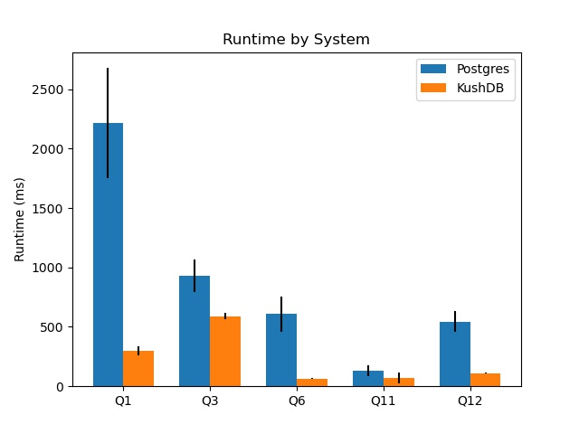
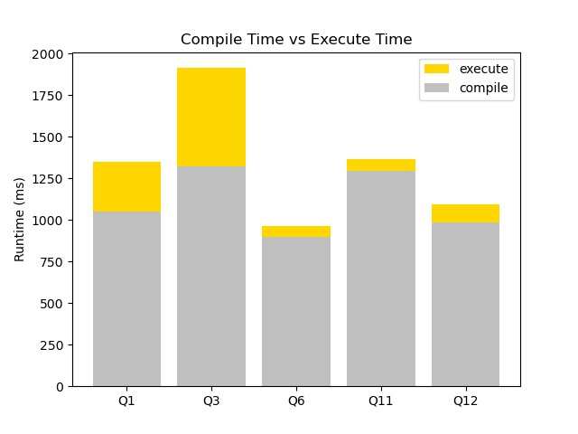

+++
title = "Compilation-based Execution Engine for a Database"
[extra]
bio = """
 Ankush Rayabhari is a first-year MS student in Computer Science at Cornell who
 is interested in databases and compilers.
"""
[[extra.authors]]
name = "Ankush Rayabhari"
+++

My project was to implement a compilation-based execution engine for a database. The code is located [here](https://github.com/ankushrayabhari/kushdb/).

## Introduction

Existing database systems initially convert a SQL query to a tree of relational algebra operators and then interpret that plan. In the past, this wasn't a bottleneck as the main cost of processing data was reading and writing data to disk. Since the amount of CPU time spent processing data was negligible compared to the disk access time, the overheads of interpretation didn't play a large role.

Nowadays, databases have access to faster storage and large amounts of main memory which means that the CPU time spent processing data is much more valuable. To reduce the overhead of interpretation, we can directly compile trees of operators down to binary and then execute them. This projects explores implementing such a compiler.

## Background

### Relational Algebra

The initial step of any database is to convert SQL to a tree of [relational algebra](https://en.wikipedia.org/wiki/Relational_algebra) operators.

For example, this query gets converted to the following tree of operators:
```
SELECT * FROM A JOIN B ON a_key = b_key WHERE x > 5
Filter(
  Join(Scan(A), Scan(b), ColRef(a_key), ColRef(b_key)), 
  CompExpr(LT, ColRef(x), Literal(5))
)
```

The key operators needed are Scan, Select, Join and Group By/Aggregate.

Joins are implemented by creating a hash table of one of its inputs and then for each tuple of the other input, concatenating it with any matching tuple in the hash table. Similarly, grouping is done by maintaining a map of the group by values to a bucket that contains all values in the group. Then, each aggregation function is computed over each bucket.

### Interpretation

Most existing databases use interpretation to generate the output. This is generally implemented by having a produce function for each operator. When you call it, the operator will call a produce function from its child operators which returns the next tuple (or null if it's done), process that tuple (filter by some condition, execute a map function, join data, etc.), and then return the processed batch.

For example, this would be what is executed for the interpreted version of `Filter(Scan(T), CompExpr(LT, ColRef(x), Literal(5)))`:
```
query {
  output = []
  while (t = child.produce()) {
    output.add(t)
  }
  return output
}

ColRef.evaluate(t) {
  return t[col]
}

CompExpr.evaluate(t) {
   l = left.evaluate(t)
   r = right.evaluate(t)
   return op(l, r);
}

Filter.produce() {
   while (t = child.produce()) {
      if (expr.evaluate(t)) {
        return t
      }
   }
}

Scan.produce() {
  return next tuple of T
}
```

While easy to implement from a system point of view, this leads to a lot of overhead as you have a function call boundary at each operator. This means values that are in registers need to be spilled and you have to invoke a virtual call which is expensive. 

### Compilation
Imagine the following equivalent code:
```
query {
  output = []
  for (t in T) {
    if (t[x] > 5) {
      output.add(t)
    }
  }
  return output
}
```
This should be much faster since there are no function calls (let alone virtual ones) and since tight loops are generated, values are kept in registered for as long as possible.

## High Level Design

### Producer/Consumer Interface

To generate code for an operator tree, we introduce produce and consume functions for each operator. Produce  generates a loop over the tuples in an operator's result. Consume is called by an operator's child surrounded by a loop over its result tuples. Effectively, produce signifies to "pull" tuples from an operator while consume "push"es them. Expressions have a produce function that generate code for calculating that expression.

To see this in action, let's consider the following psuedocode implementations for Scan and Filter:
```
Scan.produce() {
  output << "for (tuple in T) {"
    parent.consume()
  output << "}"
}

Filter.produce() {
  // To generate a loop over its result, generate a loop over its child's result.
  child.produce();
}

Filter.consume() {
  // This is called in a loop over the child's result
  output << "if (";
    cond.produce()
  output << ") {"
    parent.consume()
  output << "}"
}
```

It's worth taking some time to appreciate how elegant this is and check that it does indeed do what we want. I was positively awestruck when I first came across it.

Special care is needed for joins and group bys since they store some of the input into a hash table and then loop over it later. Here's some psuedocode for a hash-based join:

```
Join.produce() {
  // First, generate a loop over one side
  left_child.produce()
  // See consume for what gets generated in that loop

  // Then, generate a loop over the other side
  right_child.produce()
  // See consume for what gets generated in that loop
}

Join.consume(src) {
  if (src == left_child) {
    // This is called in a loop over the left child's result
    output << "add t into HT"
  } else {
    // This is called in a loop over the right child's result
    output << "for (t' in HT[t]) {"
      parent.consume(this)
    output << "}"
  }
}
```
What is needed to make this work is for us to specialize the consume function based on which loop this is generated in. We accomplish this by invoking the consume function with the operator that generated the loop. Similarly for group by:
```
GroupBy.produce() {
  // First, generate a loop over one side
  child.produce()
  // See consume for what gets generated in that loop

  // Then, loop over each bucket and then output the aggregation functions
  output << "for (bucket in HT) {"
    output << "t = compute(bucket)"
    parent.consume()
  output << "}"
}

GroupBy.consume() {
  output << "insert T into HT"
}
```

## Implementation

### Operator Tree

This is fairly standard. We introduce a base Operator and Expression class that is inherited by respective implementations. Each one can hold any number of child operators or expressions.

The only thing of note is that operators need to keep track of the schema that it outputs. For example, a table scan would have some or all the underlying table's columns in its schema. A filter operation would have the schema of its child. A join would have the schema of the concatenation of both its inputs. A group by would have the schema of whatever aggregation functions are defined on it. More generally, we associate an array of expressions as the output schema where each expression computes a function of the input schema values.

### Input

Since parsing and query planning/optimization are not the focus of this project, I've not implemented these. Rather, I manually enter a tree of relational algebra operators and then compile and execute that.

### Types

I map each of the SQL types to the following underlying type:

| SQL Type    | Implemented Type |
| ----------- | ----------- |
| SMALLINT | 16-bit signed integer |
| INT      | 32-bit signed integer |
| BIGINT   | 64-bit signed integer |
| BOOLEAN  | 8-bit boolean |
| REAL     | 64-bit floating point |
| TEXT     | Variable-length string |
| DATE     | 64-bit signed integer containing Unix millisecond timestamp |

### Storage

The file format used for a table consists of each of the columns stored as a separate file. The format of each column depends on its type:
- The format for all types except for TEXT consists of tightly-packed values of that data, much like an in-memory array. No other metadata such as cardinality is stored.
- For TEXT types, the format used is as follows. The first 4 bytes represent an unsigned 32-bit integer that contains the cardinality (number of strings) inside the file. Then, for each string, we store 8 bytes. The first 4 bytes are an unsigned 32-bit integer that contains the string length. The second 4 bytes are an unsigned 32-bit integer that contains the byte offset of the string's data in the file. After this metadata array, we store all the strings in a packed format.

To avoid having to implement a buffer pool manager and on-demand paging, I mmap the column files and rely on OS paging to handle this.

### Code Generation

We generate C++ code directly to simplify the implementation. All the types above are native C++ types that we can reuse in the implementation. For example, we can use int16_t, int32_t and int64_t for 16, 32 and 64-bit signed integers respectively. Code is generated within a compute function, `extern "C" compute() {...}`.

As mentioned in the design, we use the producer/consumer interface to generate the body of this compute function. Each operator in the tree needs to have a produce/consume function on it. While initially I developed these as plain functions that simply take in an operator as input, I quickly realized that the produce and consume function calls on the same operator needed to share state. For example, the hash join produce function outputs a hash table declaration while the hash join consume function relies on that same variable.

Because state needs to be shared, we could attach these extra state variables onto the relation algebra operators. However, for better separation of concerns, we create a wrapper translator object around each operator and then organize them into the same tree. This allows for per-operator state sharing without having to modify each of the plan classes. We use the visitor pattern to generate these translator wrappers.

Each translator needs to know which variables correspond to the schema of each operator. For example, the output operator needs to know which variables correspond to each column of the child operator's schema to know which variables to push into standard out. To handle this, each translator contains a list of variables that can be queried, one for each column of its output schema.

### Code Execution

Once the C++ file has been generated, we invoke clang on the file with optimizations turned on, allowing any C++ header defined in the codebase to be included. This enables us to reuse classes defined in the codebase such as the ones for file reading. This generates a dynamic library that we load into the database with dlopen. We retrieve the aforementioned compute function via dlsym and then execute it.

## Performance Evaluation

### Benchmark Suite

The specific benchmark suite I'm using is the TPC-H benchmark. The schema can be found in my code base in `tpch/schema.sql`. The underlying data is generated by an automated [tool](https://github.com/electrum/tpch-dbgen). This tool has various scale factors to run the query at. Scale factor 1 means there is a total of 1 GB of data, 10 means 10 GB of data and so on. I'm running these experiments on my rather underpowered (and out of disk space) laptop so I ran it at scale factor 1.

The queries involved are a mix of filters, group/by aggregations and joins. I've selected a set of 5 queries out of the whole benchmark to run the compiler on (queries 1, 3, 6, 11 and 12). These queries are unchanged except for the removal of subqueries, order by and having clauses as I don't support them. The remaining queries were mostly the same with those removed so I chose to omit them since I had to manually convert them to a physical query plan.

### Baseline

Postgres is a popular database that uses an interpretation-style execution engine so I thought it was fit to compare against as a baseline. Since my code is single-threaded, I set `max_parallel_workers` to 1. I also set `jit` off. Postgres includes a very basic compiler that will generate LLVM code for expressions only and not operators. However, since I am interested in comparing against the interpretation version, I set this off. I'm running Postgres 13.

Postgres does store tuples packed on disk while I store them separately. This does mean we load less data which gives us an unfair advantage but given that we have such low data size (only 1GB), I don't think this effect will greatly impact the results. I tried fixing this by generating code to load all columns on a scan but I believe the optimizations passes from clang eliminated them so unfortunately, I can't make this equal. I did take care to ensure that Postgres uses the same underlying data type for each column though.

I also verify correctness by checking that the query results are identical in Postgres.

### Setup

I'm running this on a Macbook Pro, Late 2013 with an i7-4750 HQ running Ubuntu 20.04 under the Windows Linux Subystem.

For both systems, I took total running times on the client. The result rows were printed but redirected to /dev/null.

### Results

None of the queries had a correctness error.

I ran 4 trials for each query and report the 95% (t-statistic) confidence intervals for the runtime. Note that this doesn't include the time to compile the query for our system, nor does it include the planning/parsing time for Postgres.

| Query | Postgres Interval (ms) | KushDB Interval (ms) 
| ----  | -------------------| -------------------|
| Q1    | 1747.46 - 2677.73  | 262.29 - 337.47 |
| Q3    | 795.16  - 1066.11  | 562.46 - 617.76 |
| Q6    | 87.88   - 177.81   | 63.75 - 65.31 |
| Q11   | 455.48  - 630.89   | 28.09 - 118.99 |
| Q12   | 562.46  - 617.76   | 105.98 - 114.08 |



For all queries generated, the compilation version greatly outperforms Postgres or matches it in the case of Q11. I suspect that the noise of measurement outweights any improvement in runtime given how fast both systems execute the query.

### Compilation Time

As I mentioned above, the above measurements only measured the time spent running the query. If we take into account the time to run clang -O3, a different result emerges.



At such low table sizes, the time spent compiling actually dominates. Note that the time spent compiling is fixed so as the database size grows larger, the yellow portion of the graph will increase and the grey portion will stay constant. This means the ratio of time spent compiling to time spent executing will decrease.

However, this is still unacceptable on smaller queries where Postgres outperforms the compilation version. In future work, I discuss some ways that this can be fixed.

## Personal Experiences

The largest barrier I had to overcome in working on this project was understanding all the pieces of the puzzle. I needed to understand each portion of the system enough to implement it.

## Future Work

While this generates extremely high performant code, the time spent compiling is extremely large. The following strategies are useful in reducing this:
- Directly generate LLVM. This removes any overhead for file I/O to output the C++ and parsing, type checking and converting that C++ to LLVM.
- Control which optimization passes run on this. For example, most of the overhead comes from dead copies that get inserted into the code. One GVN/DCE pass can get rid of these. Auto-vectorization would also prove beneficial here.

As always, there are a myriad of SQL features that I have not implemented as part of this project. Adding more features would allow me to test this more thoroughly.

Another aspect to explore is how best to parallelize the generate code. Existing techniques break the code up into the materialization boundaries and then use simple strategies to parallelize it.

Finally, to simplify the codebase, we can take advantage of operator overloading to define proxy types. For example, if you have `int`s a and b, writing a * b in your source code generates code that multiplies a and b. One more layer of indirection will simplify this. For example, if you have `proxy[int]`s a and b, writing a * b in your source code generates code that generates a program that multiplies a and b. This technique allows you to write code that behaves like the compilation version but appears like the interpreted version.

## Sources

I used the following sources as references:
- [NoisePage](noise.page)
- https://www.vldb.org/pvldb/vol4/p539-neumann.pdf
- https://db.in.tum.de/~kersten/Tidy%20Tuples%20and%20Flying%20Start%20Fast%20Compilation%20and%20Fast%20Execution%20of%20Relational%20Queries%20in%20Umbra.pdf?lang=en
- https://www.cs.purdue.edu/homes/rompf/papers/tahboub-sigmod18.pdf
