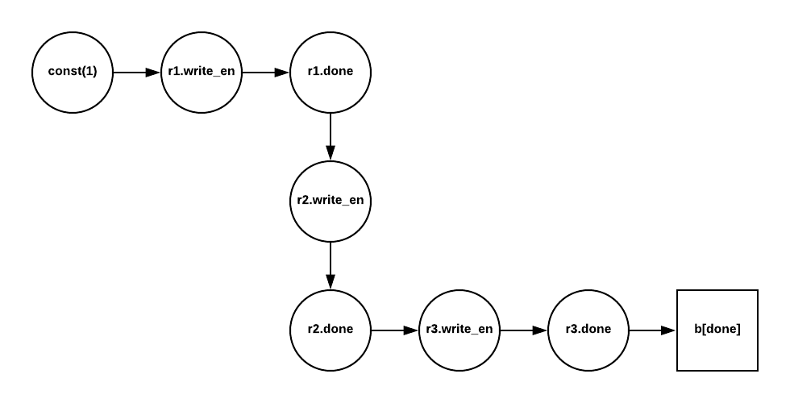
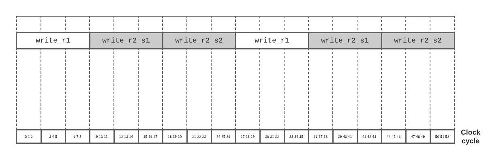
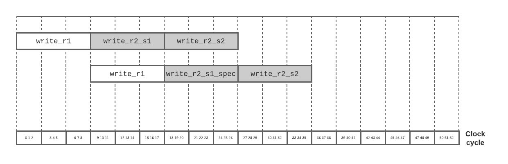
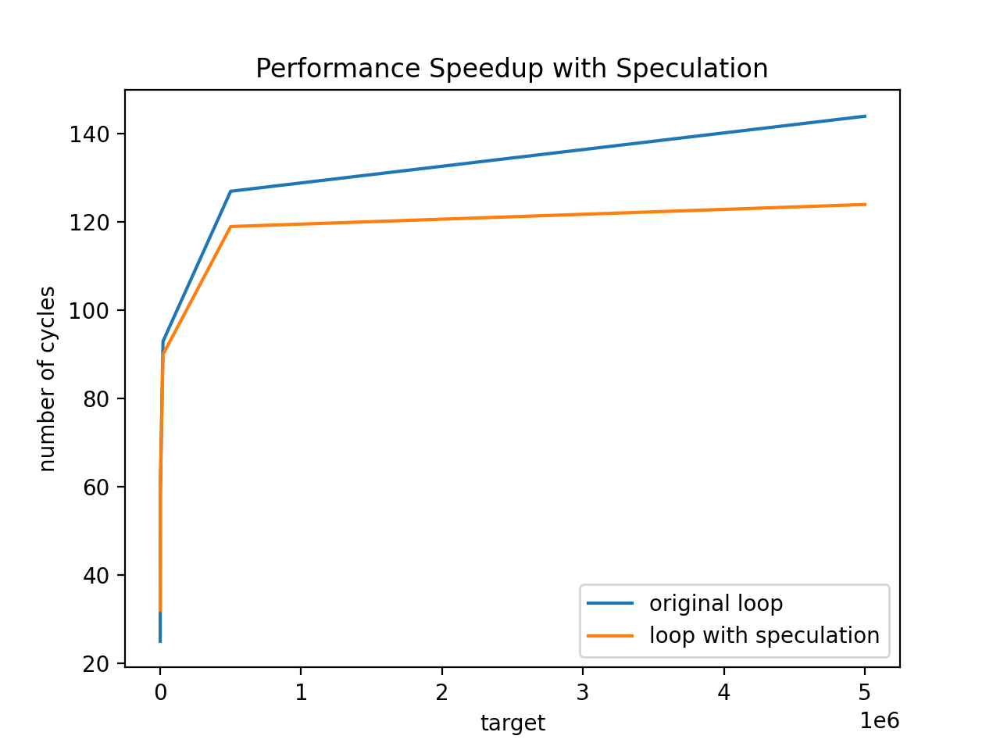

+++
title = "Experimenting with FuTIL"
[extra]
bio = """
  [Theodore Bauer](http://tedbauer.github.io/) is a first year M.S. student at Cornell who is interested in programming languages and systems. Outside of research, he likes spending time outside and making Spotify playlists.
"""
latex = true
[[extra.authors]]
name = "Theodore Bauer"
link = "http://tedbauer.github.io/"
+++

The [Capra][capra] lab at Cornell is building [FuTIL][futil], which is, quoted from its GitHub README, "an intermediate language and infrastructure for building compilers that generate custom hardware accelerators." One area of focus lately has been compiler optimizations; if we can write a good range of effective optimizations for FuTIL, it helps to build the case that it's a suitable target for new hardware programming languages.

For my CS6120 final project, I experimented with adding a few pieces of functionality to Calyx, FuTIL's compiler. I added a compiler pass that attempts to [statically infer latencies][inference-code] of subportions of FuTIL programs, and I experimented with adding another compiler pass that [augments while loops with speculative execution][speculation-code].

## FuTIL Basics

The FuTIL documentation has a great [tutorial][futil-tutorial] that illustrates the structure of FuTIL programs, and would be worth walking through to contextualize the rest of this blog post. Briefly paraphrased from the tutorial, FuTIL programs are composed of three sections:
- **a `cells` section**, containing the hardware subcomponents contained in the program. Those subcomponents are hereafter in this post called `cell`s. For example, the FuTIL standard library contains definitions for `cell`s such as memories or registers.
- **a `wires` section**, specifying the wires that connect `cell`s to one another via cell _ports_. For example, a `wires` section might contain the statement `x.in = y.out;`, which would represent connecting a wire between the `out` port of `y`, and the `in` port of `x`. These definitions can be organized into `group`s.
- **a `control` section**, defining when `group`s execute. FuTIL supports various control constructs, like `while` loops and `if`/`else` statements, as well as `par` and `seq` statements, to signal to execute `group`s in parallel or in sequence.


## Static Timing Inference Compiler Pass

### Introduction

The Calyx compiler features an optimization pass that leverages static knowledge about `group` latencies. Generated programs are sped up, because the compiler doesn't need to insert extra logic to wait for a `group` to finish, if it already knows the latency of the `group`. Frontends that are targeting FuTIL can supply this information with `group` annotations:

    group a<"static"=5> {
      ...
    }

The static timing inference pass attempts to infer this `"static"` value and insert it automatically, or error out if its inferred value doesn't match an already existing (and then necessarily incorrect) annotation.

### Inferring `group` Latencies

FuTIL `cell`s have _go/done_ interfaces. The `go` port for a `cell`, when _high_, indicates that the `cell` should start its computation. When the `cell` finishes executing, it will make its `done` port high. The names of these ports can be anything. For example, the FuTIL standard library contains a [definition for a register `cell`][registers], which has a `go` port called `write_en`, indicating that it's time to write a value, and a `done` port, indicating that the write is complete.

Inferring the latency of any `group` is uncomputable, as it almost directly amounts to solving the halting problem, so the static timing inference pass targets a subset of `group`s that meet some specific criteria:
1. All `go` ports are written to only by `done` ports or constants.
2. All `done` ports are only written to by other `done` signals.
3. The latency of each cell in this chain of `go`/`done` signals is known statically.

Expanding a little on condition 3, we know the static latency of some `cell`s---that is, the number of cycles it takes from the moment a `go` signal is raised to when the `done` signal is raised. For example, registers, as they are defined in the FuTIL standard library, have a latency of 1 cycle.

Here's an example of a group, named `a`, that meets the three criteria outlined above:

    group a {
      register1.write_en = 1'd1;
      a[done] = register1.done;
    }

The `go` port of `register1` is driven by a constant, and the `done` signal of the group is written by the `done` signal of `register1`, so the compiler pass infers that `a` takes 1 cycle to execute.

This idea can be extended to form these sort of `go`/`done` chains:

    group b {
      r1.write_en = 1'd1;
      r2.write_en = r1.done;
      r3.write_en = r2.done;
      b[done] = r3.done;
    }

The pass implementation infers latencies for these groups with a graph-based approach. The FuTIL codebase provides a convenient library for generating graphs representing different parts of FuTIL programs. The inference pass uses this graph library to generate a graph with the following algorithm:

1. Create nodes for every port in the group.
2. Draw an edge between each node $(u, v)$ if $u$ writes to $v$.
3. Draw an edge between each node $(u, v)$ if $u$ is a `done` signal, and $v$ is a `go` signal.
4. Delete isolated vertices (vertices with indegree and outdegree $0$).
5. Weight each edge after a `go` port with the latency of its parent `cell`.

For example, the group `b` would have this graph built from it:



The pass then simply traverses the path between the start node and end node (which can be found by computing the first and last elements of a topological sort), summing the edge weights along the way. If there is no path, then this sort of `go`/`done` chain pattern isn't in the `group`, and the pass conservatively gives up.

### Evaluation

I added some simple unit tests to the FuTIL test suite, to ensure some testing coverage of the compiler pass. The pass also runs during the existing FuTIL correctness tests, of which there are over 10 FuTIL programs, 3 of which are generated by a systolic array-to-FuTIL compiler.

## While Loop Speculative Execution

### Overview

I also added an experimental compiler pass that converts some FuTIL `while` loops to use speculative execution. For instance, this program performs a sequence of multiplications, until the value stored in register `r2` is greater than or equal to a number `target`:

```
while lt.out with cond { // while r2 < target
  seq {
    write_r1;    // r1 := r1 * 5;
    write_r2_s1; // r2 := r1 * 3;
    write_r2_s2; // r2 := r2 : 4;
  }
}
```

The multipliers used to perform these operations are engineered to take 3 clock cycles each. A normal, non-speculative schedule for this loop would look like this:



The pass transforms the loop to start with part of the body, namely `write_r1`, and then continue on to execute the rest of the loop, but in parallel with a speculative execution of the next iteration:

```
while lt.out with cond {
  seq {
    write_r1;

    par {
      seq { write_r2_s1; write_r2_s2; };
      seq { write_r1_spec; write_r2_s1_spec; write_r2_s2_spec; }
    }

    if lt.out with cond {
      commit_spec;
    }
  }
}
```

The speculative groups `write_r1_spec`, `write_r2_s1_spec` and `write_r2_s2_spec` are copies of their similarly named counterparts, but they write to buffer registers that are not committed to real registers (done with the group `commit_spec`) until the speculative iteration is confirmed to be required.

Such a transformed loop would be able to perform two iterations worth of work with a schedule like this, and save on clock cycles:



### Evaluation

I tried out the speculation-augmented loop above with varying values for `target`. At first, the overhead of the extra hardware needed to implement the speculative execution made the loop slightly more inefficient, for small values of `target`, but then quickly the performance speedup outweighed that cost:



### Future Directions

The speculative execution compiler pass transforms only a small number of loops that meet fairly specific criteria; it would be interesting to see how to make the pass applicable to a broader range of programs.

## Conclusion

The static inference pass and speculative execution pass both support the claim that FuTIL is a flexible and effective hardware intermediate representation. The static inference pass makes writing frontends a little bit easier, as the frontend developer doesn't need to supply as much static latency information; and the speculative execution pass demonstrates an example of a hardware optimization at the FuTIL level that brings tangible performance benefit.

[futil]: https://github.com/cucapra/futil
[capra]: https://www.capra.cs.cornell.edu/
[futil-tutorial]: https://capra.cs.cornell.edu/calyx/tutorial/langtut.html
[registers]: https://github.com/cucapra/futil/blob/master/primitives/std.lib#L264
[inference-code]: https://github.com/cucapra/futil/blob/master/calyx/src/passes/infer_static_timing.rs
[speculation-code]: https://github.com/cucapra/futil/blob/spec-execution/calyx/src/passes/while_spec.rs
