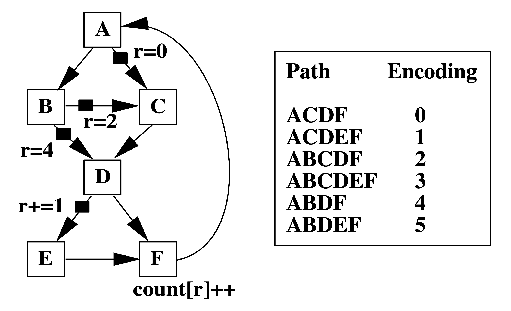
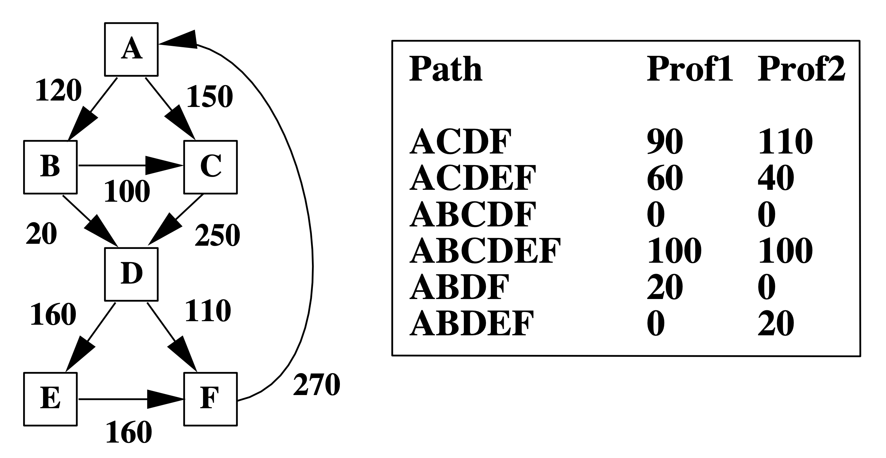
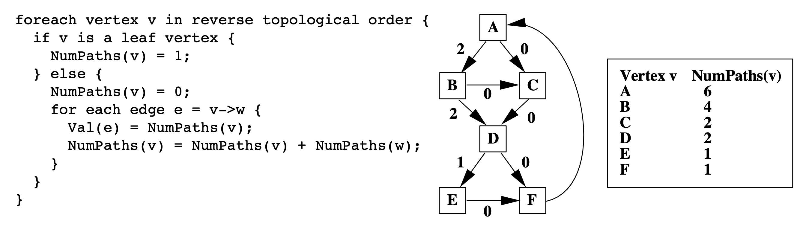
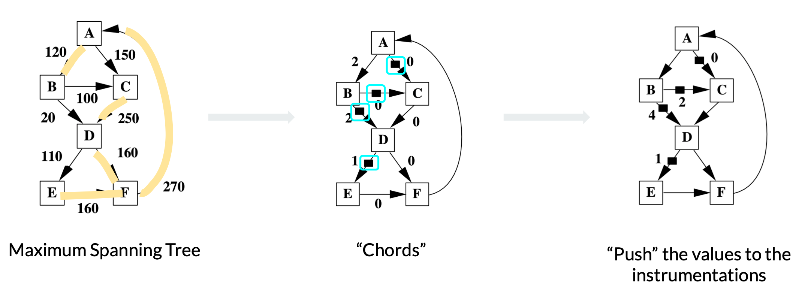
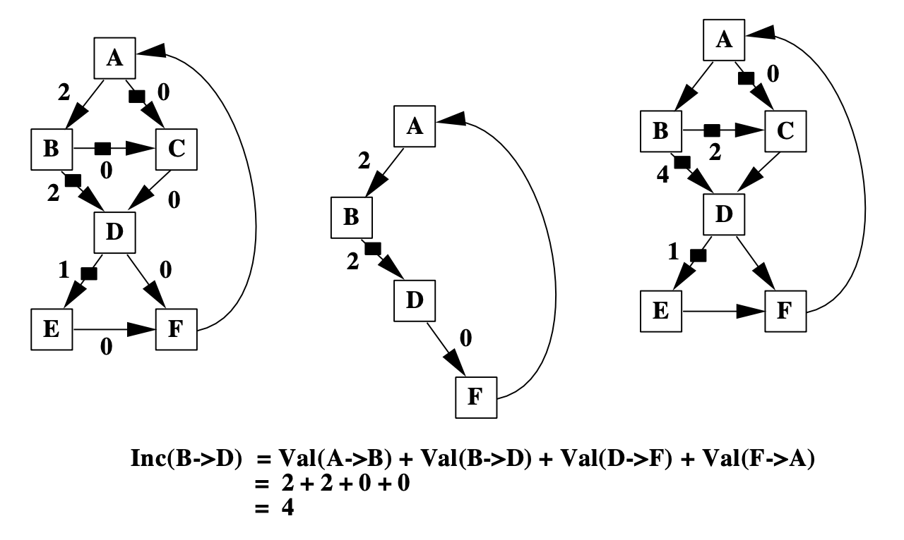
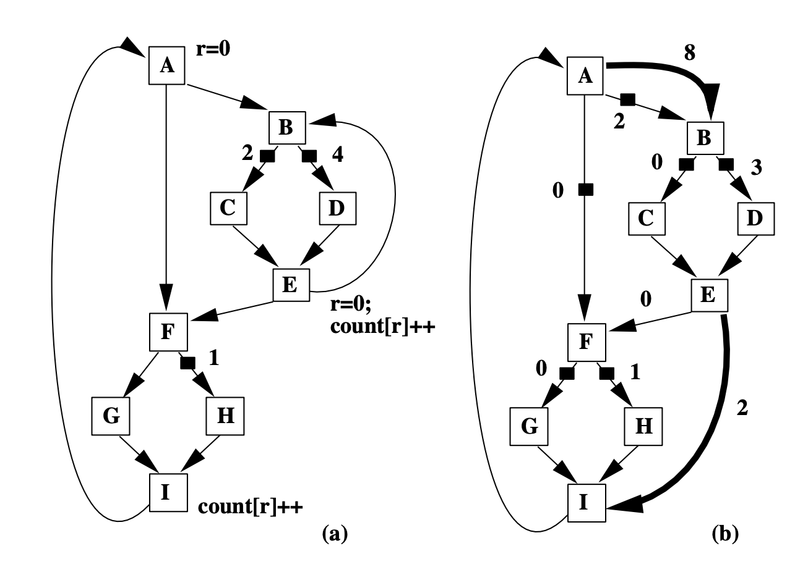
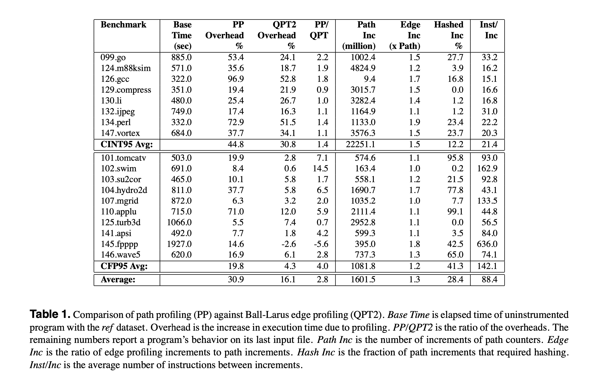

+++
title = "Efficient Path Profiling"
[[extra.authors]]
name = "Niansong Zhang"
link = "https://www.zzzdavid.tech"
[[extra.authors]]
name = "Jiajie Li"
link = "https://tonyjie.github.io/"
+++

## Introduction

### TL;DR

This paper addresses how to count each path’s execution times in a CFG with as little cost as possible. The algorithm has three steps. First, transform the CFG into DAG with a single back edge by removing the loop and adding dummy edges. Second, assign each edge a number so that each path sums to a unique encoding. Third, select edges on the least frequently executed paths to place instrumentations, and push the numbers to instrumentations while ensuring each path still sums to a unique encoding.

### Background & Motivation

The “old” way to identify heavily executed paths in a program is to approximate path frequency with edge or vertex frequency. However, this estimation is not accurate.

<strong> Left: A Control-Flow Graph (CFG) labeled with edge frequency. Right: Two possible path profiling results with the same edge frequency as the left figure.  </strong>

For example, the two path profiling results in the table correspond to the same edge frequency on the left. However, they identify two different most executed paths. Therefore, using edge frequency to estimate path frequency is unreliable. It is easy to find out that path profiling results could determine edge/block profiling results, while the opposite direction is not. 

Also, given an edge profiling result, a commonly used heuristic to select a heavily executed path follows the most frequently executed edge out of a basic block, which identifies path ACDEF in the above example. However, this path is not the most frequently visited in both Prof1 and Prof2, showing the inaccuracy of edge/block profiling. 

The naive way to count how many times each path executes is to exhaust every path in the CFG and label each one. However, this quickly becomes intractable as the CFG becomes large, or the CFG contains cycles and therefore infinite paths. 

In short, the motivation is to use an efficient path profiling method instead of traditional block/edge profiling to improve the accuracy without increasing too much effort. To have a preview, the overhead of path profiling is 30.9%, while the overhead of edge profiling is 16.1%. (You can decide whether this overhead is acceptable for you!)

### Overview

The essential idea behind path profiling is to encode paths with states. When passing through edges, we increment a register and naturally arrive at a unique number for each path. Furthermore, we can reduce the times we increment the register by placing “instrumentations” on some edges. This process is also “reversible”: we can find out the exact path in the Control-Flow Graph (CFG) given the encoding of that path. 

The paper starts from a CFG with a single back edge and generalizes to CFGs with multiple back edges. The experiment section evaluates the efficient path profiling algorithm across SPEC95 benchmarks and demonstrates a 30.9% runtime overhead on average.

### Generating Path Encodings

How do we generate unique encoding for each path? We use the following simplified example to illustrate intuition.

<strong>A simplified example of generating path encoding  </strong>

There are four paths in the graph; we now assign a value to each edge to make the path sum unique. We label the first outgoing edge to zero at the root node. Since we know along that edge there are three paths, we label the second outgoing edge with three.  

The intuition of the path encoding algorithm is to count the number of paths along “the other” edges and increment by the number of paths. 

<strong> The path encoding generation algorithm </strong>

Therefore, we count the number of paths from leaf nodes to the root node. In other words, we visit vertices in the reverse topological order. 

**Discussion**: based on the discussion in class, we think the time complexity of this algorithm can be represented as both O(n*n) and O(e) because every edge is only visited once. 

### Instrumentation

It turns out we don’t have to increment the register at every edge. Instead, we can select a subset of edges where we increment the register and still get unique path encodings, thus increasing the efficiency of the path profiling algorithm. We place instrumentations on the selected edges to denote register increments.

Instrumentation aims to minimize the profiling overhead, namely the latency and memory overhead of incrementing registers and counters. Concretely, we want to increment the register as few times as possible. Therefore, the paper develops an approach to select the least frequently executed edges based on a prior edge profiling result.

<strong>Three steps to place instrumentations </strong>

#### Grow Maximum Spanning Tree

By definition, a spanning tree is a subgraph that contains all vertices of an undirected graph. When the edges in the graph are weighted, the maximum spanning tree is the spanning tree that maximizes the sum of edge weights. In this case, the weights on the edges are edge frequencies. 

#### Find the Chords

The edges in the graph but not in the spanning tree are called chords. With a spanning tree maximizing the edge frequency sum, the left chords are the edges least frequently executed. Therefore, we place the instrumentations on these chords to minimize the times we increment the path encoding register. 

#### Push the Values

Correctness always comes first over efficiency. We need to ensure that each path still sums to a unique number after instrumentations are placed. The paper adopts the “event counting” algorithm to identify the unique loops formed by chords and spanning trees and “push” the value in the loop to the instrumentations. 

<strong>Use event counting algorithm to decide increment values on instrumentations.</strong>

### Profiling Arbitrary Control-Flow

General CFGs have nested loops, which results in multiple back edges such as the edges I->A, E->B shown in the following figure. We only consider CFGs with one back edge above, here we will see how to deal with CFGs with multiple back edges and how to transform this problem to the previous one. 

Figure (a) has two back edges I->A and inner E->B. We add dummy edges A->B and E->I, and remove the back edge E->B. Note that A is the entry block, and I is the exit block in this CFG. So the dummy edges we add are the edge from the entry block to the destination node of the back edge, and the edge from the source node of the back edge to the exit block. Through this transformation, general CFGs are downgraded to the previous CFG problem we already solved. 

<strong>Removing back edge and creating dummy edges for general CFGs</strong>

**Discussion** 
An intuitive way to understand why adding dummy edges works: the original back edge E->B is denoted as E->I->A->B in the transformed graph with the help of dummy edges. 

### Results

Table 1 shows the experiment results on runtime overhead of path profiling (PP) and edge profiling (QPT). The runtime overhead of path profiling is 30.9%, while the overhead of edge profiling is 16.1%. 

#### Is the overhead acceptable?

We discussed it with the conclusion that it depends (oh, the ultimate answer!). 

It depends on the application and how frequently you need to use path profiling. For example, if we use it in JIT compilation and only profile it once, then 30% overhead is acceptable for its improving performance. 

It’s also worth noting that the result presented in this paper might be the worst-case scenario of runtime overhead because the compiled SPEC benchmarks execute very fast. But in real cases, we may profile at the bytecode level. Then the overhead ratio might be lower because bytecode execution is slower. 

### Limitations

#### Is it efficient enough?

We need to run edge profiling first and determine where we will put our instrumentation. Only after that, can we run path profiling. This additional overhead makes readers think that the Ball-Larus method would not be as efficient as it claims in the paper. 

Some other works also raise questions on it: Kumar et al. [[1]](https://citeseerx.ist.psu.edu/viewdoc/download?doi=10.1.1.62.5323&rep=rep1&type=pdf) claim that methods like the Ball-Larus algorithm take significant time to identify profile points in the program, so they cannot be used in dynamic (JIT) compilation. 

We think the phase of identifying instrumentation could be accelerated by only analyzing a tiny and representative sample of the entire program because we only need a rough idea for the edge profiling result. There is also an interesting idea to adopt static program analysis methods like “constant propagation” to know some deterministic value range of certain variables to know additional information about edge profiling without any runtime analysis. 

### Work built upon this method

#### What applications will benefit from accurate Path Profiling?

 Profile-driven compilers and software test coverage are two applications that would benefit from accurate path profiling mentioned in the paper. We further discussed how to perform the optimizations given the path profiling information. 

1. Profile-driven compilers

    JIT (Just-In-Time) compilation: understand the hot path and do optimization like superblock (straight-line code with side exits).

2. Software test coverage

    Quantify the adequacy of a test dataset by profiling a program and reporting unexecuted statements or control-flow. 

#### Research work

For functions with many paths, allocating an array entry for all program paths is prohibitively expensive, if not feasible [[2]](https://dl.acm.org/doi/pdf/10.1145/1190215.1190268?casa_token=3s-xkEYOuScAAAAA:vnEkVvxEqP96bmXNfyeRChFu5e39rbkeYwGBcS2siNIjM5o6QWe3LtzkND-0tUkxMMj0QuKv4KYd). Vaswani et al. [[2]](https://dl.acm.org/doi/pdf/10.1145/1190215.1190268?casa_token=3s-xkEYOuScAAAAA:vnEkVvxEqP96bmXNfyeRChFu5e39rbkeYwGBcS2siNIjM5o6QWe3LtzkND-0tUkxMMj0QuKv4KYd) propose preferential path profiling (PPP): separating interesting paths from other paths and assigning a set of unique and compact numbers to these interesting paths. This enables the PPP implementation to record path information in an array instead of a hash table. 

#### Real use cases

Ball-Laraus used to have an [implementation](https://opensource.apple.com/source/llvmCore/llvmCore-3418.0.80/lib/Transforms/Instrumentation/PathProfiling.cpp.auto.html) in-tree in LLVM. But it was unmaintained and was removed in [2013](https://github.com/llvm/llvm-project/commit/ea564946251eb425fafde97e6398ec52a9ff6bf8). 

#### Impact

This idea of instrumentation has also inspired applications outside the compiler world. Sanghi et al. [[3]](https://dl.acm.org/doi/pdf/10.1145/3472873.3472880?casa_token=Ng82q735bvAAAAAA:4vZP0-QrQ6-IjWFC-UULnUUGrTV4XzPPvrvGhQsvFGxIwDqq60O7gaGztjFP_eZCKRekM5tr0GoL) uses similar packet execution path profiling method to detect anomaly data packets in data plane systems. Break Dancing [[4]](https://dl.acm.org/doi/pdf/10.1145/3461648.3463853) uses path tracing in software to mimic Intel CPU’s hardware branch tracing capabilities for ARM and AMD CPUs. Magklis et al. [[5]](https://dl.acm.org/doi/pdf/10.1145/859618.859621?casa_token=p4Y2C1I8yRwAAAAA:EgmdODixG761stV9XirxGbua7LxFVyjQ6t7luukTSmyXcg-yupKZxQOqtlkfZKb6YJ-2KafMepuT) uses dynamic path profiling to decide when to let CPU scale voltage and frequency to save power and boost efficiency. 

## References

[1] Kumar, R. Vinodh, B. Lakshmi Narayanan, and R. Govindarajan. "Dynamic path profile aided recompilation in a Java just-in-time compiler." International Conference on High-Performance Computing. Springer, Berlin, Heidelberg, 2002. [[link]](https://citeseerx.ist.psu.edu/viewdoc/download?doi=10.1.1.62.5323&rep=rep1&type=pdf)

[2] Vaswani, Kapil, Aditya V. Nori, and Trishul M. Chilimbi. "Preferential path profiling: compactly numbering interesting paths." ACM Sigplan Notices 42.1 (2007): 351-362. [[link]](https://dl.acm.org/doi/pdf/10.1145/1190215.1190268?casa_token=3s-xkEYOuScAAAAA:vnEkVvxEqP96bmXNfyeRChFu5e39rbkeYwGBcS2siNIjM5o6QWe3LtzkND-0tUkxMMj0QuKv4KYd)

[3] Sanghi, A., Kadiyala, K. P., Tammana, P., & Joshi, S. (2021, August). Anomaly Detection in Data Plane Systems using Packet Execution Paths. In Proceedings of the ACM SIGCOMM 2021 Workshop on Secure Programmable network INfrastructure (pp. 9-15). [[link]](https://dl.acm.org/doi/pdf/10.1145/3472873.3472880?casa_token=Ng82q735bvAAAAAA:4vZP0-QrQ6-IjWFC-UULnUUGrTV4XzPPvrvGhQsvFGxIwDqq60O7gaGztjFP_eZCKRekM5tr0GoL)

[4] Marin, G., Alexandrov, A., & Moseley, T. (2021, June). Break dancing: low overhead, architecture neutral software branch tracing. In Proceedings of the 22nd ACM SIGPLAN/SIGBED International Conference on Languages, Compilers, and Tools for Embedded Systems (pp. 122-133). [[link]](https://dl.acm.org/doi/pdf/10.1145/3461648.3463853)

[5] Magklis, G., Scott, M. L., Semeraro, G., Albonesi, D. H., & Dropsho, S. (2003, May). Profile-based dynamic voltage and frequency scaling for a multiple clock domain microprocessor. In Proceedings of the 30th annual international symposium on Computer architecture (pp. 14-27). [[link]](https://dl.acm.org/doi/pdf/10.1145/859618.859621?casa_token=p4Y2C1I8yRwAAAAA:EgmdODixG761stV9XirxGbua7LxFVyjQ6t7luukTSmyXcg-yupKZxQOqtlkfZKb6YJ-2KafMepuT)
