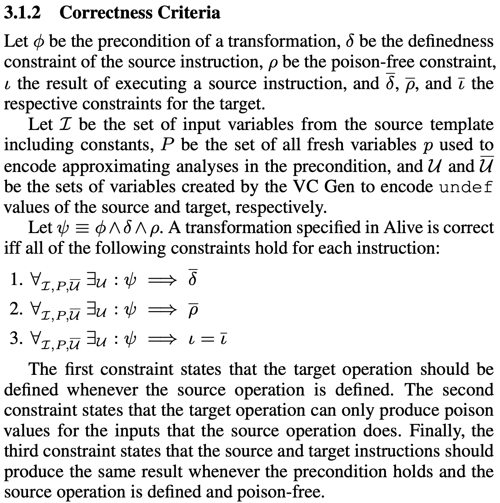

+++
title = "Provably Correct Peephole Optimizations with Alive"
[[extra.authors]]
name = "Aaron Tucker"
link = "https://www.cs.cornell.edu/~aarondtucker/"
+++

## Provably Correct Peephole Optimizations with Alive

## Introduction
[Provably Correct Peephole Optimizations with Alive](https://www.cs.utah.edu/~regehr/papers/pldi15.pdf) by [Nuno P. Lopes](https://web.ist.utl.pt/nuno.lopes/), [David Menendez](https://www.cs.rutgers.edu/people/professors/details/david-menendez), [Santosh Nagarakatte](https://people.cs.rutgers.edu/~sn349/), and [John Regehr](https://www.cs.utah.edu/~regehr/) ([PLDI 2015](https://conf.researchr.org/home/pldi2015)) is a paper with a pretty straightforward goal -- define a domain specific language and semantics for peephole optimizations in LLVM which make it easy to verify the correctness of peephole optimizations, while also building tools which make it simple to actually use the domain specific language when _you_ write peephole optimizations. Overall, I think this paper is great at scoping the project to be tractable and impactful, and is also rather elegant in how it leverages various properties of SMT solvers to make a better tool. Before we get into all of that, there is some preliminary background.

## Background
At its core, Alive is a domain specific language for formally verifying peephole optimizations in LLVM. Empirically, it found bugs where the optimization could introduce additional undefined behavior in situations where the original code did not. For me, the main important pieces of background to understand were LLVM, Peephole Optimizations, SMT Solvers, and Undefined Behaviors in C/C++.

### LLVM
According to [the project site](https://llvm.org), LLVM is “a collection of modular and reusable compiler and toolchain technologies”. Basically, compilers have a lot of similar components – they need to split up the program’s control flow to define all the basic blocks, perform dead code elimination, rearrange loops, and many other optimizations. LLVM makes it easier to reuse and compose these components by creating an _intermediate representation_ which is much closer to being machine code, but still has enough complexity and expressiveness to be able to figure out and perform the optimizations on a representation which is not yet specific to a particular architecture, and which is easier to think about.

This project has an active development community and people do contribute individual optimizations and pieces of code, so architecturally this seems to have been a great choice.

### SMT Solvers
SMT stands for Satisfiability Modulo Theory. Basically an SMT solver takes in a mathematical formula with many unknowns, and tries to figure out if the formula is satisfiable in the sense that there is some way to assign the variables such that the formula is true.

For example, in Boolean Logic the formula `x or y` is satisfiable with `x=True`, but `x and not x` is not satisfiable for any `x`.

Fascinatingly, despite the fact that SMT is NP-complete, computer scientists have been developing faster and faster SMT solvers, and using them in a variety of problems. While in general solving satisfiability problems requires brute force, in practice it appears that lovingly crafted (and ruthlessly empirically tested) heuristics are able to get better and better results on the problems that people feed to SMT solvers. However, that is not to say that an SMT solver is likely to solve your problem well – setting up problems for SMT solvers to solve them successfully is a bit of an art, and it is fortunate when researchers discover encodings that work for their problems. For example, in this paper the researchers discovered that a hand-written implementation of pointer allocation and accessing resulted in faster SMT solving than using the theory of arrays, even though they are theoretically equivalent.

### Peephole Optimizations
Peephole optimizations are small optimizations which look at a small number of instructions to find ways to do the same task but make them more computationally efficient. 

### Undefined Behaviors in C/C++
Finally, it is worth understanding that C and C++ both have a variety of ways to write code which result in  _undefined behavior_, where the specification of the language says that anything is allowed to happen. For example, if you try to index an array outside of its bounds, it is okay for the program to crash, but it is also okay for it to return data, print something out, or literally anything that it wants.

Given the prevalence of security vulnerabilities caused by improper bounds checking in array accesses such as [Heartbleed](https://en.wikipedia.org/wiki/Heartbleed), why do C specifications let you have undefined behavior rather than just defining that the behavior should be a program crash?

Ralf Jung has [a good discussion](https://blog.sigplan.org/2021/11/18/undefined-behavior-deserves-a-better-reputation/), but there was also a simple (and reasonably convincing to me) example from the class discussion. When people are writing in C, they are much more likely to care a lot about performance. If the programmer knows that they didn’t mess up their loop to iterate through all of the elements of the array, then doing bounds-checking on every array access will slow down your program unnecessarily, and doing bounds checking only when it might be useful might be too hard for your compiler to do.

In a similar flavor, undefined behavior allows a compiler to more aggressively optimize code, since while the optimized code must generate the same results whenever the results are defined, it is free to do optimizations and take shortcuts which further modify (mangle?) the code whenever it would produce an undefined result.[^1]

[^1]: If this is unsatisfying, you can also wait until later, where we will talk about this again.

## Main Contributions
With the background out of the way, I reiterate:

> At its core, Alive is a domain specific language for formally verifying peephole optimizations in LLVM.  Empirically, it found bugs where the optimization could introduce additional undefined behavior in situations where the original code did not.

### Formal Verification of Peephole Optimizations
A core engine of the paper is in creating a domain specific language which makes it easy to write peephole optimizations which can be formally verified.

#### Basic Overview
An LLVM instruction can have source preconditions $\phi$ and target postconditions $\bar \phi$, source definedness constraints $\delta$, a source poison-free constraint $\rho$, a source result $\iota$, as well as target definedness, poison-free constraint, and result  $\bar delta$, $\bar \rho$, andt $\bar \iota$ respectively.

*Preconditions* can be defined using a must-analysis for precise constraints, and may-analysis for over/underapproximations. For example, the precise `isPowerOfTwo(%a)` constraint is defined as $p \leftarrow a \neq 0 \wedge a &(a-1) = 0$, while the approximate `mayAlias(%a, %b)` 

*Definedness* simply describes when a variable has a defined output. For example, unsigned division of a/b is defined whenever $b \neq 0$.

*Poison-free* describes when a variable will not generate a poison value, which is a value which could generate undefined behavior under some circumstances. For example, left shift with no sign overflow is poison-free as long as it does not generate a sign overflow, namely as long as $(a << b) >> b = a.

*Result*s are simply their normal meaning – the result of applying the functions in the definition to their inputs.

With this out of the way, we can now understand the somewhat notationally dense definition of correctness in the paper.

#### Attribute Inference
While LLVM allows developers to annotate instructions with attributes which can help enable optimizations, it is often tricky as a developer to know whether or not an attribute is appropriate. The authors also added a tool to automatically add attributes by trying to verify that the optimization with and without various attributes, aiming for the weakest preconditions and strongest postconditions.

Note that pre/postcondition here refers only to attribute annotation (like no signed overflow), not conditions for when an optimization can be applied (like `isPowerOfTwo`). This means that it is only used in generating the poison-free constraints.

I think that this is a very useful usage of formal verification – it works on a very narrow part of the specification, and lets the SMT solver do the hard work of grinding through the examples to try to see whether or not it can add the attribute, rather than relying on a person to do so.

#### Counterexamples
SMT solvers also generate witnesses to particular events. For example, if your $\iota = \bar \iota$ constraint fails and there are some inputs where your optimization produces a different output, then SMT’s witness will include those inputs! By sharing the witnesses with users, Alive is able to show users counterexamples for where their code breaks, which is extremely useful for debugging.

### Empirical bug-finding
They discovered 8 bugs! 4 were from the optimization sometimes introducing new undefined behavior, 2 were from sometimes introducing new poison values, and 2 were from being incorrect for some inputs.

I think that it’s interesting and makes sense that the most common type of issue wasn’t that the optimization would sometimes produce wrong results, but rather that it would sometimes introduce undefined behavior. It seems much more likely to mess up an optimization by having there be edge cases which break it, than edge cases which make it produce a different value.

### Usability
In my opinion, the usability and real-world usage of the Alive toolchain is itself a notable contribution. It would be one thing if the authors used a fancy method to find some bugs that they reported and got fixed, but it’s a much more impressive thing if other people can use the author’s work on their own problems. 

#### Toolchain
The authors were able to build a project that other people both wanted to use and contribute to. This project still has users![^2]

[^2]: Technically, Alive 2 is still maintained, which uses SMT solvers for translation validation of LLVM's test suite. 

#### Know your audience
The authors selected an audience (LLVM contributors) who they knew would be interested in using the tool to make their lives easier. This was enough for some contributors to be using the tool even before the paper was published. The authors were also able to show users the value of their tool by monitoring proposed patches to LLVM, finding bugs in them, and working with contributors to fix them. This greatly improved the impact of the work by getting LLVM contributors to use the tool to continue fixing and avoiding bugs even after the paper was published.

## Discussion
While many of the great points from class have already been discussed, there are a few other points that didn’t really make it into the blog post so far.

### Limitations
The paper has a few limitations which the authors also mention, such as not being able to translate all of InstCombine because it doesn't handle vectors, call/return instructions, or floating point operation.

More deeply, its reliance on an SMT solver means that as more variables, operations, or bits get added to an optimization, the harder it is to verify the optimization, without there really being any way to fix the method. The paper already has issues with the handling larger bitwidths quickly for multiplication and division, and it seems that it would be hard to scale this method to handle larger bitwidths or expressions with more variables.

### Defining Undefined for Fun and Profit
One possibly-confusing thing in the paper is that the SMT solver can choose any value that it finds convenient for any `undef` value. While a glib justification may simply be that LLVM and C say that anything can happen, I think this is actually a quite reasonable and good thing for Alive to do. By choosing convenient values for `undef`, it maximizes its ability to verify specifications which agree on the values that are correct. It would have been interesting for the paper to report on how many of the successful verifications depended on this behavior.

### Empirical Testing vs. Formal Verification
Another interesting part of the class discussion was around the need for empirically checking the formally verified code. Theoretically, formal verification should mean that the code is correct. However, there could be challenges in translating into/out of C which break it, the translation into/out of SMT might be wrong, and more pragmatically it would also just be very suspicious if someone who claimed that their program worked perfectly every time never ran it. This discussion brought up the fun Knuth quote:
> Beware of bugs in the above code; I have only proved it correct, not tried it.

### Really? We’re just going to trust the programmer to not write code with undefined behavior?
Finally, to return to footnote 1, it turns out that there are more recent tools that kind of let you have your cake and eat it too with regards to the performance benefits of undefined behavior. By compiling with an LLVM tool called [UndefinedBehaviorSanitizer](https://clang.llvm.org/docs/UndefinedBehaviorSanitizer.html) automatically adds checks for a bunch of different types of undefined behavior, so that when you test your code you can have the program crash with helpful error messages that help you remove the undefined behavior. When you deploy the code, you can then just compile without UndefinedBehaviorSanitizer, and get the performance benefits of not doing the safety checks.
