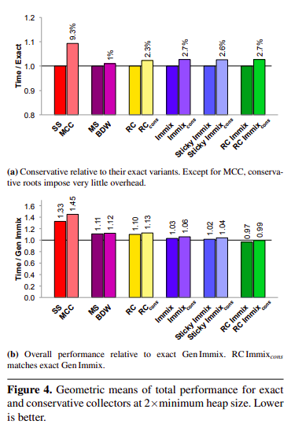

## Impact of Conservatism

The authors evaluated the impacts of conservativeness on collector
mechanisms and design, specifically on the number of roots tracked,
filtering, excess retention, and pinning.

The takeaways are as follows:

- *Ambiguous Pointers*: A challenge in conservative collection is how
   often a non-pointer object may be interpreted as a pointer. The
   authors found that conservative scanning results in _1.6x_
   more identified "roots" than exact scanning.

- *Excess Retention*: While excess retention is a very obvious side
   effect of conservative collection, its precise impacts in practice
   were not known. The authors measured excess retention by comparing
   the sizes of transitive closures between the exact and conservative
   versions, and found that excess retention was on average _0.02%_,
   with the maximum retention being _6.1%_. So, the authors concluded
   that excess retention does not cause significant problems for
   conservative collectors.

- *Pointer Filtering*: The authors compare the time performances
  between their object map and the state-of-the-art BDW free-list
  introspection, which are functionally equivalent ways of filtering
  ambiguous roots. Object maps had a higher overhead in total,
  mutator, and collection times primarily due to (1) setting bits at
  allocation time, and (2) a space penalty that results from having to
  store the map. The authors concluded that in the context of a
  non-moving collector, BDW is clearly the better solution; however,
  copying allows for a greater performance benefit.

- *Pinning Granularity*: Conservative collectors need to pin the
   "referents" of ambiguous pointers, but the effect of pinning
   depends on the collector's pinning granularity. In Bartlett-style
   page pinning granularity (used by the Mostly Copying Collectors
   (MCC)), where the "referent" and all other objects on the page that
   it resides in are retained, _2.1%_ of the live heap was impacted.
   In the 256B line granularity (used by the Immix family of
   collectors), where only the "referent" is pinned, _0.2%_ of the
   live heap was impacted. Therefore, the authors concluded that
   pinning at the line granularity is significantly less impactful.

## Performance Evaluation

### Conservative vs. Exact Variants

The authors also evaluated the performance impacts of conservatism, by
first comparing between six conservative collectors and their exact
variants: MCC (mostly copying collector with object map), BDW
(conservative mark-sweep with BDW reference filtering), conservative
RC (deferred reference counting with free-list heap organization),
conservative Immix, conservative Sticky Immix, and conservative RC
Immix.

Figure 4 displays the performance outcomes of the six conservative
collectors and their exact counterparts. The key takeaways from this
evaluation are that (1) conservative overheads are rather minimal,
ranging from _1%_ to _2.7%_; (2) all Immix collectors outperform the
free-list collectors (most likely due to cache locality); and (3)
conservative RC Immix is actually _1% faster_ than Gen Immix, the
fastest exact collector. Thus, the authors conclude that conservative
collectors can be on par with exact collectors in terms of performance.

### Performance Analysis

Following this, the authors perform a per-benchmark performance
analysis of five collectors: Gen Immix (the best performing exact
collector), conservative RC Immix (the best performing conservative
collector), RC Immix (the exact counterpart of conservative RC Immix),
MCC and BDW (prior conservative collectors given 2x the minimum size
heap).

The takeaways from this analysis is as follows:

- Conservative RC Immix has very good performance, outperforming Gen
  Immix on the majority of benchmarks. This is attributed to (1)
  better mutator performance due to using coarse grained allocation
  regions, (2) locality benefits, (3) utilizing the weak generational
  hypothesis.

- In evaluating the time-space tradeoff of collection via varying the
  heap size, the authors found that Gen Immix's total time performance
  was better than conservative RC Immix's in small heap sizes; both
  exact and conservative variants of RC Immix performed best in terms
  of collection time; conservative RC Immix performed at least as well
  as the best exact generational collector.

- Garbage collection slowdown increases as the percentage of pinned
  objects increases, and slowdown decreases as heap sizes increases.
  Therefore, the impact of pinned objects can be mitigated by
  increasing the heap size.
