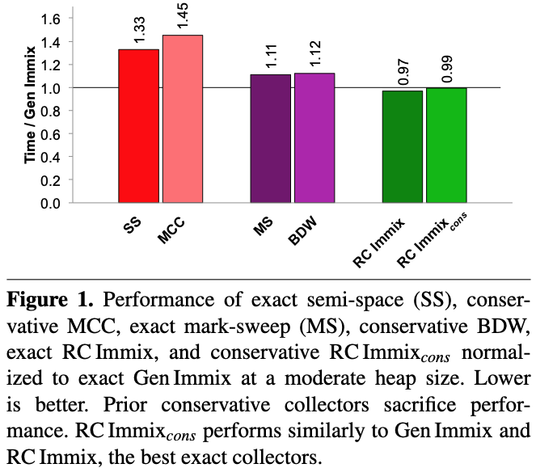
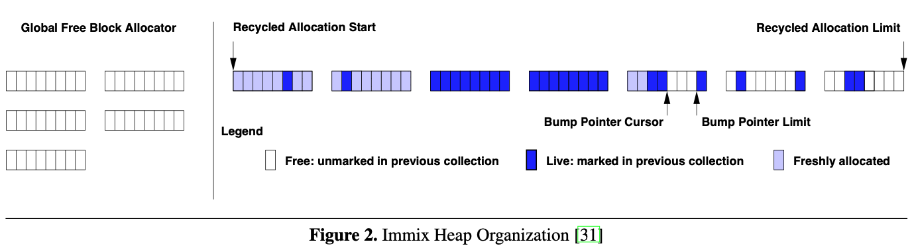
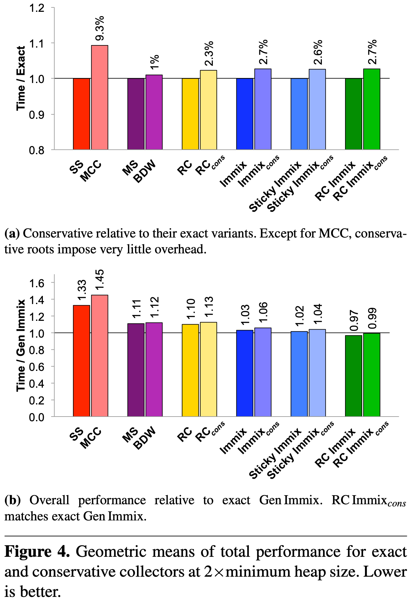

+++
title = "Fast Conservative Garbage Collection"
[[extra.authors]]
name = "Ayaka Yorihiro"
link = "https://ayakayorihiro.github.io"
[[extra.authors]]
name = "Shubham Chaudhary"
link = "https://www.cs.cornell.edu/~shubham/"
+++

# Fast Conservative Garbage Collection

This paper[^1] explores the common challenges of implementing an efficient
conservative garbage collectors in managed languages, namely excess
retention and pinning caused by ambiguous references. To that end,
the authors introduce the concept of an optimized object map, which
tracks live objects, to mitigate some of these issues. Finally, they compare
conservative collectors to their exact counterparts and conclude that
conservative collectors can be as efficient in space and time as exact
collectors.

# Background

Within language implementations, memory management can be done by
either _exact_ garbage collectors, which are fully aware of all
references, or _conservative_ garbage collectors, which must deal with
_ambiguous references_ that could be either pointers or values.

Because exact collectors know references, they can move objects and
filter out more references. However, exact collectors impose
non-trivial engineering and performance challenges, such as having to
maintain a shadow stack. In many situations, it is also impossible to
implement an exact collector. So, work on implementing effective and
efficient conservative collectors is necessary.

The key challenges in implementing conservative collectors are
as follows:

1. **Excess retention**: Because an ambiguous reference _could_ point to
an object, that "referent" cannot be collected. This is because the
ambiguous reference _could_ be a valid pointer to that object. So,
actually dead objects and their transitively reachable descendants
will be kept alive, causing extra space to be taken.

2. **Pinning**: Because an ambiguous reference _could_ be a value, the
collector can't modify it. So, in the case that the ambiguous
reference is actually a pointer, the referents cannot be moved,
causing fragmentation.

# Contributions

The main contributions of this paper include:

- A detailed examination on conservative garbage collection, including
  the first detailed study of impacts of exact and conservative
  collection in practice.

- Introducing an object map that precisely tracks live objects to filter
  ambiguous roots efficiently.

- The design, implementation, and evaluation of new conservative
  collectors that use the object map, against prior conservative
  collectors and their exact counterparts.

  - **RC ImmixCons**, introduced in this paper, is 1%
  _faster_ than **Gen Immix**, the best-performing exact collector.

# Techniques

There are two broad classes of techniques used by conservative collectors to
make them match exact collectors:

1. **Filtering**: maintaining a data structure to track references to live objects
   to filter ambiguous references that could not possibly be valid pointers to reduce
   excess retention.

2. **Ambiguous Roots**: many collectors strike the balance between exact and conservative
   collection by using available run-time information such that the only conservative references
   are the roots. Other references are exactly known, and therefore can be moved freely.

## Existing Conservative Collectors

**Boehm-Demers-Weiser Collector (BDW)**[^2] is a conservative collector designed for C and C++. It is a
non-moving tracing collector which uses a free-list to reclaim and reuse memory which can be used
as a drop-in replacement for `malloc`. It filters ambiguous references by comparing them against
live free-list cells. While it is very convenient to use, it suffers from bad mutator performance
due to sparse allocations and the inability to defragment.

**Mostly Copying Collectors (MCC)**[^3][^4][^5][^6][^7] strike a balance by only allowing roots to be
ambiguous and freely moving the non-pinned references as an exact collector would. Additionally, they
use bump-pointer allocation to reduce the sparsity of allocations. To-space and from-space are
maintained as a linked-list of allocated pages. If any allocation on a page is pinned, the entire
page is considered to be pinned, which wastes space. Filtering is performed by scanning the list of
allocated pages for live addresses.

Performance evaluations show that these state-of-the-art conservative collectors have a high
overhead compared to the fastest exact collectors. This paper takes the straightforward approach of
applying simple techniques outlined previously to convert these fast exact collectors into conservative
collectors.

## Immix Family of Exact Collectors

We briefly describe a family of high-performance exact collectors based on the idea of the organizing
the heap using a data structure called the _Immix Heap_[^8].

**Immix** divides the heap into blocks (32 KB) and each block into lines (256 bytes). Objects are
allocated using bump-pointer allocation within a line. The tracing version of Immix performs
opportunistic copying to defragment lines and blocks. **Sticky Immix** is a generational
collector which marks objects that survive collection as old and only performs tracing on young objects.
**RC Immix** performs deferred reference counting with the Immix heap.

## Making Collectors Conservative

**Object Map** is a data structure proposed by the authors for efficient filtering of ambiguous
roots. The idea is to maintain a bitmap for each 8-byte word in memory indicating whether that
location is alive.

**Conservative Immix (ImmixCons)** is a conservative version of Immix. It only
considers roots as ambiguous, and the objects referenced by these are pinned on line
granularity (256 bytes) which is space efficient. Like Immix, it performs opportunistic
copying for other non-root exact references. Furthermore, ambiguous roots are filtered
against the object map, which is updated after every collection cycle.

Similarly, **Conservative Sticky Immix (Sticky ImmixCons)** is the conservative
counterpart of Sticky Immix. Maintaining the object map is trickier since only young objects
are traced regularly.

**Conservative Immix RC (RC ImmixCons)** performs tracing on young objects, and
reference counting on mature objects. Object map is used here as well, and is updated incrementally
as reference counting is performed.

# Evaluation

The authors conduct an extensive evaluation in two parts: (1)
understanding the impact of conservatism by comparing between exact
and conservative versions of collectors; (2) a performance evaluation
comparing the conservative versions of RC, Immix, Sticky Immix, and RC
Immix against existing state-of-the-art conservative garbage
collectors.

## Impact of Conservatism

The authors evaluated the impacts of conservative-ness on collector
mechanisms and design, specifically on the number of roots tracked,
filtering, excess retention, and pinning.

The takeaways are as follows:

- *Ambiguous Pointers*: A challenge in conservative collection is how
   often a non-pointer object may be interpreted as a pointer. The
   authors found that conservative scanning results in _60%_
   more "roots" than exact scanning.

- *Excess Retention*: While excess retention is a very obvious side
   effect of conservative collection, its precise impacts in practice
   were not known. The authors measured excess retention by comparing
   the sizes of transitive closures between the exact and conservative
   versions, and found that excess retention was, on average, only _0.02%_,
   with the maximum being only _6.1%_, as a fraction of heap size.

- *Pointer Filtering*: The authors compare the performances
  between their object map and the state-of-the-art BDW free-list
  introspection, which are functionally equivalent ways of filtering
  ambiguous roots. Object maps had a higher overhead in total,
  mutator, and collection times primarily due to (1) setting bits at
  allocation time, and (2) a space penalty that results from having to
  store the map. The authors concluded that in the context of a
  non-moving collector, BDW is clearly the better solution; however,
  copying allows for a greater performance benefit.

- *Pinning Granularity*: Conservative collectors need to pin the
   "referents" of ambiguous pointers, but the effect of pinning
   depends on the collector's pinning granularity. In MCCs, where
   the "referent" and all other objects on the page that
   it resides in are retained, _2.1%_ of the live heap was impacted.
   In the 256 bytes line granularity (used by the Immix family of
   collectors), where only the referent line is pinned, _0.2%_ of the
   live heap was impacted. Therefore, the authors concluded that
   pinning at the line granularity is significantly less impact-full.

## Performance Evaluation

### Conservative vs. Exact Variants

The authors also evaluated the performance impacts of conservatism, by
first comparing between six conservative collectors and their exact
variants: MCC, BDW, RCCons, ImmixCons,
Sticky ImmixCons, and RC ImmixCons.

The above figure displays the performance outcomes of the six conservative
collectors and their exact counterparts. The key takeaways from this
evaluation are that (1) conservative overheads are rather minimal,
ranging from _1%_ to _2.7%_; (2) all Immix collectors outperform the
free-list collectors (most likely due to cache locality); and (3)
RC ImmixCons is actually _1% faster_ than Gen Immix, the
fastest exact collector. Thus, the authors conclude that conservative
collectors can be on par with exact collectors in terms of performance.

### Performance Analysis

Following this, the authors perform a per-benchmark performance
analysis of five collectors: Gen Immix (the best performing exact
collector), RC ImmixCons (the best performing conservative
collector), RC Immix (the exact counterpart of RC ImmixCons),
MCC and BDW (prior conservative collectors given 2x the minimum size
heap).

The takeaways from this analysis is as follows:

- RC ImmixCons has very good performance, outperforming Gen
  Immix on the majority of benchmarks. This is attributed to (1)
  better mutator performance due to using coarse grained allocation
  regions, (2) locality benefits, (3) utilizing the weak generational
  hypothesis.

- In evaluating the time-space trade-off of collection via varying the
  heap size, the authors found that Gen Immix's total time performance
  was better than RC ImmixCons's in small heap sizes; both
  exact and conservative variants of RC Immix performed best in terms
  of collection time; RC ImmixCons performed at least as well
  as the best exact generational collector.

- Garbage collection slowdown increases as the percentage of pinned
  objects increases, and slowdown decreases as heap sizes increases.
  Therefore, the impact of pinned objects can be mitigated by
  increasing the heap size.

# References

[^1]:Rifat Shahriyar, Stephen M. Blackburn, and Kathryn S. McKinley. 2014. Fast conservative garbage collection. SIGPLAN Not. 49, 10 (October 2014), 121–139. doi: 10.1145/2660193.2660198

[^2]: [https://www.hboehm.info/gc/](https://www.hboehm.info/gc/)

[^3]: J. F. Bartlett. Compacting garbage collection with ambiguous roots. SIGPLAN Lisp Pointers, 1 (6): 3--12, Apr. 1988. ISSN 1045-3563. doi: 10.1145/1317224.1317225.

[^4]: G. Attardi and T. Flagella. A customisable memory management framework. In Proceedings of the 6th Conference on USENIX Sixth C++ Technical Conference - Volume 6, CTEC'94, pages 8--8, Berkeley, CA, USA, 1994. USENIX Association.

[^5]: A. L. Hosking. Portable, mostly-concurrent, mostly-copying garbage collection for multi-processors. In Proceedings of the 5th International Symposium on Memory Management, ISMM 2006, Ottawa, Canada, June 10 - 11, 2006, pages 40--51. ACM, 2006. ISBN 1-59593-221-6. doi: 10.1145/1133956.1133963.

[^6]: F. Smith and G. Morrisett. Comparing mostly-copying and mark-sweep conservative collection. In Proceedings of the 1st International Symposium on Memory Management, ISMM 1998, Vancouver, BC, Canada, October 17 - 19, 1998, pages 68--78. ACM, 1998. ISBN 1-58113-114-3. doi: 10.1145/301589.286868.

[^7]: WebKit. The WebKit open source project, 2014. [URL](http://trac.webkit.org/browser/trunk/Source/JavaScriptCore/heap).

[^8]: S. M. Blackburn and K. S. McKinley. Immix: A mark-region garbage collector with space efficiency, fast collection, and mutator locality. In ACM Conference on Programming Language Design and Implementation, PLDI'08, Tucson, AZ, USA, June 2008, pages 22--32. ACM, 2008. doi: 10.1145/1379022.1375586.
