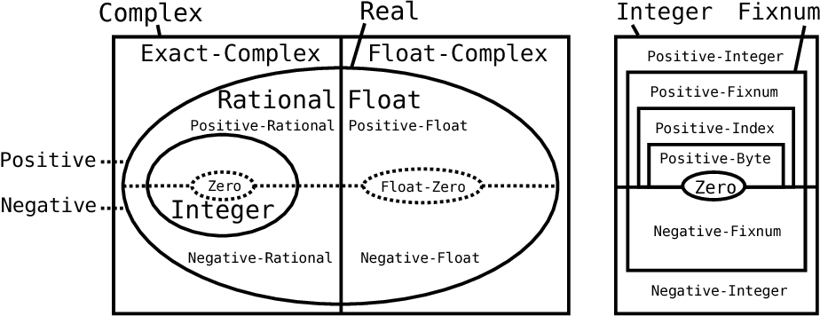

+++
title = "Type-based Alias Analysis"
[extra]
latex = true
[[extra.authors]]
name = "Andrew Butt"
link = "TODO"
[[extra.authors]]
name = "Andrey Yao"
link = "https://www.youtube.com/watch?v=dQw4w9WgXcQ"
+++

## Introduction
The type system of a statically-typed language allows compilers to reject illegal programs during the type-checking stage of compilation. In a sense, the typing information attached to variables, functions, etc. is a refinement on the set of valid program states, which can be approximated without ever running the program. Although programming language types are often used to locate certain errors during compile time, it's not their only use.

"Type-Based Alias Analysis" by Diwan, McKinley, and Moss examines how the same principal can be applied to alias analysis, a type of conservative analysis that determines whether two given pointer variables might interfere with each other, i.e. pointing to the same memory address. Although there had been prior research on alias analysis, Diwan et al.'s type-based alias analysis (TBAA) has the following advantages:
* It is flow-insensitive and runs on linear time, as opposed to many other alias analyses which are expensive to compute.
* It performs almost equally well under an open world assumption as it does in closed world. It's compatible with the principle of modular programming.

They also presented evaluations of TBAA. They performed static and dynamic performance analyses on the effectiveness of TBAA when used for redundant load elimination (RLE). Perhaps most notably, they adopted the strategy of limit analysis by comparing empirical speedups with the maximum possible speedups.

In this blog post, we will first study the specific ideas of TBAA with examples in C#-like syntax, as opposed to Modula-3, the language used in the paper. Then we will review the performance analyses and discuss potential factors behind the empirical results. We will then digress a little bit and talk about extensions to TBAA for more complicated programming language features. Finally we will briefly touch upon the general philosophy of empirical evaluations.

## Type Preliminaries
** Readers can skip this section if they are already familiar with type systems or wish to focus on TBAA **

Given two types $\tau_1$ and $\tau_2$, we say that $\tau_1$ is a subtype of $\tau_2$ if whenever a value of $\tau_2$ is expected, it is legal to supply a value of $\tau_1$ in its place. If we view types as sets and all possible values of a type as its elements, the subtyping relation can be considered roughly the subset relation. Familiar examples from Java include `class Person extends Object` and `class LinkedList<T> implements Iterable<T>`, etc. There's also the numeric tower from Typed Racket:
<p align="center">

</p>
**St-Amour, Vincent et al. “Typing the Numeric Tower.” PADL (2012).**
TODO add this citation to the end

The subtyping relation is reflexive and transitive. It is an example of a "preorder". We will denote $\tau_1\leq \tau_2$ if the former is a subtype of the latter. There are various ways to construct new subtyping relations given existing ones. For example, if we know that $\tau_1\leq \tau_2$ and $\sigma_1\leq \sigma_2$, it could be reasonable to conclude that the arrow(function) types have $\tau_2\to\sigma_1\leq \tau_1\to\sigma_2$. In this case we say the function type is *covariant* in its return type and *contravariant* in its argument type.

There are other typing rules for constructs like tuples, records, generics, etc., but we will not list all of them here. However, the select examples above already give us a glimpse into the richness of information encoded by types. In general, in a statically-typed type-safe language, stricter typing rules allows more fine-grained TBAA, which we will see shortly.

## Type-Based Alias Analysis
TBAA operates on the program AST instead of the IR. Thus, it has access to higher level information than some other program analyses. Let's assume the language we're working with has the following kinds of memory references:

1. `a.x`  Class field access
2. `a[n]` Array indexing
3. `*a` Pointer indirection

An access path is defined to be any combination of one or more of these memory references. For instance, `(*(a.b).c[3])[2][*d[*e.f]]` is a pathological example of an access path. Basically, access paths are succinct representations of chains of memory references in the AST. We will also define typeof ($\mathcal{P}$) to be the type of the path $\mathcal{P}$.

### Type Declarations Only

To predict whether two paths $\mathcal{P}_1, \mathcal{P}_2$ might alias, an obvious heuristic is to say this is when the (typeof $\mathcal{P}$) has nonempty intersection with the subtypes of (typeof $\mathcal{P}$). Of course, if the two types are disjoint, then if any expression involving $\mathcal{P}_1$ type checks, the same expression with $\mathcal{P}_2$ substituted in place cannot type check, and so the two paths cannot possibly alias. We will define a function TD, which takes two access paths and returns true iff their types have a common subtype.

### With Field Access
We can extend the above heuristic by taking into account the language fact that `a.f` and `a.g` cannot alias each other for some object `a`. Here we also assume that a field access and an array indexing never alias. This is probably true for many OOP languages. We can summarize whether two access paths may alias inductively using the following table, where "FTD" is true iff its arguments paths may alias. 

<style type="text/css">
.tg  {border-collapse:collapse;border-spacing:0;margin:0px auto;}
.tg td{border-color:black;border-style:solid;border-width:1px;font-family:Arial, sans-serif;font-size:14px;
  overflow:hidden;padding:10px 5px;word-break:normal;}
.tg th{border-color:black;border-style:solid;border-width:1px;font-family:Arial, sans-serif;font-size:14px;
  font-weight:normal;overflow:hidden;padding:10px 5px;word-break:normal;}
.tg .tg-a0yd{border-color:inherit;font-family:inherit;font-size:12px;text-align:center;vertical-align:top}
.tg .tg-c3ow{border-color:inherit;text-align:center;vertical-align:top}
</style>
<table class="tg">
<thead>
  <tr>
    <th class="tg-a0yd">$\mathcal{P}_1$</th>
    <th class="tg-c3ow">$\mathcal{P}_2$</th>
    <th class="tg-c3ow">FTD($\mathcal{P}_1$, $\mathcal{P}_2$)</th>
  </tr>
</thead>
<tbody>
  <tr>
    <td class="tg-c3ow">p</td>
    <td class="tg-c3ow">p</td>
    <td class="tg-c3ow">true</td>
  </tr>
  <tr>
    <td class="tg-c3ow">p.f</td>
    <td class="tg-c3ow">q.g</td>
    <td class="tg-c3ow">f=g $\land$ TD(p,q)</td>
  </tr>
  <tr>
    <td class="tg-c3ow">p.f</td>
    <td class="tg-c3ow">*q</td>
    <td class="tg-c3ow">AT(p.f) $\land$ TD(p.f, *q)</td>
  </tr>
  <tr>
    <td class="tg-c3ow">*p</td>
    <td class="tg-c3ow">q[m]</td>
    <td class="tg-c3ow">AT(q[m]) $\land$ TD(*p, q[m])</td>
  </tr>
  <tr>
    <td class="tg-c3ow">p.f</td>
    <td class="tg-c3ow">q[m]</td>
    <td class="tg-c3ow">false</td>
  </tr>
  <tr>
    <td class="tg-c3ow">p[n]</td>
    <td class="tg-c3ow">q[m]</td>
    <td class="tg-c3ow">FTD(p, q)</td>
  </tr>
  <tr>
    <td class="tg-c3ow">p</td>
    <td class="tg-c3ow">q</td>
    <td class="tg-c3ow">TD(p, q)</td>
  </tr>
</tbody>
</table>

Here $AT$ stands for "address taken", and AT($\mathcal{P}$) is defined to betrue iff the program has ever taken the address of $\mathcal{P}$. One hidden assumption about the table is that the cases are supposed to be checked from top to bottom. For example, if two paths fit case 2 then case 7 on the last row will not apply. Thus it should be very straightforward to implement the function FTD on an AST recursively using ML-style pattern matching, for example.

### Extended With Assignments
So far TD and FTD operats on the assumption that access paths with compatible types and appropriate field accesses can always read or write to each other. However, this can be improved by observing that given $\tau_1\leq\tau_2$, if there are no assignments from variables of type $\tau_1$ to references of type $\tau_2$ anywhere in the program, then references to type $\tau_1$ cannot possibly alias references to type $\tau_2$. This gives rise to the following algorithm:

```
[Part 1]
//Start by assuming no types alias each other
initiliazie Equiv := {{t} | t is a pointer type}

for each pointer assignment a := b
	EA := set in Equiv containing typeof(a)
	EB := set in Equiv containing typeof(b)
	//Merges the equivalence classes of the two types
	remove EA, EB from Equiv and insert (EA union EB)
end

[Part 2]
for each type t
	ET := set in Equiv containing t
	TypeRefsTable[t] = ET intersect (subtypesof t)
end
```
The algorithm can be broken down into roughly two stages. In Part 1, we construct the equivalence classes of types based on the aliasing relation, which is an equivalence relation. Note that equivalence classes of a set partition the set, so in each loop iteration of the algorithm, each type $\tau$ belongs to a unique set inside `Equiv`. Before we saw any assignments in the program, we assume no types alias each other. Each time we see a pointer assignment, we merge the two classes.

Part 2 of the algorithm refines the equivalence relation with subtyping information, at the cost of symmetry of the relation. When the algorithm terminates we end up with `TypeRefsTable`, a map from types $\tau$ to the set of types that might be referenced by some access path of type $\tau$.

### Asymptotic Complexity
This analysis is flow-insensitive and takes $O(n)$ time, where $n$ is the number of instructions. However, using the result of TBAA can have runtime quadratic in the number of memory reference expressions. 
