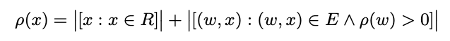
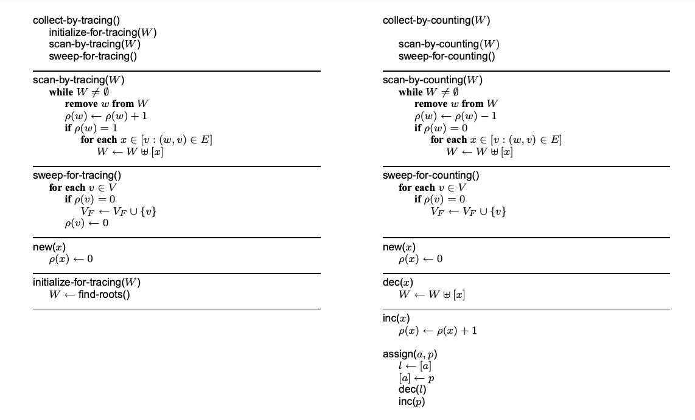

+++
title = "A Unified Theory of Garbage Collection"
[[extra.authors]]
name = "Orko Sinha"
link = ""
[[extra.authors]]
name = "Michael Maitland"
link = "https://michaelmaitland.com"
+++

# Introduction
Some programming languages have dynamic memory management. Tracing and reference counting have often been thought of as two seperate techniques to implement garbage collection. However, [A Unified Theory of Garbage Collection](https://dl.acm.org/doi/10.1145/1028976.1028982) by Bacon et al. presents a framework that views tracing and reference counting as duals of each other. The paper presents this framework, shows how tracing and reference counting are in fact duals, how optimized garbage collectors are hybrids of tracing and reference counting, and develops a cost analysis to determine the time and space tradeoffs of collectors within this design space.

# Background
## Garbage Collection
Languages like C and C++ take a manual memory management approach, requiring programmers to explicitly allocate and deallocate memory using `malloc` and `free`. This approach is extremely error prone and has led to many bugs. Languages such as Java or Python use dynamic memory management where the programming language runtime automatically frees memory that is no longer being used by the programmer. This approach however comes at a runtime cost since the language must be able to keep track of which objects are no longer being used. This has led to the research of high performance garbage collectors. There are two main types of collectors: reference counting collectors and tracing collectors. Until the ideas in this paper were presented, it was believed that they were separate algorithms that accomplished the same task.

## Reference Counting

A reference counting collector keeps metadata that keeps track of how many references there are to each object. Reference counting runs every time a pointer is changed. When a pointer is assigned to point to an object, the count for that object is increased, and when it no longer points to an object the count is decreased. When the count goes to 0, the object can be freed. Low pause time, determinism, predictability, and simplicity are pros of reference counting.

## Tracing

Tracing does not keep track of any extra metadata. Tracing does not run every time a pointer is changed. Instead, it runs periodically as determined by the programming language. Although it does not run every time a pointer is changed and does not keep track of metadata, it must perform a graph traversal to identify which nodes are unreachable. Lower space overhead, control over when the collector should run, and cycle collection are pros of tracing. 

# The Paper

## Motivation

Tracing and reference counting collectors each have their pros and cons. Researchers have explored the design space searching for optimizations. This paper presents a formalization of the design space, demonstrating that all garbage collection is a combination of reference counting and tracing. It also provides a way for collectors to perform analysis on the cost of such collectors.

## Fix-Point Formulation

Garbage collection is first defined using a fixed point formulation. Later in the paper, it is shown how tracing, reference counting, and hybrids of tracing and reference counting satisfy this fixed point formulation. We start out with a characterization of memory:
* `V` is the set of all objects. This includes objects that are still in use, objects that are no longer in use but not yet freed, and objects that have been freed. 
* `E` is the multiset of edges in the graph. In other words, the references between one object between another. It is a multi-set because an object can have multiple pointers to another node. Consider the case where object `a` has fields `f1` and `f2` which both point to the same object `b`.
* `R` is the multiset of objects that are roots in the graph.
* `p(v)` where `v in V` is the reference count of vertex `v`.

The object graph is the triple `G = <V, E, R>`. From here, garbage collection is given as a fixed point computation.

Once reference counts have been assigned, vertices with counts of 0 are reclaimed. It is important to note that this fixed point equation is not an algorithm. Instead, tracing, reference counting, and hybrids of the two are algorithms that satisfy this fixed point equation.

## Algorithmic Duals
## Tracing vs Reference Counting

The tracing garbage collection and reference counting algorithms are shown below. Tracing computes the least fix point and reference counting computes the greatest fix point. The set difference between the two fix point solutions is comprised of cyclical garbage. Cyclical garbage will be discussed in more detail below.

Tracing initially sets the reference counts of all objects to 0 and initializes the worklist to be the root set $R$. The $scan-by-tracing()$ function scans through the worklist and increments the reference counts of the objects it encounters, and adds all of the objects referenced by it to the worklist to be recursively processed as well. When this function terminates, the reference counts for live objects will have non-zero counts and all other objects will have a count of zero. From here the $sweep-for-tracing()$ function can free all objects of count zero so their memory can be reused.

Reference counting need not do any initialization work at the start of the algorithm because initialization is handled for each time when an object is allocated. When an object is allocated, its reference count is set to 0. When an object is assigned to a pointer, the reference count of the object is incremented by one since a pointer now has a reference to it, and the object that was previously referenced by that pointer, if any, is added to the worklist to have its count decremented by one since the pointer no longer references it. The $scan-by-counting()$ function processes this  worklist of objects who need to have their count decremented by one and recursively adds objects it references to the worklist, similar to the tracing algorithm. The $sweep-for-counting()$ function acts exactly like the one for tracing, as it frees all objects of count zero so their memory can be reused.

It is important to note that when we want to decrement the count of an object, we delay the actual decrement operation by placing it in a worklist so that it is decremented in the $sweep-for-counting()$ function. In a real world implementation this may seem silly, but it is structured in this way to show the relationship between tracing and reference counting as duals. The actual complexity of the algorithm remains the same between both versions.

Now that tracing and referencing counting algorithms have been presented, it is possible to compare the two. Revisiting the idea of duals, we again acknowledge that tracing increments the reference counts of objects on the worklist whereas RC decrements them. Now, it becomes clear that they are also duals in the manner that tracing checks if the reference count is 1 when deciding whether to add to the worklist and reference counting checks if the reference count is 0 when deciding whether to add to the worklist. Lastly, for tracing the worklist initially included roots of the graph, but for reference counting the worklist contains objects that had a reference removed since the last time the algorithm ran. Tracing begins with an underestimate of counts while reference counting starts with an overestimate and both converge towards a true value.

When comparing the two algorithms side by side, we see how similar the two are. The scan and sweep functions are almost identical except for the duality differences highlighted in the previous paragraph.

## Deferred Reference Counting vs Partial Tracing
## Generational Garbage Collection Hybrids

Generational garbage collection is another well researched method of garbage collection. These collectors operate on the assumption that most objects die young. In other words, objects that have been recently allocated have a higher chance of becoming unreachable compared to objects that have been reachable for a long time. To accomplish this the heap is split into two regions: a nursery and a mature space. Objects are allocated into the nursery and at some point objects that survive long enough are moved to the mature space.

The paper presents and compares three generational garbage collector algorithms: tracing generational collection, generational with a reference counted nursery, and generational with a reference counted heap. In a tracing generational collector the roots into the nursery use tracing, the roots into the mature space use tracing, the nursery uses tracing within itself, the mature space uses tracing within itself, and objects in the mature space that reference objects in the nursery use reference counting. In a generational collector with reference counted nursery, we use the same formulation except that the nursery uses reference counting instead of tracing. The advantage of this collector is that cyclic garbage will eventually be collected because the mature space is traced; the disadvantage is that it reference counts young objects, which most likely have a high mutation rate, leading to expensive write barrier operations being performed most frequently. In a generational collector with a reference counted heap, we also use the same formulation except that the mature space is reference counted instead of traced. This has the advantage that mutations in the nursery are not recorded by the write barrier which is less expensive, but the disadvantage that some additional cycle collection mechanism is required for the mature space. The relationship between these collectors is depicted below. It is important to recognize that modifications or different versions of collectors yield different design tradeoffs because they are employing tracing or reference counting differently.

## Cycle Collection
## Multi-Heap Collectors
## Cost Analysis
## Conclusions

# Analysis of Contributions

# Impact

