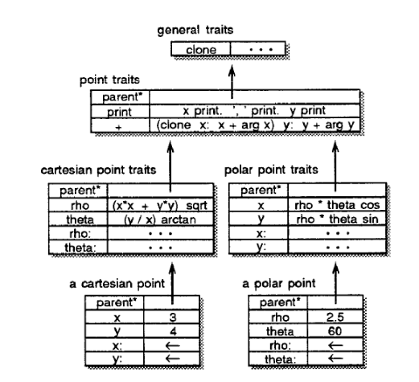
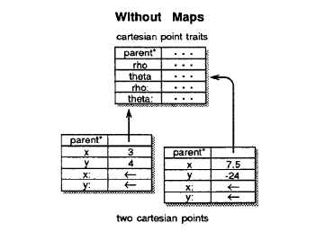
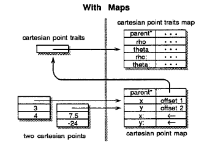
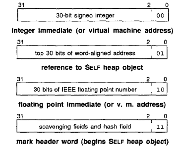
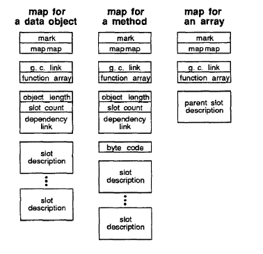

+++
title = "Efficient SELF Implementation"
[extra]
bio = """
	Charles Sherk is an junior studying Computer Science & Mathematics at
	Cornell university, interested in compilers and programming language
	implementation.
"""
[[extra.authors]]
name = "Charles Sherk"
link = "https://github.com/charles-rs/"
+++

## Background
### TLDR

[This](https://dl.acm.org/doi/10.1145/74878.74884) paper is on an efficient
implementation of the Self programming language. They detail the reasons which
make Self difficult to compile, and present a JIT (just in time) compilation
strategy for Self, getting over twice as fast as Smalltalk, which is a
comparable language, much more popular at the time.

### Language description
So what is Self, and why is it so hard to write a compiler for? Well, Self is
just about as dynamic of a language as you can get. It is object oriented using
a prototyping model instead of a class hierarchy, and everything is done through
message passing, which is also inherently very dynamic.

#### Self objects
Self objects are a collection of "slots", which can contain a variety of
things. In general, they either are _method_ slots, _data_ slots, or _parent_
slots. _Method_ slots are exactly what they sound: they have Self code which
describes some kind of method on the object, which can be invoked by passing a
message. _Data_ slots contain either primitives or Self objects. Mutable data
gets two slots: one for the data and one for the "assignment" operator, which is
again invoked by a message pass. _Parent_ slots provide the true power of Self:
inheritance. Self supports dynamic and multiple inheritance: you may have as
many parent slots as you like, and may change them at runtime.

#### Message passing
As mentioned above, _everything_ is done through message passing: it is the only
control flow structure. The way message passing works, is that _messages_ are
passed to a _receiver_. Then, the receiver's slots are searched for a slot with
a name that matches the message. If none are found, the parents are searched
recursively until a matching slot is found. Once a slot is matched, it's
contents are evaluated and returned. A data slot would just return it's value,
whereas a method slot would have to run some Self code, potentially with
arguments provided in the message.

Let's look at an example from the paper:

#### Example

Here is an object hierarchy for cartesian and polar points, that allows
conversion between. If we want to get the `x` coordinate of a cartesian point,
we send an `x` message, and Self will find the matching slot, and return 3 in
this case. Now imagine we send the `x` message to the polar point shown. There
is no slot named `x` so the parent slots are traversed. The `x` slot in polar
point traits is found, and evaluated. This results in more message passing,
looking up `rho` and `theta`, and also a `cos` slot which works on floats, and
multiplication. Finally, this will evaluate to `1.25` which is then returned. We
can see how this means that all points regardless of representation will be
printed as cartesian, as the `print` method uses the `x` and `y` methods. Also,
the `+` slot which allows adding points will all work in cartesian space, so if
you add two polar points, you will get a cartesian one.

Some other object features are object arrays and byte arrays. Object arrays are
exactly what they sound like, and byte arrays allow for a more compressed data
representation, which is helpful for strings.

## Implementation

### Object storage system

At a glance you may see a problem with the prototyping model that has no
classes: a lot of data will be duplicated across objects. If we think about the
point example above, there is some inherently shared structure between a bunch
of cartesian points: in this case, the parent and the assignment slot. This is
why the paper introduces _maps_, which are a memory layout that if you squint,
looks like it mimics a more class based system.

Here are a couple points in memory without maps:

And here once maps are used:

As we can see, _most_ slots can be factored out into a common map, with the
exception of the assignable ones. These of course need to be unique to the
individual object, but it is possible to factor out the _structure_ by putting
the memory offset into the map. Maps serve two purposes: they let Self recoup
the lost memory performance over a class based model, and they provide more
information to the compiler about what can be optimized, but more on that later.

### Object formatting
Self is a garbage collected language, so there needs to be some metadata around
for the collector to use. One annoyance surrounding this is byte arrays: they
really can look like anything, and they are NEVER pointers. The authors provide
a novel solution to this: store them in a separate section of memory that is
never traversed by the garbage collector. After reading this, it seems like an
obvious solution, but it is quite elegant.

#### Tagging
Outside of byte arrays, all data needs to be tagged. The tagging format is
detailed in the following diagram:

The two least significant bits are the tag bits, and Self is designed to run on
a 32 bit machine. Integers are tagged with 0 so that arithmetic instructions
don't have to do any special work, and virtual machine addresses use the same
tag. The reason for this is that the integer tag tells the GC never to relocate
these, and it isn't going to be relocating VM addresses either.

Self heap objects also get their own tags, as these are the ones that the GC
will deal with. Floats need to be tagged differently than integers, as self
supports operators like `+` and `<` which are polymorphic on numeric types, and
use different machine instructions.

There is one more tag available, and it is used for the mark header word, which
is the beginning of a self object, and contains some metadata for the GC as well
as some immutable bits that are used by the hashing primitive.

#### The actual objects
Every Self object begins with a mark header word, as mentioned above. Then,
there is a pointer to the associated map, and after that there are some slight
differences between object types. Normal objects have a sequence of slot
contents for mutable slots. Object arrays then have the length, followed by the
literal elements (pointers if objects). Byte arrays are similar, but the
contents are padded out to 32 bit word boundaries.

#### Map layout

Maps also have a slightly varying layout depending on the type. All maps share
the same map, which is referred to as the "map map." They also need to have a GC
link so that the GC can traverse all of the maps.

### Bytecode
This is relatively uninteresting, but should be mentioned. Self code is compiled
to a bytecode that is at the same time very simple, and also expressive. It is
almost just a syntax rewrite of the message passing with everything being on a
stack, so this translation phase has a lot more to do with ease of interpreting
and simplicity of the representation than some earth shattering transformation.

### How it goes fast

The real interesting part of this paper is how it makes Self go so
fast. Previous work on making Smalltalk quicker was mostly focused on adding
static types that the compiler can take advantage of, but this defeats the
purpose of having such a dynamic language, so the authors employ a JIT with
surprisingly few optimizations.

#### Customized compilation

The first optimization presented in this paper is "customized compilation,"
where when a method is run with a certain type of receiver, this is noted and
compiled for that specific type, where other message sends can be disambiguated
at compile time. This is a huge advantage since a lot of the overhead in
dynamically typed languages like this comes from having to constantly check the
types of everything to determine which code to run, but in this case once you do
something multiple times with the same types, you will have fast, specialized
machine code to run.

#### Message inlining

Sometimes messages lookups can be resolved at compile time[^1], and in this case
they are inlined. Methods are inlined as code if they are short enough and
non-recursive. Constant data can have it's value inlined, whereas mutable reads
and writes can be inlined as a single machine instruction (either load or
store), since the offset is known. This is where the maps come in handy for
giving the compiler information that is easy to work with.

#### Message splitting

A lot of the efficiency of this implementation comes from this specialized
compilation that allows message inlining, but this nice type information is lost
at cfg merge points, as you may have two specializations that merge together and
then share code. The idea of message splitting is to push those merge points
later, and then optimize the resulting code that has more type information,
resulting in more specialized code. This may seem in general compilers not to be
a great idea, as there would be too much of an icache penalty, but in this case
the message inlining results in such drastic reductions in code size it is worth
it to give more opportunities.

#### Type prediction

Even when types are known for customized compilation, they might change as
everything is dynamic in self, so the above customized compilation has an
element of optimism to it. Type prediction takes that optimism one step further,
and uses static heuristics to "guess" the types at compile time, and insert
specialized code. This allows the compiler to have very efficient code for
common cases like `if else` without special casing them out. This also means
that users can define their own custom control flow like methods and get similar
performance: you aren't beholden to use certain "built in" features.

## The programming environment

Self has a very difficult to support programming environment. It is highly
interactive, allowing users to incrementally recompile and old code needs to be
invalidated. Source level debugging is also a must, which means there needs to
be a way to recover the original control flow after optimization.

### Incremental recompilation

Support for incremental compilation mandates a mechanism for invalidating
compiled code, as certain assumptions can drastically change on a
recompile. This is where the aforementioned _dependency link_ comes in. The
links are for compiled methods, so they can reside in maps, and have links to
the slots that it depends on. The information used to make assumptions to
compile code is the format of objects and constant valued slots: precisely what
is stored in maps, which is why dependency links don't have to worry about
individual objects.

The actual structure is a circular linked list which links a slot description or
a map to all the dependent compiled methods. This allows the compiler to
traverse this list and invalidate everything upon a change.

## Debugging

Ideally, it is possible to step through source programs in a debugger, without
having to reason about internal representations of the compiler/runtime. This is
complicated by the aggressive inlining performed by the Self compiler, so it
takes some trickery. This trickery is accomplished by looking at each "scope"
compiled (basically a method after inlining) with information about all of the
inlined methods, which allows a reconstruction of the virtual call stack which
has been optimized away.

Breakpoints are another problem after specialization, as a bidirectional mapping
between program counter and byte code instructions won't be one to one nor will
it even be a function. The way this is resolved is by having the debugger look
up the _latest_ PC address in the mapping which is before the current one, and
the _latest_ byte code that is mapped to this address. This gives the last byte
code block which has started running but not yet completed for any PC, which can
find the bottommost virtual stack frame for a given virtual one.

## Performance

Basically, Self is faster than Smalltalk, but not as fast as C. No one expects
Self to be as fast as C, but it comes surprisingly close (factor of 3-6 times
slower). The most interesting part of the performance evaluation is comparing
with the Hurricane Smalltalk compiler, which used type declarations to make
compilation more optimal. The performance gains of this Self compiler were
similar, which is a good suggestion that this project is successfully using type
information collected at runtime, as it isn't really doing any other
optimizations. 

[^1]: Remember we are talking about a JIT here, so there is some run time
	information available at compile time!
