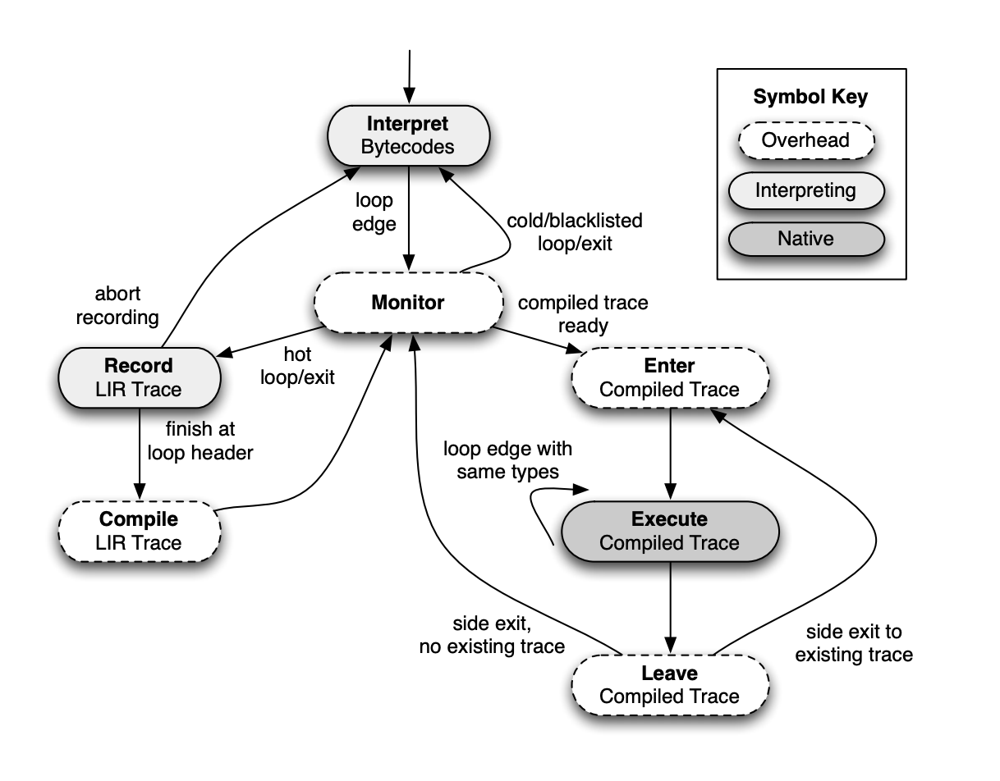
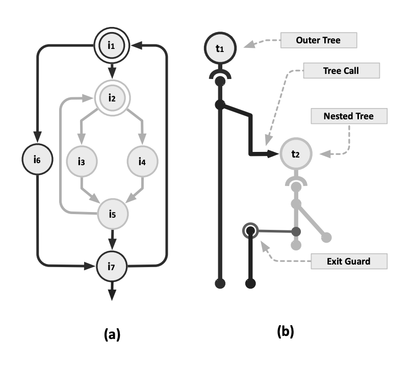

+++
title = "Trace-Based Just-in-Time Type Specialization for Dynamic Languages"
[extra]
latex = true
[[extra.authors]]
name = "Yulun Yao"
+++

## Introduction
# TL.DR.
This paper presents *Trace-Monkey*, a JavaScript language implementation based on tracing Just-In-Time (JIT) compilation. It focuses on identifying frequently executed loop traces at run-time and then compile those traces with dynamic type information. Specifically, the author proposes an algorithm to lazily form trace-trees with alternative paths within the loop, and explains how to generate efficient type-specialized code for the identified traces. The experimental result shows that *Trace-Monkey* is 10x faster compared to previous compilation strategies on some benchmarks.

# Problem
Dynamic languages, such as JavaScript, Python and Ruby are some of the top programming languages in the recent decade. These languages are accessible to developers thanks to their less restrictive syntax and type systems, easy to deploy on a wide range of platforms since they contain less hardware-specific type information. On the other hand, however, compared to traditional, statically typed languages, namely Java, C++, Ocaml, dynamic languages are much more difficult to be compiled. No hardware would ever support non-typed arithmetic operations, so the typing information needs to be resolved eventually. As types of expressions may vary at runtime in dynamic languages, the typing information is not available to compilers, which very often need to utilize it to do optimizations and generate efficient bytecodes. A seemingly simple yet not-so-simple example for compiler is as follows:

``` 
function add(x, y, z) {
	for (i = 0; i < x.length(); i++){
        z[i] = x[i] + y[i];
    }
    return z;
}
```

This function computes the sum(?) of each corresponding `x`, `y` slots and put the computation result into `z`. With a traditional, statically-typed languages, there are tons of optimizations we could do. For example, if we know `x`, `y`, `z` are all integer arrays, we could compile this program into vadd (vector adds) if our ISA supports it to speedup our computation. But what if `x`, `y`, `z` are doubles? Or even strings which need to be concatenated. 

The naive apporach is to just use an intepreter to figure out the typing information line-by-line. In the context of Javascript, this refers to the early SpiderMonkey which did nothing except for interpreting the language at that time. This disables any optimizations we mentioned above, and interpreter itself introduces huge overhead - For each statement in the user program, the interpreter needs to analyze it, look up corresponding instruction w.r.t. to the current environmental context, and deal with additional store/load operations as interpreter needs to maintain a mapping to the varibles. The overhead of interpreter makes it a undesireble approach as Javascript are often used in modern browser, which is highly interactive. Users would be annoyed by its slow and unreponsive behavior, and hence the early web applications are often very limited.

# Solution
A key observation based on real-world scenerio is that even though types can only be resolved during runtime for dynamic languages, they are typically type-stable. In other word, once `add(x, y, z)` are called with three integer arrays as arguments, the following calls to the same function are most likely passed with arguments of same types. With this observation in mind, we could speculate that the following calls will be using the same type information, optimize for the most frequent scenerio (HOT path) and create a fast path, meanwhile make sure that if this function is called with arguments of different types, we could still output correct computation result.

The above strategy leads to a technique called Just-in-Time (JIT) Compilation, which does the following procedure:

1. Execute the code with interpreter
2. Extract the typing information
3. See if the bytecode is hot, we lookup instruction cache to see if we have compiled fast path stored in cache
4. If the type information matches, we run the pre-compiled code, or compile and generate the fast path with current type information
5. If it's not hot or the execution diverts the fast path, we fall back to the standard interpreter mode to execute the program

The step 3 and 4 resemble the traditional ahead-of-time compilation strategy, in which we could generate efficient, machine specalized code. The step 5 is achieved by adding a special instruction called `guard` which works as `assert` but instead of terminating the program, it would terminate the fast path and fall back to the interpreter execution mode when the condition is not met. 

In 2008, Google developed Chrome V8 engine with a method-based JIT that compiles functions into typed-functions which can serve as fast paths when there is a match on the inputs' type information.

# TraceMonkey - this work
The high level idea of TraceMonkey is very close to what we mentioned in the last section. The main difference is, instead of optimizing for methods/functions, this work focuses on program traces, or specifically in the context of this paper, loops. The method-based JIT would generate the entire method with 'hot' type signatures. A program trace is often not that comprehensive - a trace represent hot bytecode sequences, but not including control sequences. A compiled trace is therefore an execution path throughout the program, with each value mapped to its type. This work specifically aims loops, as the authors find loops to be more interesting:
1. For each program, the vast majority of execution time is spent on loops. So that optimizing loops is often more fruitful.
2. Loop traces are often type-stable, even more so than methods. A variable in loop start with integer would almost always remain as integer for all iterations.

We would mainly take a look at three aspects of TraceMonkey:
1. Design Overview && Procedures
2. Trace/Tracetree Formation
3. TraceMonkey VM Implementation && Optimizations

# Design Overview
Below is a state diagram from the original paper showing the overall structure of TraceMonkey. To make the explanation clearer, I've also attached the sample program: Sieve of Eratosthenes, which is also from the original paper.

<p align="center">

</p>


```
for (var i = 2; i < 100; ++i) {
    if (!primes[i])
        continue;
    for (var k = i + i; i < 100; k += i)
        primes[k] = false
}
```

Each program in tracemonkey starts with running in interpreting mode. The trace points in TraceMonkey are the loop edges. Every time when the interpreter crosses the loop edge, the trace monitor gets invoked, which would then decide in between continuing with interpreting mode, recording a new trace, or executing a compiled trace. At the beginning, none of the traces are hot, so the monitor will always pick interpreting mode. In the context of the sample program, this is when `i == 2` and we are first entering the outer loop. After we execute the inner program for the second time, the trace monitor would identify that loop as hot and would start recording. During the recording, the program will be executed in interpreted mode and the trace is recorded with a low-level compiler intermediate representation called LIR. LIR encodes all operations with type information, as well as guards and stack operations when crossing a function boundary. The LIR snippet for encoding the inner loop is attached below:

```
    v0 := ld state[748] // load primes from the trace activation record
    st sp[0], v0 // store primes to interpreter stack
    v1 := ld state[764] // load k from the trace activation record
    v2 := i2f(v1) // convert k from int to double
    st sp[8], v1 // store k to interpreter stack
    st sp[16], 0 // store false to interpreter stack
    v3 := ld v0[4] // load class word for primes
    v4 := and v3, -4 // mask out object class tag for primes
    v5 := eq v4, Array // test whether primes is an array
    xf v5 // side exit if v5 is false
    v6 := js_Array_set(v0, v2, false) // call function to set array element
    v7 := eq v6, 0 // test return value from call
    xt v7 // side exit if js_Array_set returns false
```

The recording stops when the trace monitor sees the loop edge again or exits the loop. It would then compile the loop trace into native machine code specifically for the types it sees during the recording. The LIR itself contains no information of the machine but it could be easily mapped to each ISA. Some other optimizations are done in this phase, which we would discuss later. The compiled trace is stored in trace cache. Next time whenever trace monitor crosses the inner loop edge, it would attempt to call the compiled trace if there's a match in between variables in the environment and the recorded trace's type information. This is very similar to calling a function with a matching function signature.

So what about the outer loop? The outer loop becomes hot on its second iteration and would start recording. When the trace monitor sees that the trace for inner loop already exists, it would attempt to execute that compiled trace, and record that call to the inner trace into the outer loop's trace.

Two problems arise from the above procedure:
1. Given that many side exits in the trace, how would it be efficient if we just cover one trace per loop?
2. With nested loops, we would either record the same inner loop again and again (with the cost of $O(N^k)$ space), or return to interpreting mode and execute the inner loop trace (with the cost of extra time spent in stack operations and interpreter overheads). Is there a better way of dealing with nested loops?

The author offers a solution in the next secion.

# Trace/Tracetree Formation
We've mentioned that compiled trace in this work works like an extended, typed basic block. A trace has exactly one entry, a distinct type signature, and multiple (side) exits. Naively, without any additional optimizations, the program execution would frequently fall back to the intrepreting mode. This is highly undesireable, given how slow interpreter is, and additional overhead incurred in entering/exiting compiled traces. The author comes up with an idea called Trace-tree, which uses a couple of techniques to reduce the space/time overhead and maximize the time a program is running in native, compiled traces.

The idea of Tracetree is based on the observation that most loops would have some variation. Instead of aborting the current trace when side-exiting. The trace monitor would identify hot side exits, and start a new branch trace from that side exit. After recording for that hot branch trace is done, the original side exit will be modified to jump directly to the new branch trace. In this way, we could capture any hot variations within a loop, and extend the single trace into a single-entry, multiple-exit trace tree.

This idea is combined with several techniques to improve performance:

## Blacklisting
This technique is implemented to fight the issue that some traces cannot be recorded and is incurring penalty when the trace monitor is trying to record them repeatedly, either because there are some unsupported operations, or execeptions got thrown. The author simply uses a counter to track how many time it fails to record and adds a no-op to the header to avoid overhead in calling the trace monitor.

## Nested Tree Formation
This technique is used to avoid recording the same inner loop repeatedly. The key insight of the formation algorithm is that the code for each loop is only contained in its own trace tree. Any references to this particular loop should be a call instead of duplicate records. When the trace monitor is tracing an outer loop, if it sees an inner loop, it would attempt to call the trace for the inner loop. If the call successes, it would record the call into the outer loop. If the call fails, it would stop recording the outer loop and start recording the inner loop first. Therefore, we are always recursively finish recording the inner loop first, and there shall be no duplication. The trace call is also optimized in a way that it's implemented as a direct jump to the inner compiled trace. This works just like inlining and makes sure that the execution does not need to fall back to interpreter.

A graph depicting this approach is shown below:

<p align="center">

</p>

# TraceMonkey VM Implementation & Optimization

Finally, we take a look at how TraceMonkey's VM implemented. TraceMonkey's VM stores all compiled traces inside trace cache, indexed by interpreter PC and type signatures. The trace monitor builds a activation record when executing a trace, with associated local and global variables, temporary stack spaces, and space for arguments to native calls. The trace could then be called like a normal function pointer. The trace monitor is also responsible for restoring the interpreter state, verifying states for compiled trace and releasing the occupied space.

The author also introduces an intresting optimization technique called Tree Stiching. The purpose of tree stitching is to reuse activation record when a side exit is met. The reason is fairly straightforward, since it's easy to see that within a loop, the register allocation and memory layouts are often invariant. the exiting trace only needs to write live
register-carried values back to its trace activation record. However, with multi-code processors being the majority (unlike when this paper just got published), it's probably just easier to recompile the entire trace-tree in backend.

Additional optimization techniques when a LIR trace gets compiled to machine code as a set of filters, including
1. Float to Integer Conversion
2. Constant Subexpression Elimination
3. Constant Folding
4. Dead Code Elimination
5. Dead Stack Elimination

# Evaluation
The evaluation of is paper is performed on a Macbook Pro over SunSpider, which is a standard testing suite for JavaScript with a variety of applications. The experimental environment is very reasonable to me, since it's a very good representation of JavaScript workloads and user's device. The author benchmarks TraceMonkey against SpiderMonkey (baseline interpreter), SFX (inline threading interpreter in Apple's Webkit), V8 (Method-based JIT developed by Google).

Based on the figure above, traceMonkey is the fastest VM on 9 out of 26 benchmarks. In particular, TraceMonkey performs on an average of ~5x compared to SFX and V8 on `bitops` benchmarks, which are mainly short bitwise operations. In addition to that, TraceMonkey performs well in maths and crypto, slightly edging SFX and V8. TraceMonkey does not achieve the same level of speedup against SFX and V8 on programs with a high number of traces or tiny loop bodies, as well as cases where TraceMonkey currently not tracing (i.e. recursion), although I believe it's relatively easy and reasonable to implement tracing for recursion.

The detailed trace recording statistics provides more insights into the performance. One thing I noticed is that Trace/Loop is inversely correlated with Speedup. The reason I believe is that more traces per loop means higher compilation costs, and also higher costs to call inner loop / branch traces. This shows that even with many optimization techniques implemented upon trace trees, dealing with nested loops and loops with multiple branches are still the main challenges.

# Discussion Question
- Why tracing-JITs cannot compete with method-JITs? Even though TraceMonkey was successful at its time, it was eventually replaced by a method-JIT.
- Would another definition of 'hot' helps with tracing-JITs performance?
- What are the biggest contributors to modern JavaScripts' speedup?