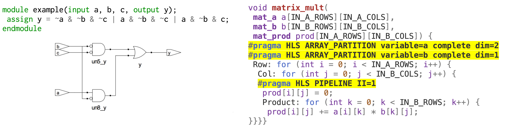
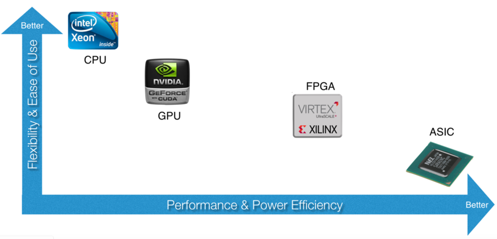
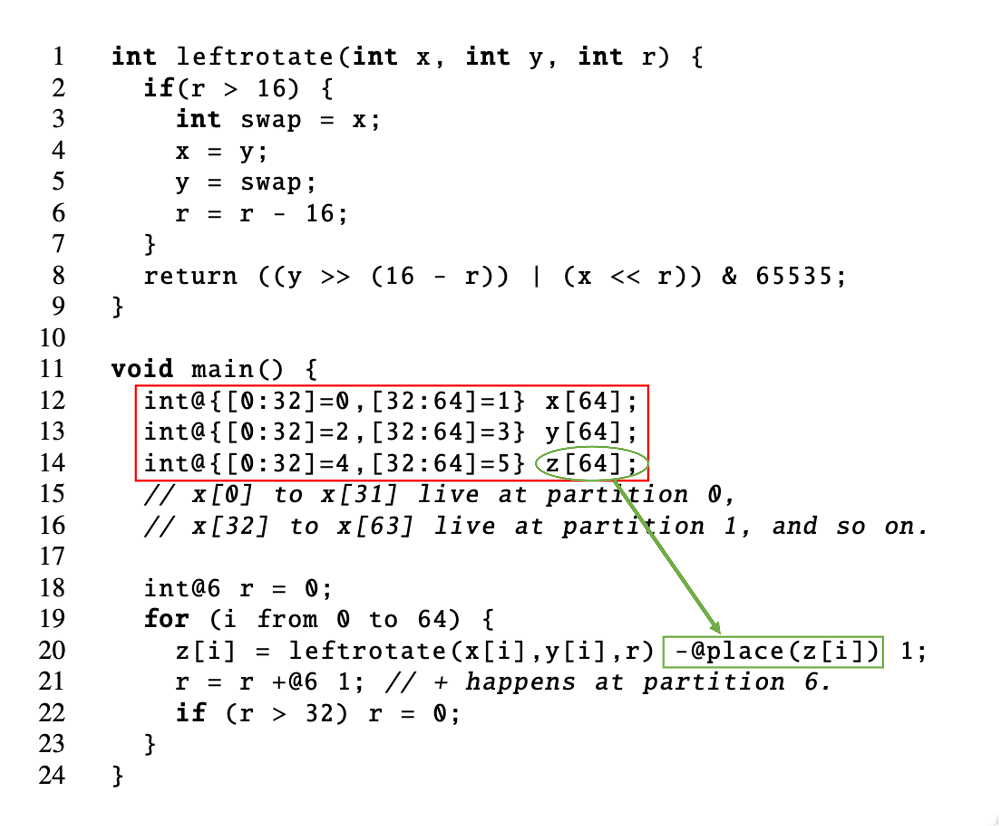
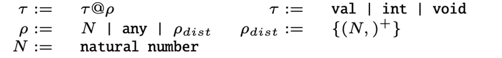
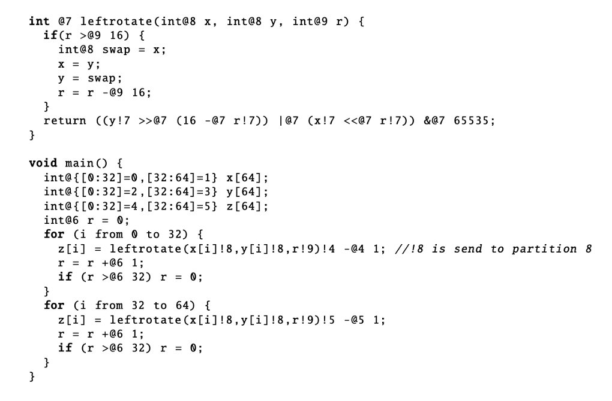
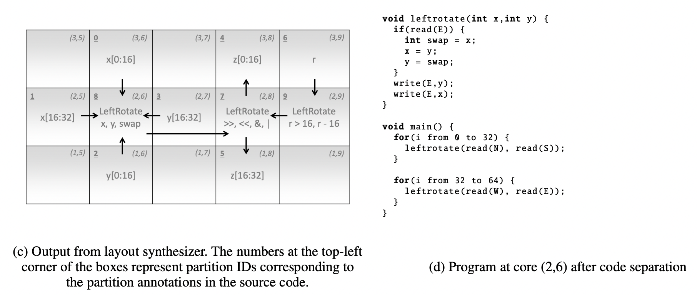

+++
title = "Chlorophyll: Synthesis-Aided Compiler for Low-Power Spatial Architectures"
[extra]
bio = """
  [Hongzheng Chen](https://chhzh123.github.io/) is a first-year CS PhD student at the Computer Systems Laboratory, Cornell University. His research interests include domain-specific languages, compiler optimization, and heterogeneous computing systems.
latex = true
"""
[[extra.authors]]
name = "Hongzheng Chen"
link = "https://chhzh123.github.io/"
+++

> [**Chlorophyll: Synthesis-Aided Compiler for Low-Power Spatial Architectures**](https://dl.acm.org/citation.cfm?id=2594339)
> Phitchaya Mangpo Phothilimthana, Tikhon Jelvis, Rohin Shah, Nishant Totla, Sarah Chasins, and Rastislav Bodik.
> PLDI, 2014.

**TL;DR**: This paper proposes *Chlorophyll*, the first synthesis-aided programming model and compiler for the low-power spatial architecture *GreenArray GA144*. It decomposes a complex compilation program into smaller synthesis subprograms -- partitioning, layout, code separation, and code generation. Experimental results show that Chlorophyll can significantly reduce the programming burden and achieve good performance for several benchmarks.

## Background

In this section, I will firstly introduce the background of the program synthesis and spatial architecture.

### Program Synthesis
Some examples we saw in [Lesson 13](https://www.cs.cornell.edu/courses/cs6120/2022sp/lesson/13/) are just a few cases of program synthesis. Based on the talk[^1] given by Prof. [James Bornholt](https://www.cs.utexas.edu/~bornholt/), we can roughly classify the application of program synthesis into three categories: approximate computing, black box systems, and hardware synthesis. For this paper, we will only focus on the last category -- hardware synthesis.

Traditionally, hardware programmers need to write circuits in [hardware description languages (HDL)](https://en.wikipedia.org/wiki/Hardware_description_language) like Verilog or VHLS (see the left figure below), and push the program through time-consuming logical synthesis and physical synthesis (placement and routing) to generate the desired hardware architecture. However, HDL is too low-level and lack modern language features, making the development process extremely long. Therefore, [high-level synthesis (HLS)](https://en.wikipedia.org/wiki/High-level_synthesis) is proposed to enable the programmers to write hardware circuits in a high-level language like C/C++. See the right figure below, programmers need to insert pragmas after the loops or the array declartion for HLS, which are quite similar to the OpenMP pragmas. HLS will then generate the corresponding circuit description in HDL based on the pragmas provided by the programmer. Leveraging HLS, programmers can enjoy the facilities of high-level languages, which greatly shorten the development time for hardware accelerators.

In general, synthesis is not a new technique for hardware compilation. It has already been widely used in nowadays circuits design. Some commercial examples include [Xilinx Vivado HLS](https://www.xilinx.com/support/documentation-navigation/design-hubs/dh0012-vivado-high-level-synthesis-hub.html) and [Intel FPGA oneAPI toolkit](https://www.intel.com/content/www/us/en/developer/tools/oneapi/fpga.html#gs.z1p9mh)).



### Spatial Architecture
A spatial architecture commonly has multiple identical processing elements (PEs) on the chip. Those PEs are connected with on-chip network, but the data transmission and network interconnection need to be manually configured. A typical example of spatial architecture nowadays is [systolic array](https://en.wikipedia.org/wiki/Systolic_array), which is the core component of Google's [TPU](https://cloud.google.com/tpu). Since deep neural networks are essentially doing matrix multiplication, using systolic array can maximally exploit the parallelism and greatly speedup the computation.

This paper targets another spatial architecture called GreenArray (GA144). It is a 18-bit stack-based processor with 144 cores dispatched on 8 rows and 18 columns. The blueprint is very similar to systolic array, but the interconnection is much more regular. Each core of GA144 has 2 circular stacks with less than 100 18-bit words private memory. It can only communicate using blocking read or write with its neighbor cores in the same row or column. Overall, it is very energy-efficient compared with general processors like CPU and GPU.

Though GA144 is low-power and environmentally-friendly, it uses a low-level stack-based language called [colorForth](http://www.euroforth.org/ef19/papers/oakford.pdf)/[arrayForth](http://www.greenarraychips.com/home/documents/greg/cf-intro.htm) to program. (Actually it is a very interesting language that uses color to express different semantics.) It requires programmers to write programs for each core and manually manipulate the stack for transfering the data. The intercommunication between cores also need to be manually configured, which places great burden on the programmer.

### Specturm of Computing Devices
The following figure shows the programmability and energy efficiency of different computing devices. Generally, CPU is the most easy-to-use device, targeting the most common applications. With the rise of [GPGPU](https://en.wikipedia.org/wiki/General-purpose_computing_on_graphics_processing_units), GPU also becomes a popular choice for deep learning and high-performance computing, but the downside of GPU is its large power consumption. On the other hand, [field-programmable gate array (FPGA)](https://en.wikipedia.org/wiki/Field_programmable_gate_array) is more energy-efficient than CPU and GPU, but requires lots of programming efforts to achieve high performance.

GA144 can be classfied as a *manycore* processor, which can be placed between GPU and FPGA. Another spatial architecture called [coarse-grained reconfigurable array (CGRA)](https://cccp.eecs.umich.edu/research/cgra.php) also has lower power consumption than CPU and GPU, but is hard to program.

In the rightmost side of this figure is [application-specific integrated circuit (ASIC)](https://en.wikipedia.org/wiki/Application-specific_integrated_circuit). It provides really high performance and low energy consumption, but is designed for a specific application and cannot be reconfigured for other applications. Google's [TPU](https://cloud.google.com/tpu) and Huawei's [Ascend NPU](https://www.huawei.com/en/news/2019/8/huawei-ascend-910-most-powerful-ai-processor) are both examples of ASIC.

A consensus is that there does not exist an one-size-fits all processor. Different devices may have their own strengths and weaknesses. Combining different technologies in a large chip seems to be a trend of future devices. Apple's M1 chip has a 16-core [Neural Engine](https://www.apple.com/newsroom/2020/11/apple-unleashes-m1/) which is also a type of NPU. Nvidia's [Turing GPU](https://www.nvidia.com/en-us/data-center/tensor-cores/) has a specialized Tensor Core architecture which greatly accelerates low-bitwidth matrix multiplication but requires special program snippets to run on that.



We also discuss in class why GA144 is not widely adopted nowadays and what makes a device become popular. The first thing should be programmers' productivity. If a device is easy to use and debug, even its performance is not that good, it can still be accepted by many people. The second thing is the cost of the device. Based on the [price](http://www.greenarraychips.com/home/products/index.php) listed on the GreenArray website, it costs $20 per chip, which is a very reasonable price and can be massively manufactured, so the main problem of low acceptance is probably programmability.


## Motivation
Based on the background we discussed above, the authors propose the following challenges that motivate them to develop a compiler for GA144:
1. <u>Spatial architecture is hard to program.</u> The data placement, communication, and computation all need to be manually specified by the programmers using very low-level language.
2. <u>Classical compiler may not be able to bridge the abstraction gap of low-power computing.</u> For one thing, designing compilers for new hardware is hard since no well-known optimizations can be applied. For the other, the GA144 architecture was still evolving at that time, so the compiler should also evolve fast to keep up with the pace.
3. <u>Program synthesis is hard to scale to large programs.</u>

Therefore, the authors propose a synthesis-aided compiler Chlorophyll to solve the above challenges. 

## Methods

In this section, I will talk about the four stages of the compiler, including program partition, layout and routing, code separation, and code generation.

### Program Partition
#### Programming Model
Chlorophyll provides a easy-to-use programming model for partitioning. Basically, users can directly write C code and add partition annotation to the program. `@` specifies the variable or the computation is on which partition, and `!` means the data is send from one partition to another.

Programmers only need to write partially annotated code as shown below, and the compiler will automatically generate the fully annotated one. This example shows `x` is in the `2`nd partition, and `y` is in the `1`st partition. Partition `2` needs to firstly transfer data `x` to partition `1`, and then compute `x * y`. Finally the result will be passed to partition `0` and returned.
```cpp
// partial annotation
int@0 mult(int x, int y) { return x * y; } 
// full annotation
int@0 mult(int@2 x, int@1 y)
  { return (x!1 *@1 y)!0; }
```

For control flow, Chlorophyll only supports constant-bound `for` loops and general `while` loops. It will duplicate the control flow in each core to ensure the program correctness.

For distributed arrays, users can annotate which part of data should be put on which partition, and use `place` to specify the partition based on the data location in the array. For example, the following figure shows `[0:32]` elements in array `x` are put on partition `0`, and `[32:64]` elements are put on partition `1`.



The authors mention this programming model have several limitations like cannot support recursive calls, multi-dimensional arrays, and non-loop-variable indices. These limitations are reasonable, and even for nowadays HLS tools, they still cannot support recursive function calls[^2].

#### Partition Type
> Partitioning a program can be thought of as a type inference on the partition types.

I think this is the most interesting part of the paper. The authors add partition information to the type system, thus partitioning the program can be automatically done using type inference. The definition of partition type is shown below.


#### Partition Process
The partition process in the paper is a bit messy, so I reorganize it into a more clear way. We have the following steps:

1. <u>Loop splitting.</u> Since array data are distributed among partitions, we also need to split the control flow (the loop) to ensure the computation access the correct data. The code snippet shows how to split the loop for two partitions.
```cpp
// before splitting
int@{[0:5]=0, [5:10]=1} x[10];
for (i from 1 to 10) x[i] = x[i] + x[i-1];
// after splitting
for (i from 1 to 5) x[i] = x[i] + x[i-1]; // x[i] at 0, x[i-1] at 0
for (i from 5 to 6) x[i] = x[i] + x[i-1]; // x[i] at 0, x[i-1] at 1
for (i from 6 to 10) x[i] = x[i] + x[i-1]; // x[i] at 1, x[i-1] at 1
```

2. <u>Create symbolic variables for unannotated variables.</u> If the partition type can be inferenced from the user-annotated types, then the compiler will directly add that type after the operator or variable. Otherwise, it will generate a symbolic variable for those unannotated variables like `sym0` shown below.
```cpp
// before annotating
int@6 r = 0;
for (i from 0 to 64) {
  z[i] = leftrotate(x[i], y[i], r) - @place(z[i]) 1;
  r = r +@6 1; // + happens at partition 6.
  if (r > 32) r = 0; 
}
// after annotating
int@6 r = 0;
for (i from 0 to 64) {
  z[i] = leftrotate(x[i]!sym0, y[i]!sym1, r!sym2) - @place(z[i]) 1;
  r = r +@6 1; // + happens at partition 6.
  if (r >@6 32) r = 0; 
}
```

3. <u>Construct communication count and partition space constraints with [Rosette](http://emina.github.io/rosette/) synthesizer.</u> The overall memory space should satisfy the following constraints:

\[ \text{Space} (\text{operation}) + \text{Space} (\text{statement}) + \text{Space} (\text{maxComm}) < \text{Memory per core}\]

The synthesizer will solve the constraint, use that solution as an additional constraint for `maxComm`, and then iteratively solve it to find the minimum communication cost. Finally we can obtain the following fully annotated program.



One question here is that where is the boundary between programmers and compiler. For this programming model, programmers do not exactly know where they should annotate the partition types. Some may be benefit for the synthesizer to quickly solve the constraint, but others may have negative impact or even cause infeasible solution. This actually can be a burden for programmers since they still have to have a good understanding of the underlying architecture and annotate the partition in a right way.

### Layout and Routing
The next stage is to map the logical representation to physical cores. We can denote $F$ as the logical facilities or the code partition, $L$ as the physical core locations (represented in a 2D tuple), $t:F\times F\to\mathbb{R}$ as the flow function (i.e., the number of messages between two partitions), and $d:L\times L\to\mathbb{R}$ as the distance function (use Manhattan distance as a measurement). Thus, the layout and routing problem becomes finding the assignment that minimizes the following communication function:

\[\sum_{f_1\in F, f_2\in F}t(f_1,f_2)\cdot d(a(f_1),a(f_2))\]

This is a [Quadratic Assignment Problem (QAP)](https://en.wikipedia.org/wiki/Quadratic_assignment_problem) and can be efficently solved by [simulated annealing](https://en.wikipedia.org/wiki/Simulated_annealing#:~:text=Simulated%20annealing%20(SA)%20is%20a,space%20for%20an%20optimization%20problem.).

### Code Separation
After the layout mapping is generated, we can generate code for each core, which consists of the data storage, computation, and communication part. For basic statements, we can directly put the variable to corresponding partition and generate the communication between different partitions.

```cpp
// basic statement
int@3 x = (1 +@2 2)!3 *@3 (3 +@1 4)!3; 
// partition 1
write(E, 3 + 4);
// partition 2
write(E, 1 + 2); write(E, read(W));
// partition 3
int x = read(W) * read(W);
```

For functions, the arguments need to be transferred to the corresponding partition.
```cpp
// function call
int@3 f(int@1 x, int@2 y) { return (x!2 +@2 y)!3; }
int@3 x = f(1,2); 
// partition 1
void f(int x) { send(E, x); } f(1);
// partition 2
void f(int y) { send(E, read(W) + y); } f(2);
// partition 3
int f() { return read(W); } int x = f();
```

For distributed arrays, we need to generate subarrays for each partition and split the loops.
```cpp
int @{[0:16]=0, [16:32]=1} x[32];
for (i from 0 to 32) x[i] = x[i] +@place(x[i]) 1;
// partition 0
int x[16];
for (i from 0 to 16) x[i] = x[i] + 1;
// partition 1
int x[16];
for (i from 16 to 32) x[i-16] = x[i-16] + 1;
```

Finally we can obtain the following code after separation.


Notice the code separation itself is not a synthesis problem. The authors only said they decomposed the problem into several subproblems, but not necessarily each subproblem should be solved by synthesis.

### Code Generation


## Further Discussion


## Programming Model


## Synthesis and Compilation


## Reference
[^1]: James Bornholt, Emina Torlak, [Scaling Program Synthesis by Exploiting Existing Code](https://www.cs.utexas.edu/~bornholt/papers/scalesynth-ml4pl15.slides.pdf)
[^2]: Xilinx Vitis HLS, [Recursive Functions](https://docs.xilinx.com/r/en-US/ug1399-vitis-hls/Recursive-Functions)