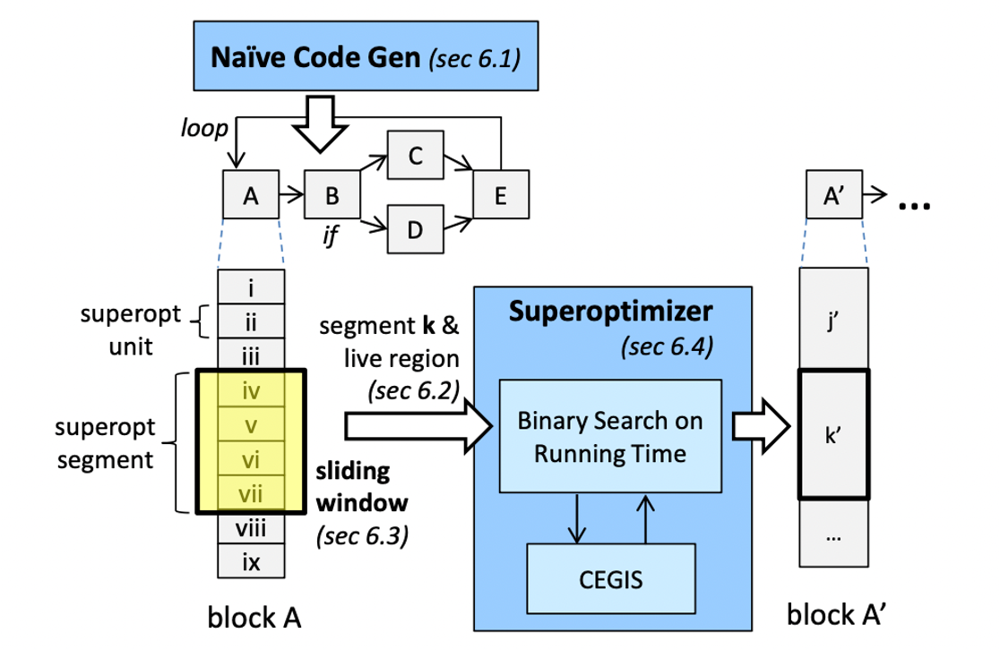
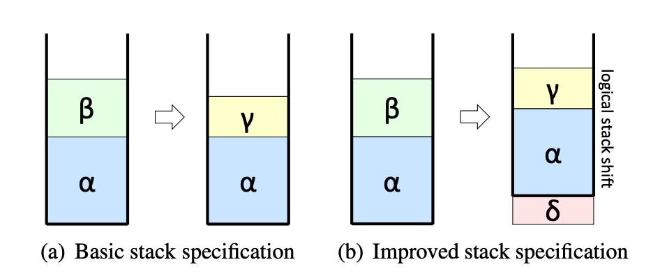
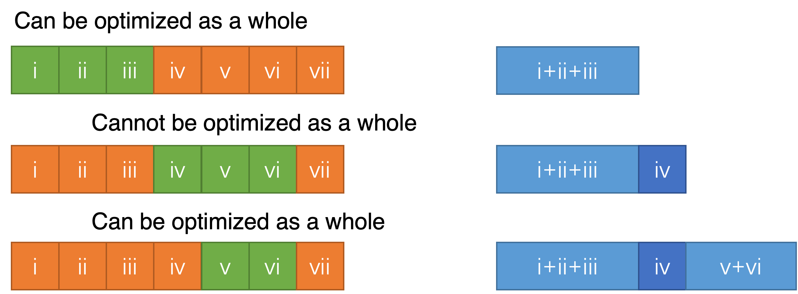
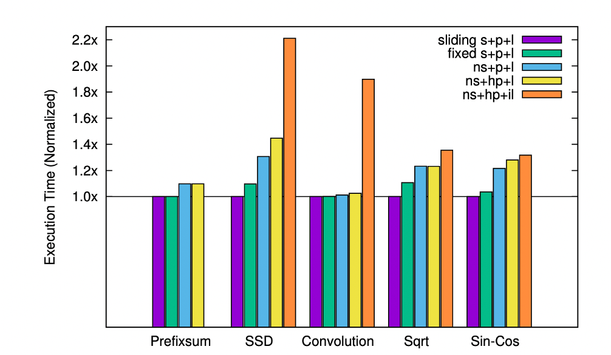
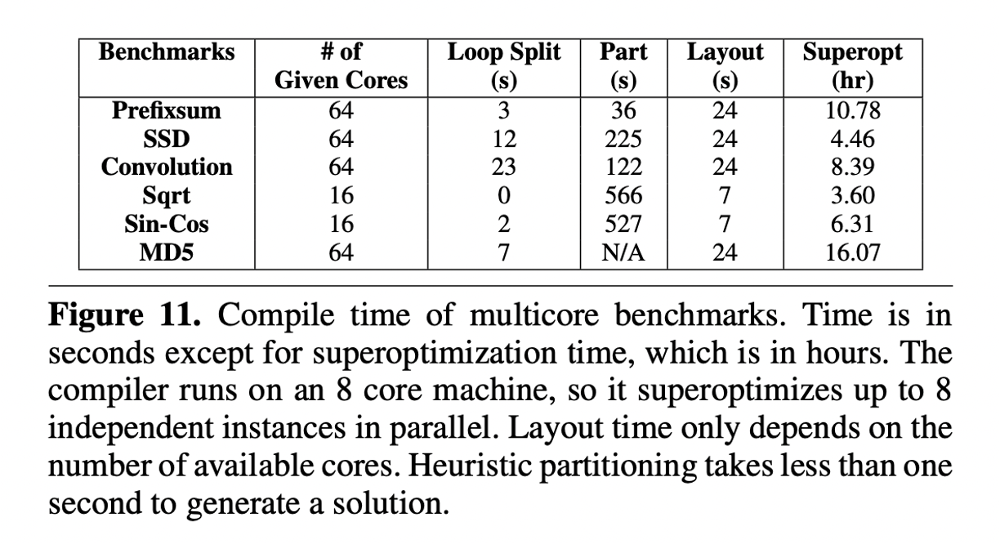
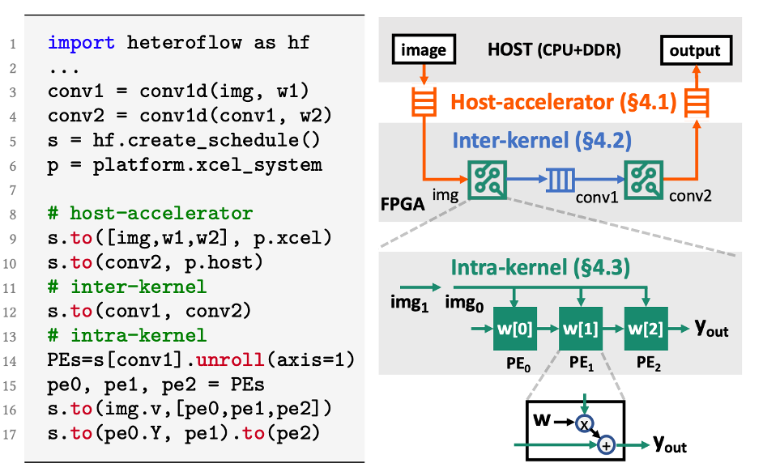

+++
title = "Chlorophyll: Synthesis-Aided Compiler for Low-Power Spatial Architectures"
[extra]
bio = """
  [Hongzheng Chen](https://chhzh123.github.io/) is a first-year CS PhD student at the Computer Systems Laboratory, Cornell University. His research interests include domain-specific languages, compiler optimization, and heterogeneous computing systems.
"""
latex = true
[[extra.authors]]
name = "Hongzheng Chen"
link = "https://chhzh123.github.io/"
+++

> [**Chlorophyll: Synthesis-Aided Compiler for Low-Power Spatial Architectures**](https://dl.acm.org/citation.cfm?id=2594339)<br/>
> Phitchaya Mangpo Phothilimthana, Tikhon Jelvis, Rohin Shah, Nishant Totla, Sarah Chasins, and Rastislav Bodik.<br/>
> PLDI, 2014.

**TL;DR**: This paper proposes *Chlorophyll*, the first synthesis-aided programming model and compiler for the low-power spatial architecture *GreenArray GA144*. It decomposes a complex compilation problem into smaller synthesis subproblems -- partitioning, layout, code separation, and code generation. Experimental results show Chlorophyll can significantly reduce the programming burden and achieve good performance for several benchmarks.

The code of Chlorophyll is available on [GitHub](https://github.com/mangpo/chlorophyll).


## Background

In this section, I will first introduce the background of the program synthesis and spatial architecture.

### Program Synthesis
Some examples we saw in [Lesson 13](https://www.cs.cornell.edu/courses/cs6120/2022sp/lesson/13/) are just a few cases of program synthesis. Based on the talk[^1] given by Prof. [James Bornholt](https://www.cs.utexas.edu/~bornholt/), we can roughly classify the application of program synthesis into three categories: approximate computing, black-box systems, and hardware synthesis. For this paper, we will only focus on the last category -- hardware synthesis.

Traditionally, hardware programmers need to write circuits in [hardware description languages (HDL)](https://en.wikipedia.org/wiki/Hardware_description_language) like Verilog or VHLS (see the left figure below) and push the program through time-consuming logical synthesis and physical synthesis (placement and routing) to generate the desired hardware architecture. However, HDL is too low-level and lacks modern language features, making the development process extremely long. Therefore, [high-level synthesis (HLS)](https://en.wikipedia.org/wiki/High-level_synthesis) is proposed to enable the programmers to write hardware circuits in a high-level language like C/C++. See the right figure below, programmers need to insert pragmas after the loops or the array declaration for HLS, which are quite similar to the OpenMP pragmas. HLS will then generate the corresponding circuit description in HDL based on the pragmas provided by the programmer. Leveraging HLS, programmers can enjoy the facilities of high-level languages, which greatly shorten the development time for hardware accelerators.

In general, synthesis is not a new technique for hardware compilation. It has already been widely used in nowadays circuit design. Some commercial examples include [Xilinx Vivado HLS](https://www.xilinx.com/support/documentation-navigation/design-hubs/dh0012-vivado-high-level-synthesis-hub.html) and [Intel FPGA oneAPI toolkit](https://www.intel.com/content/www/us/en/developer/tools/oneapi/fpga.html#gs.z1p9mh).


### Spatial Architecture
A spatial architecture commonly has multiple identical processing elements (PEs) on the chip. Those PEs are connected with on-chip network, but the data transmission and network interconnection need to be manually configured. A typical example of spatial architecture nowadays is [systolic array](https://en.wikipedia.org/wiki/Systolic_array), which is the core component of Google's [TPU](https://cloud.google.com/tpu). Since deep neural networks are essentially doing matrix multiplication, using systolic array can maximally exploit the parallelism and greatly speed up the computation.

This paper targets another spatial architecture called [GreenArray (GA144)](http://www.greenarraychips.com/home/documents/greg/PB001-100503-GA144-1-10.pdf
). It is an 18-bit stack-based processor with 144 cores dispatched on 8 rows and 18 columns. The blueprint is very similar to a systolic array, but the interconnection is much more regular. Each core of GA144 has 2 circular stacks with less than 100 18-bit words private memory. It can only communicate using blocking read or write with its neighbor cores in the same row or column. Overall, it is very energy-efficient compared with general processors like CPU and GPU.

Though GA144 is low-power and environmentally-friendly, it uses a low-level stack-based language called [<font color="red">color</font><font color="green">Forth</font>](http://www.euroforth.org/ef19/papers/oakford.pdf)/[arrayForth](http://www.greenarraychips.com/home/documents/greg/cf-intro.htm) to program. (It is actually a very cool language that uses <font color="red">color</font> to express different semantics!) It requires programmers to write programs for each core and manually manipulate the stack for transferring the data. The intercommunication between cores also needs to be manually configured, placing great burden on the programmer.

### Spectrum of Computing Devices
The following figure shows the programmability and energy efficiency of different computing devices. Generally, CPU is the most easy-to-use device, targeting the most common applications. With the rise of [GPGPU](https://en.wikipedia.org/wiki/General-purpose_computing_on_graphics_processing_units), GPU has also become a popular choice for deep learning and high-performance computing, but the downside of GPU is its large power consumption. On the other hand, [field-programmable gate array (FPGA)](https://en.wikipedia.org/wiki/Field_programmable_gate_array) is more energy-efficient than CPU and GPU, but requires lots of programming efforts to achieve high performance.

GA144 can be classified as a *manycore* processor, which can be placed on the figure between GPU and FPGA. Another spatial architecture called [coarse-grained reconfigurable array (CGRA)](https://cccp.eecs.umich.edu/research/cgra.php) also has lower power consumption than CPU and GPU, but is still hard to program.

On the rightmost side of this figure is [application-specific integrated circuit (ASIC)](https://en.wikipedia.org/wiki/Application-specific_integrated_circuit). It provides really high performance and low energy consumption, but is designed for a specific application and cannot be reconfigured for other applications. Google's [TPU](https://cloud.google.com/tpu) and Huawei's [Ascend NPU](https://www.huawei.com/en/news/2019/8/huawei-ascend-910-most-powerful-ai-processor) are both examples of ASIC.

A consensus is that there does not exist a one-size-fits-all processor. Different devices may have their own strengths and weaknesses. Combining different technologies in a large chip seems to be a trend for future devices. Apple's M1 chip has a 16-core [Neural Engine](https://www.apple.com/newsroom/2020/11/apple-unleashes-m1/) which is also a type of NPU. Nvidia's [Turing GPU](https://www.nvidia.com/en-us/data-center/tensor-cores/) has a specialized Tensor Core architecture that can accelerate low-bitwidth matrix multiplication but requires special program snippets to run on that.


We also discuss in class why GA144 is not widely adopted nowadays and what makes a device become popular. The first thing should be programmers' productivity. If a device is easy to use and debug, even its performance is not that good, it can still be accepted by many people. The second thing is the cost of the device. Based on the [price](http://www.greenarraychips.com/home/products/index.php) listed on the GreenArray website, it costs $20 per chip, which is very reasonable price and can be massively manufactured.


## Motivation
Based on the background we discussed above, the authors propose the following challenges that motivate them to develop a compiler for GA144:
1. **Spatial architecture is hard to program.** The data placement, communication, and computation all need to be manually specified by the programmers using very low-level language.
2. **Classical compiler may not be able to bridge the abstraction gap of low-power computing.** For one thing, designing compilers for new hardware is hard since no well-known optimizations can be applied. For the other, the GA144 architecture was still evolving at that time, so the compiler should also evolve fast to keep up with the pace.
3. **Program synthesis is hard to scale to large programs.**

Therefore, the authors propose a synthesis-aided compiler Chlorophyll to solve the above challenges. 

## Methods

In this section, I will talk about the four stages of the compiler, including program partition, layout and routing, code separation, and code generation.

### Program Partition
Partitioning the program is the most important step in the Chlorophyll. The following subsections will explain the programming model and the partioning process.

#### Programming Model
Chlorophyll provides an easy-to-use programming model for partitioning. Basically, users can directly write C code and add partition annotations to the program. `@` specifies the variable or the computation is on which partition, and `!` means the data is sent from one partition to another.

Programmers only need to write partially annotated code as shown below, and the compiler will automatically generate the fully annotated one. This example shows `x` is in the `2`nd partition, and `y` is in the `1`st partition. Partition `2` needs to firstly transfer data `x` to partition `1`, and then compute `x * y`. Finally, the result will be passed to partition `0` and returned.
```cpp
// partial annotation
int@0 mult(int x, int y) { return x * y; } 
// full annotation
int@0 mult(int@2 x, int@1 y)
  { return (x!1 *@1 y)!0; }
```

For control flow, Chlorophyll only supports constant-bound `for` loops and general `while` loops. It will duplicate the control flow in each core to ensure the program's correctness.

For distributed arrays, users can annotate which part of data should be put on which partition, and use `place` to specify the partition based on the data location in the array. For example, the following figure shows `[0:32]` elements in array `x` are put on partition `0`, and `[32:64]` elements are put on partition `1`.


The authors mention this programming model has several limitations. For instance, it cannot support recursive calls, multi-dimensional arrays, and non-loop-variable indices. These limitations are reasonable. Even for nowadays HLS tools, they still cannot support recursive function calls.[^2]

#### Partition Type
> "Partitioning a program can be thought of as a type inference on the partition types."

I think this is the most interesting part of the paper. The authors add partition information to the type system, thus partitioning the program can be automatically done using type inference. The definition of partition type is shown below.

<center>

</center>

#### Partition Process
The partition process in the paper is a bit messy, so I reorganize it in a more clear way. We have the following steps:

1. **Loop splitting.** Since array data are distributed among partitions, we also need to split the control flow (the loop) to ensure the computation access the correct data. The code snippet shows how to split the loop for two partitions.
  ```cpp
  // before splitting
  int@{[0:5]=0, [5:10]=1} x[10];
  for (i from 1 to 10) x[i] = x[i] + x[i-1];
  // after splitting
  for (i from 1 to 5) x[i] = x[i] + x[i-1]; // x[i] at 0, x[i-1] at 0
  for (i from 5 to 6) x[i] = x[i] + x[i-1]; // x[i] at 0, x[i-1] at 1
  for (i from 6 to 10) x[i] = x[i] + x[i-1]; // x[i] at 1, x[i-1] at 1
  ```

2. **Create symbolic variables for unannotated variables.** If the partition type can be inferenced from the user-annotated types, then the compiler will directly add that type after the operator or variable. Otherwise, it will generate a symbolic variable for those unannotated variables like `sym0` shown below.
  ```cpp
  // before annotating
  int@6 r = 0;
  for (i from 0 to 64) {
    z[i] = leftrotate(x[i], y[i], r) - @place(z[i]) 1;
    r = r +@6 1; // + happens at partition 6.
    if (r > 32) r = 0; 
  }
  // after annotating
  int@6 r = 0;
  for (i from 0 to 64) {
    z[i] = leftrotate(x[i]!sym0, y[i]!sym1, r!sym2) - @place(z[i]) 1;
    r = r +@6 1; // + happens at partition 6.
    if (r >@6 32) r = 0; 
  }
  ```

3. **Construct communication count and partition space constraints with [Rosette](http://emina.github.io/rosette/) synthesizer.** The overall memory space should satisfy the following constraints:

\\[ \text{Space} (\text{operation}) + \text{Space} (\text{statement}) + \text{Space} (\text{maxComm}) < \text{Memory per core} \\]

The synthesizer will solve the constraint, use that solution as an additional constraint for `maxComm`, and then iteratively solve it to find the minimum communication cost. Finally, we can obtain the following fully annotated program.


One question here is where is the boundary between programmers and compilers. For this programming model, programmers do not exactly know where they should annotate the partition types. Some may benefit for the synthesizer to quickly solve the constraint, but others may have a negative impact or even cause an infeasible solution. This actually can be a burden for programmers since they still have to have a good understanding of the underlying architecture and annotate the partition in a right way.

### Layout and Routing
The next stage is to map the logical representation to physical cores. We can denote $F$ as the logical facilities or the code partition, $L$ as the physical core locations (represented in a 2D tuple), $t:F\times F\to\mathbb{R}$ as the flow function (i.e., the number of messages between two partitions), and $d:L\times L\to\mathbb{R}$ as the distance function (use Manhattan distance as a measurement). Thus, the layout and routing problem becomes finding the assignment that minimizes the following communication function:

\\[ \sum_{f_1\in F, f_2\in F} t(f_1,f_2) \cdot d(a(f_1),a(f_2)) \\]

This is a [Quadratic Assignment Problem (QAP)](https://en.wikipedia.org/wiki/Quadratic_assignment_problem) and can be efficently solved by [simulated annealing](https://en.wikipedia.org/wiki/Simulated_annealing).

### Code Separation
After the layout mapping is generated, we can generate code for each core, which consists of the data storage, computation, and communication part. For basic statements, we can directly put the variable to the corresponding partition and generate the communication between different partitions.

```cpp
// basic statement
int@3 x = (1 +@2 2)!3 *@3 (3 +@1 4)!3; 
// partition 1
write(E, 3 + 4);
// partition 2
write(E, 1 + 2); write(E, read(W));
// partition 3
int x = read(W) * read(W);
```

For functions, the arguments need to be transferred to the corresponding partition.
```cpp
// function call
int@3 f(int@1 x, int@2 y) { return (x!2 +@2 y)!3; }
int@3 x = f(1,2); 
// partition 1
void f(int x) { send(E, x); } f(1);
// partition 2
void f(int y) { send(E, read(W) + y); } f(2);
// partition 3
int f() { return read(W); } int x = f();
```

For distributed arrays, we need to generate subarrays for each partition and split the loops.
```cpp
int @{[0:16]=0, [16:32]=1} x[32];
for (i from 0 to 32) x[i] = x[i] +@place(x[i]) 1;
// partition 0
int x[16];
for (i from 0 to 16) x[i] = x[i] + 1;
// partition 1
int x[16];
for (i from 16 to 32) x[i-16] = x[i-16] + 1;
```

Finally, we can obtain the following code after separation.


Notice the code separation itself is not a synthesis problem. The authors only said they decomposed the problem into several subproblems, but not necessarily each subproblem should be solved by synthesis.

### Code Generation
The last step is to generate the code for each partition. This paper leverages superoptimization to generate the optimized code, the reason of which is that GA144 is a new architecture and there does not exist well-known optimization techniques for it. Brute force search may be a good choice to obtain high-performance "assembly" code (written in arrayForth), but there exist two challenges:
1. We can break down code sequences into smaller ones but it is hard to choose segment boundaries.
2. Only specifying the input-output behavior may disallow garbage values on the stack, which miss optimization opportunities.

Therefore, the authors propose modular superoptimization to tackle the above challenges. The overview of the superoptimizer is shown below.

<center>

</center>

Traditionally, if the superoptimizer uses a strict equivalence form, to prove two programs $P\equiv P'$, we require the programs to have the same behavior and generate the same output. For the following stack example, we want to remove $\beta$ from the top of the stack and add $\gamma$ to the stack. The strict form requires the programs to have the same behavior, i.e., for $P$ and $P'$, we have $\alpha\mid\beta \to \alpha\mid\gamma$, but actually we do not strictly require $\alpha$ to be on the bottom of the stack.

<center>

</center>

If we want to calculate $b-a$ in the following example, we need to retrieve $b$ and $a$'s value, calculate the difference, and push the result back to the stack. Since the stack is circular, leaving garbage value at the bottom of the stack does not harm. We do not require $a$ to be popped, so the optimized version only has 5 instructions.

<center>

</center>

```cpp
// strict form (8 instructions)
b = stack.top()
stack.pop()
a = stack.top()
stack.pop() // 3 instr (no idea why in GA it is 3)
v = b - a
stack.push(v)
// relaxed form (5 instructions)
b = stack.top()
stack.pop()
a = stack.top()
v = b - a
stack.push(v)
```

To optimize a whole program, the authors separate the program into several superoptimizable units and use a sliding window to search for the optimal solution. The superoptimizer takes in a few superoptimizable units whose total size does not exceed the bound of the optimizer (16 instructions). If these units can be optimized as a whole, then directly generate the optimized code. Otherwise, it only takes the first unit to optimize and generate the code for the first unit. It will try again for the rest of the units and repeat the above process. Finally, all the code segments will be traversed, and the optimized code of the whole program can be generated. For implementation, the authors use the Z3 SMT solver to conduct the [counterexample-guided inductive synthesis (CEGIS)](http://www.kroening.com/papers/cav2018-synthesis.pdf).

<center>

</center>

## Interaction Between Steps
### Iterative Refinement Method
Since the above four steps are not aware of each other, it may be possible that some optimizations in specific steps are not suitable for others. For example, passing a message from the core $A$ to core $B$, the layout result may require the message to be passed by $C$, but in the previous step, $C$ is not aware of that, so the message buffer is not counted into $C$'s partition space, which may exceed the memory of $C$. The authors propose an iterative refinement method to relax the communication constraints until all data fit in each of the cores.

### Optimization Opportunity Loss
Since the authors decompose the problem into four subproblems and solve them individually, which may lead to possible optimization opportunity loss:
1. **Partition before superoptimization.** For example, A, B, and C are three code segments. A+B may have the lowest communication cost, but B+C may have the lowest computation cost if they are put on the same core. The partition algorithm is not aware of that.
2. **Schedule-oblivious routing strategy.** The routing algorithm does not know which core is busy and may still send messages to the busy core.
3. **Scope of the superoptimizer.** The superoptimizer leverages a greedy algorithm, which works well for local code segments but is not the best for the whole program.


## Performance Evaluation
### Execution Time
The authors evaluate their compiler on different benchmarks and compare the performance of different settings (with/without sliding-window superoptimization, with/without partitioning synthesis, and with/without layout synthesis). The results are shown below. But since the author only makes self-comparison, it is hard to say whether the results are good enough.
<center>

</center>

They do compare their generated code with handwritten code and give the following statement:
> "Compared to the experts' implementation, it is **only 65% slower, 70% less energy-efficient and uses 2.2x more cores**. This result confirms that our generated programs are comparable with experts’ not only on small programs but also on a real application."

Considering Chlorophyll is the first high-level compiler for GA144, if it indeed reduces the programming effort, then even the performance is not good, it is useful for more applications running on GA144.

### Productivity
The authors also mention that a graduate student spent one summer learning arrayForth to program GA144 but only implemented 2 benchmarks. With Chlorophyll, authors can implement 5 benchmarks within one afternoon, and the 2-core version is better than the expert's implementation.

We all agree this coding sample is too small. The authors can hold an undergraduate class to gather more coding examples and compare the efficiency of their proposed compiler.

### Compilation Time
The authors also provide the compilation time of different benchmarks. We can see from the following figure, it takes more than 16 hours to compile the largest benchmark. Most of the time is spent in the superoptimization part.
<center>

</center>

It seems the compilation time is not count into the development time mentioned above. If compiling a program costs such a long time, it is hard for a programmer to debug. It is also impossible to write a program and verify its correctness in just one afternoon.


## Further Discussion
### Synthesis and Compilation
Prof. Armando Solar-Lezama at MIT mentions in his course, "One distinguishing feature between a compiler and a synthesizer is the element of **search**"[^3]. Traditional compiler only does some simple transformation to the program, while synthesizer may have lots of valid programs but need to search for the best one. However, we can see the boundary between compiler and synthesizer nowadays is becoming blurry. A trend of domain-specific compiler is to decouple the *schedule* (how to optimize the program) from the *algorithm* (what to compute). Using this new interface, some compilers may be equipped with auto-tuning methods, which is essentially what the synthesizer does for searching. Examples include Halide[^4] for image processing, TVM[^5] for deep learning, HeteroCL[^6] for software-defined hardware, and GraphIt[^7] for graph processing, etc.

Recently, we can also see some efforts in deploying program synthesis techniques for deep learning model optimization. For example, Cowan et al.[^8] provide compute sketch and reduction sketch to synthesize high-performance quantized machine learning kernels. Xie et al.[^9] use program synthesis to generate an optimal parallelism plan for distributed training. Those examples prove that program synthesis can be a powerful tool for a compiler to generate high-performance code. We need to strike a balance between compilation and synthesis.

### Programming Model
Someone also mentions we should rethink about the [high-level programming abstraction](https://github.com/sampsyo/cs6120/discussions/321#discussioncomment-2651248) for these spatial architecture. One recent effort to reduce the programming burden for data placement is HeteroFlow[^10], which I was lucky to contribute to it. It proposes the `.to()` interface to conduct host-to-accelerator, inter-kernel, and intra-kernel communication. Users can easily specify the data communication between different kernels or different devices without rewriting the algorithm.

<center>

</center>


## Reference
[^1]: James Bornholt, Emina Torlak, [Scaling Program Synthesis by Exploiting Existing Code](https://www.cs.utexas.edu/~bornholt/papers/scalesynth-ml4pl15.slides.pdf).

[^2]: Xilinx Vitis HLS, [Recursive Functions](https://docs.xilinx.com/r/en-US/ug1399-vitis-hls/Recursive-Functions).

[^3]: Armando Solar-Lezama, [Introduction to Program Synthesis](http://people.csail.mit.edu/asolar/SynthesisCourse/Lecture1.htm).

[^4]: Jonathan Ragan-Kelley, Connelly Barnes, Andrew Adams, Sylvain Paris, Frédo Durand, and Saman Amarasinghe, "*Halide: a language and compiler for optimizing parallelism, locality, and recomputation in image processing pipelines*", PLDI, 2013.

[^5]: Tianqi Chen, Thierry Moreau, Ziheng Jiang, Lianmin Zheng, Eddie Yan, Meghan Cowan, Haichen Shen, Leyuan Wang, Yuwei Hu, Luis Ceze, Carlos Guestrin, Arvind Krishnamurthy, "*TVM: An Automated End-to-End Optimizing Compiler for Deep Learning*", OSDI, 2018.

[^6]: Yi-Hsiang Lai, Yuze Chi, Yuwei Hu, Jie Wang, Cody Hao Yu, Yuan Zhou, Jason Cong, and Zhiru Zhang, "*HeteroCL: A Multi-Paradigm Programming Infrastructure for Software-Defined Reconfigurable Computing*", FPGA, 2019.

[^7]: Yunming Zhang, Mengjiao Yang, Riyadh Baghdadi, Shoaib Kamil, Julian Shun, Saman Amarasinghe, "*GraphIt: A High-Performance Graph DSL*", OOPSLA, 2018.

[^8]: Meghan Cowan, Thierry Moreau, Tianqi Chen, James Bornholt, and Luis Ceze, "*Automatic generation of high-performance quantized machine learning kernels*", CGO, 2020.

[^9]: Ningning Xie, Tamara Norman, Dominik Grewe, Dimitrios Vytiniotis, "*Synthesizing Optimal Parallelism Placement and Reduction Strategies on Hierarchical Systems for Deep Learning*", MLSys, 2022.

[^10]: Shaojie Xiang, Yi-Hsiang Lai, Yuan Zhou, Hongzheng Chen, Niansong Zhang, Debjit Pal, Zhiru Zhang,"*HeteroFlow: An Accelerator Programming Model with Decoupled Data Placement for Software-Defined FPGAs*", FPGA, 2022.