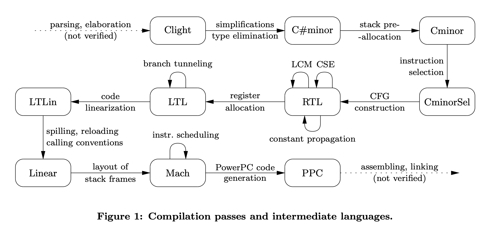
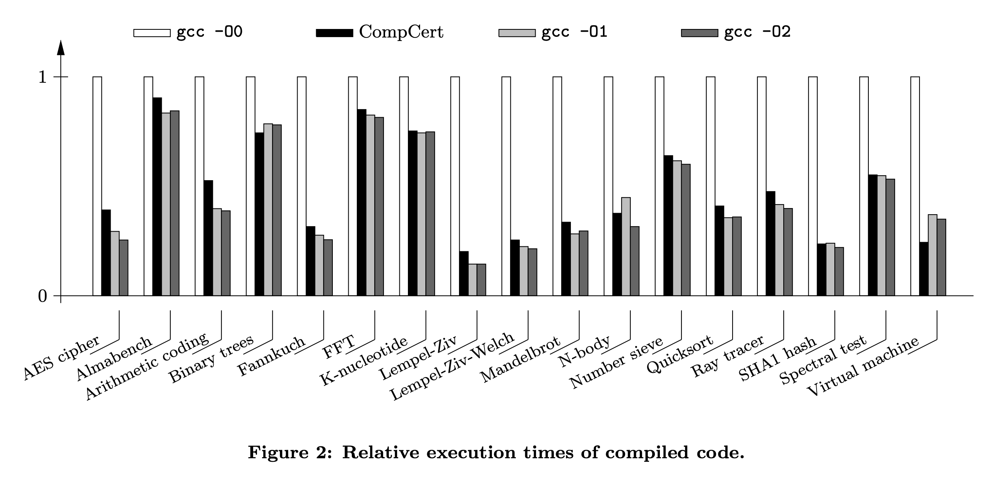

+++
title = "Formal Verification of a Realistic Compiler"
[extra]
latex = true
bio = """
  [Anshuman Mohan](https://www.cs.cornell.edu/~amohan/) is a Ph.D. student. He thinks mostly about food, and occasionally snaps out of it and thinks about programming languages.

  [Alaia Solko-Breslin](https://alaiasolkobreslin.github.io/) is an M.Eng.
  student interested in programming languages. She also enjoys playing 
  volleyball and cooking.
  
  They are both based at [Cornell CS](https://www.cs.cornell.edu/).
"""
[[extra.authors]]
name = "Anshuman Mohan"
link = "https://www.cs.cornell.edu/~amohan/"
[[extra.authors]]
name = "Alaia Solko-Breslin"
link = "https://alaiasolkobreslin.github.io/"
+++

### Background: The Landscape of Formal Verification

A thorough explanation of formal verification is beyond the scope of our discussion; the [Wikipedia article](https://en.wikipedia.org/wiki/Formal_verification) is a reasonable starting point. We will, however, make a brief comment about the landscape that we are entering.

Proponents of formal verification argue that traditional testing is unsafe and untrustworthy, and that we often need more mathematically sound assurances of what our code does. While verification is generally agreed to be a good idea, some of the strongest arguments against it are that:
* Verification is too expensive (in time, in maintainability, and therefore in money) to be put into common use.
* Verification means very little if the verified code is modified before it is executed.

The standard response to the first argument is:
* Selectively verify code that is particularly delicate or mission-critical. Use traditional testing elsewhere.
* Use techniques from programming languages and software engineering to reduce the cost of verification. This is a whole domain of research in CS; see the [CAV](http://i-cav.org/) community for an example.

The second argument is harder to defend against. Most verification happens at the source language, and so most verified code needs to undergo an _enormous_ modification – compilation – before it is run! This is where CompCert, a formally verified C compiler, comes in. Rather than treating compilation as a black-box transformation, CompCert states and proves, with mathematical precision, how it transforms the code. Programmers can state and prove claims about their code as written, in the source language. CompCert then guarantees that these hard-won claims still hold true even after the source code is compiled to an executable. The effect is multiplicative and powerful.

### Trusting Your Compiler

In a sense a compiler is very easy to specify: it should transform code without changing its behavior. However, as the author shows, it is critical that we take a more flexible stance to allow for undefined behavior, nondeterminism, and permissible changes to the behavior of the source code. Indeed, the wise programmer is aiming not for identical behavior, but rather for behavior that is close enough to the original, for some choice of “close enough”. 

This is intentionally open-ended. Loosely speaking, choosing a strong definition of “close enough” leads to more work and stronger guarantees, while a more relaxed choice leads to less work and weaker guarantees. In class we discussed that this vagueness, in addition to the vagueness about “going wrong”, is a feature of this work. 

#### Five Notions of Trust

The author provides five ways to think about a compiler from a semantic perspective. In the statements below, $S$ is the source program, $C$ is the compiled program, and $B$ is the observable behavior of a program. $S \Downarrow B$ means that $S$ executes with observable behavior $B$. The open-ended set of "going wrong" behaviors is written $\mathtt{wrong}$, and a program satisfies the predicate $\mathtt{safe}$ if none of its behaviors "go wrong".

1. $ \forall B, S \Downarrow B \Leftrightarrow C \Downarrow B $
2. $ S \mathtt{ safe} \Rightarrow (\forall B, C \Downarrow B \Rightarrow S \Downarrow B) $
3. $ \forall B \notin \mathtt{wrong}, S \Downarrow B \Rightarrow C \Downarrow B $ 
4. $ S \vDash \text{Spec} \Rightarrow C \vDash \text{Spec} $
5. $ S \mathtt{ safe} \Rightarrow C \mathtt{ safe} $ 

These are not interchangeable, but the author explains how they relate to each other and points out features (such as transitivity) that they have in common. For a taste, property 2 says that, if none of $S$'s possible behaviors are "wrong", then any behavior observed during the execution of $C$ must have also been observed during the execution of $S$. Property 3 additionally assumes that the programs and their execution environments are deterministic: when we say $S \Downarrow B$, the behavior $B$ is uniquely determined. Intuitively, property 3 says that, for all behaviors that are not "wrong", if $S$ demonstrates that behavior, so will $C$. This is the property that CompCert actually establishes in its proofs. The choice of property 3 makes sense:
* CompCert does indeed work in a deterministic setting, so there is no need for it to deal with the messiness of nondeterministic behavior.
* Establishing property 3 is easier than establishing some others: in a mechanized setting like Coq, one can `intro`duce (1) some specific behavior $B$, (2) the assumption $B \notin \mathtt{wrong}$, and (3) the assumption $S \Downarrow B$, and then perform structural induction on the execution of $S$. 

Additionally, we remarked in class that definition 4 is a helpful way to appreciate CompCert's overall goal: given a predicate $\text{Spec}$ on behaviors, and assuming that (1) $S$ cannot go wrong and (2) all behaviors of $S$ satisfy $\text{Spec}$, this property tell us that (1) ${C}$ cannot go wrong and (2) all behaviors of $C$ *also* satisfy $\text{Spec}$. With reference to the background section above, it should be clear that this property is a powerful and clean way of viewing a compiler.

#### Three Ways of Getting There

Having established the overall goal of a trustworthy compiler, the the author surveys three ways to arrive at this trust.
In the discussion below, the compiler $Comp$ is a total function on source programs $S$. It either executes without going wrong, giving $\mathtt{OK}(C)$ where $C$ is the compiled program, or goes wrong and gives an $\mathtt{error}$. When we write $S \approx C$, we mean that any of the five notions of trust can be substituted in.

1. Verify the compiler:
    $$ \forall S, C, Comp(S) = \mathtt{OK}(C) \Rightarrow S \approx C $$
    That is to say, use techniques from formal methods on the source code of the compiler $Comp$ itself. For the formal specification of the compiler, choose one of the five properties discussed above.

2. Verify the validator:
    $$ \forall S, C, Validate(S, C) = \mathtt{true} \Rightarrow S \approx C $$
    That is to say, use a (possibly untrusted) compiler to convert $S$ to $C$, and then employ a separate *validator* that can check, after the fact, whether $S \approx C$. Use techniques from formal methods on the source code of the validator to prove that the validator returns no false positives: whenever it returns $\mathtt{true}$, it is indeed the case that $S \approx C$.

3. Verify the certificate-checker:
    $$ \forall S, C, Check(S, C, Spec, \pi) = \mathtt{true} \Rightarrow S \approx C $$
    That is to say, modify the compiler to return not only a compiled program $C$ but also a proof $\pi$ that $C$ satisfies some specification $Spec$. Do not trust this compiler. Employ a separate *checker* that can ensure, after the fact, that $\pi$ convincingly shows that $C$ satisfies $Spec$. As above, use techniques from formal methods on the source code of the checker to prove its soundness.

Again, these are not interchangeable. They share a deep connection and are, from a formal perspective, equally convincing. This was confusing to the class, with a bit of a sentiment that the third option was the best. We spent some time clarifying this confusion in class, and have attempted to thread that discussion into the individual explanations above. The big takeaway is that none of these techniques offers a free lunch. One must still do the work of formal verification; one simply has some flexibility as to what one verifies. Depending on the context, one choice may be preferable to another. 

For instance, CompCert uses the second approach in one of its last passes, when performing instruction scheduling to go from Mach to PowerPC. As we discussed in class, this may just because the algorithm in use is complicated while checking it after the fact is easy. 
<!-- Alaia, do you remember any more of this discussion from class? -->

For the most part, CompCert makes one choice of “trust” and achieves this trust in one way:
    $$ \forall S, C, B \notin \mathtt{wrong}, Comp(S) = \text{OK}(C) \land S \Downarrow B \Rightarrow C \Downarrow B $$

That is: if CompCert compiles program $S$ without error into program $C$, and program $S$ had non-error behavior $B$, then program $C$ will also have behavior $B$.

### Overview of the CompCert Compiler

The CompCert compiler is composed of 14 passes that go through 8 intermediate languages.
The source language of CompCert is Clight, a large subset of the C programming language. Although Clight omits several C features such as extended-precision arithmetic and goto statements, it turns out to be sufficient for writing critical embedded software. 
At the time when this paper was written, the target language of CompCert was the PowerPC assembly language. This translation from Clight to PowerPC was formally verified. However, some parts of the compiler were not verified yet including parsing, assembling, and linking. CompCert's intermediate languages are described below in more detail.

* **C#minor** is a typeless variant of Clight. To go from Clight to C#minor, normal arithmetic operators are replaced by distinct arithmetic operators for integers, pointers, and floats. C loops are replaced by infinite loops (blocks and multi-level exits from enclosing blocks are added).
* **Cminor** is very similar to C#minor but omits the & operator, meaning addresses cannot be taken.
* **CminorSel** is the target language of the instruction selection pass which involves a bottom-up rewriting of Cminor expressions.
* **RTL** is a register transfer language which is an IR that is very close to assembly and represents data-flow at the register-transfer level. Control is represented as a control-flow graph (CFG), and instructions operate over pseudo-registers. Optimizations based on dataflow analyses can be implemented at this stage. Some optimizations that have been implemented and integrated include constant propagation and common subexpression elimination.
* **LTL** is similar to RTL except pseudo-registers are replaced by hardware registers or abstract stack locations after register allocation is performed. 
* **LTLin** is the result of CFG linearization which produces a list of instructions with labels and branches.
* **Linear** is the next IR after LTLin. Spill and reload instructions are placed around instructions that reference pseudo-registers allocated to stack locations. Move instructions are inserted to enforce calling conventions.
* **Mach** is the result of laying out the activation records of functions.
* **PowerPC** is the target assembly language. Instruction scheduling is performed to go from Mach to PowerPC. Note that this pass uses the verified validator approach.

### Proof of Correctness

The source, intermediate, and target languages of CompCert all have formally defined semantics. The Coq proof assistant was used to prove that the transformations between these languages preserve semantics. The Coq formalization and proof amounts to 42,000 lines of Coq and approximately 3 person-years of work. 14% of these lines define compilation algorithms, 10% specify language semantics, and 76% correspond to the correctness proof.

Coq's extraction facility was used to generate an executable compiler. This process involves translating functional specifications in Coq into Caml code and then running the Caml code through the Caml compiler. Note that the correctness of CompCert relies on trust in this compilation chain since it has not been formally verified.

### Performance

CompCert's performance turns out to be adequate for critical embedded code. CompCert was benchmarked against the GCC 4.0.1 compiler at optimization levels 0, 1, and 2. CompCert generates code that is twice as fast as code generated with GCC without optimization. CompCert code is 7% slower than gcc-01 and 12% slower than gcc-02 on average. Compilation times of CompCert are within a factor of 2 of those of gcc-01. On the one hand, CompCert's compilation times are higher than GCC's, and CompCert code runs slower than GCC code on average. On the other hand, we think that in certain settings, such as compiling safety-critical software, this is a small price to pay for CompCert's correctness guarantees.

### The Story Since 2009

CompCert foresaw – and triggered – an increasing interest in the formal verification of software.
CompCert has been received warmly by the community; the day after our presentation it won the 2021 [ACM Software System Award](https://awards.acm.org/software-system). It remains in active development not only in the research community but also, in partnership with [AbsInt](https://www.absint.com/compcert/index.htm), in a commercial setting. It now supports five target languages and not just one, and efforts have been made to extend the verification upwards to the parsing phase and downwards to the assembling phase.

Many outside projects have taken advantage of CompCert’s design choice of several well-specified intermediate languages. The presence of a formal specification at each level means that external projects have an easier time “hopping on” and “hopping off” CompCert. The ready hook into the Coq proof assistant means that external projects can prove that their work is reasonable. A few examples:
* [A certified framework for compiling and executing garbage-collected languages](https://dl.acm.org/doi/10.1145/1932681.1863584). The authors present a new machine-checked framework for compiling garbage-collected languages. They design a new intermediate language, GCminor, where one has to clarify the mutator/collector interface and make the root set explicit. They then write CompCert-style passes to compile GCminor to Cminor, and verify this compilation in Coq. They link the compiled code with a generic memory manager also written in Cminor. From then on, they trust CompCert to get them to assembly. To use this framework, a user needs to compile their source language to GCminor.
* [Certified and efficient instruction scheduling: application to interlocked VLIW processors](https://dl.acm.org/doi/10.1145/3428197). The authors extend CompCert, allowing the reordering of instructions for optimization. They meet CompCert at a low level, adding three new passes between Mach and assembly. The reward is that the compiler now targets VLIW (very long instruction word) processors, which can parallelize instructions so long as they are annotated as parallelizable. The authors do this scheduling and annotation during their compilation passes. They use an untrusted transformation along with a Coq-checked verifier, i.e., the "second way" of establishing trust.

In an applied context, the main use of CompCert is in the compilation of safety-critical software. The alternate approach is to use languages like Ada, Rust, or Go, which provide safety guarantees at the source level but do not have formally verified compilers. Both approaches appear to be in active use. The trade-offs are clear: the CompCert approach forces the use of C but guarantees correct compilation; the alternate approach opens the floor to safer programming languages but lacks a trusted compiler. A fun closing thought from class was to get the best of both worlds by writing a verified compiler from Rust to CompCert Clight.   
