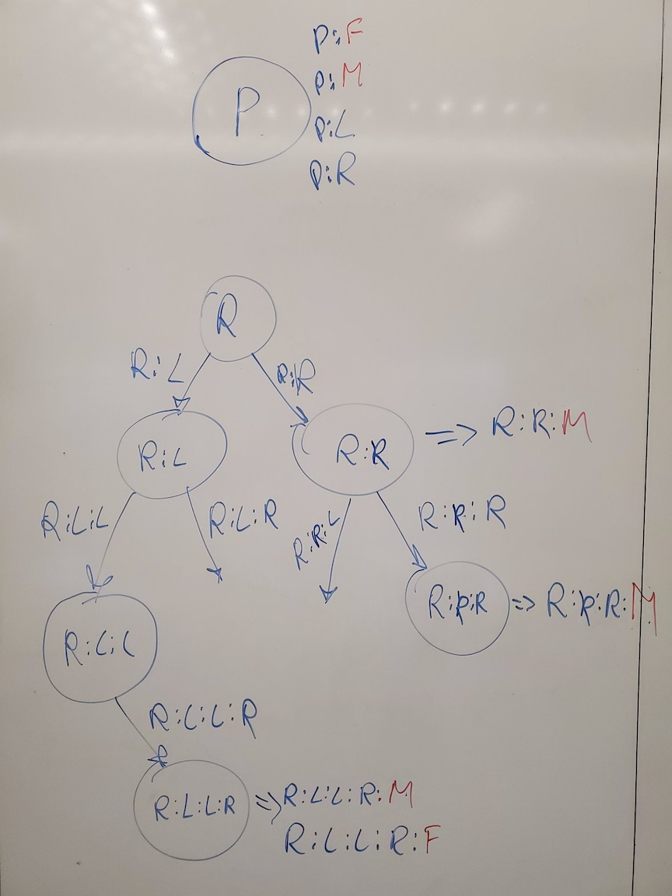

+++
title = "A Type and Effect System for Deterministic Parallel Java"
[extra]
bio = """
  [Nikita Lazarev](https://www.nikita.tech/) is an PhD student at Cornell's ECE department;
  Susan Garry is an undergraduate student at Cornell' CS department.
"""
[[extra.authors]]
name = "Nikita Lazarev"
link = "https://www.nikita.tech/"  # Links are optional.
[[extra.authors]]
name = " Susan Garry"
+++

### Paper review

["A Type and Effect System for Deterministic Parallel Java", Robert L. Bocchino, Vikram S. Adve, Danny Dig, Sarita V. Adve, Stephen Heumann, Rakesh Komuravelli, Jeffrey Overbey, Patrick Simmons, Hyojin Sung, and Mohsen Vakilian. OOPSLA 2009](http://dpj.cs.illinois.edu/DPJ/Publications_files/DPJ-OOPSLA-2009.pdf)

### Introduction

Multithreading is notoriously difficult to reason about and error-prone. This happens due to potential race conditions that can be arised when two threads are trying to access the same region in memory simultaneously. Traditional approaches using locks (e.g. mutexes) can cause a deadlock and are also hard to reason about.

In this paper, the authors propose a new way of making concurrency in Java safe and lock-free by introducing a novel mechanism for partitioning and annotating of parallel Java programs. They develop a new extention for Java called DPJ (Deterministic Parallel Java) which additionaly comes with the formal verification functionality. The papers demonstrates how DPJ can be used to implement realistic algorithms and verify their thread-safeness.

### Basic Idea

The paper introduces a set of annotations for unsafe memory accesses. The systems defines two main classes of annotations:

* **regions** - the programmer names portions of the heap and assigns each object and variable to a region of the heap;
* **effect annotations** - denotes what regions a method reads and writes from, e.g. ```reads <region-list> writes <region-list>```, where ```<region-list>``` is the region list defined above.

The listing bellow shows an example of a class definition (a Tree class for a tree datastructure) with annotations, the example is taken form the original paper, and we added more comments in it to show the functionality.

```
// take the "global" region P for this class as a template argument.
class TreeNode<region P> {
     region Links, L, R;  // create DPJ regions
     // annotate that the member variable `mass` is in region P.
     double mass in P ;
     // annotate that member variables `left` and `right` are in region `Links`.
     TreeNode<L> left in Links;
     TreeNode<R> right in Links ;
     // Annotate effect for the function `setMass` saying that it writes to region P.
     void setMass(double mass) writes P { this.mass = mass; }
     void initTree(double mass) {
       cobegin {
         // overal effect: reads Links writes L
         left.mass = mass;
         // overal effect: reads Links writes R
         right.mass = mass;
       }
    }
 }
```

### Region Nesting

Since many datastructures are naturally recursive, DPJ comes with the functionality to express recursivness of memory regions. This is called **region nesting**. The listing bellow shows how the aforementioned program can be extended with region nesting:

```
// take the "global" region P for this class as a template argument.
class TreeNode<region P> {
     region Links, L, R;  // create DPJ regions
     // annotate that the member variable `mass` is in region P.
     double mass in P:M ; // add P:M showing nesting of M under P
     // annotate that member variables `left` and `right` are in region `Links`.
     TreeNode<P:L> left in Links; // add P:L showing nesting of L under P
     TreeNode<P:R> right in Links ; // add P:R showing nesting of R under P
     // Annotate effect for the function `setMass` saying that it writes to region P.
     void setMass(double mass) writes P { this.mass = mass; }
     void initTree(double mass) {
       cobegin {
         // overal effect: reads Links writes L
         left.mass = mass;
         // overal effect: reads Links writes R
         right.mass = mass;
       }
    }
 }
```

The above code results in the following recoursive region nesting as shown in the figure bellow. Here, the mass region M is different for every nested/recoursive node.

<p align="center">

</p>

### Subtyping

The DPJ type system supports subtyping to better express nested regions. A summary of the subtyping rules is shown bellow:

* Two regions are nested within each other, R1 ≤ R2,  iff R1 is contained within R2, e.g. P:M ≤ P;
* C<R1> is a subtype of C<R2> iff every region of R1 is in R2 (R1 ⊆ R2); examples:
C<P:M> is a subtype of C<P:*>
C<P:L:*:M> is a subtype of C<P:*:M>
C<P:M> is not a subtype of C<P>
* B<r> is a subtype of A<r> iff  B<region R> extends A<R> {} is sound, but B<r> is not a subtype of Object

### Supporting Cuncurreny in Arrays

In order to allow safe concurreny in arrays, the authors define two novel capabilities: (1) **index-parameterized arrays** and (2) **subarrays**.

##### Index-Parameterized Arrays

Index-Parameterized Arrays allow to describe cuncurrent operations on different elements of an array. The problem seems to be trivial for arrays of primitive types, however, it is way harder for arrays of **mutable references**. The idea behind index-parameterized arrays is simple: we need to parameterize each object reference in the array by the array index's integer expression. For example, the aforementioned ```TreeNode``` class should be parameterized as follows ```TreeNode<Root:[10]>``` for the element ```10``` in the array. The compiler then will check (with a symbolic integer expression solver) that all array accesses in the program going to the element parameterized by expression [i] happen through the array element ```i```. If this holds, we get formally proved safe cuncurrent access to all the distinct elements in the array, even with mutable references.

##### Subarrays

In addition to the aforementioned Index-Parameterized Arrays, DPJ also provides the functionality to express cuncurrent operations on sub-arrays. This is very useful for devide-and-conqueue algorithms. Here, each array can be partitioned with the new ```DPJPartition``` abstraction that represents a distinct memory region. ```DPJPartition```s are parameterized by two integer expressions: the starting position and the length of the partition. Similarly to the above Index-Parameterized Arrays, compiler checks that all distinct concurrent memory accesses go to different partitions.

### Commutativity Annotations

This is a simple feature that attempts to generalize `read`/`write` effects by explicitly specifying what methods are commutative and therefore can be called cuncurrently. For example, 
```
class IntSet<region P> {
  void add(int x) writes P { ... }
  add commuteswith add;
}
```
defines that two invocations of `add` are atomic and either order of invocations produces the same result. The commutativity property is not getting checked by the compiler and should be verified independently with formal analysis.

### Evaluation

The authors evaluate their type and effect system on a set of benchmarks and show that it indeed allows to express cuncurrency that provides near-ideal linear scaling of performance with the number of executors. Some algorithms do not scale linearly due to certain limitations of DPJ such as impossibility of re-shuffeling fo array elements.

