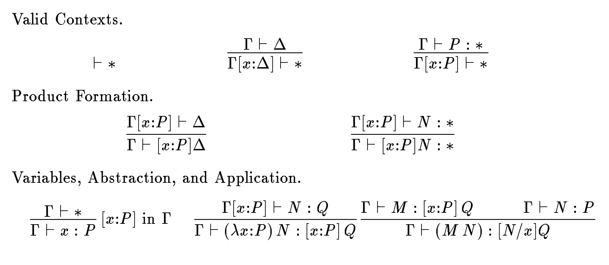

+++
title = "Implementing The Calculus of Constructions"
[extra]
latex = true
bio = """
  [Alaia Solko-Breslin](https://alaiasolkobreslin.github.io/) is an M.Eng.
  student interested in programming languages. She also enjoys playing 
  volleyball and cooking.
"""
[[extra.authors]]
name = "Alaia Solko-Breslin"
link = "https://alaiasolkobreslin.github.io/"
+++

Code: [here](https://github.com/alaiasolkobreslin/CoC)

## Background

The Calculus of Constructions (CoC) is a type theory created by Thierry Coquand.
It is a higher-order typed lambda calculus that is the apex of the 
[lambda cube](https://en.wikipedia.org/wiki/Lambda_cube).
In CoC it is possible to define functions from terms to terms, types to types, types to terms, 
and terms to types. Functions being able to go from terms to types is what makes CoC so powerful.
Types that depend on terms are known as *dependent types*, and most languages
do not have them. As an example, consider the following vector type in Coq
where the length of the vector is part of its type.

```coq
Inductive vec : Type -> nat -> Type :=
| vnil : forall X : Type, vec X 0
| vcons : forall X : Type, X -> forall n : nat, vec X n -> vec X (S n).

Definition v0 : vec bool 0 := vnil bool.
Definition v1 : vec bool 1 := vcons bool true 0 v0.
Fail Definition v0 : vec bool 1 := vnil bool.
```

Notice how the last definition fails because using the number 1 in `v0`'s type
makes the term ill-typed.

CoC is part of the Calculus of Inductive Constructions (CiC), which adds inductive
types to CoC, and CiC is the basis of Gallina! But for the purposes of this
project, we only implemented CoC.


## Design and Implementation

### Typing rules

Unlike most other languages, CoC eliminates the distinction between types and terms. 
We describe the CoC syntax below. We use $ M, N, ... $ for terms in general
and $ x, y, z $ for variables.
<p align="center">
    $ M ::= x \; | \; (\lambda x:M) N \; | \; (M N) \; | \; [x:M] N \; | \; * $
</p>

$ [x:M] N $ is called a product, and $ * $ is the universe of all types, but is not a
type itself. For an explanation of why, see the [Bonus section](#bonus).
*Contexts* (denoted by $ \Gamma, \Delta $) are products over $*$ and have the
form $[x_1:M_1] ... [x_n:M_n] *$. The inference system defines two judgements:

1. $ \Gamma \vdash \Delta $ means $ \Delta $ is a valid context in the valid
   context $ \Gamma $.
2. $ \Gamma \vdash M : P $ means $ M $ is a well-typed term of type $ P $ in
   the valid context $ \Gamma $

In the inference system, a type $ P $ will either be a context or have the 
property that $ \Gamma \vdash P : * $. Also note that $ [N/x]Q $ is the notation
for substituting $N$ for $x$ in $Q$. The inference rules are below.

<p align="center">

</p>

### Design

When I started this project, I was writing my implementation based off of
some notes written by Professor Clarkson, and this was the syntax of CoC that he used.

<p align="center">
    $ t := x \; | \; \lambda x:t_1 \rightarrow t_2 \; | \; (t_1 \; t_2) \; | \; \forall x:t_1, t_2 \; | \; \text{Type} $
</p>

I will be using this syntax throughout the rest of the blog post to go over examples,
but the inference rules remain the same as before.

I wanted the ability to write proofs in my programs, so I designed the AST with
this in mind:
```
type t = 
  | Id of id
  | Fun of id * t * t
  | App of t * t
  | Forall of id * t * t
  | Type

and theorem =
{
  id: id;
  theorem: t;
  proof: t;
}

and prog = 
| Let of id * t * prog
| Theorem of theorem * prog
| Expr of t
```

Here is an example of a valid program
```
let Nat = forall N:Type, (forall _:N, (forall _:(forall _:N, N), N)) in
let zero = lambda N:Type -> (lambda x:N -> (lambda _:(forall _:N, N) -> x)) in
let succ = lambda nat:Nat -> (lambda N:Type -> (lambda x:N -> 
  (lambda f:(forall _:N, N) -> (f (((nat N) x) f))))) in
(succ (succ zero))
(* output: (fun N:Type -> (fun x:N -> (fun f:(forall _:N , N) -> (f (f x))))) *)
```
and this is an example of a valid (unrelated) proof.
```
Theorem p_implies_p: forall P:Type, forall _:P, P.
Proof. lambda P:Type -> lambda x:P -> x.
```

### Implementation

The main implementation task was implementing a typechecker. To typecheck
a term, we first check whether that term is a context. If it is, we typecheck
the context to ensure that it is well-typed. Otherwise, the term is typechecked
according to the typing rules above.

Typechecking also needs to happen for entire programs. When typechecking
a `Let` statement, beta reduction is performed on the term, and that result
is substituted for the corresponding identifier throughout the rest of the program.
Then the rest of the program is typechecked. When typechecking a `Theorem`,
beta reduction is performed on the theorem term, and the proof term is typechecked.
Then the typechecker checks if these two resulting terms are alpha equivalent.
If they are, then the proof is valid. The proof term is then beta reduced
and this term is substituted in for the corresponding identifier throughout the
rest of the program. Then the rest of the program is typechecked.
When the typechecker sees an `Expr`, it typechecks the
term to make sure it is well-typed and then returns the beta-reduced term.

## Evaulation

My goal for this project was to be able to solve some of the simple exercises
in the [Software Foundations](https://softwarefoundations.cis.upenn.edu/)
logic chapter, and I was somewhat successful.
I started by defining logical conjunction and disjunction.

```
(* Logical conjunction *)
let conj = lambda P:Type -> lambda Q:Type -> forall x:Type, 
    forall _:(forall _:P, forall _:Q, x), x in
(* Logical disjunction *)
let sum = lambda P:Type -> lambda Q:Type -> forall x:Type, 
    forall _:(forall _:P, x), forall _:(forall _:Q, x), x in
```

Here are a few of the proofs I was able to successfully typecheck. I came up
with some of these proofs on my own and some with the help of a friend.
These proofs were not translated from SF solutions.
```
(* P /\ Q -> P *)
Theorem conj_implies_fst: forall P:Type, forall Q:Type, 
    forall _:((conj P) Q), P.
Proof. lambda P:Type -> lambda Q:Type -> lambda  p:((conj P) Q) -> 
    ((p P) (lambda x:P -> lambda _:Q -> x)).

(* P /\ Q -> Q *)
Theorem conj_implies_snd: forall P:Type, forall Q:Type, 
    forall _:((conj P) Q), Q.
Proof. lambda P:Type -> lambda Q:Type -> lambda  p:((conj P) Q) ->
    ((p Q) (lambda _:P -> lambda x:Q -> x)).

(* P -> Q -> P /\ Q *)
Theorem p_implies_q_implies_conj: forall P:Type, forall Q:Type, 
    forall p:P, forall q:Q, ((conj P) Q).
Proof. lambda P:Type -> lambda Q:Type -> lambda a:P -> lambda b:Q -> 
    lambda x:Type -> lambda evidence:(forall _:P, forall _:Q, x) -> 
        ((evidence a) b).

(* P /\ Q -> Q /\ P *)
Theorem and_commute: forall A:Type, forall B:Type, 
    forall _:((conj A) B), ((conj B) A).
Proof. lambda A:Type -> lambda B:Type -> lambda  p:((conj A) B) -> 
    lambda x:Type -> lambda evidence:(forall _:B, forall _:A, x) ->
        ((evidence (((conj_implies_snd A) B) p)) (((conj_implies_fst A) B) p)).

(* P -> P \/ Q *)
Theorem p_implies_sum: forall P:Type, forall Q:Type, forall p:P, ((sum P) Q).
Proof. lambda P:Type -> lambda Q:Type -> lambda p:P -> lambda x:Type -> 
    lambda evidence:(forall _:P, x) -> lambda _:(forall _:Q, x) -> (evidence p).

(* P \/ Q -> Q \/ P *)
Theorem or_commute: forall A:Type, forall B:Type, 
    forall _:((sum A) B), ((sum B) A).
Proof. lambda A:Type -> lambda B:Type -> lambda p:((sum A) B) -> 
    lambda x:Type -> lambda evidence1:(forall _:B, x) -> 
        lambda evidence2:(forall _:A, x) -> (((p x) evidence2) evidence1).
```

As a comparison, consider the equivalent lemma and proof for 
`p_implies_q_implies_conj` (the third example above) in Coq:

```
Lemma and_intro : forall A B : Prop, A -> B -> A /\ B.
Proof.
  intros A B HA HB. split.
  - apply HA.
  - apply HB.
Qed.
```
Notice how much cleaner this proof is than my code. It is no wonder that Coq has
tactics to make it more usable!

My goal was to prove as many one-star exercises in this chapter as possible.
Out of the eight one-star exercises, these were the ones I was able to prove:

```
Lemma proj2 : forall P Q : Prop,
  P /\ Q -> Q.

Theorem or_commut : forall P Q : Prop,
  P \/ Q  -> Q \/ P.
```

This means I was only able to prove 25% of the one-star exercises. I was not able to prove
some of the other exercises for a variety of reasons. One exercise, `iff_refl`
asks you to prove `forall P : Prop, P <-> P`. While this seems like it should be
a fairly simple proof involving just conjunction and implication, we spent 
about 20 minutes trying to solve it and couldn't.
Another exercise, `eqb_neq`, asks you to prove 
`forall x y : nat, x =? y = false <-> x <> y.`. To prove this theorem you would
need to inductively define the natural numbers, but my implementation does
not support inductive definitions.


## Experience

This project was more challenging than I expected. The most difficult thing to
get right was beta reduction. For example, the process of beta reducing a function
application took me some time to get right --- the process is to first typecheck
the argument. Then you make sure that the term on the left hand side is actually
a lambda term. Now you can't just check whether the types of the parameter and
argument are equal; you have to check that they are *alpha equivalent*.
Then you can perform substitution and continue beta-reducing the term. My beta
reduction bugs caused many issues elsewhere. A common bug I was having 
is that typechecking a function application would fail
because one of the terms was not beta reduced correctly, so argument and parameter
types were not alpha equivalent.

The other difficult part of this project was the evaluation. I found
it difficult to reason about proofs in CoC because all of the lambda and forall
terms made my code really messy and hard to understand. I definitely have
a greater appreciation for of Coq for having code that is easy to read and 
reason about. For example, some tactics you see a lot in Coq are `intros`, which
introduces variables and hypotheses, and `apply`, which uses implications to
transform goals and hypotheses. You could write the following proof in Coq:

```
Theorem p_implies_p : forall P : Prop, P -> P.
Proof.
  intros P H.
  apply H.
Qed.
```

The line `intros P H` is introducing the proposition `P` and the hypothesis `H`, 
which is `P` (the left-hand side of the implication). The resulting goal is `P`. 
The line `apply H` applies `H` to the current goal, completing the proof. Here
is the same proof in CoC.

```
Theorem p_implies_p: forall P:Type, forall _:P, P.
Proof. lambda P:Type -> lambda x:P -> x.
```

Compared to Coq, it is much more difficult to understand what is happening
in this CoC proof because it lacks tactics.

## Future Work

The next step for this project would be to implement CiC (add support for inductively
defined types). This would allow users to define inductive lists, natural numbers, etc.
Users would also be able to define the `vec` type that I showed earlier as an
example of dependent types. I would also like to define some built-in
tactics to make it easier to write proofs.

When someone is first learning Coq, they usually start out with proving theorems like
`1 = 1` or ` 1 + 2 = 2 + 1`. These proofs only require one line, `reflexivity`.
I think it would be cool to implement inductive types and add a reflexivity tactic
so that a user could complete some of the exercises in the first chapter of
Software Foundations.

## Acknowledgements

Professor Clarkson's [CoC Notes](https://github.coecis.cornell.edu/cs4160/lectures-2022sp/blob/main/06-coca/coca.md)
helped me a lot with understanding CoC, and [this paper](https://www.cs.cmu.edu/~fp/papers/mfps89.pdf) 
was also really helpful for understanding inference rules. Also huge shout out 
to [Chris Lam](https://flyingrocksquirrel.github.io/) for helping a little bit
with the typechecker and helping a lot with writing proofs!

## Bonus

$ * $ is the universe of all types, but is itself not a type. Why is this?
A similar question is known as *Russell's Paradox*: let 
$ R = \\{ x | x \notin x \\} $, i.e., $R$ is the set of all sets that are not members
of themselves. Can $R$ be a member of itself?

1. If $R$ is a member of itself, then by definition $R \notin R$, which means
  $ R $ is not a member of itself
2. If $R$ is not a member of itself, then $R \notin R$. This means $R \in R$
  by the definition of $R$

The result is a contradiction. In symbols:
<p align="center">
    $ \text{Let } R = \{ x | x \notin x \} , \text{then } R \in R \Leftrightarrow R \notin R  $
</p>

So what is the solution? Russell's solution was *type theory*, which creates
a hierarchy of types where objects of a type can only be built from objects
of types lower in the hierarchy. Allowing $*$ to be a type itself would
violate this hierarchy and lead to paradox (this would be very bad, as this 
would allow us to prove `False`).