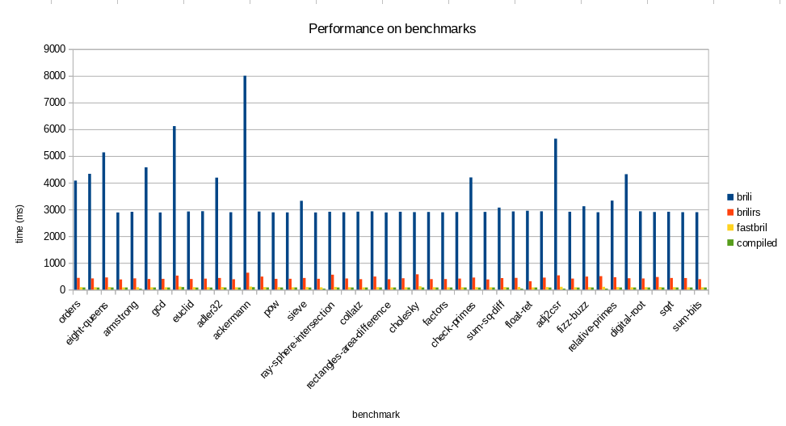

+++
title = "Bril Bytecode Interpreter"
[extra]
latex = true
bio = """
	Charles Sherk is an junior studying Computer Science & Mathematics at
	Cornell university, interested in compilers and programming language
	implementation.
	Susan Garry is a senior studying Computer Science at Cornell University,
	interested in compilers and programming language design.

"""
[[extra.authors]]
name = "Charles Sherk"
link = "https://github.com/charles-rs/"
[[extra.authors]]
name = "Susan Garry"
link = "https://github.com/susan-garry"
+++

## Motivation
In order to interpret Bril, we currently have access to `brili`, which is
written with an emphasis on
readable code and extensiblity. However, it is written in typescript and is not
very fast. `brilirs` attempts to solve this problem with a Rust implementation,
but is also intended to be a showcase of the `bril-rs` library for working with
Bril in Rust. It also does some runtime checking, which requires more time.
There were some points in this course where time was spent on "waiting
for the Bril interpreter" that could have been avoided. So, we propose and
implement an interpreter for Bril whose sole focus is speed. On top of this, we
provide a reasonably well specified bytecode format for Bril, as well as a
translation from this bytecode to armv8-a assembly.

## Design overview

### Big Red Bytecode
In order to make our interpreter as efficient as possible, we have designed a
very compressed representation of Bril instructions: (almost) all of them are
represented in 64 bits, with some taking multiple 64 bit words as needed. See
the [documentation](https://github.coecis.cornell.edu/cs897/fast-bril/blob/master/doc/brb.pdf).

In order to appease the C typechecker and not rely on undefined behavior, we use
a union type to internally represent instructions, but most have the first 16
bits as the opcode, so we can pull this out and then determine how to decode the
rest of the instruction. In principle, we could also use `uint64_t` or
`uint16_t[4]`, but using unions is the most user friendly, and lets the C
compiler do more work to access the fields of structs, in case there are any
cool tricks for that behind the scenes.

### Features
We support a superset of the behavior provided by `brili`, so options like `-p`
work exactly the same. We also support the following:
 - `-b` will read in bytecode instead of the Bril JSON
 - `-bo <file>` will output the bytecode to `<file>`
 - `-pr` will print the program to standard out (probably more useful with the
         `-b` option)
 - `-ni` will NOT run the interpreter.
 - `-e <file>` will emit assembly to `<file>`.

### `fastbrili`, despite the name, is also a compiler to armv8-a assembly
We translate variables to consecutive natural numbers (the first seen is 0,
then 1, etc.), and we couldn't help but notice that these numbers could easily
be multiplied by 8, and then just turned into stack locations.

We have a working compiler to armv8 with no register allocation, and are working
on linear scan register allocation in arm as well as x86 code
generation. Unfortunately, these features aren't quite finished due to being
undergraduate students with other finals, however there's a good chance they'll
be fixed after the class is over (in the interest of having something nice to
merge into the Bril repo).

Our general translation from Bril instructions to assembly was as follow:
 1. Load the temps used by the instruction from the stack into registers
 2. Run the instruction on these registers
 3. Store the result from whatever register it ends up in back to the stack

Our assembly does depend on the C standard library for functions like `malloc`
(to support the memory extension) as well as a few printing functions as doing
it all with system calls just didn't seem like a great use of time. We have some
functions in the `lib/` directory for printing base types, as well as parsing
them in order for the `main` function to read command line arguments. A future
improvement would be putting `malloc` and other C functions we call into this
file so that we could keep a compiled version around and not have to link with
C.

#### Assembly difficulties
The translation to armv8-a went quite smoothly. The most difficult part was
passing arguments to functions, as there are 8 argument registers for ints, and
8 for floats. As we immediately save these to the stack in the prologue of our
functions, we could have just ignored the difference between the ints and floats
and used all 16 registers in order, but obeying the calling convention allows us
to generate code that can link with other assembly.

Register allocation was enough work that we have not finished it yet, but this
is more due to the existence of other classes than any serious difficulties, and
it will probably be working at some point this summer.

## Implementation
Our interpreter consists of an initial pass to translate into this bytecode,
which turns temps and labels from strings into numbers, and reduces the size of
the code overall. The bytecode instructions are stored in an array so that we
can benefit from cache locality. We then interpret them by iterating through
this array. One minor inconvenience is that certain instructions, such as `print`,
require multiple words. This means that our array index for iteration will
NOT be an induction variable, so the C compiler will not be able to optimize it
as aggressively. One solution to this could be using a less flat representation 
of a list of instructions, and using pointers for the multiword 
instructions, but this seems like more trouble than it's worth, especially 
considering the benefits of cache locality.

For the armv8 assembly generation, we initially implemented it as a single pass
over the bytecode that printed the instructions as it went. This is fine, but it
leaves little room for extensions and improvements, so in order to get started
on register allocation we refactored to have an internal representation of arm
instructions. For this, we went with a tagged union, as it is similar to a
variant which is very convenient for this, as learned in CS 4120.

## Evaluation

	

We used the Bril benchmarks from the repo, and used wall-clock time to evaluate
the difference. This isn't exactly optimal as most of these benchmarks are very
small, so the startup time might be significant, but the startup time should
hurt our interpreter the most, as it has the translation phase. Our results are
[here](https://github.coecis.cornell.edu/cs897/fast-bril/blob/master/eval/performance.ods),
in ods format. On (geometric) average, `brili-rs` runs in .13 the time of
`brili`, and `fastbrili` runs in .21 the time of `brili-rs`. `fastbrili` also
runs in .03 the time of `brili`, so I think we can call this a job well
done.

One interesting part of the performance evaluation was that the compiled
code ran in .80 the time of `fastbrili`. This means either our interpreter is
very good, or our compiler isn't. We very trivial instruction selection as well
as no register allocation, so probably the latter, but this gives us a really
good idea of how fast the interpreter is. We use 4 armv8 instructions for (most)
of the Bril instructions, which means that if most of the runtime is indeed
running the program, fastbrili runs on the order of 5 machine instructions to
interpret one Bril instruction.

## Drawbacks
While we would love to say that `fastbrili` is the answer to all of your Bril
needs, there are some minor drawbacks, mainly that invalid Bril programs cause
undefined behavior. Most of the type information is erased and then inferred
(e.g., if you use `add` on two floats, it will not check, assume they are ints,
and run integer addition on the values), but we do deal with all correct Bril
programs correctly. The Bril spec explicitly permits that we only deal with well
defined programs, so we have.We believe that this isn't much of an issue, as
`brili` isn't actually that helpful with these errors, though we do acknowledge
that `fastbrili` is worse.

We impose a couple extra limits on the Bril language:
 + No more than $2^{16}$ temps in a function
 + No more than about $2^{16}$ instructions in a function (some instructions need
   a longer encoding, which affects this)
 + Pointers may only nest up to $2^{14}$ deep

We check all of these and will fail if they are violated, though this should be
very uncommon.

### Extensibility
One of the really cool things about Bril is that it is relatively easy to
extend. Our bytecode is designed in a way that it supports $2^{15}$ opcodes, which
is room for plenty of extensions, but if you wanted to add more types this would
be considerably more difficult. We rely on being able to represent types in 16
bits, by using 2 of them for the "base type" and then the other 14 for pointer
depth. Realistically $2^{14}$ is deeper than any pointer will be nested, so adding a
few more base types wouldn't be too much of an issue, but adding more complex
types would be a serious complication. This could be solved by having one bit of
tag for whether the type is complex, and then using the rest of the bits to
index into some memoized array of the types that show up, but this would require
a bit of work.

### Saving Bytecode
While we do support saving the bytecode, we have not specified exactly how it
works, so if you want to interoperate with it right now it requires reading the
`byte-io.c` file to see the exact format. This is fine since right now we are
the only ones using this bytecode, but in the interest of this being a helpful
extension to the Bril ecosystem, this should be documented. We'll probably do
this soon, but didn't get to it yet.
