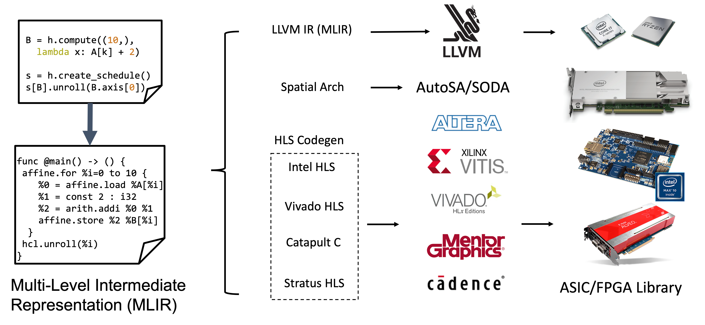
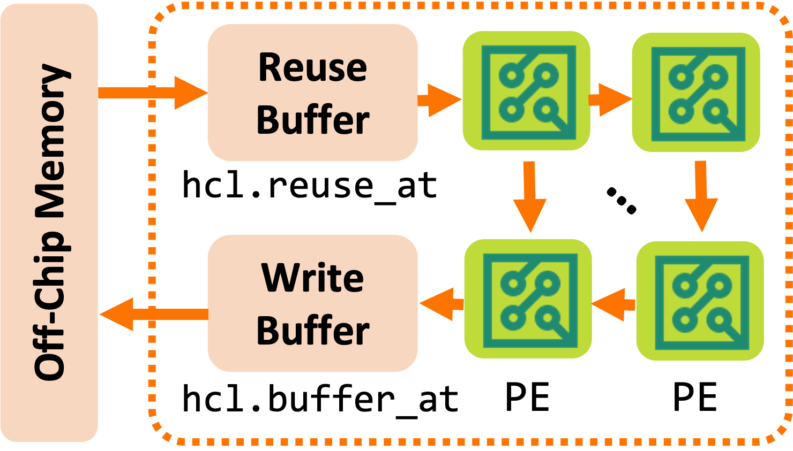
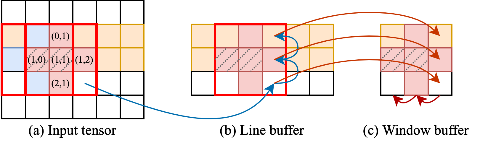
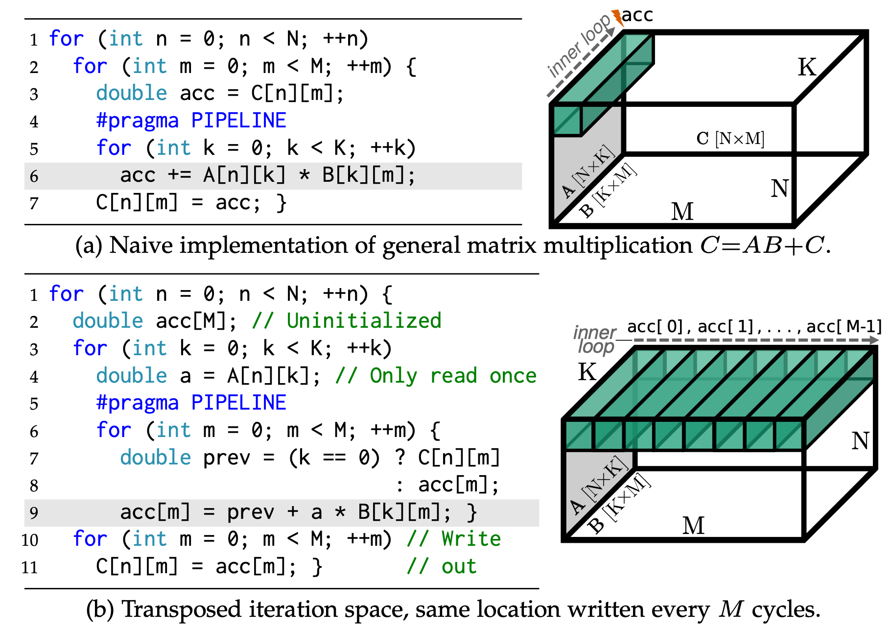
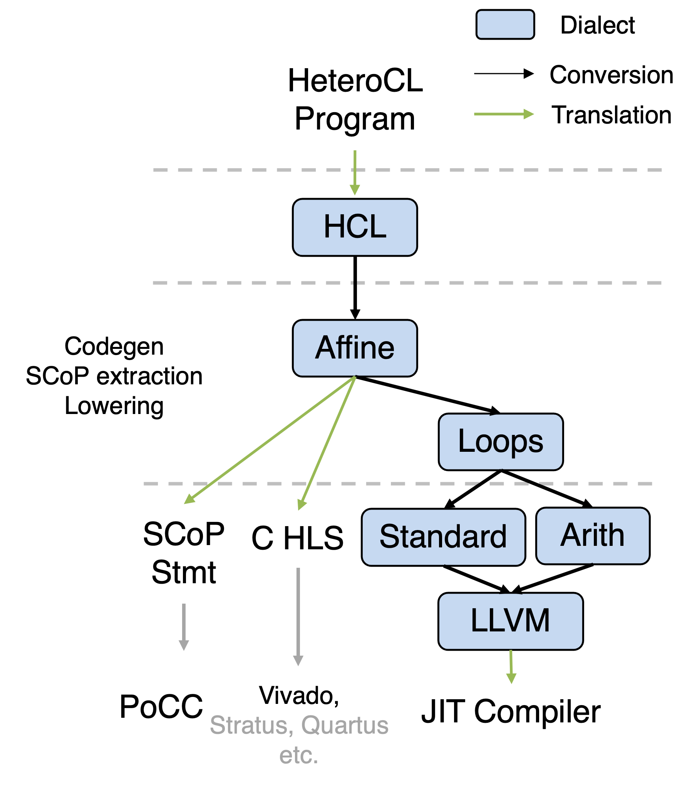

+++
title = "Memory Optimization and Profiling for MLIR-Based HeteroCL"
[extra]
bio = """
  [Hongzheng Chen](https://chhzh123.github.io/) is a first-year CS PhD student at the Computer Systems Laboratory, Cornell University. His research interests include domain-specific languages, compiler optimization, and heterogeneous computing systems.
  [Niansong Zhang](https://www.zzzdavid.tech/) is a first-year ECE PhD student at Cornell.
  [Jiajie Li](https://tonyjie.github.io/) is a first-year ECE PhD student at Cornell.
"""
latex = true
[[extra.authors]]
name = "Hongzheng Chen"
link = "https://chhzh123.github.io/"
[[extra.authors]]
name = "Niansong Zhang"
link = "https://www.zzzdavid.tech/"
[[extra.authors]]
name = "Jiajie Li"
link = "https://tonyjie.github.io/"
+++

<!-- Proposal: https://github.com/sampsyo/cs6120/issues/311 -->
<!-- For the main project deadline, you will write up the project’s outcomes in the form of a post on the course blog. Your writeup should answer these questions in excruciating, exhaustive detail:
* What was the goal?
* What did you do? (Include both the design and the implementation.)
* What were the hardest parts to get right?
* Were you successful? (Report rigorously on your empirical evaluation.) -->

## Introduction
[HeteroCL](https://github.com/cornell-zhang/heterocl)[^1] is a programming infrastructure composed of a Python-based domain-specific language (DSL) and a compilation flow that targets heterogeneous hardware platforms. It aims to provide a clean abstraction that decouples algorithm specification from hardware customizations, and a portable compilation flow (shown in Fig. 1) that compiles programs to CPU, GPU, FPGA, and beyond.

<figure>

<figcaption><center>Fig. 1: HeteroCL supports compilation for various backends</center></figcaption>
</figure>

The original HeteroCL uses Halide IR as an intermediate representation. However, Halide IR is difficult to extend and scales poorly to programs with hundreds of modules. Therefore, we are moving to the MLIR ecosystem for better scalability and extensibility. [MLIR](https://mlir.llvm.org/)[^2] stands for Multi-Level Intermediate Representation, which is a modular compiler infrastructure that enables different optimizations performed at different levels of abstraction.

We build a HeteroCL (HCL) dialect in MLIR to capture hardware customizations and define program abstractions. Hardware customizations are optimization techniques to build faster and more efficient programs or architectures. There are three types of hardware customizations:
* **Compute customizations**: such as loop unrolling, splitting, reordering, and pipelining.
* **Data type customizations**: quantization, packing, and unpacking.
* **Memory customizations**: build custom memory hierarchies and scratchpad memories.

In HeteroCL, we use *schedule* and *stage* to specify hardware customizations. A stage is either a function or a loop nest that produces or updates tensors. A schedule is a graph of stages created from the algorithm description, and all hardware customizations are specified on the schedule, thus decoupled from the algorithm specification. For this project, we aim to strengthen HeteroCL's memory customization ability and add performance profiling infrastructure. Specifically, we make the following contributions:
1. We extend the `.reuse_at()` primitive to generate reuse buffers for a broader range of applications with higher dimension tensors and complex memory access patterns.
2. We propose a `.buffer_at()` primitive to generate write buffers so that the memory access overheads can be further reduced.
3. We add a profiling tool to evaluate the operational intensity and automatically generate a roofline model to guide the optimization process.

<figure>

<figcaption><center>Fig. 2: Reuse buffer and write buffer</center></figcaption>
</figure>

Fig. 2 is an overview of reuse buffer and write buffer generation with `reuse_at` and `buffer_at` primitives. We will go into details in the following sections.

## Reuse Buffer
The original HeteroCL paper only discusses how to generate reuse buffers for a simple 2D convolutional kernel, while real-life applications generally have high-dimensional arrays with complex access patterns. In this project, we try to extend the idea of reuse buffer in the MLIR framework to support more applications. In this section, we will first discuss the high-level design of reuse buffer and detail the implementation.

### Design
The basic idea of reuse buffer is to reuse data between adjacent loop iterations so that the number of off-chip memory accesses can be reduced. If without special notification, we suppose the traversal order is the same as the memory access order in this report, i.e., always access the last dimension first and then access the second last, etc.

The applications that have data reuse are mostly *stencil* kernels, so we follow SODA[^3] to give a similar definition. Consider a point $\mathbf{x}=(x_0,x_1,\ldots,x_m)\in\mathbb{N}^m$, a $n$-point stencil window defines a set of offsets $\\{\mathbf{a}^{(i)}\in\mathbb{N}^m\\}_{i=1}^n$ that describe the distance from $\mathbf{x}$. By adding the offset to a specific point, we can get the actual points $\\{\mathbf{y}=\mathbf{x}+\mathbf{a}^{(i)}\\}_{i=1}^n$ of a stencil in a specific iteration. The value of these points will be reduced (e.g., mean, summation) to one value in the output tensor.

We further define the *span* $s_d$ of a dimension $d$ as the largest distance between two stencil points along that dimension.

$s_d=\max_{i}(\mathbf{a}^{(i)}_d)-\min_i(\mathbf{a}^{(i)}_d)+1$

In the Fig. 3(a) example, we consider a five-point stencil

$\{\mathbf{a}^{(i)}\}^{5}_{i=1}=\{(0,1),(1,0),(1,1),(1,2),(2,1)\}$

colored with red, and the span of each dimension is $s_0=s_1=2$.

<figure>

<figcaption><center>Fig. 3: Hierarchical reuse buffer</center></figcaption>
</figure>

Declaring this kernel in HeteroCL is easy. Users can leverage the declarative API `hcl.compute()` to explicitly write out the computation rule as follows.
```python
def test_stencil():
    hcl.init(dtype)
    A = hcl.placeholder((width, height))

    def stencil(A):
        B = hcl.compute(
            (width - 2, height - 2),
            lambda i, j: A[i, j + 1]
            + A[i + 1, j]
            + A[i + 1, j + 1]
            + A[i + 1, j + 2]
            + A[i + 2, j + 1],
            name="B",
            dtype=dtype,
        )
        return B

    s = hcl.create_schedule([A], stencil)
    B = stencil.B
```

From the memory access pattern above, we can see that when the stencil window is moved from the previous iteration (<font color="blue">blue grids</font> in Fig. 3(a)) to the next iteration in the same row (<font color="red">red grids</font> in Fig. 3(a)), there exist two replicated data in these two iterations (highlighted with dash line). If all the data are loaded from off-chip memory, it may cause contention and introduce large memory access overheads. To exploit this data reuse opportunity, HeteroCL provides a push-button primitive `.reuse_at()` for users to declare reuse buffers. By specifying the dimension, users can exactly control the location of reuse buffers.

The minimal size of the reuse buffer consists of small rectangular strips whose total length is equal to the reuse distance of the stencil [^3]. In the five-point stencil example, this requires generate buffer covering elements from $(0,1)$ to $(2,1)$. The total size of the buffer is $4+6+3=13$. However, this may introduce complicated control logic when implemented on FPGA. Thus, for simplicity, we use the *rectangular hull* of the stencil as the reuse buffer, which is labeled as <font color="red">red frame</font> in Fig. 3(a). We call it *window buffer*. The shape of this buffer is $[s_0,s_1,\ldots,s_m]$. We can always reuse data when the buffer moves along the same row.

While this works well for one dimension, when the stencil window moves from the end of previous row to the front of the next row, there will be no elements that can be reused, which may incur extra latency to load data from off-chip memory. A traditional way to tackle this problem is leveraging another load process to prefetch the data, so the reuse buffer can always be prepared with data. This method again complicates the control logic and requires an extra prefetching function to work concurrently. To be consistent with the API that HeteroCL proposed, we can further create hierarchical reuse buffers to hide memory access overheads. As shown in Fig. 3(b), we can create a *line buffer* to reuse data along the column dimension. Basically, only one element needs to be fetched from off-chip memory to line buffer in each iteration. The original elements in the line buffer need to be shifted up for one grid as depicted in <font color="blue">blue arrows</font>. After the elements are loaded to the line buffer, they are further copied to window buffer as shown in <font color="red">red arrows</font> in Fig. 3(c). In this way, the data loading pipeline can work perfectly without stall. Finally the kernel can simply use the indices in $\\{\mathbf{a}^{(i)}\\}^{5}_{i=1}$ to access the elements in the window buffer.

The programming interface is also easy-to-use, users only need to attach the following two lines of code to their schedule. Our compiler will automatically generate the buffer and implement the reuse logic.

```python
# schedule.reuse_at(tensor, stage, axis)
LB = s.reuse_at(A, s[B], B.axis[0])
WB = s.reuse_at(LB, s[B], B.axis[1])
```

For higher-dimensional cases, we can generalize the above idea and generate hyper-cubic buffers. Currently we only support stride-one reuse patterns. Suppose the input tensor has shape $[w_0,w_1,\ldots,w_m]$, the hierarchical buffers may have the following shape (if the corresponding axis has reuse pattern).

$
\begin{aligned}
\text{reuse at axis 0}: &[s_0,w_1,\ldots,w_m]\\
\text{reuse at axis 1}: &[s_0,s_1,\ldots,w_m]\\
\cdots &\\
\text{reuse at axis m}: &[s_0,s_1,\ldots,s_m]\\
\end{aligned}
$

### Implementation
The above description seems straightforward, but the actual implementation in MLIR is intractable. There are two main challenges here:
1. The affine dialect decouples the expression from actual variables making analysis indirect. For example, the `affine.load` operation accepts block arguments as operands, the `AffineMapAttr` that describes the memory access is attached to the attribute. The actual indices are calculated by applying the `AffineMapAttr` to the operands. For `affine.load %1[0, %arg2 + 1]`, there is only two operands `%1` and `%arg2`. The attached `AffineMapAttr` is `(d0)->(0, d0+1)`.
2. MLIR uses a strict SSA form, meaning the computation rule is not written in one line and requires us to traverse the use-def chain to obtain the actual memory access operations. We also need to distinguish between off-chip memory access and on-chip memory access.

To tackle the above challenge, we need to prepare required information before actual analysis. Since there are so many ways to declare memory access, users can directly write out each input element, or they can leverage `hcl.sum` to reduce value in a given dimension as shown below, which calls for a systematic way to analyze the memory access.

```python
def conv2d(A, F):
    rc = hcl.reduce_axis(0, ic)
    rh = hcl.reduce_axis(0, kh)
    rw = hcl.reduce_axis(0, kw)
    B = hcl.compute(
        (bs, oc, oh, ow),
        lambda n, c, h, w: hcl.sum(
            A[n, rc, h + rh, w + rw] * F[c, rc, rh, rw],
            axis=[rc, rh, rw],
            dtype=dtype,
        ),
        name="B",
        dtype=dtype,
    )
    return B
```

We record the span of each dimension. If the access pattern is written in reduction format, we can easily figure out the span of dimension equal to the size of reduction axis. Otherwise, we need to manually get the offset from the affine expression and calculate the difference between the largest and smallest offset. The affine expressions are stored in a `set` with the offset as the sorting key.

Based on the span and original tensor shape, we can allocate a reuse buffer with correct size. We ignore the leading `1` in the shape, while original HeteroCL does not eliminate these dimensions. Our approach makes the code more compact and easier to calculate the memory indices.

After the reuse buffer is created, the original memory read should be changed to read from reuse buffer that directly uses stencil offsets as the indices. Since we are now conducting computation regarding the input tensor, the loop bound also needs to be changed to the size of the output tensor. The original memory store should be updated to reflect the new loop bound.

Since the reuse buffer is actually reusing the data in the input tensor, we need to create `if` statement to check if the points are on the boundary. If so, only data loading will be performed. Otherwise, the computation will also be conducted.

Before the actual computation starts, the first thing to do is to shift buffer elements and load one element from off-chip memory to on-chip buffer as shown in Fig. 3. Following shows the MLIR code for five-point stencil with line buffer.

```cpp
#set = affine_set<(d0) : (d0 - 2 >= 0)>
module {
  func @top(%arg0: memref<10x10xi32>) -> memref<8x8xi32> {
    %0 = memref.alloc() {name = "B"} : memref<8x8xi32>
    %1 = memref.alloc() : memref<3x10xi32>
    affine.for %arg1 = 0 to 10 {
      affine.for %arg2 = 0 to 10 { // shift buffer elements
        %2 = affine.load %1[1, %arg2] : memref<3x10xi32>
        affine.store %2, %1[0, %arg2] : memref<3x10xi32>
        %3 = affine.load %1[2, %arg2] : memref<3x10xi32>
        affine.store %3, %1[1, %arg2] : memref<3x10xi32>
        %4 = affine.load %arg0[%arg1, %arg2] : memref<10x10xi32>
        affine.store %4, %1[2, %arg2] : memref<3x10xi32>
      } {spatial}
      affine.if #set(%arg1) {
        affine.for %arg2 = 0 to 8 { // actual computation
          %2 = affine.load %1[0, %arg2 + 1] : memref<3x10xi32>
          %3 = affine.load %1[1, %arg2] : memref<3x10xi32>
          %4 = arith.addi %2, %3 : i32
          %5 = affine.load %1[1, %arg2 + 1] : memref<3x10xi32>
          %6 = arith.addi %4, %5 : i32
          %7 = affine.load %1[1, %arg2 + 2] : memref<3x10xi32>
          %8 = arith.addi %6, %7 : i32
          %9 = affine.load %1[2, %arg2 + 1] : memref<3x10xi32>
          %10 = arith.addi %8, %9 : i32
          affine.store %10, %0[%arg1 - 2, %arg2] : memref<8x8xi32>
        } {loop_name = "j"}
      }
    } {loop_name = "i", stage_name = "B"}
    return %0 : memref<8x8xi32>
  }
}
```

We also add additional optimizations to make generated code more efficient. One of them is to merge loops with the same bound. The following example shows the five-point stencil code with line buffer and window buffer, and we can see that the shifting part of the line buffer is merged with the inner computation part (only generate one `j` loop in this example), so that the loop overhead is reduced.

```cpp
#set = affine_set<(d0) : (d0 - 2 >= 0)>
module {
  func @top(%arg0: memref<10x10xi32>) -> memref<8x8xi32> {
    %0 = memref.alloc() {name = "B"} : memref<8x8xi32>
    %1 = memref.alloc() : memref<3x10xi32>
    %2 = memref.alloc() : memref<3x3xi32>
    affine.for %arg1 = 0 to 10 {
      affine.for %arg2 = 0 to 10 {
        %3 = affine.load %1[1, %arg2] : memref<3x10xi32>
        affine.store %3, %1[0, %arg2] : memref<3x10xi32>
        %4 = affine.load %1[2, %arg2] : memref<3x10xi32>
        affine.store %4, %1[1, %arg2] : memref<3x10xi32>
        %5 = affine.load %arg0[%arg1, %arg2] : memref<10x10xi32>
        affine.store %5, %1[2, %arg2] : memref<3x10xi32>
        affine.if #set(%arg1) {
          affine.for %arg3 = 0 to 3 {
            %6 = affine.load %2[%arg3, 1] : memref<3x3xi32>
            affine.store %6, %2[%arg3, 0] : memref<3x3xi32>
            %7 = affine.load %2[%arg3, 2] : memref<3x3xi32>
            affine.store %7, %2[%arg3, 1] : memref<3x3xi32>
            %8 = affine.load %1[%arg3, %arg2] : memref<3x10xi32>
            affine.store %8, %2[%arg3, 2] : memref<3x3xi32>
          } {spatial}
          affine.if #set(%arg2) {
            %6 = affine.load %2[1, 0] : memref<3x3xi32>
            %7 = affine.load %2[0, 1] : memref<3x3xi32>
            %8 = arith.addi %6, %7 : i32
            %9 = affine.load %2[1, 1] : memref<3x3xi32>
            %10 = arith.addi %8, %9 : i32
            %11 = affine.load %2[2, 1] : memref<3x3xi32>
            %12 = arith.addi %10, %11 : i32
            %13 = affine.load %2[1, 2] : memref<3x3xi32>
            %14 = arith.addi %12, %13 : i32
            affine.store %14, %0[%arg1 - 2, %arg2 - 2] : memref<8x8xi32>
          }
        }
      } {loop_name = "j"}
    } {loop_name = "i", stage_name = "B"}
    return %0 : memref<8x8xi32>
  }
}
```

The above steps can be extended to high-dimensional stencils, and we will give more experimental results in the following sections.

## Write Buffer
In this section, we focus on generating the write buffer. We propose a new primitive called `.buffer_at()`, which generates on-chip write buffers for a certain tensor at a specified loop level. An example use case is writing partial results to memory, which will be loaded again for computation until the reduction loop finishes. Instead of writing the partial results to the off-chip memory every time, we can instantiate an on-chip buffer to hold the partial results, and write only once to off-chip memory when reduction finishes.

The `.buffer_at()` syntax is shown below. `Tensor` is the target tensor that holds write-back values. `Stage` is the loop nest that writes to the target tensor. `Axis` the loop level at which a write buffer of the target tensor is instantiated.

```python
schedule.buffer_at(Tensor, Stage, Axis)
```

### GEMM Example
We use general matrix-to-matrix multiplication as an example to illustrate the effect of `buffer_at`. We also empirically evaluate the result on the FPGA backend with Vivado HLS, which is discussed in the experiment section.

```cpp
module {
   func @kernel(%A: memref<1024x512xf32>, %B: memref<512x1024xf32>, %C: memref<1024x1024xf32>)
   {
       %li = hcl.create_loop_handle "i" : !hcl.LoopHandle
       %lj = hcl.create_loop_handle "j" : !hcl.LoopHandle
       %lk = hcl.create_loop_handle "k" : !hcl.LoopHandle
       %s = hcl.create_stage_handle "s" : !hcl.StageHandle
       affine.for %i = 0 to 1024 {
           affine.for %j = 0 to 1024 {
               affine.for %k = 0 to 512 {
                   %a = affine.load %A[%i, %k] : memref<1024x512xf32>
                   %b = affine.load %B[%k, %j] : memref<512x1024xf32>
                   %c = affine.load %C[%i, %j] : memref<1024x1024xf32>
                   %prod = arith.mulf %a, %b : f32
                   %sum = arith.addf %prod, %c: f32
                   affine.store %sum, %C[%i, %j] : memref<1024x1024xf32>
               } { loop_name = "k", reduction = 1 : i32}
           } { loop_name = "j" }
       } { loop_name = "i", stage_name = "s" }
       %buf = hcl.buffer_at(%s, %C: memref<1024x1024xf32>, %li) -> memref<1024xf32>
       return
   }
}
```

The above example is matrix multiplication with a write buffer at the first level in MLIR assembly code. The program multiplies matrices A and B and updates the matrix C. Operations such as `hcl.create_loop_handle` and `hcl.create_stage_handle` define loop and stage handles which are used to describe customizations. In this example, we have three loops `i`, `j`, `k`, and one stage `s`. We apply `hcl.buffer_at` for target tensor `C` in stage `s` at loop level `i`. This will create a buffer that stores 1024 values of `C` tensor’s one row.

```cpp
module {
  func @kernel(%arg0: memref<1024x512xf32>, %arg1: memref<512x1024xf32>, %arg2: memref<1024x1024xf32>) {
    affine.for %arg3 = 0 to 1024 {
      %0 = memref.alloc() : memref<1024xf32>
      %cst = arith.constant 0.000000e+00 : f32
      affine.for %arg4 = 0 to 1024 {
        affine.store %cst, %0[%arg4] : memref<1024xf32>
      } {loop_name = "j_init", pipeline_ii = 1 : i32}
      affine.for %arg4 = 0 to 1024 {
        affine.for %arg5 = 0 to 512 {
          %1 = affine.load %arg0[%arg3, %arg5] : memref<1024x512xf32>
          %2 = affine.load %arg1[%arg5, %arg4] : memref<512x1024xf32>
          %3 = affine.load %0[%arg4] : memref<1024xf32>
          %4 = arith.mulf %1, %2 : f32
          %5 = arith.addf %4, %3 : f32
          affine.store %5, %0[%arg4] : memref<1024xf32>
        } {loop_name = "k", reduction = 1 : i32}
      } {loop_name = "j"}
      affine.for %arg4 = 0 to 1024 {
        %1 = affine.load %0[%arg4] : memref<1024xf32>
        affine.store %1, %arg2[%arg3, %arg4] : memref<1024x1024xf32>
      } {loop_name = "j_back", pipeline_ii = 1 : i32}
    } {loop_name = "i", stage_name = "s"}
    return
  }
}
```

`.buffer_at()` only specifies the buffer we want to generate. To generate the buffer, we transform the IR through a pass and generate operations that allocate the buffer, initialize it, and write it back to tensor `C`. The above code snippet shows the MLIR assembly code with the row buffer generated. 

### Interleaving Accumulation
We can combine `.buffer_at()` with loop reordering to achieve a technique called interleaving accumulation[^1]. Interleaving accumulation resolves loop-carried dependency by reordering the loops to transpose iteration space. Fig. 4 shows the GEMM example after interleaving accumulation is applied. 

<figure>

<figcaption><center>Fig. 4: Interleave accumulations to remove loop-carried dependency</center></figcaption>
</figure>

To implement the interleaving accumulation technique, we reorder the reduction loop with the outer loop in the GEMM example and add a write buffer for partial results:

```cpp
module{
   func @kernel(%A: memref<1024x512xf32>, %B: memref<512x1024xf32>, %C: memref<1024x1024xf32>)
   {
       %li = hcl.create_loop_handle "i" : !hcl.LoopHandle
       %lj = hcl.create_loop_handle "j" : !hcl.LoopHandle
       %lk = hcl.create_loop_handle "k" : !hcl.LoopHandle
       %s = hcl.create_stage_handle "s" : !hcl.StageHandle
       affine.for %i = 0 to 1024 {
           affine.for %j = 0 to 1024 {
               affine.for %k = 0 to 512 {
                   %a = affine.load %A[%i, %k] : memref<1024x512xf32>
                   %b = affine.load %B[%k, %j] : memref<512x1024xf32>
                   %c = affine.load %C[%i, %j] : memref<1024x1024xf32>
                   %prod = arith.mulf %a, %b : f32
                   %sum = arith.addf %prod, %c: f32
                   affine.store %sum, %C[%i, %j] : memref<1024x1024xf32>
               } { loop_name = "k", reduction = 1 : i32}
           } { loop_name = "j" }
       } { loop_name = "i", stage_name = "s" }
       hcl.reorder(%s, %lk, %lj)
       %buf = hcl.buffer_at(%s, %C: memref<1024x1024xf32>, %li) -> memref<1024xf32>
       hcl.pipeline(%s, %lj, 1)
       return
   }
}
```

With the same pass to implement loop reordering and buffer generation, the transformed MLIR assembly code has the reduction loop at axis 1, inner loop pipelined, and partial results written to the row buffer `%0`, as shown in the following code snippet.

```cpp
module {
  func @kernel(%arg0: memref<1024x512xf32>, %arg1: memref<512x1024xf32>, %arg2: memref<1024x1024xf32>) {
    affine.for %arg3 = 0 to 1024 {
      %0 = memref.alloc() : memref<1024xf32>
      %cst = arith.constant 0.000000e+00 : f32
      affine.for %arg4 = 0 to 1024 {
        affine.store %cst, %0[%arg4] : memref<1024xf32>
      } {loop_name = "j_init", pipeline_ii = 1 : i32}
      affine.for %arg4 = 0 to 512 {
        affine.for %arg5 = 0 to 1024 {
          %1 = affine.load %arg0[%arg3, %arg4] : memref<1024x512xf32>
          %2 = affine.load %arg1[%arg4, %arg5] : memref<512x1024xf32>
          %3 = affine.load %0[%arg5] : memref<1024xf32>
          %4 = arith.mulf %1, %2 : f32
          %5 = arith.addf %4, %3 : f32
          affine.store %5, %0[%arg5] : memref<1024xf32>
        } {loop_name = "j", pipeline_ii = 1 : i32}
      } {loop_name = "k", reduction = 1 : i32}
      affine.for %arg4 = 0 to 1024 {
        %1 = affine.load %0[%arg4] : memref<1024xf32>
        affine.store %1, %arg2[%arg3, %arg4] : memref<1024x1024xf32>
      } {loop_name = "j_back", pipeline_ii = 1 : i32}
    } {loop_name = "i", stage_name = "s"}
    return
  }
}
```

## Roofline Model

## Experiments
<!-- A major part of your project is an empirical evaluation. To design your evaluation strategy, you will need to consider at least these things:
* Where will you get the input code you’ll use in your evaluation?
* How will you check the correctness of your implementation? If you’ve implemented an optimization, for example, “correctness” means that the transformed programs behave the same way as the original programs.
* How will you measure the benefit (in performance, energy, complexity, etc.) of your implementation?
* How will you present the data you collect from your empirical evaluation?
Other questions may be relevant depending on the project you choose. Consider the [SIGPLAN empirical evaluation guidelines](https://www.sigplan.org/Resources/EmpiricalEvaluation/) when you design your methodology. -->

### MLIR-based HeteroCL compilation flow
MLIR-based HeteroCL supports two backends for now: a CPU backend through LLVM dialect, and an FPGA backend through Vivado HLS. A HeteroCL program first generates HCL dialect IR, with HCL operations to represent hardware customizations. Then, a transformation pass implements hardware customizations and erases HCL operations, and the IR is converted to affine dialect, as shown in Figure 5.

<center>

</center>
<center>
Figure 5. MLIR-based HeteroCL end-to-end compilation flow.
</center>

From the affine dialect level, the IR either generates HLS code through a translation pass or keeps lowering to LLVM dialect level for CPU execution.

### Write buffer experiments
We evaluate `.buffer_at()` on the FPGA backend with Vivado HLS. Since creating a write buffer between PE and off-chip memory is essentially customizing memory hierarchy, and we don't have such freedom on CPU, we omit the experiments on the LLVM backend.

Experiment | Latency | Speedup | DSP | BRAM | LUT | FF
-- | -- | -- | -- | -- | -- | --
`gemm` | 25.778 sec | 1x | 5 | 0 | 525 | 576
`gemm_buffer` | 23.639 sec | 1.1x | 5 | 2 | 677 | 617
`gemm_acc` | 2.156 sec | 11.9x | 5 | 2 | 783 | 745
`conv` | 6.978 ms | 1x | 5 | 0 | 739 | 619
`conv_acc` | 0.639 ms | 10.9x | 5 | 2 | 858 | 1586

- `gemm`: baseline, without any hardware customization.
- `gemm_buffer`: buffering a row of output tensor with `hcl.buffer_at`.
- `gemm_acc`: interleaving accumulation with loop reordering and write buffer.
- `conv`: 2D convolution baseline, without any hardware customization.
- `conv_acc`: 2D convolution with interleaving accumulation.

We observe that buffering a row of output tensor alone brings 1.1x speedup, with some BRAM overhead. Using interleaving accumulation to remove loop-carried dependency delivers 11.9x speedup compared to baseline. 

In addition to the GEMM example, we add 2D convolution experiments with interleaving accumulation. Similarly, we first reorder the reduction loops and their outer loop, then create a write buffer and add pipelining. The complete implementation is [here](https://github.com/zzzDavid/hcl-memory-opt/blob/main/buffer_at/conv_acc.mlir). Convolution with interleaving accumulation has 10.9x speedup to baseline, also with some BRAM and FF overhead.

## Conclusion
In conclusion, we enhance the memory customization ability and add performance profiling infrastructure to MLIR-based HeteroCL. We extend the `.reuse_at()` primitive to generate reuse buffers for 3D and higher dimention tensors. We propose a `.buffer_at()` primitive to generate write buffers and demonstrate its use cases with interleaving accumulation. Finally, we add a profiling tool to evaluate operational intensity and plot a roofline model to guide users to make optimizations.

## References
[^1]: Yi-Hsiang Lai, Yuze Chi, Yuwei Hu, Jie Wang, Cody Hao Yu, Yuan Zhou, Jason Cong, Zhiru Zhang, "*HeteroCL: A Multi-Paradigm Programming Infrastructure for Software-Defined Reconfigurable Computing*", FPGA, 2019.

[^2]: Chris Lattner, Mehdi Amini, Uday Bondhugula, Albert Cohen, Andy Davis, Jacques Pienaar, River Riddle, Tatiana Shpeisman, Nicolas Vasilache, Oleksandr Zinenko, "*MLIR: Scaling Compiler Infrastructure for Domain Specific Computation*", CGO, 2021.

[^3]: Yuze Chi, Jason Cong, Peng Wei, Peipei Zhou, "*SODA: Stencil with Optimized Dataflow Architecture*", ICCAD, 2018.

[^4]: Louis-Noel Pouchet, Peng Zhang, P. Sadayappan, Jason Cong, "*Polyhedral-Based Data Reuse Optimization for Configurable Computing*", FPGA, 2013

[^5]: de Fine Licht, Johannes, Maciej Besta, Simon Meierhans, and Torsten Hoefler. "Transformations of high-level synthesis codes for high-performance computing." IEEE Transactions on Parallel and Distributed Systems 32, no. 5 (2020): 1014-1029.