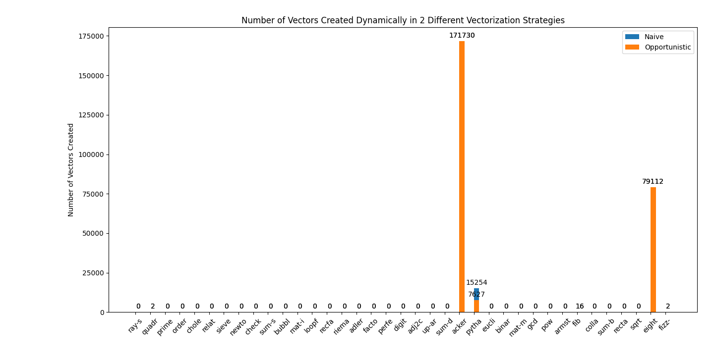
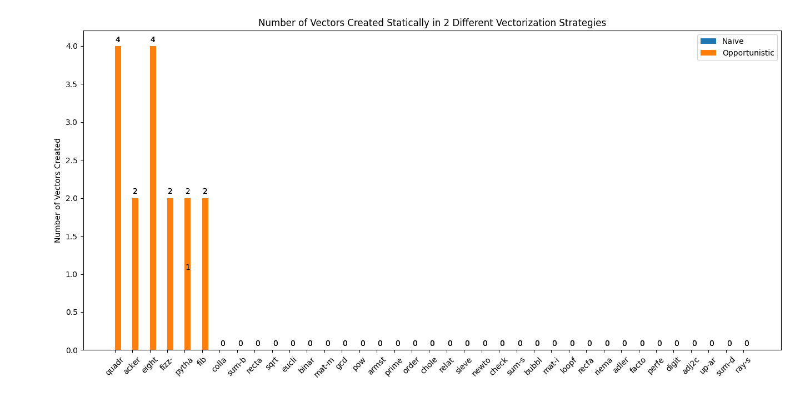

+++
title = "Vectorization for Bril"
[[extra.authors]]
name = "Jonathan Tran"
+++

## Introduction

In this project, I implemented auto-vectorization in the Bril language. I added a basic vector instruction set to the Bril language and implemented the instruction set with an extension of the reference interpreter, called `brili-vc`. I then implemented various approaches towards vectorization, beginning with a naive form of vectorization which creates vector instructions whevever possible. I also implemented a form of vectorization based on local value numbering, which opportunistically attempts to reuse vectors as much as possible. As a goal for this project, I wanted to develop correct vectorization algorithms, and measure how many vector instructions were created. To measure correctness, I created my own test cases, and to measure how many vector instructions were created, I used the CS 6120 Bril Benchmarks and calculated the number of vector instructions that were generated by instrumenting the `brili-vc` interpreter to track relevant statistics. My implementation is at the links: [vectorization](https://github.com/JonathanDLTran/CS6120-Jonathan) and [brili-vc](https://github.com/JonathanDLTran/bril/tree/main/bril-ts).

## Vector Language

The design of the vector language was based off resources from several students who had previously taken CS 6120, as well as the LLVM vector language. The students' languages are located at [vril](https://www.cs.cornell.edu/courses/cs6120/2019fa/blog/vril-vector-bril/), and [vector-instruction-support](https://www.cs.cornell.edu/courses/cs6120/2019fa/blog/interpreter-vector-support/). The LLVM vector language can be found be found at [llvm-vector](https://llvm.org/docs/LangRef.html#vector-operations).

Using these resources, I specified a minimal vector language. Each vector is comprised of exactly 4 ints. To create a fresh vector, one can use the `veczero` command, which creates a vector with all lanes starting with a value of 0. Operations on vectors include `vecadd`, `vecsub`, `vecmul`, and `vecdiv`, which are similar to their single integer Bril counterparts, except that the vector operations operate on 4 integers at a time. `vecmove` copies the value in one vector register to another vector register. `vecmac` represents an operation multiplying two vectors, and then adding a vector offset. `vecneg` negates all the elements of a vector. Due to project limitations, neither `vecmac` nor `vecneg` were handled; however, it is possible to extend the vectorization to handle these 2 instructions. 

To interact between vector registers and normal registers. one can load into and store from vectors. For instance, the `vecload` instruction places one integer of data into a vector, at the specified index in the vector. Likewise, `vecstore` extracts one integer of data from a vector into a Bril pseudo-register. 

The vector language is simulated in the Bril interpreter. I implemented the vector registers as variables storing array of width 4. Each vector operation manipulates the array appropriately; for instance, `veczero` instantiates all the cells of the array to have value 0, `vecload v i d` loads data `d` into the array representing vector `v` at index `i` in the array, and `vecadd v1 v2` does element-wise addition on the arrays representing vectors `v1` and `v2`. The implementation of this interpreter is located in the files `bril-vc` and `brili-vc`. I also augment the `print` instruction to print out all elements in a vector, for easy debugging.

## Vectorization

Vectorization is broken into several stages. The first stage is to preprocess the code, which enables the vectorization algorithms to have greater opportunities to create vectors. The preprocessing stage is comprised of several passes that attempt to create larger basic blocks with more consecutive vectorizable instructions. 

The second stage is to create runs of vectorizable instructions. A run of instructions is a sequence of Bril instructions that are all have the same opcode and are independent. A vectorizable instruction is independent if its arguments to do not depend on any other destination variables from the same run of insturctions. For example, the sequence of Bril instructions

```bril
w: int = add a b;
x: int = add b c;
y: int = add a c;
z: int = add d d;
```

would be a valid run of vectorizable instructions, while the similar sequence 

```bril
w: int = add a b;
x: int = add b w;
y: int = add a c;
z: int = add d d;
```

would not be a valid run of vectorizable instructions because `w` is defined and then used in the same basic block.

Finally, the third stage is to run the vectorization algorithms on the runs of vectorizable instructions, and create vectors, which then replace code in the basic block. Vectors are only created when each run has two or more instructions in it.

### Preprocessing

Preprocessing is applied to the Bril code to allow for further optimization potential. Assuming no memory operations are present, the first preprocessing optimizations applied are simple dead code elimination (DCE) and loop invariant code motion (LICM). Removing obviously dead instructions will help simplify the code. As a side note, the condition for non-present memory conditions is because my implementations do not handle memory operations for DCE or LICM. Also, local value numeering (LVN) would have been used, but my version of LVN had a bug, causing me to exclude using LVN.

I then inline as much code as possible, to create larger basic blocks. To do so, I created a call graph of all calls, then topologically sort the call graph, and copy the body of callees into callers, stitching together code as appropriate.

Next, loops in the code are fully unrolled, if possible. Unrolling only applies to loops that have one iteration variable that is increasing by 1 or decreasing by 1. Further, the loop header must have exactly one branch condition, depending on the iteration variable. The loop also must have only one exit, from the branch condition in the header. By unrolling the code, loops get expanded into long sequences of straight-line code without branches or jumps. Having straight line code allows for long sequences of instructions that can be identified as vectorizable, and the possibility that a vector may be used several times.

After unrolling, stores are then moved as late in the basic block as possible. Store movement depends on alias analysis, because a store can only move past another store or another load, assuming no aliasing. Moving stores later in the basic block allows for a greater opportunity of finding vectors, because vectors have to end when a store is identified. In the same vein, `const` instructions and `id` instructions are moved as early as possible, while `print` instrucitons are moved to be as far down in a basic block as possible.

Following moving stores, each basic block is canonicalized so that sequences of adds, divides, multiplies, and subtractions occur together as much as possible. This pass is used to identify potential vectors in a simple manner.

Finally, block coalescing is done to the control flow graph. When loop unrolling is complete, there may exist extraneous jumps in the control flow graph. Basic blocks connected by a jump are stitched together into a single block, assuming that the original target label of the jump is unused after the jump is eliminated. By coalescing the control flow graph, the vectorization algorithms are able to search longer jump-free sequences of instructions and possibly find more vectors than had the coalescing not been applied.

### Naive Vectorization

In naive vectorization, given a run of instructions, a vector will be created, with loads and stores created appropriately. There is no attempt to reuse a created vector. As an example of naive vectorization, given the run: 

```bril
w: int = add a b;
x: int = add b c;
y: int = add a c;
z: int = add d d;
```

then the below instructions are created, and used to replace the original run of instructions:

```bril
v1: vector = veczero;
v2: vector = veczero;

one: int = const 1;

i: int = const 0;
vecload v1 i a;
i: int = add i one;
vecload v1 i b;
i: int = add i one;
vecload v1 i a;
i: int = add i one;
vecload v1 i d;

i: int = const 0;
vecload v2 i b;
i: int = add i one;
vecload v2 i c;
i: int = add i one;
vecload v2 i c;
i: int = add i one;
vecload v2 i d;

sum: vector = vecadd v1 v2;

i: int = const 0;
w: int = vecstore sum i;
i: int = add i one;
x: int = vecstore sum i;
i: int = add i one;
y: int = vecstore sum i;
i: int = add i one;
z: int = vecstore sum i;
```

### Opportunistic Vectorization

Opportunistic vectorization attempts to reuse created vectors as much as possible. For instance, if a vector `v` can be used in multiple locations, opportunistic vectorization will recognize this and reuse the vector `v`. In conjunction with reusing vectors, opportunistic vectorization also attempts to reuse constants wherever possible, so that constants are not recomputed when building offsets to load into vectors.

In opportunistic vectorization, each vector name is associated with its values. For example, vector `v` might be associated with the quadruple of values (`a`, `b`, `c`, `a`). Every time a run has the set of arguments (`a`, `b`, `c`, `a`), `v`, can be substituted, instead of creating a new vector and loading into that vector. To make this vectorization scheme possible, I have to force each variable to have a single definition. Otherwise, it is possible a variable is updated, and a vector now has a different computational value. SSA is used in this scheme, and vectorization is required to follow SSA rules. After opportunistic vectorization is completed, an pass is used to leave SSA form and reenter normal Bril format.

An example of opportunistic vectorization is shown on the Bril code below:

```bril
w: int = add a b;
x: int = add b c;
y: int = add a c;
z: int = add d d;

m: int = add e b;
n: int = add f c;
o: int = add g c;
p: int = add h d;
```

The result of opportunistic vectorization is:

```bril
v1: vector = veczero;
v2: vector = veczero;

one: int = const 1;

i0: int = const 0;
vecload v1 i0 a;
i1: int = add i0 one;
vecload v1 i1 b;
i2: int = add i1 one;
vecload v1 i2 a;
i3: int = add i2 one;
vecload v1 i3 d;

i4: int = const 0;
vecload v2 i4 b;
i5: int = add i4 one;
vecload v2 i5 c;
i6: int = add i5 one;
vecload v2 i6 c;
i7: int = add i6 one;
vecload v2 i7 d;

sum1: vector = vecadd v1 v2;

i8: int = const 0;
w: int = vecstore sum1 i8;
i9: int = add i8 one;
x: int = vecstore sum1 i9;
i10: int = add i9 one;
y: int = vecstore sum1 i10;
i11: int = add i10 one;
z: int = vecstore sum1 i11;

v3: vector = veczero;

i12: int = const 0;
vecload v3 i12 e;
i13: int = add i12 one;
vecload v3 i13 f;
i14: int = add i13 one;
vecload v3 i14 g;
i15: int = add i14 one;
vecload v3 i15 h;

sum2: vector = vecadd v3 v2;

i16: int = const 0;
m: int = vecstore sum2 i16;
i17: int = add i16 one;
n: int = vecstore sum2 i17;
i18: int = add i17 one;
o: int = vecstore sum2 i18;
i19: int = add i18 one;
p: int = vecstore sum2 i19;
```

where only three new vectors are created, rather than four, because vector `v2` can be reused in its entirety. Note that constants like `1` are not regenerated.

To deal with partial matches in opportunistic vectorization, I use the `vecmove` instruction. Consider the vector `v` associated with the quadruple (`a`, `b`, `c`, `a`). If we are required to build the vector (`a`, `b`, `d`, `a`), which differs at one location from vector `v`'s quudruple, we can reuse the vector `v` by copying it to a new vector register `v1`, and then loading `d` into the second index of `v1`. Partial matches are only considered when there are at least two matches, to lessen the number of `vecload` instructions required. Overall, using `vecmove` allows for greater reuse of vectors.

To further improve opportunistic vectorization, further vector instructions could be added to allow for further vector reuse. These include shuffle or permutation instructions. This would allow for matching the quadruple of arguments (`a`, `b`, `c`, `a`) with (`a`, `a`, `b`, `c`), which is just the same vector, permuted to the right by one slot. Furthermore, permuting arguments in commutative instructions like `mul` or `add` would also allow for greater use of previously computed vectors.

## Evaluation

I evaluated the vectorization algorithms for correctness on my own tests, as well as the Bril Benchmarks. I restricted the benchmarks to only benchmarks using the Bril core language, as well as the Bril memory extension. The Bril speculative and Bril floating point extensions are not supported in my vectorization scheme. 

Using Brench, I verified that my passes operated correctly on all the passes, compared to when my passes were not run. I also evaluated the vectorization algorithms to see how many vectors were created at run time. To do so, I instrumented the `brili-vc` interpreter to count the number of `veczero` calls that were created. The results are shown in the graph below:

<p align="center">

title="Vectors Dynamically Created" style="zoom:25%;"
</p>

As the graph shows, when most benchmarks are run through my vectorization pass, no vector instructions are created. The only benchmarks in which vector instructions were created were `quadratic`, `ackermann`, `pythagorean-triple`, `fib`, `eight-queens`, and `fizz-buzz`. These benchmarks have sequences of two or more vectorizable instructions, which made it trivial to vectorize. The inflated number of vectors dynamically created in the `ackermann` function, is due to the tremendous amount of recursive calls that this function makes, while for `eight-queens` and `pythgorean-triple`, the number of vectors dynamically created are largely dependent on the iterative search over a large search spce. `quadratic`, `fib` and `fizz-buzz` have much less vectors dynamically created due to less iteration or recursion.

I also track the number of vectors created statically. These results are perhaps more revealing of the ability of the vectorization pass to find opportunities to create vector instructions. 

<p align="center">

title="Vectors Statically Created" style="zoom:25%;"
</p>

Most of the benchmarks have no vector instructions created statically, but for those that do, between 1 and 4 vector instructions are created. 

Finally, no benchmark actually had code that utilized `vecmove`, indicating that sharing and reusing of vectors is much more complex to do, compared to the basic schemes I devised. Only `pythagorean_triple` reused a vector.

## Shortcomings in the Vectorization Schemes

There were several major issues with the vectorization schemes that I proposed. First, I did not end up creating vector instructions like `vecmac`. However, some benchmarks using matrices used multiple sequences of consecutive `mul` and `add` instructions. In particular, benchmarks like `mat-mul`, `mat-inv`, and `cholesky` fell into this category, and would be targets for creating `vecmac` instructions. 

Next, the preprocessing passes are not as strong as I intended them to be. For instance, the unrolling pass is very simple in how it detects whether a loop can be unrolled. In fact, the unrolling pass never actually runs, because the only benchmark it could have run on, `mat-mul`, did not hardcode the dimensions of the matrix, instead passing it in as a parameter. As a result, I would need to improve the unrolling pass to make it detect a wider range of fully-unrollable loops. In addition, the alias analysis pass was designed to be very basic, generally only being able to disambiguiate between two different arrays. A major weakness is that the alias analysis pass only assigns one address to an entire array, failing to disambiguate between different locations within an array. This means that some instances of store movements cannot occur successfully, because the alias analysis will report two addresses in an array can alias, when in fact the two addresses are at different memory locations. Hence, it would probably be a good idea to augment the alias analysis to model each cell in the array.

Another problem is that I completely fail to account for the costs for each Bril vector instruction. For instance, I form vectors from consecutive operations that can be vectorized. However, I never account for the cost of loading into or extracting from vectors. Generally, architectures allow for cheaper loads of consecutive memory locations into a vector, than compared to non-consecutive memory locations. The same qualities hold for stores. However, I never verify that consecutive memory locations are being loaded into or stored from a vector. This would cause the vectorizable to be more expensive in terms of runtime, when compared to the original code. As a way to fix this issue, I could adopt Larsen and Amarasinghe's approach in the Superworld Level Parallelism (SLP) paper. [^1] The authors of SLP begin by forming sets or "packs" of values that are likely to be vectorized, with each pack being consecutive memory addresses. Then, def-use and use-def chains are followed from these initial packs to form further packs of values, which are then built into vectors as well. If I were to implement the approach described in the SLP paper, I would likely have to build better alias analysis and array element tracking methods, to identify consecutive memory locations.

Additionally, the algorithms that I implemented in this project were very simple. There are more complex ways to allow for further vector reuse across basic blocks, and across entire functions. For instance, Mendis and Amarasinghe's goSLP project uses integer linear programming (ILP) to encode conditions that each vector pack must satisfy in a valid vectorization scheme. [^2] After using an ILP solver, an optimal solution can be found for creating vector packs across an entire function. goSLP also minimizes the number of vector shuffles required, by using a dynamic programming approach. While I never tried any ideas from the goSLP paper, I did try brute force techniques to enumerate every possible permutation of instructions in a vector pack, considering packs of size two, three and four. This attempt failed to scale to five vector packs, and even on four vector packs, produced too many possible vector packs that could be valid vectorizations. This made me realize that I had to be more clever with my brute force technique to create more tractable solutions. I also tried enumerating combinations, rather than permutations, as well, and the results were fairly poor. 

Finally, I have no true way of evaluating the vectorization, because there is no Bril backend to target a real-life architecture. If I compiled Bril code down to x86 assembly, then I could evaluate the true optimization impact of the vectorization via measurements of the running time. However, the measurements I currently make are poor approximations for the actual optimization potential of vectorization, because there is no running time estimate for each Bril instruction executed, and because there are many other factors that could play a role in the success of vectorization, such as instruction cache performance.

## Conclusion

I implemented vectorization for Bril, by first preprocessing programs to allow for more opportunity to vectorize, then using two approaches of vectorization, including a naive and opportunistic method. I found that not many vectors were able to be created statically across the Bril benchmarks, and recognized several major issues with my approaches. Improving several of the preprocessing passes, and by incorporating main ideas other approaches, such as from the SLP paper, would result in better vectorization. [^1] In total, I have created a foundation, from which further approaches for vectorizing Bril code can be investigated. 

[^1] Samuel Larsen, and Saman Amarasinghe. 2000. Exploiting Superword Level Parallelism with Multimedia Instruction Sets. In Proceedings of the ACM SIGPLAN 2000 conference on Programming language design and implementation (PLDI ‘00), August 2000. ACM Inc., New York, NY, 145-156. https://dl.acm.org/doi/10.1145/349299.349320

[^2] Charith Mendis, and Saman Amarasinghe. 2018. goSLP: globally optimized superword level parallelism framework. Proceedings of the ACM on Programming Languages Volume 2 OOPSLA, November 2018. ACM Inc., New York, NY, 1-28. https://dl.acm.org/doi/pdf/10.1145/3276480
