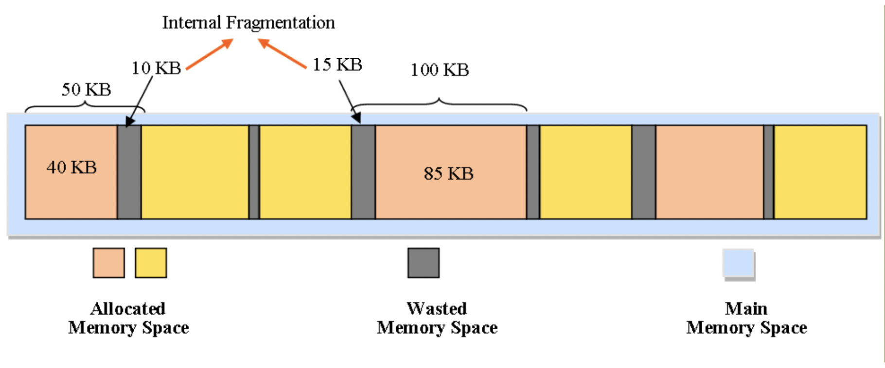

+++
title = "MESH: Fancy Memory Management"
[extra]
bio = """
  Grace Hopper made the first compiler. [Adrian Sampson](https://www.cs.cornell.edu/~asampson/) is an assistant professor of computer science, so that's pretty cool too I guess.
"""
[[extra.authors]]
name = "Adrian Sampson"
link = "https://www.cs.cornell.edu/~asampson/"  # Links are optional.
[[extra.authors]]
name = "Grace Hopper"
+++

MESH: Compacting Memory Management for C/C++
=======

One of C++’s greatest strengths is perhaps its complete command over memory. Pointers, addresses, and integers can all be manipulated like numbers, and memory can be allocated and freed on command. This comes with some tradeoffs; over time, memory becomes more and more fragmented, as space that is deallocated is re-allocated less efficiently. 

Garbage collected languages don’t deal with this problem. Rather, because such languages abstract away details about memory locations from the programmers, they are able to reclaim fragmented memory and reduce internal fragmentation. In C and C++ on the other hand, the overtly flexible representation of pointers and addresses makes it impossible for garbage collectors to reclaim fragmented memory. Because pointers are virtually indistinguishable from numerics at runtime, a garbage collector would not even know if there was still a reference to a particular section of memory.

As a result, C++ programs can suffer from low memory utilization and high memory fragmentation – and this can cause all kinds of terrible things, like sluggish or crashing applications. In order to solve this potential problem, we introduce MESH – a memory compaction algorithm proposed in 2019 that reduces memory consumption for C/C++ programs. 

What is MESH?
-------------

On the surface, MESH is a run-time library that acts as a plug-in replacement for malloc and free. Underneath the hood, MESH is a mechanism to compact the heap together without updating pointers, which seems an altogether impossible task. 

The key idea is that the allocator merges (or “meshes”) spans of pages when they have non-overlapping allocations in virtual memory. Crucially, the physical pages that are reclaimed after meshing can be returned to the operating system, but **no modification of the virtual addresses occurs**. 

To make this allocation scheme not only correct, but efficient, MESH heavily leverages randomization. Broadly, MESH can be broken down into three main components:

 - Allocation
 - De-allocation
 - Meshing

Each component of the algorithm needs to be efficient for the system to be performant. In the allocation phase, MESH uses a novel data structure called a shuffle vector to randomly select an offset to allocate an object to within a span. The authors of the paper showed that in expectation, randomly selecting offsets does not decrease the probability of two spans being meshable. The performance gains of the random allocation are also shown to outweigh the potential downsides of non-determinism. In the de-allocation phase, local frees are taken care of by simply adding the allocated offset back to the shuffle vector. Finally, in meshing, the creators leverage an algorithm called SplitMeshser to randomly probe potential meshes for faster performance. They show that the algorithm is able to get close to ½ the best possible meshing in a reasonably fast time. 

MESH and Randomization
----------------------

It may seem strange that something as important as a memory allocation algorithm would leverage randomization. After all, determinism is crucial with these types of things. There are two interesting observations here: the randomization in the algorithm does not affect the correctness of the allocation scheme, only the performance. In other words, in the worst case, pages don’t mesh as often as we would like, but this won’t change the execution result of the program. 

The second is that randomization is applied at more than one stage of the meshing algorithm. It’s used to randomly partition in the SplitMesher algorithm, randomly probe offsets when allocating, and to simplify the clique problem into meshing. It’s interesting that randomization is used so prevalently in an allocation system. Intuitively, it would seem like the more randomness you inject into the system, the luckier you need to be for everything to “go right”. In other words, composing a lot of random processes together almost seems to make it more unlikely that the good cases you are hoping for will actually happen. But surprisingly, the theory works out very elegantly. The authors are able to prove fairly reasonable confidence bounds on the performance of the system in spite of the randomness, and in practice it ends up working very well. At a minimum, the randomized algorithms do just as well as their deterministic analogues. In the best cases, they actually do significantly better. 

We discussed heavily: does this randomization cause performance problems? Frequently, good programmers do **cache-aware** programming – in performance critical systems, putting frequently sequentially accessed items next to each other in memory allows for a higher percentage of cache hits. We discussed how it actually seems like the random allocation does not decrease performance significantly at all, which at first seems surprising. In fact, the MESH paper actively does some benchmarking of MESH with and without randomization, to back up this fact.

The first hypothesis is that it's more important for items inside an object to be contiguous in memory – so when you allocate a vector, the vector might be placed at a random address, but all the items of the vector are contiguous in memory. This is more important than two different vectors being right next to each other! Then the random allocation of several vector objects wouldn’t matter, as long as everything inside the vector object is close in memory.

The second is that in a complex, memory-intensive system where there are many allocations and frees, memory allocation patterns end up looking random anyway. Thus, randomizing on allocation makes a negligible on the memory allocation patterns.

Both are interesting to consider, and our compilers class discussed that it would be interesting to see some stats on each hypothesis!

How Well Does MESH Perform?
---------------------------

The paper benchmarks MESH on three different benchmarks: Firefox, Redis, and the SPECint2006 suite. 

Firefox is a well-known web browser that historically has a large memory footprint. This makes a Firefox benchmark a particularly meaningful benchmark, as developers have spent multiple years in efforts to lessen the Firefox memory footprint. While running a particular application that simulates some commonly used web workloads, MESH had a 16% decrease in average heap size, and only a 1% increase in performance compared to Firefox with its bundled `jemalloc`. 

The second benchmark is on Redis, which is a well-known in-memory database. The benchmark configures Redis to act as an LRU cache, and also compares against the original Redis with its “active defragmentation” turned on. The findings were that MESH saved as much memory as Redis with its active defragmentation option on, but MESH spent far less time meshing than Redis’ defragmentation – in fact, up to 5.5x faster.

Lastly, MESH was benchmarked on the SPECint2006 – a standard benchmarking suite for compiler optimizations. MESH seemed to cause no major memory improvements, although it is noted that most of SPECint is not allocate-heavy, and thus it has not much use for powerful memory defragmentation.  

 Our compilers class, in particular, has a particular interest in the quality of benchmarks across multiple papers, and this paper was not an exception. In particular, we noted how most meaningful programs have many memory allocations, deallocations, and activity, and yet there seems to be few standard benchmarks that stress test the memory system. In particular, the SPECint suite is normally meant to test CPU performance, and even though it is a standard compiler benchmark suite, it provides not too much meaningful insight to the performance of MESH. On the other hand, the Firefox and Redis benchmarks were compelling evaluations that tested the effectiveness of MESH, as Firefox is an actual real-world use case with heavy memory usage. Redis, on the other hand, is a product that clearly has defragmentation concerns, as it has specific benchmarks developed that test memory load (and Redis has invested time in implementing their own defragmentation). Thus, it makes for a good benchmark for comparison for MESH. 

MESH Conclusions
----------------

We were particularly impressed by this paper because it elegantly ties together a lot of fundamental areas in computer science, from theoretical algorithms and probability to operating systems and compilers concepts. In particular, we appreciated that the authors spent a great deal of effort attempting to rigorously prove their claims. They did not just assert that their randomized algorithms would likely work well - they showed rigorously that the expected running times under the randomness they induced are indeed more performant than the deterministic counterparts. 

Not only was the paper theoretically rigorous, but the authors also focused heavily on making the application practical and showing the readers that it was useful with empirical results. The paper raised a number of interesting points about allocation in languages such as C and C++ as well, and also provided a clever solution to the problems raised by fragmentation that does not require rewriting the code or even re-compiling it. The only thing that needs to be done is to swap out the allocator and relink the executables. The benchmarks they evaluated the allocator on were also very practical - Redis and Firefox are both widely used applications, and any performance gains from them can be viewed as a pretty notable result. 

Ultimately, we were very glad to have read and discussed this paper! In particular, for such a recent paper, we are excited to see what comes next in the future of memory allocators and garbage collectors in the coming years. 
