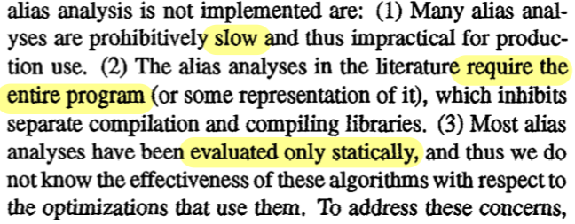
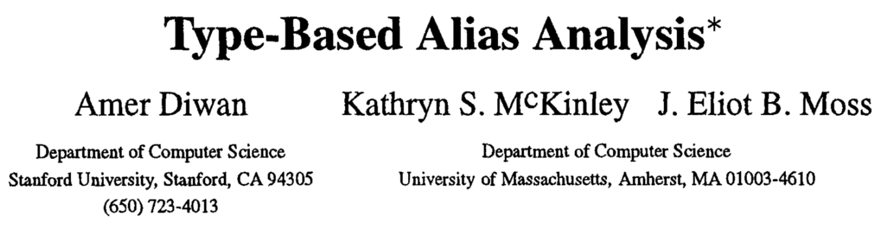
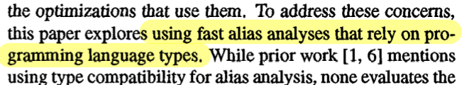
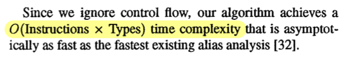
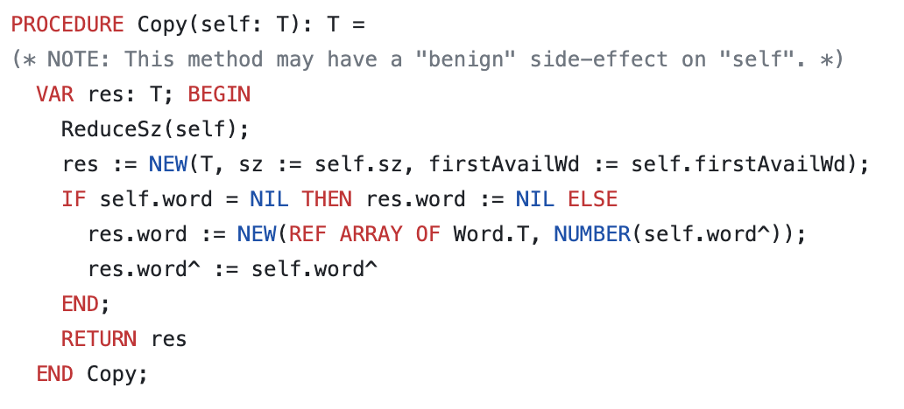
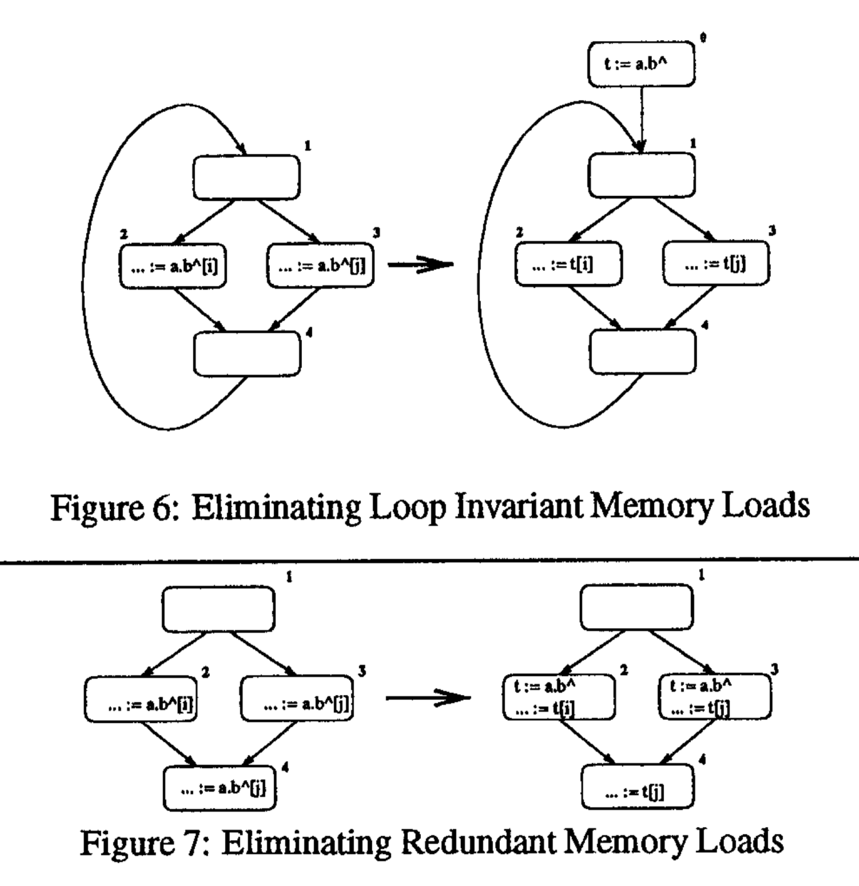
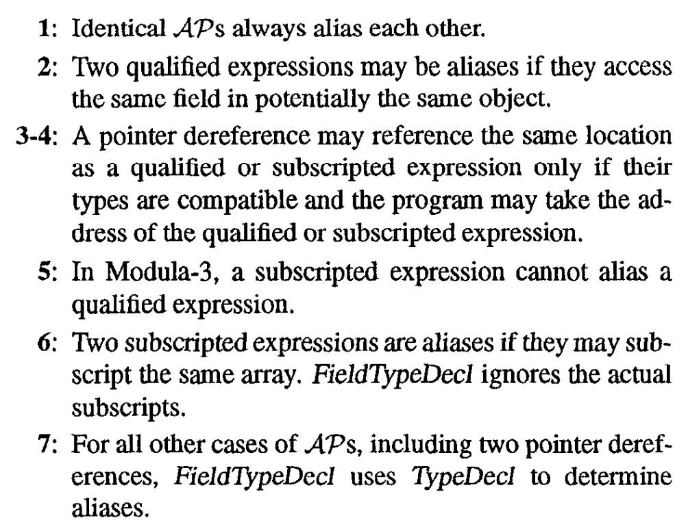

+++
title = "How Type Systems Optimize Optimizers"
[extra]
authors = "Albert Xiao, Jan-Paul Ramos, Kei Imada, and Ryan Mao"
latex = true
bio = """
    Kei Imada is a first-year Ph.D. student. He is interested in applying
    mathematical structures to type systems and formal verification to
    efficiently develop parallel and distributed systems and software
    defined networks.
"""
[[extra.authors]]
name = "Albert Xiao"
[[extra.authors]]
name = "Jan-Paul Ramos"
[[extra.authors]]
name = "Kei Imada"
link = "https://keikun555.github.io/"
[[extra.authors]]
name = "Ryan Mao"
+++
[Slides from the discussion](https://docs.google.com/presentation/d/17exjq4corO3WoJOblv7BwcrzJ_x4F7MHgPyCCNGfV8k/edit?usp=sharing).
## Background
### What is alias analysis?

Let’s recall from the [pointer analysis lecture](https://www.cs.cornell.edu/courses/cs6120/2023fa/lesson/10/) what pointer analysis is.
For each pointer pair A and B, we determine whether A may-alias B, in other words, whether A and B could point to the same memory location.
The stricter problem of determining whether A would alias B is an intractable problem as covered in the lecture.
In the example below, the analysis of the code might tell us that A will not alias B, so we would be able to remove the star B equals B line, making the resulting program more efficient.
```c++
// a may-alias b?
bool foo(char *a, char *b) {
    *a = 'a';
    *b = 'b'; // remove if not
    return *a == 'a';
}
```

### Why do we want alias analysis?
We want to analyze aliases because many of our popular languages use pointers today, and some language-features require pointers, like polymorphism.
And oftentimes, these addresses point to memory allocated in the heap.
Loading memory from the heap is more random and less frequent than loading memory from the stack, which makes reading from the heap more prone to cache misses, decreasing the performance of the program.
Alias analysis lets us reason about which load instructions are necessary and which ones are not.

### Problems with alias analysis
The paper cites that before, alias analysis wasn’t used as much because (1) it was slow, (2) had a closed-world assumption, and (3) was only evaluated statically.

Just static analysis didn’t tell compiler developers how effective the analyses would be in a real-world environment, in other words, applied to an optimization.
The closed-world assumption meant that the entire program was needed to do these analyses which meant that we couldn’t use them on compiled libraries, which meant we wouldn’t be getting modularity of code.
And slowness meant that the analyses were, well, slow.

### Type-based alias analysis
So that’s why Diwan, McKinley, and Moss thought of leveraging fast type systems of typed languages to enhance alias analysis.
Hence the name type-based alias analysis.


And they ended up with a near-optimal algorithm that is O(Instructions * Types).

The main contributions of this paper come in three forms.

* Three implementations of type-based alias analysis, built on top of one another.
    * Type compatibility
    * Type compatibility + field names
    * Type compatibility + field names + flow-insensitive analysis
* Three different kinds of evaluations.
    * _Static evaluations_, or measures on the code itself
    * _Dynamic evaluations_ on an actual optimization, called redundant load elimination
    * _Limit analysis_ which compares against the quote-on-quote best case scenario.
* How well the analyses perform on an open world assumption.

There are three topics of background information we need to cover: Modula-3, the programming language the authors wrote the analyses for, redundant load elimination, and access-paths.

### Modula-3

Excerpt of Modula-3 code from [here](https://github.com/modula3/cm3/blob/4e0b3df126b34db781039e6fd55449850d88ebec/m3-libs/bitvector/src/BitVector.m3#L208C29-L208C29)

Introduced in 1988, Modula-3 is a versatile programming language designed for both simplicity and power. It evolved from Modula-2, retaining its strong typing while incorporating much of C’s power. Key features of Modula-3 include object-oriented programming, generic programming, and garbage collection. Unlike languages like Java, Modula-3 compiles directly to machine code, eliminating expensive virtual machine overheads. Its record types offer direct memory representation, similar to C's structs. While it has an automatic garbage collector, pointers in Modula-3 can be designated as either visible or hidden to this collector. Due to these features and others, Modula-3 can be employed at the systems-level. In fact, an operating system called SPIN was even developed using Modula-3.

##### Memory References in Modula-3
Modula-3 includes three ways to reference memory, which have analogous components to C:

* `p.f` to access a field of an object
* `p[i]` to access the i-th element of an array p
* `p^` to dereference a pointer

The paper uses these expressions in its analyses.

### Redundant load elimination (RLE)

Redundant load elimination, as proposed by the paper, is a combination of loop-invariant code motion and common subexpression elimination of memory references, which are both subsumed by partial redundancy elimination. It illustrates the optimization with the two examples below.

In the program before optimization, the expression `a.b` (a field memory access) is loop invariant and can be hoisted to the loop’s preheader, as shown in the transformed control flow.

In the before control flow, the expression `a.b` (also a field memory access) is computed on all paths with respect to block 4, so the redundant computation performed in block 4 is removed.

These optimizations, especially loop-invariant code motion, are particularly powerful since memory references are expensive and removing any redundancy can provide a huge speedup. Redundant load elimination uses may-alias pairs as its input to inform what expressions are loop-invariant or redundant. 

#### Access Paths
An _access path_ is an expression that accesses memory. It can have many components like an array access or a member field access. Each component or any contiguous subsequence of components are also access paths. Consider the following example.

* `a^.b[i].c` where `a` is a pointer to an object with a field `b` that is an array of objects that have a field `c`
* In this example, `a`, `a^`, `b[i]`, and `c` are the components of the access path

The analyses below will refer to whole access paths using letters like _p_ and _q_.

## Type-based alias analysis (TBAA)
Now, we will provide overviews of the type-based alias analyses introduced by this paper. There are three introduced:

* Type compatibility (TypeDecl)
* Type compatibility + field names (FieldTypeDecl)
* Type compatibility + field names + flow-insensitive analysis (SMTypeRefs)

#### Type Compatibility (TypeDecl)

This is the simplest analysis and can be implemented with only the knowledge of the type hierarchy of the program. Since Modula-3 is type safe, two access paths that reference the same memory location must have static types that have a _subtype_ relationship. Formally, for two access paths u and p, this analysis determines they may alias if

\[\mathrm{Subtypes}(\mathrm{Type}(u))\cap\mathrm{Subtypes}(\mathrm{Type}(p)) \neq \nullset.\]

Consider the following Java example to see why this simple analysis works. Assume B and C are subtypes of A, and D is a class that has a single field x of type A array.


```
C[] array = otherArray;
B b = otherB;
D d = otherD;
```


We can simply reason that b, d, and any array[i] cannot alias since none of these expressions’ types are compatible, but it is possible that d.x[i] aliases with b or any array[j], with the intuition that the types of these expressions are compatible. 

For type-unsafe languages, this simple expression is not necessarily true, since, for example, arbitrary type casting can occur. Consider the following snippet of C++ code with the same type hierarchies of the previous example.


```
C* array = otherArray;
B* b = otherB;
D* d = otherD;
```


If before this code, `otherArray[0] = (C*) otherB;` appeared, C[i] may alias B, despite the incompatibility between types C and B. (If the same cast was performed in Java, there would be a runtime cast exception, which will not allow any potentially unsafe code like this to be run.)


#### Type Compatibility and Field Names (FieldTypeDecl)

The second analysis introduced by the paper is FieldTypeDecl, an extension of TypeDecl that includes higher-level information about the language and types. There are seven cases in this rule from the paper:

|Access Path 1 (AP1)|Access Path 2 (AP2)|FieldTypeDecl(AP1, AP2)|
|--- |--- |--- |
|p|p|true|
|p.f|q.g|(f = g) ∧ FieldTypeDecl(p, q)|
|p.f|q^|AddressTaken (p.f) ∧ TypeDecl (p.f, q^)|
|p^|q[i]|AddressTaken (q[i]) ∧ TypeDecl (p^, q[i])|
|p.f|q[i]|false|
|p[i]|q[j]|FieldTypeDecl (p, q)|
|p|q|TypeDecl (p, q)|

The simplest rules that incorporate language information is the second one: if two access paths are field member accesses of compatible objects, they can only alias if the fields have the same name. This is clear to see for the simple case of p = q: then, p.f can only alias p.g if f = g. The other rules follow similar principles and have simple explanations to them. See the following from the paper:


##### AddressTaken
What is AddressTaken and why do some rules reference this? AddressTaken is a function that returns true if the program ever takes the address of its input. For example, AddressTaken (p.f) returns true if the program ever takes the address of the field f of a possible alias of p (this possible alias set is computed using TypeDecl). There is a similar definition for AddressTaken (x[i]). Rule 3 uses this rule since if the address of p.f has been taken, q may have been assigned it! For example, observe the following C snippet.

```
A* a = ...;
B* b = &a.b_field;
A* otherA = a;
```

In this somewhat complex example, otherA.b_field aliases *b! However, if b was instead assigned to something else and A.b_field never has its address taken, then b and otherA.b_field may not alias (assuming nothing type-unsafe occurs in the program).

#### Type Compatibility + Field Names + Flow-Insensitive Analysis (SMTypeRefs)
The third and final analysis is a combination of type compatibility and field names. This new analysis – SMTypeRefs – improves the previous by incorporating a flow insensitive pass to include the effects of variable assignments and references. This is called _Selectively Merge Type References_. 

```
VAR
	t: T := NEW(T);
	s: S1 := NEW(S1);
```

The following code assumes that `t` and `s` may reference the same location because it is semantically correct for objects of type `T` to reference objects of type `S1`. However, it’s fairly obvious that `t` and `s` never reference the same location since there is no explicit or implicit assignment between the two, and this is where the Selectively Merge Type References come into play.

```
Initialize unique group for each pointer type T
For all pointer assignments a := b:
	if Type(a) != Type(b):
		Ga, Gb := Group(Type(a)), Group(Type(b))
		Remove Ga, Gb from Groups
		Add (Ga ⋃ Gb) to Groups

Construct TypeRefsTable:
	For all types t:
 		TypeRefsTable[t] = Group(t) ∩ Subtypes(t)
```

This algorithm produces a TypeRefsTable which takes a declared type `T` as an argument and returns all the types potentially referenced by an access path declared to be of type `T`. Remember, AP just described the logical order of records in a file. The paper then describes that we have aliases if and only if there exists an intersection between the tables of a pair of access paths.

During the algorithm, we initialize a Group in which each declared type is in an independent set and an access path declared with type `T` is assumed to reference only objects of type `T`. In part 2 is when the algorithm really shines, as we examine all the assignment statements and merge the types if the left and right hand are different.

There is a remark in the paper that this step is similar to Steensgaard’s algorithm, which can be found implemented in LLVM. It’s very nice because it’s just a pointer analysis algorithm that operates in near-linear time, supporting essentially unlimited scalability in practice.

It’s particularly challenging because we need to represent the results in linear space, which is nontrivial because over the course of program execution, any pointer `p` could potentially point to the location of any other pointer `q`. This seems to need a representation of $O(n^2)$ space at least. 

There’s a unification of abstract locations for `q` and `r`, creating a single abstract location for both of them. Now we can track the fact that `p` may point to either variable using a single points-to relationship.

Finally, in step 3 they actually apply flow insensitivity. They filter out infeasible aliases from Group, creating an asymmetry in the SMTypeRefs relationship. The paper remarks that now using Steensgaard’s algorithm, and applying it to the user defined types, it wouldn’t discover this asymmetry. The final result of this step is the TypeRefsTable.

## Evaluation

The authors use three different types of evaluation methods to examine their work.

* **Static Evaluation:** measure static measures of the analysis. In the paper, the authors examine the sizes of the may-alias sets returned by their algorithms, where smaller sizes correspond to more precise results. Crucially, the authors note that static evaluation alone may not provide a holistic picture of the performance of the analysis.
* **Dynamic Evaluation:** measure the actual runtime performance of the algorithm, after performing optimizations utilizing their analysis. The authors implemented RLE using the sets computed by their TBAA, and measured the wall clock runtime both with and without optimization. This evaluation, in conjunction with the static evaluation, provides a bit more insight into the results of the analysis.
* **Limit Analysis:** evaluates the gap between the analysis performance and a hypothetical ‘best’ analysis. The authors explore this gap using instrumentation in a runtime setting.

Some notes on the experimental setup: First, Modula-3 is transformed into an AST-like intermediate representation (IR). Both the type-based analysis and redundant load elimination operate on this IR. As a final step, the code is sent to a non-optimizing GCC backend to generate machine code.

### Results: Static Evaluation
The authors run all three variants of TBAA (TypeDecl, FieldTypeDecl, and SMFieldTypeRefs) on their benchmarks and aggregate the sizes of may-alias local and global pairs within each benchmark. It’s worth noting that these three variants are each strictly stronger than the previous. In terms of the computed pair set size, there was a significant improvement between TypeDecl and the latter two analyses. Interestingly enough, there was not a very significant improvement between FieldTypeDecl and SMFieldTypeRefs. One possible explanation is that the field types inherently provide a ton of information, and bring the resulting analysis very close to a best-case analysis. 

### Results: Dynamic Evaluation
The authors performed RLE using the sets computed in their analysis and found improvements of 1% to 8% in wall clock runtime on the benchmarks, with an average improvement of 4%. There didn’t seem to be much difference resulting from different analyses used in generating the may-alias sets. There are several caveats to these results – they are heavily dependent both on the benchmarks used and on the optimization implementation. 

### Results: Limit Analysis
The authors then instrumented every load instruction in the benchmarks. A load was labeled as ‘redundant’ if the most recent load referenced the same memory address. They compared the number of redundant loads in both the unoptimized and optimized programs, and showed a significant improvement according to this metric (37% to 87% reduction in the number of redundant loads in the benchmarks). For the remaining redundant loads after optimization, the authors categorized them into several categories:

* **Encapsulation: **because of encapsulation, some redundant expressions were implicit in their IR, so they couldn’t eliminate them.
* **Conditional:** some loads are only redundant on certain control paths, not all.
* **Breakup:** the authors did not implement copy propagation, so redundant expressions consisting of smaller expressions weren’t eliminated. 
* **Alias failure:** issue with the analysis.
* **Rest:** undetermined.

The authors manually categorized the remaining redundant loads and determined that the vast majority were due to encapsulation. Conditional redundant loads were another significant source. The authors claimed to have no redundant loads resulting from an alias failure, but their ‘rest’ category was pretty significant and it is still possible for some redundant loads that fall into that category to result from an alias analysis failure.

### Extension: Incomplete Programs
The procedures and results mentioned by the authors all rely on the assumption that the entire program is available to the compiler. In many real-world settings, however, this may not be the case. For example, consider the following Modula-3 procedure definition: 

```
    PROCEDURE f(p: S1, q: S2) = …
```

In a type-unsafe language, if the compiler isn’t able to see every call of `f` in the program, then we have to assume that `p` and `q` may alias each other. If the language is type-safe, there are stronger assumptions we can make about the two variables leveraging the language’s type system.

The authors wrap up their paper with a brief discussion of how to modify their approach in the case of an incomplete program. First and foremost, for the AddressTaken component of their analyses, they add a second condition: if there exists a pass-by-reference formal, and some pointer shares the same type as it, then set the AddressTaken of that pointer to true. In this sense, the authors consider all available instructions for available code, and then conservatively consider the type system only for unavailable code. Additionally, the merging operation in their analyses is modified to also merge all available types that are related by the subtype relation. 

Interestingly enough, the authors claim that the open-world setting has an insignificant impact on the effectiveness of TBAA on their RLE.

## Discussion
* This paper presents a new kind of alias analysis: type-based alias analysis.
* The authors measured the new analysis algorithms in the context of its use: redundant load elimination
    * In addition to static analysis, the authors conducted dynamic runtime analysis and limit analysis, which measures against the measured best-case performance.
    * This paper is one of the first to utilize dynamic analysis and limit analysis, and highlights the importance of experimental results in respect to compiler optimizations.
* Shortcomings
    * We felt that the eight benchmark choices were limited. The authors write that the benchmarks were chosen because “other researchers have used several of them in previous studies.” Eight benchmarks cover nowhere enough use cases for programming languages that can express a plethora of algorithms. Ideally, we would have many more benchmarks across different use cases, and this paper did not have that. Granted, this paper came out in 1998 which could mean that there was a lack of Modula-3 benchmarks.
* We also discussed where we can use limit analysis in our optimization measurements. We concluded that we can use limit analysis when we have an intractable optimization problem and its theoretically optimal runtime measurement is tractable.

## Related
* More on redundant load elimination: [Introduction to load elimination in the GVN pass - The LLVM Project Blog](https://blog.llvm.org/2009/12/introduction-to-load-elimination-in-gvn.html)
* Steengaard’s Algorithm: [Points-to Analysis in Almost Linear Time](https://www.cs.cornell.edu/courses/cs711/2005fa/papers/steensgaard-popl96.pdf)
    * Available in LLVM in: [LLVM Alias Analysis Infrastructure — LLVM 18.0.0git documentation](https://llvm.org/docs/AliasAnalysis.html#the-steens-aa-pass)
* C++ Implementation of TBAA for Statically Typed Lua: [Statically typed Lua docs](https://the-ravi-programming-language.readthedocs.io/en/stable/llvm-tbaa.html)
    * “Lua 5.3 was released on 12 Jan 2015” so pretty old
