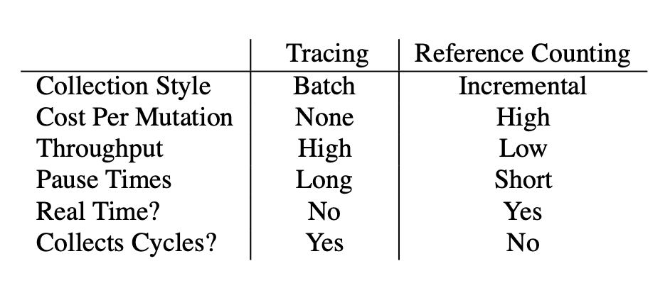
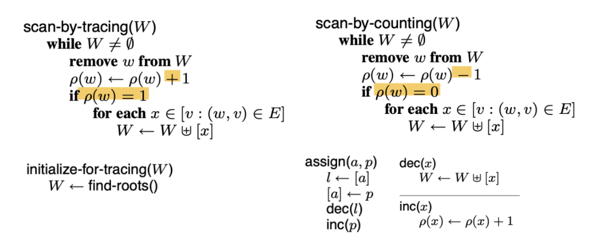
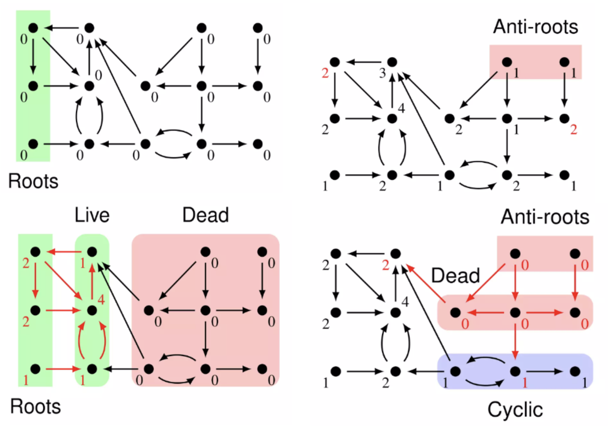

+++
title = "A Unified Theory of Garbage Collection"
[[extra.authors]]
name = "Sanjit Basker"
link = "https://github.com/SanjitBasker"
[[extra.authors]]
name = "Omkar Bhalerao"
link = "https://github.com/obhalerao"
[[extra.authors]]
name = "Melinda Fang"
link = "https://github.com/MelindaFang-code"
[[extra.authors]]
name = "Justin Ngai"
link = "https://justinngai.me"
[extra]
latex = true
+++

# Introduction
Reference counting and tracing are two techniques for garbage collection. These methods have traditionally been viewed as distinct approaches to managing memory and reclaiming unused objects in programming languages. Reference counting involves keeping track of the number of references to an object and deallocating it when the count reaches zero, while tracing involves identifying and collecting unreachable objects by following references from known roots. However, *A Unified Theory of Garbage Collection by Bacon et al.* presents a framework that views tracing and reference counting as duals of each other. The paper shows how optimized garbage collectors are hybrids of reference counting and tracing, and analyze all the presented algorithms using a common cost model for each operation and under some (strong) assumptions about the state of the program.

## Qualitative Comparison
On the high level, Reference counting is incremental, updating counts on each pointer write, while tracing operates in "batch mode" by scanning the entire heap. Tracing has a throughput advantage, while reference counting offers shorter pause times, suitable for real-time applications. Tracing collects cyclic garbage, but reference counting does not, requiring additional methods to handle cyclic garbage. 

However, optimizing them leads to similarities. The cost of updating reference counts in real-time applications often necessitates deferred reference counting, which introduces characteristics similar to tracing collectors, such as delayed collection and longer application pauses.

    

# Algorithmic Dual

    

    

The Tracing algorithm centers around the "scan-by-tracing()" function. It does so by scanning forward from elements in a work-list, incrementing reference counts as it encounters vertices. When a previously unvisited vertex is encountered, it recursively processes its out-edges by adding them to the work-list. The loop continues until all live nodes in R are found, and their reference counts are set to the number of in-edges they have. 

The primary difference between this algorithm and a standard tracing collector is that it maintains a full reference count instead of a boolean flag indicating visited status. This difference doesn't change the algorithm's complexity.

Similarly, “scan-by-counting” is the most important algorithm as well. It scans forward from elements in "W," decreasing reference counts of encountered vertices. When it identifies a garbage vertex, it recursively processes its edges by adding them to "W." This formulation of the algorithm buffers decrement operations instead of executing them immediately as described in the original approach. This buffering approach doesn't affect the algorithm's complexity but helps understand its relationship with other garbage collection algorithms.

To sum up, viewing reference counting as a delayed batched operation where decrements are performed at "collection time," and tracing as a process that reconstructs actual reference counts instead of just marking objects, both algorithms exhibit striking parallels. Tracing collects live data by traversing the object graph forward from the roots, while reference counting identifies dead data by starting with the anti-roots (objects with decremented reference counts). In essence, reference counting computes the graph complement of tracing, assuming there are no cycles. Tracing initializes reference counts to zero and increments them during traversal, while reference counting starts with counts exceeding the true value and decrements as needed.

To formally formulate the algorithm for garbage collection abstractly, the authors derived a fixed-point formula to describe the reference counts of a specific object

* $V$ is the set of vertices in the object graph, the universe of all objects
* $E$ is the multiset of edges in the graph 
* $R$ is the multiset of roots of the graph (in stack frames and global variables).
* $ρ(v)$, where $v \in V$, is the reference count of vertex $v$

$$\rho(x) = |\left[x : x \in R\right]| + | \left[ \left(w,x\right):\left(w,x \right) \in E \land \rho\left(w\right) > 0\right]|$$

Once reference counts have been assigned, vertices with a reference count of 0 are reclaimed

Given an object graph, there exist different fixed-point formulations. To be specific, the Tracing finds the least fix-point and counting finds the greatest fix-point, and their difference comprises the cyclic garbage. 

## Tracing-Counting Hybrids:
After drawing the equivalence and symmetric dual structure of pure reference counting and pure tracing algorithms, the authors apply the unified framework they described to various algorithms that can be seen as a hybrid approach between reference counting and tracing.

The first algorithm that the authors consider is deferred reference counting. This method of reference counting draws a distinction between root references (i.e. references that can be directly accessed from the current stack variables), and heap references, which are references that are contained within objects that are currently on the heap. As opposed to trivially counting all the references, this method only counts the references within the heap and keeps track of the root references separately. Whenever objects hit a reference count of zero, they are stored in a separate table, and at collection time, all the root references are traced, and all those that point to references with count zero are collected recursively. The authors draw the following diagram to illustrate the distinction between how reference counting and tracing are used in this algorithm.

From this illustration, the authors now consider inverting the uses of tracing and reference counting. They ask, what if only the root references were reference-counted and the heap references themselves were traced? The result is a garbage collection algorithm they deemed “partial tracing,” which is exactly that. For the reference-counting portion, the algorithm adds to and deletes from the set of root references (and hence, “counts” the root references) every time variables are created or written to. Then, for the tracing portion, the standard tracing algorithm is executed starting from the maintained roots by the counting portion at collection time. The authors do note that, though functional, this is a very impractical garbage collection algorithm to implement as it has a high per-write overhead (as in reference counting), but also keeps none of the incremental features of reference counting (due to the required tracing step). Similar to previously, the authors provide an illustration of the partial tracing algorithm below.

Lastly, the authors consider generational garbage collection methods. As a general rule of thumb, generational garbage collectors divide the heap into two sections: the nursery, which contains objects that were allocated relatively recently, and the mature space, which contains objects that were allocated longer in the past. Once the nursery gets full, the oldest objects in the nursery are copied into the mature space. Then, the nursery and the mature space are collected separately (with the nursery being collected more often than the mature space), and a remembered set of objects in the nursery that are pointed to by objects in the mature space is kept (with, of course, such objects not being collected). This generational structure can be implemented in various ways using both tracing and reference counting, and the authors go through multiple such implementations.

The first (and standard) implementation is to trace both the nursery and the mature space upon collection time. The collector will first use the standard tracing algorithm to collect the nursery (barring any elements of the remembered set), and then when it comes time to collect the full heap, the standard tracing algorithm is once again used. The authors also consider implementations that perform reference counting on the nursery and the mature space; for the implementation that performs reference counting on the nursery, which has high overhead but succeeds in collecting all the cyclic garbage, and for the implementation with a reference counted heap, it reduces overhead per write but fails to collect all the cyclic garbage. Thus, both these implementations have their tradeoffs.

## Cycle collection
A well-known caveat of reference counting is that it fails to detect and reclaim cycles of objects in the pointer graph. The authors give a definition of cyclic garbage in their formulation of the problem and describe several approaches that are robust to the structure of the pointer graph. Again, they unify existing algorithms for cycle collection with their framework. The first algorithm, reference counting with “sticky counts,” is simple to understand, but it doesn’t seem to provide any theoretical insight (perhaps because it was derived from the similarly unsatisfying algorithm of reference counting with an occasional tracing pass). The trial deletion algorithm is more interesting but uses a very complex subroutine to identify cycle candidates. Nevertheless, it’s clear that this formal framework is compatible with cyclic pointer graphs.

## Multi-Heap Collectors
In this section of the paper, the authors introduce garbage collection algorithm that runs on multiple heaps. Multi-heap systems generally partition the heap in order to collect some regions independently of others. The benefits are reduced pause times and increased collector efficiency by preferentially collecting regions with few live objects. The authors present the train algorithm as example where this is achieved through a nuanced notion of generation. A two layer abstraction of trains and car (building blocks of a train) is used to represent the maturity. Collection occurs car by car, thus optimizing the size of the car can reduce the collection pause time. Left over live objects are moved to the next car (or train) based on the links they have. The train algorithm has flavors of both reference counting (with handling the inter-car references) and tracing (performed within each car). The authors further suggest that the "remembered sets" of links, and the order of collection, the positional nature of car choices, ultimately resemble some macro-reference counting scheme.

Note that this paper was not the first paper to discuss the train algorithm, rather it seeks to highlight the tracing vs reference counting flavors underlying the design of the algorithm. This also seemed to be the core theme of the paper whereby it does not present any new memory management algorithms, but rather seeks to unify existing ones under a common framework.

## Cost Analysis
In this section, the authors analyze all the presented algorithms using a common cost model for each operation and under some (strong) assumptions about the state of the program. We felt that this depth of bookkeeping should probably belong in an appendix. Some folks felt that codifying the time-space tradeoff could be done qualitatively. Further, since the performance of a GC is largely empirical, the regimes in which a particular design is optimal may not be precisely described by the costs computed in this paper (even if we are able to measure the underlying quantities and the “steady-state” assumptions are true).

## Space-Time Tradeoffs:
The authors also address possible concerns about them using one canonical implementation of base reference counting and tracing by making the claim that potential alternate implementations are simply a tradeoff in space versus time. The authors cite examples of copying collectors (which copy live data into a new semi-space each time and thus saves iterating over the dead data), alternate representations of the remembered set (like adding tag bits to each data entry), and alternate ways of traversing the object graph (like adding reverse pointers instead of allocating an extra stack). These are all just minor details that seem to be included for completeness’ sake.

Folks also felt that the presentation of the paper was not very effective. In some places it read like a survey of existing algorithms, but other places (like cost analysis) felt so detailed that they belonged in an appendix. Formal definitions of various concepts were given, but they did not really culminate in a main theorem (e.g. giving some conditions that a garbage collector must satisfy to correctly find a fixed point). Despite these weaknesses, we think this paper is an essential read for those getting introduced to garbage collection, since it gives a proper theoretical treatment of garbage collection and a sampling of some of the refinements that can be used to improve a GC in practice.
