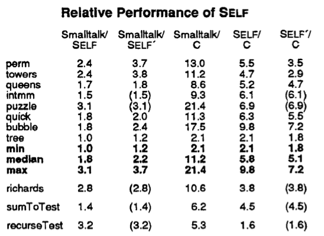

+++
title = "title TBD"

[extra]
bio = """
  Alice is an M.Eng student studying Computer Science. She is broadly interested in compilers, systems and algorithm design.
"""
[[extra.authors]]
name = "Benny Rubin"
[[extra.authors]]
name = "Collin Zhang"
[[extra.authors]]
name = "Alice Sze"
+++

## Compiler Optimization
The authors faced these challenges while designing SELF. First, message-passing is expensive, and many optimizations during compilation are impossible without knowledge of the type, moreover, the language has to perform a virtual machine call for simple instructions.

To solve these challenges, the authors proposed these techniques. The first technique is to “automatically derive much of the type information statically specified in other type systems", which is actually the predecessor of JIT compilation nowadays. The authors also suggested customized compilation based on type prediction. Message inlining based on message splitting also helped a lot during the optimization, while primitive inlining further improves efficiency of primitive operations. It's interesting to observe that message passing is applied in other languages to implement dynamic features. For example, Objective-C is a dynamic object oriented language based on C, although C is static and doesn't have object oriented features. Objective-C uses the message passing style to implement these features, which shows that message passing is a powerful technique. 

Let's first talk about customized compilation. SELF first trace the execution of the program, and generate a customized version of code based on type information. With that information of type, the language runtime can eliminate the need for message passing.

Type prediction is an interesting technique based on a lot of heuristics of the program. For example, `less-than` implies that the type would be integer. In that case, the compiler will insert a integer branch into the code according to message splitting.

Message Splitting is the optimization the authors apply to handle the case when one variable can take several different types. In this case, the compiler will create one specific subroutine for each type, while eliminating the need for message passing during that subroutine.

When we know the type of a variable, one optimization we can take is primitive inlining. Primitive operations are expensive because primitive operation often requires "calls to primitive operations are normally implemented using a simple procedure call to an external function in the virtual machine." When we know the type of the variable, we know how to handle the operations so that we don't have to pass the message to the virtual machine.

## Performance and Evaluation

The authors compared the performance of SELF with the fastest Smalltalk implementation available and with the standard Sun optimizing C compiler. The Stanford integer benchmarks and the Richards operating system simulation benchmarks were transliterated from C to SELF, SELF' (rewritten in a more SELFish programming style) and Smalltalk. The figure below shows the ratios of the running times of the benchmarks for the given pair of systems.

<!-- 
 -->

<!-- 
 -->

SELF outperforms Smalltalk on every benchmark by about a factor of two, but is around four to five times slower than an optimizing C compiler. The authors attributed the relative slowness to the quality of the SELF compiler implementation, SELF's robust semantics (e.g. bounds-checking) and the lack of type information. While this is promising for those who want to have their dynamic languages and use them too, some concerns were voiced by the class over the evaluation methods. Firstly, it is unclear how the benchmarks were transliterated, by a human or a program. Either way, it could be that the Smalltalk transliterations were not as good (subjective) as the SELF ones, which gives it an unfair disadvantage. More generally, this highlights the difficulty of using the same benchmarks across different languages. Secondly, real time is used instead of CPU time to measure the running time of Smalltalk, unlike C and SELF, because the two times are "practically identical". But if they are, then why not just use the CPU time for all of them? 

