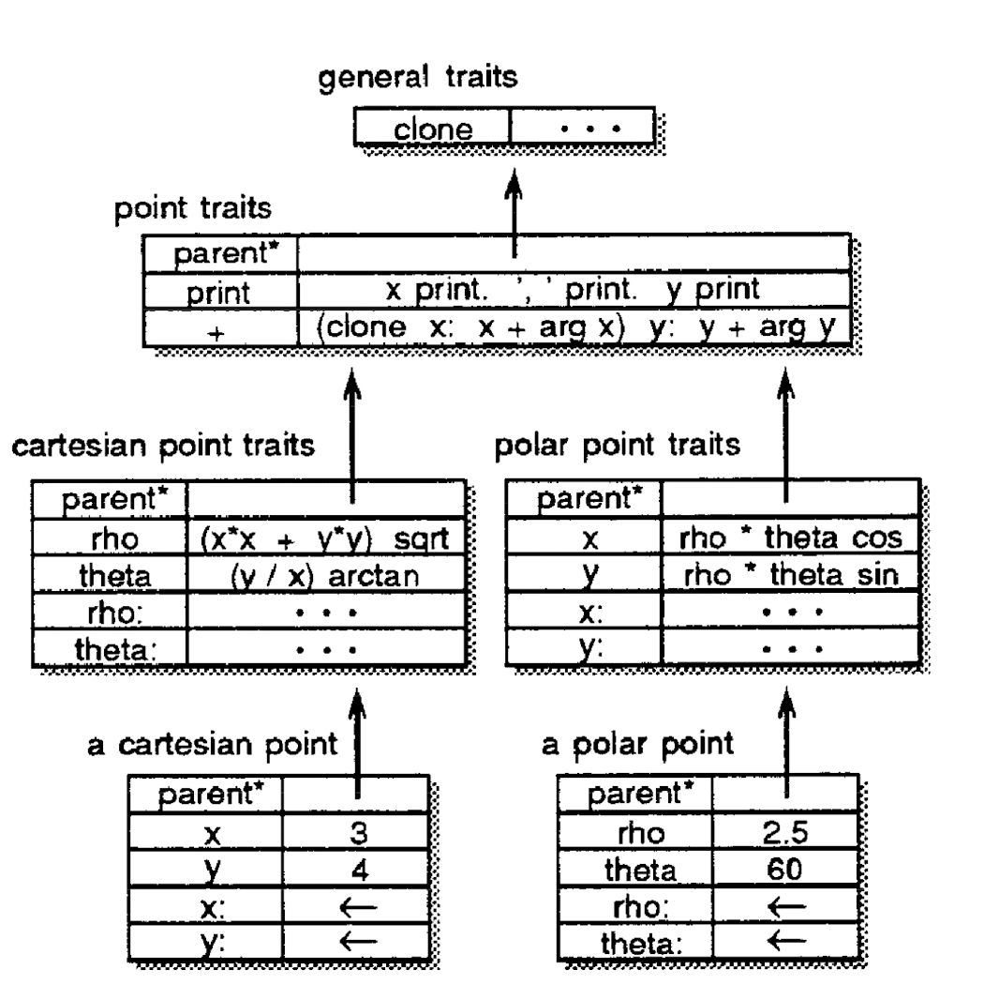
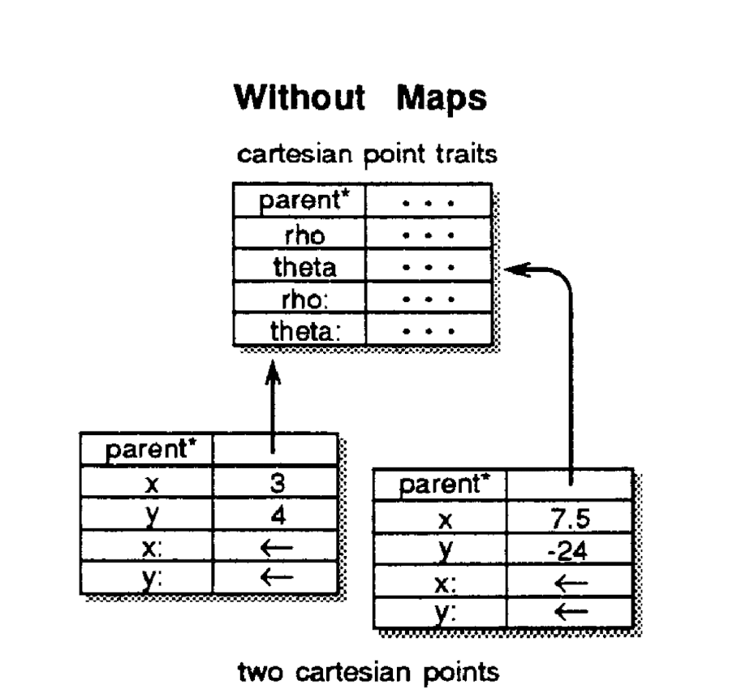
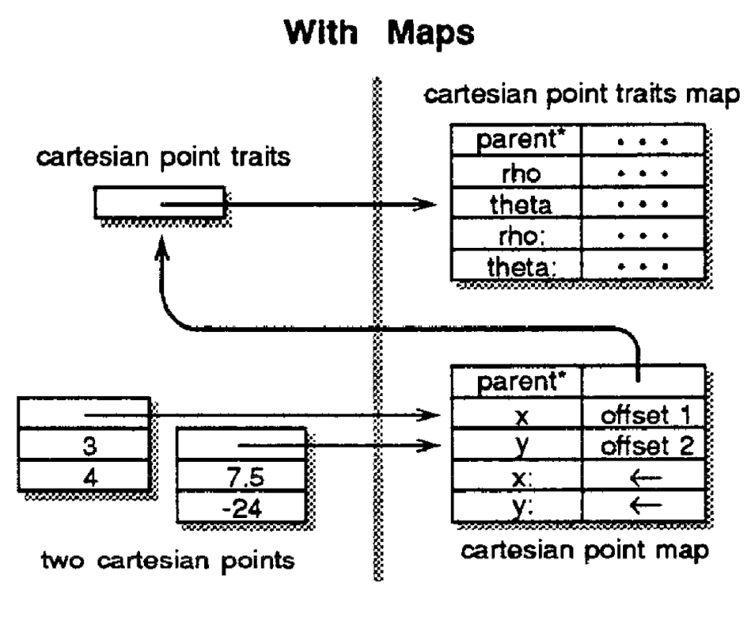

+++
title = "An Efficient Implementation of SELF"

[extra]
bio = """
  Alice is an M.Eng student studying Computer Science. She is broadly interested in compilers, systems and algorithm design.

  Benny is a Junior studying Computer Science. He is interested in networking and operating systems.

  Collin is a first year CS PhD student at Cornell. He is interested in security and privacy.
"""
[[extra.authors]]
name = "Benny Rubin"
[[extra.authors]]
name = "Collin Zhang"
[[extra.authors]]
name = "Alice Sze"
+++

SELF was a pioneer langauge in the development of Dynamic Languages and just-in-time (JIT) compilers. It is no surprise that the developers utilize interesting and fairly complex optimizations to get their language to run as fast as static languages, despite their use of the prototype model instead of traditional classes and design choice that every operation is a message pass. 

## Language Design

In SELF, there is a disconnect between the behavior given to the programmer (message passing, slots, etc.) and how these objects are efficiently implemented in the compiler. This gives a clean semantics while compiling to fast and efficient code. In this section, we focus on the language design itself. 

Instead of constructing instances of classes (as in a familiar OO-language), all SELF objects are created by cloning a prototype and setting the original prototype to the parent. All fields of objects are implemented as slots (including the parent). When evaluating a message pass that corresponds to a field or method, all slots of the receiving object are searched, before recursively searching the parents. SELF contains different kinds of slots: parents, methods, data (read-only and mutable). SELF supports multiple inheritance, and allows for the funky ability to dynamically rewrite parent slots. This means that inheritance is dynamic can change at runtime.

Below is an example of a SELF object: 

<!-- 
 -->

<!-- 
 -->

In this example, point contains a single parent, a number of fields (data fields and method fields). One thing to note is that even the assignment operator for fields x and y of a cartesian point (and similarly for a polar point), are impemented as slots. As an example, imagine the rho message is passed to a cartesian point. After not finding the slot in the cartesian point it will look in the parent, and find rho. It will this clone this method, setting a special "self" slot to the cartesian point. Thus, when it looks for x and y it will find them with values 3 and 4 respectively, returning 5. 

## Language Implementation

In this section, we will peak behind the curtain at how SELF is implemented efficiently. 

### Maps

Maps are used to avoid storing redundant information for cloned objects. Cloning creates many duplicates of slots that are the same among members of the same family (same slot structure, modulo assignable slot values). All shared data is factored into a map object, so objects can be implemented simply as arrays with assignable data and a pointer to the map of its clone family. Below is an example of two cartesian points implemented without using a map:

<!-- 
 -->

<!-- 
 -->

And the implementation with maps: 

<!-- 
 -->

<!-- 
 -->

In this simple example, the assignable slots x and y, and the parent slots are implemented twice, which is factored out in the maps example. In a more complex object there could be a lot of read-only data and method/parent slots that are factored out. 

## Heap Scanning

Heap scanning is an operation the compiler needs to do often for a number of reasons: 
* Garbage Collection
* Object has to be moved
* GUI environment browser

The first design point in heap scanning is the segregation of memory into the byte array section and objects section. This avoids the classic problem of byte arrays looking like pointer objects. Now, we know when scanning the heap which slots are bytes and which are pointers. 

The second approach is the use of sentinels to efficiently check when the scanner has reached the end of the object space. Instead of checking if we have reached the end of the object space after every read, the SELF compiler adds a *sentinal* reference at the end of the object space that matches the scanning criteria. Thus, we only need to check for the sentinal on every matching reference instead of every word of memory.

Finally, a scanner often must find objects that *contain* a matching reference rather than the object itself. To efficiently implement this, the compiler begins every object with a *mark* word. Once the scanner finds a matching reference, it simply needs to scan backwards to find the mark word and find out what the object is. 

## Compiler Optimization
The authors faced these challenges while designing SELF. First, message-passing is expensive, and many optimizations during compilation are impossible without knowledge of the type, moreover, the language has to perform a virtual machine call for simple instructions.

To solve these challenges, the authors proposed these techniques. The first technique is to “automatically derive much of the type information statically specified in other type systems", which is actually the predecessor of JIT compilation nowadays. The authors also suggested customized compilation based on type prediction. Message inlining based on message splitting also helped a lot during the optimization, while primitive inlining further improves efficiency of primitive operations. It's interesting to observe that message passing is applied in other languages to implement dynamic features. For example, Objective-C is a dynamic object oriented language based on C, although C is static and doesn't have object oriented features. Objective-C uses the message passing style to implement these features, which shows that message passing is a powerful technique. 

Let's first talk about customized compilation. SELF first traces the execution of the program, and generates a customized version of code based on type information. With that information of type, the language runtime can eliminate the need for message passing.

Type prediction is an interesting technique based on a lot of heuristics of the program. For example, `less-than` implies that the type would be integer. In that case, the compiler will insert a integer branch into the code according to message splitting.

Message Splitting is the optimization the authors apply to handle the case when one variable can take several different types. In this case, the compiler will create one specific subroutine for each type, while eliminating the need for message passing during that subroutine.

When we know the type of a variable, one optimization we can take is primitive inlining. Primitive operations are expensive because primitive operation often requires "calls to primitive operations are normally implemented using a simple procedure call to an external function in the virtual machine." When we know the type of the variable, we know how to handle the operations so that we don't have to pass the message to the virtual machine.

With these optimizations, the authors are able to eliminate a lot of overhead produced by dynamic features of the languages. The evaluation of the language is discuess below.

## Performance and Evaluation

The authors compared the performance of SELF with the fastest Smalltalk implementation available and with the standard Sun optimizing C compiler. The Stanford integer benchmarks and the Richards operating system simulation benchmarks were transliterated from C to SELF, SELF' (rewritten in a more SELFish programming style) and Smalltalk. The figure below shows the ratios of the running times of the benchmarks for the given pair of systems.

<!-- 
 -->

<!-- 
 -->

SELF outperforms Smalltalk on every benchmark by about a factor of two, but is around four to five times slower than an optimizing C compiler. The authors attributed the relative slowness to the quality of the SELF compiler implementation, SELF's robust semantics (e.g. bounds-checking) and the lack of type information. While this is promising for those who want to have their dynamic languages and use them too, some concerns were voiced by the class over the evaluation methods. Firstly, it is unclear how the benchmarks were transliterated, e.g. by a human or a program, whether they were optimized. The fact that the authors improved on the original SELF transliterations to produce SELF' versions suggests that the Smalltalk benchmarks are "literal" translations that are less efficient, potentially putting Smalltalk at a disadvantage. More generally, this highlights the difficulty of using the same benchmarks across different languages. Secondly, real time is used instead of CPU time to measure the running time of Smalltalk, unlike C and SELF, because the two times are "practically identical". But if they are, then why not just use the CPU time for all of them? 

### Instructions per message sent
The authors proposed a new metric called *millions of messages per second (MiMS)* to compare the performance of object-oriented systems, analogous to the millions of instructions per second (MIPS) for processors. A message send here refers to invocations whose semantics include a dispatch. For SELF, this includes "instance variable" accesses but not "local variable" accesses. The *efficiency* of an object-oriented system is then inversely proportional to the number of instructions executed per message sent. While it is an interesting idea, it isn't clear whether these metrics could offer an apple-to-apple comparison with other languages that are less object- and message-oriented. For instance, even integers could be receivers in SELF, but not in most other languages. It is also ambiguous if inlined and replaced messages count as message sends.

## Conclusion
Although SELF did not become a mainstream programming language, we see its relevance in prototypal inheritance in JavaScript, the ability to change classes at run-time and the attribute dictionaries in Python. On a design philosophy level, this paper asks us to reconsider if we should build compilers around people people around compilers, or somewhere in the middle.

<blockquote>
Researchers seeking to improve performance should improve their compilers instead of compromising their languages.
</blockquote>
