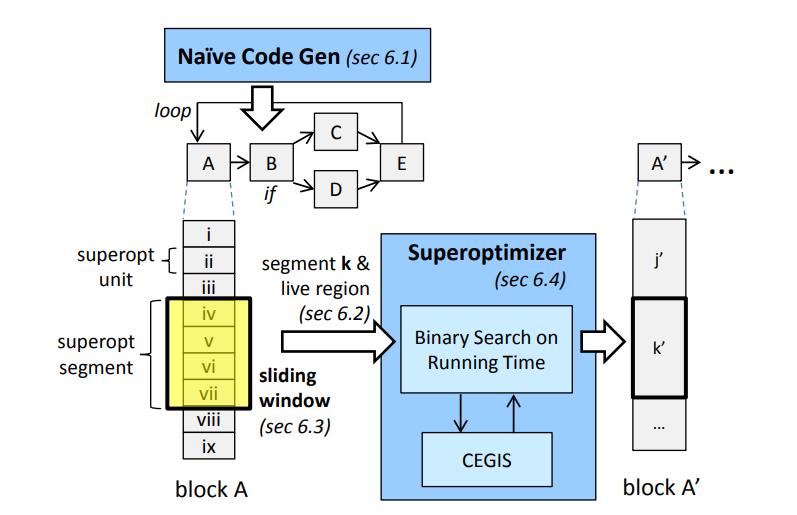
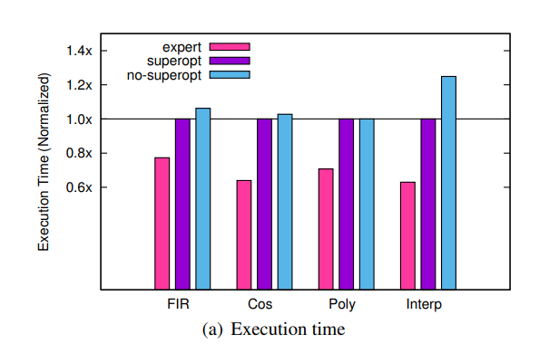

+++
title = "Chlorophyll: synthesis-aided compiler for low-power spatial architectures"
[extra]
bio = """
  Matthew Hofmann is a 2nd year Ph.D. student researching design automation for reconfigurable hardware.
  Yixiao Du is a 3rd year Ph.D. student researching hardware acceleration for graph processing and sparse linear algebra.
"""
[[extra.authors]]
name = "Matthew Hofmann"
[[extra.authors]]
name = "Yixiao Du"
+++

Chlorophyll is a synthesis-aided compiler that targets a spatial array of ultra-low power scalar cores. Chlorophyll takes a subset of C as input and maps the computation to the hardware in a process not unlike FPGA high-level synthesis. Each core of the GreenArrays GA144 is extremely barebones. They have their own proprietary ISA, it only has 64 18b words of memory, and the cores are not clocked synchronously. While the paper's compilation problem is posed around an extremely niche hardware architecture, the authors' contributions of modular superoptimization is deserving of a close look.

In this blog post, we will breakdown the subproblems of program synthesis and qualitatively judge how effective their synthesizer is at optimizing programs for spatial architectures. To summarize, the main two claims the authors make are (1) that the loss of QoR (quality of results) is worth the increased level of automation and (2) that modular superoptimization is effective enough at finding peephole optimizations like strength reduction and bit-hacks.

Full citation:
```
Phitchaya Mangpo Phothilimthana, Tikhon Jelvis, Rohin Shah, Nishant Totla, Sarah Chasins, and Rastislav Bodik. 2014. Chlorophyll: synthesis-aided compiler for low-power spatial architectures. SIGPLAN Not. 49, 6 (June 2014), 396–407. https://doi.org/10.1145/2666356.2594339
```

## Background

**Spatial Architecture** is a type of computer architecture where the computation is broken down into separate components that run in parallel, sharing intermediate results. The term "spatial" refers to the fact that the data flows from one location to another, rather than the traditional architecture where the data is stored in a single location and the computation is performed on it. Spatial architectures are also known as dataflow architectures.

**Stack-Based ISA** describes an instruction set architecture where the instructions can only access the top of a stack.
Eliminating the random addressablity of registers allows for a simpler and more power-efficient design.

**Type Inference** is the process of automatically deducing the types of expressions in a program. In this paper, the authors use type inference to infer the partitioning annotations of the input C code.

## The Architecture

The target architecture of the Chlorophyll compiler is the GA144 from GreenArrarys. It contains 144 F18A processor cores.
Each core only has 64 18b words of memory, and employs a stack-based ISA for lower power consumption.
The cores are layed out in a 8x18 mesh grid, where one core can only communicate with its neighbors.
Designed to be simple and low power, GA144 does not support any global synchronization mechanisms
such as locks and barriers that are common on an ordinary shared-memory multicore machine.

GA144's uniqie architecture greatly differ from traditional computers. Different tasks of a program are mapped to different cores
with explicit data movement pritimitives. During execution, the data flows from one location to another, hence the name of "spatial architecture" (aka. dataflow architecture).

## The Compiler

As stated before, Chlorophyll is a compiler for the GreenArrays GA144 chip with a frontend that can process a subset of C. In addition, the input C code can be annotated with '@' and '!' symbols to signify where a value originates from and where it is sent to, respectively. The paper provides the following example of partitioned code using their syntax:

```
int@0 mult(int@2 x, int@1 y)
{
  return (x!1 *@1 y)!0;
}
```

With just these modifications to C, the compiler has enough information to map the code to the spatial layout of the GreenArray chip. The compilation is broken down into the following steps:

1. Design Partitioning
    * In this step, the locations of the data and compute operations are inferred from the source program. Given some initial partitioning annotations, the compiler synthesizes the rest of the annotations as a type-inference problem. Every high level operation, variable read, and variable write is partitioned with a location index.
2. Placement
    * Given that the design is broken down into logical partitions, the compiler must then place these partitions to specific cores within the layout. The target architecture in this paper is an 8x18 grid of cores that each can communicate to their neighbors to the north, south, east, and west.
3. Code Separation
    * The purpose of a spatial architecture is to break the computation down into separate components that run in parallel, sharing intermediate results. Hence, the compiler needs to transform the source program into separate executables, one for each core. For each partition, code separation filters out the portions of code that are not relevant to it. For the segment of code that pertains to that partition, each variable use and assignment is converted into a `read()` and `send()` operation, respectively.
4. Code Generation
    * Finally, an initial version of machine code is generated for each partition. Then, the bulk of the synthesis-aided optimization occurs. The superoptimizer searches the entire space of instruction reorderings within the boundaries of `read()` and `send()` operations. Great effort went into scaling superoptimization for larger applications. In short, the authors split the machine code into segments and superoptimize along a sliding window.

## Modular Superoptimization

Chlorophyll uses an initial pass to generate machine code as a baseline. Then, the authors use an SMT solver to carry out all their superoptimization steps on a sliding window of instructions:

1. Load the optimizatin window up with enough segments from the input to fill the minimum size
2. Run the SMT solver.
    - Was a solution found? Emit the optimized output and go back to step #1 if there is more input.
    - If a solution is not found, pop the first segment from the window to the output and go to step #2.
    - If the solver times out, remove the last segment, place it back into the input, and go to step #2.
3. Use this loop until the input is empty.

Figure 3 has a more detailed diagram of the modular superoptimization loop operating on a CFG:



Program equivalence is encoded into the SMT formulas by tracking the encapsulating state of the program: the data stack, the call stack, data memory, and stack pointer. For a candidate optimization to be a solution, the live region of the stack must be equivalent (the authors elaborate what this means in section 6.1). As a result, the relaxed constraints do not require the entire core end state be equivalent, allowing the synthesizer to do its job.

## Evaluation

The superoptimization technique *does* show improvements over the initial code generation. However, the synthesis-aided compiler still does not meet the performance of the hand-optimized benchmarks:



In the single core benchmarks tested, the superoptimized program was still closer to initial code generation rather than the hand-written programs. In order to show a positive result, the authors needed to record results with synthetic benchmarks. They show that the superoptimizer can discover bit-twiddling optimizations, using examples from [Hacker's Delight](https://en.wikipedia.org/wiki/Hacker%27s_Delight). However, the time needed to compile is on the order of hours, and this is another shortcoming of the paper. The superoptimization time largely hinges on the program length, meaning the max segment size is another parameter that needs to be balanced.

The finite impulse response (FIR) benchmark is their best result, because the compiler is able to automatically parallelize the application to more cores. Judging by this case, it seems like the best use case for Chlorophyll is for applications which are embarrasingly parallel. This allows developers to quickly explore the sequential / parallel tradeoffs on PPA. For more sequential tasks that use fewer cores, the merits of this paper fall a bit flat. Finally, we want to note that the authors did not fully address the issue of placement and routing. Because each core can only communicate with its direct neighbor, we anticipate that the issue of design partitioning would overtake code optimization as the main compilation challenge for larger designs.

## Discussion

Overall, a lot of the novelty of this paper stems from the challenges in compiling to such a unique spatial architecture. The authors' methods are a vertical slice of everything you would need to automate in order to map a legacy language like C to a reconfigurable overlay. Even though the authors specifically target a GreenArrays chip, the compiler description is generic enough to be able to extract the theory out and compare it to modern high-level synthesis for FPGAs and ASICs. More elaborate high-level (HLS) synthesis compilers try not to lean on code annotations so much, support some C++ classes, and compile to a hardware netlist instead of binaries. If the reader is curious, we would recommend reading an intro to [high-level hardware synthesis](https://ieeexplore.ieee.org/document/6838614) or taking a look at [ECE6775](https://www.csl.cornell.edu/courses/ece6775/index.html).

As for their superoptimization technique, we think the problem formulation is too narrow to be useful. We think the very limited results are evidence that compiling to spatial architectures requires some higher-level reasoning other than peephole optimizations. By limiting the superoptimization to code segments within communication boundaries, there is are not many ways for the compiler to parallelize the computation. As long as communication across the chip is held constant, that heavily constains the types of optimizations that can be found.

In any case, the paper still has value in demonstrating how to create a optimizing compiler for novel architectures. As the authors state, the main contribution of the paper is to show how simple program synthesis can be and still be useful. While such a method will not produce the highest performing compilers, this paper demonstrates the value of program synthesis as a quick way to 'kickstart' the evaluation of a new architecture.
