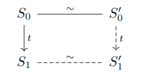

+++
title = "Verifying Software Systems: Theory and Practice"
[[extra.authors]]
name = "Zak Kent"
[[extra.authors]]
name = "Ali Farahbakhsh"
[[extra.authors]]
name = "Stephen Verderame"
[extra]
latex = true
bio = """
Ali Farahbakhsh is a 2nd-year Ph.D. student working on Distributed Systems.

Zak Kent is an undergraduate senior at Cornell interested in programming languages, architecture, and verification.

Stephen Verderame is an undergraduate senior/MEng student at Cornell interested 
in compilers and programming languages.
"""
+++

Welcome to our blog post on CompCert! CompCert is a verified compiler for C. We first explain the building blocks of CompCert, which are its notion of correctness and Coq. Then we introduce CompCert and explain how it operates in light of our knowledge of the building blocks.

## Semantic Preservation
At the basis of any verification project lies a notion of correctness.
Without such a notion, it simply is not possible to say anything meaningful.
CompCert is not an exception, and to understand and appreciate it, we need
to understand the underlying notion of correctness that CompCert designers have opted for.
However, before delving into CompCert, let us briefly talk about different notions of correctness.

The simplest notion of correctness that we can think of is the correctness of a single system.
Correctness for a single system usually falls into one of the following categories:
1. Producing the correct result.
2. Termination.
3. Not misbehaving during the execution.

Take as an example the famous problem of distributed systems, consensus.
Consensus is defined for a group of processes, each having an initial value,
and it requires all the processes to decide on a value.
Correctness for a system designed to achieve consensus usually has two aspects:
1. No two processes should decide on different values (no misbehavior).
2. All processes should eventually decide (termination).

Let us take a step back and provide an abstract view of what it means to verify a single system.
As we saw in the consensus example, we usually check whether the system satisfies some conditions.
Formally, such conditions are called *predicates*.
Therefore, verification starts with a set of predicates $P$ against which we will test our system, e.g., does the value of $x$ exceed 10, or do two different processes decide on different values, etc.
Given this set, assuming we denote our system with $S$, we can express the verification criterion as $\forall p\in P: S\vDash p$.
Note that this expression is by no means meaningful yet: what does it mean when we write $S\vDash p$?

We can see the importance of specifying the meaning of this expression by going through an example.
Let us assume that our system $S$ is a program that is supposed to receive a value $x$ as input, add 10 to it, and then return it.
The set of predicates $P$ has a single element in this case: whether the output is equal to $x+10$.
Now, to give meaning to $S\vDash p$, we can *model* $S$ as a function $S:X\rightarrow Y$ where $X$ and $Y$ are the input and output spaces.
We finally have everything we need! Verification of this system means verifying $\forall x\in X: S(x) = x + 10$.
This is the same as $\forall p\in P: S\vDash p$, and we have just specified the meaning.

Now let us turn our eyes towards a more complex scenario, one that also resembles compilers more.
Say we have two systems $S_1$ and $S_2$, and we want to verify whether these two systems are *similar*. Like correctness, similarity also requires a meaning, i.e., the correctness of the entire system translates to the meaning of similarity. So, how would we gauge similarity?
We have already seen the set of predicates $P$ as a way of expressing the *qualities* we desire a system to have. It seems natural to extend this to the similarity between two systems. That is, for a given predicate $p$, we can say that $S_1$ and $S_2$ behave similarly with respect to $p$ if we have $S_1\vDash p\Longleftrightarrow S_2\vDash p$. To generalize this to the entire set $P$ of our desired predicates, we can simply say $\forall p\in P: S_1\vDash p\Longleftrightarrow S_2\vDash p$. This expression tells us the meaning of $S_1$ and $S_2$ being similar, provided that we also give meaning to $S_1\vDash p$ and $S_2\vDash p$.

We are quite close to what it means to verify a compiler, but not there yet. What makes verifying a compiler strictly harder is the fact that a compiler is not just working on a single $S_1$, which would give us the compiled version of $S_1$ as $S_2$. Instead, it also quantifies *over* potential candidates for $S_1$. In other words, correctness for a compiler means that *for every* input program $S$, if we denote the compiled version as $C$, $S$ and $C$ should be similar. This quantification over potential input programs makes the task significantly more challenging.

One of the biggest challenges in this context is that we no longer have a single set of predicates $P$ that would make sense for all of the possible input programs. A compiler might receive programs coming from quite different domains like scientific computing and web applications.
While it might be possible to express everything in a holistic set $P$, such a set would be too big to contain useful information about specific programs. Moreover, requirements for some input programs might be in direct tension with those of others.

To bypass this issue, we have to think more deeply about a predicate. What is a predicate anyway? If we look closer at the predicates that we usually care for, we realize that our desired predicates are usually defined over the *behaviors* of a program (there exist more complex predicates, and we do not mention them for the sake of simplicity). For our purposes, we can think of a behavior as an execution trace of the program. Therefore, whatever a predicate is, we know that it is defined for behaviors, and for each behavior it either evaluates to true or false. This gives us a way out: what if instead of showing that $S$ and $C$ act the same way with respect to $P$, we just show that the behaviors of $S$ and $C$ are the same? This way, we know that whatever the actual desired $P$ is, $S$ and $C$ behave similarly with respect to $P$, since they always behave the same way. Finally, note that in the case of a compiler, what we care for is for the compiled version to behave like the source program, not the other way around. It therefore suffices that the set of behaviors for the compiled version is a subset of the set of behaviors for the source program.

We finally have the correctness criterion for a given compiler $COM$. We need to check whether $\forall S: \texttt{behaviors}(COM(S))\subseteq\texttt{behaviors}(S)$ holds. This is essentially the notion of correctness that CompCert has adopted, with a tiny twist that stems from a set-theoretic argument and not from the requirements of verification itself. Since CompCert only works on deterministic programs, there is a one-to-one correspondence between the behavior of $S$ given a specific input, and the behavior of $C$ given the same input. Thus, one can reverse the subset relation while retaining the verification semantics: $\forall S: \texttt{behaviors}(S)\subseteq\texttt{behaviors}(COM(S))$. For the sake of simplicity, we have omitted talking of limiting this only for source behaviors that are not wrong, since it is easy to see that practically speaking, we do not care what the compiled version does if the source program is already misbehaving.

## Coq

### Introduction

Thus far, we have discussed how one might verify systems like compilers at a theoretical level. Unfortunately, pencil and paper proofs are not suitable for verifying large, realistic software systems. Although such proofs may be useful to verify small, isolated components of a system, the large number of contributors to realistic projects makes end-to-end verification infeasible.

Fortunately, automated proof assistants allow you to write machine-checked proofs, eliminating the possibility of human error. Coq is one such theorem prover, and the one used to develop and verify CompCert. Conveniently, you can write proofs and code both within the same language (Gallina), and Coq's type checker will ensure that every proof is valid; that is, if Coq's type checker decides that a program is well-typed, then every proof is guaranteed to be valid.

## Curry-Howard

However, it is not immediately clear how you might write proofs and code in the same language; the type systems of many common programming languages are not expressive enough to express the semantics of higher-order logic, for example. To understand why this is possible, one first needs to shift their perspective to look at programs as proofs and types as propositions. This correlation is commonly known as the *Curry-Howard Correspondence*. From this view, a typing judgment $\Gamma \vdash e : \tau$ becomes the logical judgment that $e$ is a proof of proposition $\tau$. Common type constructors then also take on new meanings; for example, consider the type function type $P \to Q$. According to Curry-Howard, this corresponds to the logical implication that $P \implies Q$.

We also want to write propositions including quantifiers; what type can we construct that expresses this? For instance, how might one express a proposition like the reflexivity of equality as a type?

$$ \forall x \in \mathbb{N}, x = x $$

Even more expressive type systems, like that of OCaml, cannot express propositions like these. In fact, Coq's type system is strictly more powerful than most languages, being *dependently typed*. Dependent types are types that depend on terms (expressions), a fairly radical concept present in few programming languages. To gain some insight into what this implies, first consider parametric polymorphism, which allows types to be parameterized over other types. Dependent types subsume parametrically polymorphic types, allowing types to be parameterized over terms. Coq's type language expresses dependent types through the following construct:

$$ \mathsf{forall} \, (x : \tau_1), \tau_2 $$

Here, $\tau_1$ is a type and $\tau_2$ is another type that may mention $x$. If you squint, this is exactly a universal quantifier! We can now express the reflexivity of equality using this "forall" type:

$$ \mathsf{forall} \, (x : \mathsf{nat}), x = x $$

### Expressing Syntax and Semantics in Coq

The ability to express propositions within Coq's type system also allows one to express the semantics of a programming language in Coq. We'll demonstrate this by developing the syntax and small-step semantics for the CBN lambda calculus in Coq. To review, we describe the syntax of lambda calculus terms using the following BNF grammar:

$$ e ::= e_1 \ e_2 \ | \ \lambda x. \ e \ | \ x $$

A lambda term is either the application of two lambda terms, an abstraction, or a variable. It is fairly trivial to convert this into an inductively defined type in Coq.

```
Inductive Term : Type :=
  | App (e1 : Term) (e2 : Term)
  | Abs (x : string) (e : Term)
  | Var (x : string).
```

Now let's examine the small-step semantics for the CBN lambda calculus.


First note that a judgment that $e_1$ steps to $e_2$ is simply a proposition stating that $e_1$ and $e_$ are related by the small-step relation. With this in mind, we can translate these into an *inductively defined proposition* in Coq, including a case for both rules in the semantics.

```
Inductive Step : Term -> Term -> Prop :=
  | StepLeft : 
      forall e1 e1' e2, 
        Step e1 e1' -> Step (App e1 e2) (App e1' e2)
  | Reduce :
      forall x e1 e2,
        Step (App (Abs x e1) e2) (subst e1 e2).
```

Here, the kind of `Step`, `Term -> Term -> Prop`, indicates that `Step` relates two terms. The `StepLeft` constructor corresponds to rule (1) in the semantics, while `Reduce` corresponds to rule 2. This is similar to how CompCert defines the syntax and semantics for its many intermediate representations, but of course at a much smaller scale.


## CompCert

With the building blocks of CompCert out of the way, we can begin to
examine the main contributions of the paper. When CompCert generates
a program, we are assured that the "not wrong" behaviors of the generated
machine code are a subset of the "not wrong" behaviors of the source program.
This is proved via *semantic preservation*, which, informally, means the
generated machine code behaves in a way that adheres to the semantics of the
source program.

To achieve this, the compiler progressively lowers the source program
through many different IRs (11, as of 2018). 


Each IR can be thought of as the target for a transformation or optimization that 
changes the IR structure. As such, the differences between IRs are often small.
CompCert uses this technique to aid in proving semantic preservation, but you
could imagine using this approach in unverified compilers as well.

For example, we could imagine splitting BRIL into two IRs, one in SSA form
and one in non-SSA form. Then any pass that requires SSA could easily check 
that its input is in SSA form by checking that it's running on the 
correct IR. If we implement our passes in a
statically typed language, this check could occur at compile time by
representing the two IRs with different types. 
The downside in this example
is that there can be a lot of redundancy between the IRs, which
could lead to code duplication in the implementation of our passes. 
In general, such an approach also inherently
adds some complexity since developers would need to learn multiple IRs and know
their differences.

### CompCert Pipeline

Let's examine a few stages in the CompCert pipeline, starting with CLight. 
CLight is the source language for CompCert. As of today, it consists of 
practically everything in C99 except `setjmp`, `longjmp` and variable-length arrays.
Note that more features are supported now since the paper was published such as
`goto` and unconstrained switches (such as Duff's Device). One notable difference
from C is that CLight has explicit numeric sizes such as `i16`, `i32`, and `f32`
instead of C's unspecified `short`, `long`, `int`, and `double`. Furthermore,
CLight expressions must not have side effects. For example, the expression
`1 + f(x)` would have to be written as `temp = f(x); 1 + temp`.


CLight is represented internally as an AST that is constructed by CompCert's
parser generated from [Menhir](https://gallium.inria.fr/~fpottier/menhir/). 
The parser was previously unverified, but that changed in 2014.

The next stage in the pipeline is to translate the CLight AST to the next IR,
C#Minor. The difference between C#Minor and CLight is small: C#Minor just
introduces explicitly typed operators. For example, instead of a single division
operator, there are separate division operators for signed integers,
unsigned integers, and floats. C#Minor also transforms all loops into 
infinite loops with explicit loop exits.


Skipping ahead a bit, let's next take a look at RTL. RTL is an IR represented
as a CFG over instructions. CompCert's CFGs do not use basic blocks because
it makes verification easier without hurting performance by much.
RTL consists of target-specific machine instructions
operating over an infinite supply of abstract registers (known as *pseudo-registers*).
RTL is just a CFG representation of CMinorSel, the target IR of instruction selection.


Register allocation is performed on RTL, which transforms RTL into LTL,
an IR that is exactly like RTL except it uses concrete architectural registers.
LTL is also represented as a CFG, and the transformation between LTL and LTLin
just converts the CFG representation to a representation as a list of instructions.

Skipping ahead one more time, we arrive at Mach, short for "machine" as in
"machine instructions". From here, the compiler will print out the assembly
instructions and use an external assembler and linker to construct the
final binary. Previously, this part of CompCert was completely unverified,
however, today a tool called [Valex](https://www.absint.com/factsheets/factsheet_valex_ppc_web.pdf)
can be used to examine the compiled binary and verify that the actual machine 
instructions match up with the final Mach representation.

### Verification Strategy

The main way CompCert proves semantic preservation is by proving it for
each IR transformation. Suppose we have a source language $L$ and target language
$L'$ and program $P$ in the source language which transforms to $P'$ in the 
target language. Recall what we want to show is that
$$\forall B \not \in \text{WRONG}, P \downarrow B \Rightarrow P' \downarrow B$$

We'll show this with a proof by induction by showing that
every program state in $P$ has a corresponding program state in $P'$.
First, define an equivalence
relation $\sim$ such that initial state $S_0$ of $P$ relates to initial
state $S_0'$ for $P'$ and final states of $P$ related to final states
of $P'$. This gives us the base case $S_0 \sim S_0'$.

For the inductive case, assume an arbitrary state $S_0$ of $P$ relates to
$S_0'$ of $P$.


Then suppose that $S_0$ small-steps to a state $S_1$ via the trace $t$, denoted $S_0 \rightarrow_t S_1$. The trace
is a trace of *observable behaviors* such as system calls and reads/writes to
volatile variables.


So what we want to show is that $\exists S_1'$ such that 
$S_0' \rightarrow_t S_1' \land S_1 \sim S_1'$. 



If we can show such a $S_1'$ exists
then by induction, the only way to end up in a final state $S_n'$ is to take
a series of transitions from $S_0'$ that matches up to a series of transitions
from $S_0$ to the corresponding state $S_n$. The transitions must also have 
the same trace of observable behaviors.

There is a problem though, in general, this approach is too strict.
A transformation like dead code elimination might remove transitions 
from $P$, and a transformation like register-spilling might add new
transitions to $P'$ that weren't present in $P$. So what we need to
show is that 
$$\exists S_1', S_0' \rightarrow_t S_1' \land S_1 \sim S_1'$$
or $S_0'$ steps to $S_1'$ with an observable trace $t$ in one or more transitions:
$$\exists S_1', S_0' \rightarrow_t^+ S_1' \land S_1 \sim S_1'$$


or $S_1$ relates to $S_0'$, so long as $S_1$ is "making progress" over $S_0$
$$S_0' \sim S_1 \land |S_1| < |S_0|$$


Using this method, we can show that a given IR transformation
preserves semantics from the source to the target IR. Then by
transitivity, we can compose these proofs to show that the
semantics of CLight are preserved during the series
of transformations that lower it down to Mach.

### Trust

When using CompCert, the formal guarantees do rely on trusting a few things

1. The external C preprocessor being used
2. Coq's Trusted Computing Base
3. CompCert's formalized proof statements
4. **YOUR CODE**

Regarding 2, Coq itself isn't entirely verified. It relies on a base of
unverified code known as its trusted computing base. This includes
things like the extraction of the implementation parts of the Coq code 
to OCaml. This also implies you're trusting the (unverified) OCaml compiler.
A bit of a chicken-and-the-egg problem here. This is kind of the nature
of most verified code today. For example, if you use an SMT solver, you're
trusting the solver, and by extension, the compiler that compiled the
solver.

Regarding 3, Coq can only tell you if your proof is correct, it can't
tell you if you proved the thing you intended to prove. For example,
consider trying to formalize what it means for a sorting algorithm to be
correct. The first thing that might come to mind would be to say that
a sorting algorithm is a function that takes a list, $l$ of length $n$ and returns
another list, $l'$ of length $n$ such that $l_i' < l_{i + 1}'$ and 
$\forall e \in l', e \in l$. However, this definition would say that an algorithm 
that just repeats the first element of $l$, $n$ times 
would be a "correct sorting algorithm."

Finally, regarding 4, all of the proofs assume that the source
program does not have any "wrong" behaviors. These would be many 
undefined behaviors according to the C specification such as division by 0.
This makes sense once you think about it, CompCert is a compiler that just
assures you it doesn't break your code. It can't magically fix code that's
already broken.

Despite this, CompCert has shown very promising results regarding compiler bugs.
Compiler bugs have been found in CompCert, but only in previously unverified
parts of the pipeline or in the formalizations of IR semantics. 
[CSmith](https://users.cs.utah.edu/~regehr/papers/pldi11-preprint.pdf),
a successful C compiler fuzzer was only able to find about 8 bugs in
CompCert, compared to 79 and 202 in GCC and LLVM, respectively.
In particular, the authors note that "the striking thing about our CompCert 
results is that the middle-end bugs we found in all other compilers are absent"
and "the apparent un-breakability of CompCert supports a strong
argument that developing compiler optimizations within a proof framework [...]
has tangible benefits for compiler users."

### CompCert in the Wild

CompCert has seen some industry successes, in particular being used by Airbus
in France and MTU Friedrichshafen in Germany. One barrier to adoption is that
many companies have already built their own proprietary verification
tools. Even CompCert itself was proprietary for quite some time,
only recently becoming open source but still requiring a license to use
commercially.

In the US, at least for the aviation industry, it does not appear that
CompCert can be used for safety-critical software development, simply
because it would need to go through a US certification process, although
I'd imagine it has already gone through something similar to be cleared
for use in France and Germany.

But even so, a verified compiler is not a panacea. CompCert would
only help with source-to-object code traceability, which many teams
currently handle by disabling or severely limiting optimizations and 
performing manual reviews of the object code (with the help of tools).
Developers would still need to hit the same instruction coverage targets
on their target architecture since CompCert can't show the code won't
trigger some issue in the hardware, and perform the laborious verification
of their own code.

Being a C compiler, CompCert also isn't helpful for projects in other languages.
While C is a popular language in the safety-critical software industry,
it is not the only one in use. Some teams value object-oriented features 
and opt for languages like C++ instead.

Although verifying a language people already use is probably
an effective way of gaining a large user base, it's also somewhat
unfortunate that a more modern language that makes it easier to write code
without any "wrong" behaviors couldn't have been verified. Perhaps a new
language could have been designed with a verified compiler in mind.

The upside to this is that CompCert has laid the groundwork by
verifying optimizations that likely aren't going anywhere anytime soon
such as register allocation, redundancy elimination, dead code
elimination, and constant propagation. Any future verified languages
could theoretically reuse CompCert's IRs and verified transformations.

### Runtime Performance

Speaking of optimizations, CompCert is somewhat competitive
to `gcc -O1` and generates significantly faster code than `gcc -O0`.
CompCert doesn't generate the most optimized code, but it's better than nothing.
Optimizations are typically hard to use in safety-critical settings
because it becomes more difficult to trace the generated object code to the
written source code. This traceability is necessary to make sure the compiler
didn't generate something incorrect. So it's likely that CompCert provides
more optimizations with much less developer effort than previous methods
