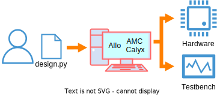

+++
title = "Frontend Integration for Accelerator Memory Compiler"
[extra]
bio = """
  Matthew Hofmann is a 2nd year Ph.D. student researching design automation for reconfigurable hardware.<br>
  Yixiao Du is a 3rd year Ph.D. student researching hardware acceleration for graph processing and sparse linear algebra.
"""
[[extra.authors]]
name = "Matthew Hofmann"
[[extra.authors]]
name = "Yixiao Du"
+++

## Introduction

For our final course project, we have integrated our HLS (high-level sythesis) compiler, AMC, with a Python frontend, called HCL. In the end, we are able to compile and simulate custom hardware designs with extremely concise design descriptions and short compile times. As a consequence, we greatly reduce the design effort required for new accelerators as well as offer a convenient tool for functional verification. In this report, we walk through an example design with our tool flow, offer insight into how the underlying compiler works, and finally evaluate some benchmarks with latency and resource utilization measurements.
<center>

</center>

### Hardware Accelerators

When CPU and GPU optimizations have been exhausted, custom hardware accelerators are the main option for improving the performance and energy efficiency of compute intensive applications. However, the design effort required to create a new accelerator is often too high for the average programmer. This is because the design process requires a deep understanding of the underlying hardware architecture, how it can be used, and how the CAD tools behave. For example, the designer must understand how to map their algorithm to the floorplan of the hardware and how to optimize for the functional units present in architecture (e.g., LUTs, DSPs on FPGAs). Of course, debugging is its own challenge when designing hardware. Finally, the designer also needs to battle with inadequate vendor tools, which are used to synthesize the hardware description language (HDL) and run behavioral and cycle-accurate simulations. In the end, the accelerator designer must be an expert in a very tall stack of technologies, spanning both hardware and software. As a result, bringing up a new accelerator is a slow, tedious, and typically expensive process.

### High-Level Synthesis

High-Level Synthesis (HLS) is one such solution to solve the problem of hardware design productivity. The general idea is to raise the level of abstraction from the commonly-used register transfer level (RTL) (e.g., Verilog) to a higher-level language like C/C++. This allows the designer to focus more at the algorithm level and less on the hardware details, such as interfaces and timing. The "magic" of HLS compilers is that it can infer a gate-level mapping from the high-level language to the underlying hardware. The main steps of generating this mapping are scheduling, resource allocation, and binding. In the end, the outputted RTL code from HLS can be synthesized by downstream tools. However, current HLS tools greatly fall short in their promise to free designers from thinking at the architecture level. They rely on special directives (e.g., C++ pragmas) from the designer to guide the optimization process. Oftentimes, the designer must even rewrite their code to fit the HLS compiler's model of computation.

### MLIR and Incubator Projects

Reinventing HLS with advanced compiler techniques is an active area of research. There are many outstanding HLS tools/frameworks such as [TAPA](https://tapa.readthedocs.io/en/release/overview/overview.html), [Dynamatic](https://dynamatic.epfl.ch/), and [HeteroCL](https://heterocl.csl.cornell.edu/). However, these tools are developed independently with different compilation flows, which brings difficulties of integrating them together. [MLIR](https://mlir.llvm.org/) is a new compiler design paradigm where the source language is compiled through multiple levels of modularized intermediate representations (IRs), also known as dialects. Dialects act like domain-specific languages (DSLs) and can capture the approprate details at each level of abstraction.

The [CIRCT](https://circt.llvm.org/) project expands the MLIR-based development methodology for hardware design. It represents key components of hardware as MLIR dialects such as finite state machines (FSM), pipelines, and interface handshaking. HeteroCL has been migrated to the MLIR ecosystem as a dialect, with a new Python frontend called HCL. HCL decouples the interactions between the algorithm, hardware optimizations, and backend targets to enable productive design and testing. Lastly, Accelerator Memory Compiler (AMC) is an MLIR dialect for representing memory architecture. Its expressiveness is able to capture common memory organization strategies such as partitioning, banking, and arbitration. AMC can be further lowered to Calyx, which is also integrated with the CIRCT ecosystem. Finally, the Calyx compiler gives us a pathway to synthesizable Verilog. The contribution of this project is that we integrated HCL with AMC to enable a Python frontend for AMC. This allows us to use HCL to describe the algorithm and AMC to describe the memory architecture. The resulting design can be compiled to Verilog and simulated with a single function call. In the end, we hope that this integration will enable a more productive design flow for hardware accelerators as well as help us find more bugs in AMC.

## Design Example

To use HCL with AMC, the designer only needs to write their kernel in Python. Then, then user can simply specify which Python function to build with the AMC backend. HCL will do the initial translation of the kernel AST into MLIR, along with some other high-level optimzations. Then, the AMC backend takes it the the rest of the way. Moreover, AMC acts as a drop-in replacement to the other backends in the HCL ecosystem, making functional testing and debugging seamless. In the far majority of cases, the [NumPy](https://numpy.org/) or the LLVM backend is suitable for use as a golden reference model. In this section, we walk through an example where we functionally verify a kernel built with AMC. Then, we will record some resource estimates and execution times.

Our illustrative example will be matrix multiplication. What would ordinarily be a cumbersome task when using the vendor tools, like [Vitis HLS](https://www.xilinx.com/products/design-tools/vitis/vitis-hls.html), becomes a simple, 5 minute exercise. First, we specify some inputs initialized to random values. Then, `build()` the accelerator. Finally, we call both the software and hardware simulations and check their outputs. Compared to a C/C++ based tool flow, the amount of boilerplate code and scripting is reduced to near zero. In the end, we can represent this application with only 18 lines of code:

```python
def test_amc():
    N = 16
    # Initialize 2 input matricies to random integers
    A = np.random.randint(0, 20, size=(N, N), dtype="int32")
    B = np.random.randint(0, 20, size=(N, N), dtype="int32")

    # Our kernel is just matrix multiplication
    # HCL provides a primitive for this
    def kernel(A: int32[N, N], B: int32[N, N]) -> int32[N, N]:
        return matmul(A, B)

    # Traverse the kernel AST
    # and create handle to Allo customizations
    s = customize(kernel)
    # Build the accelerator with AMC backend
    f = s.build(target="amc")
    # Run the software simulation by invoking directly
    np_out = kernel(A, B)
    # Now run the hardware simulation with AMC+Calyx
    hcl_out = f(A, B)
    np.testing.assert_array_equal(hcl_out, np_out)
```

Additionally, we can also get an approximation of how much FPGA resources this design uses. Simply call `.get_resource_estimates()` after building:

```python
    print(f.get_resource_estimates())
    # {
    #   "BRAM36": 1,
    #   "DSP": 3,
    #   "FF": 255,
    #   "LUT": 467,
    #   "LUTL": 467,
    #   "LUTM": 0,
    #   "cycles": 15016,
    #   "name": "kernel"
    # }
```

This uses [Vivado](https://www.xilinx.com/products/design-tools/vivado.html) RTL synthesis for Xilinx FPGAs, but it would only be a one-time effort to support other synthesis tools like [Yosys](https://yosyshq.net/yosys/). If functional errors arise, the AMC backend also offers some options to help with debugging. To better understand what is going on under the hood, the first step would be to dump the underlying intermediate representation in MLIR with `print(f.module)`.

```mlir
// print(f.module)
func.func @kernel(%arg0: memref<16x16xi32>, %arg1: memref<16x16xi32>) -> memref<16x16xi32> {
  %c0_i32 = arith.constant 0 : i32
  %alloc = memref.alloc() : memref<16x16xi32>
  affine.for %arg2 = 0 to 16 {
    affine.for %arg3 = 0 to 16 {
      affine.for %arg4 = 0 to 16 {
        %0 = affine.load %arg0[%arg2, %arg4] : memref<16x16xi32>
        %1 = affine.load %arg1[%arg4, %arg3] : memref<16x16xi32>
        %2 = affine.load %alloc[%arg2, %arg3] : memref<16x16xi32>
        %3 = arith.muli %0, %1 : i32
        %4 = arith.addi %2, %3 : i32
        affine.store %4, %alloc[%arg2, %arg3] : memref<16x16xi32>
      }
    }
  }
  return %alloc : memref<16x16xi32>
}
```

The above IR helps give insight into what program the AMC is actually attempting to compile. To debug at a lower level, we can inspect the IR at individual steps of the pass pipeline. For example, here is what this application would look like after AMC buffers are inserted:

```mlir
module {
  amc.memory @amcMemory0(!amc.static_port<16x16xi32, w, 1>, !amc.static_port<16x16xi32, rw, 1>) {
    %0 = amc.alloc : !amc.memref<16x16xi32>
    %1 = amc.create_port(%0 : !amc.memref<16x16xi32>) : !amc.static_port<16x16xi32, w, 1>
    %2 = amc.create_port(%0 : !amc.memref<16x16xi32>) : !amc.static_port<16x16xi32, rw, 1>
    amc.extern %1, %2 : !amc.static_port<16x16xi32, w, 1>, !amc.static_port<16x16xi32, rw, 1>
  }
  func.func @kernel(%arg0: memref<16x16xi32>, %arg1: memref<16x16xi32>, %arg2: memref<16x16xi32>) {
    %c0_i32 = arith.constant 0 : i32
    %0:2 = amc.inst @amcMemory0_inst of @amcMemory0
            : !amc.static_port<16x16xi32, w, 1>, !amc.static_port<16x16xi32, rw, 1>
    affine.for %arg3 = 0 to 16 {
      affine.for %arg4 = 0 to 16 {
        affine.for %arg5 = 0 to 16 {
          %1 = affine.load %arg0[%arg3, %arg5] : memref<16x16xi32>
          %2 = affine.load %arg1[%arg5, %arg4] : memref<16x16xi32>
          %3 = amc.affine_load %0#1[%arg3, %arg4] : !amc.static_port<16x16xi32, rw, 1>
          %4 = arith.muli %1, %2 : i32
          %5 = arith.addi %3, %4 : i32
          amc.affine_store %5, %0#1[%arg3, %arg4] : !amc.static_port<16x16xi32, rw, 1>
        } {hls.pipeline, hls.unroll = 1 : i64}
      } {hls.unroll = 1 : i64}
    } {hls.unroll = 1 : i64}
    affine.for %arg3 = 0 to 16 {
      affine.for %arg4 = 0 to 16 {
        %1 = amc.affine_load %0#1[%arg3, %arg4] : !amc.static_port<16x16xi32, rw, 1>
        affine.store %1, %arg2[%arg3, %arg4] : memref<16x16xi32>
      } {hls.bufferize, hls.pipeline, hls.unroll = 1 : i64}
    } {hls.unroll = 1 : i64}
    return
  }
}
```

For more information on the motivation behind AMC and the dialect itself, you can visit the [Andrew Butt's blog post](https://www.cs.cornell.edu/courses/cs6120/2022sp/blog/banked-memory-compiler-backend-in-mlir/) from last year. As a last resort when debugging, the AMC backend has a `.dump_vcd()` method which outputs the waveforms from the hardware simulation:

```python
    f.dump_vcd("waveform.vcd")
    # You can now take the debugging to your favorite waveform viewer
```

Writing other types of kernels is as easy as writing normal Python. For example, here are a couple of other kernels which are just a simple to get up and running:

```python
def fibonnaci(A: uint32[N]):
    A[0] = 1
    A[1] = 1
    for i in range(2, N):
        A[i] = A[i - 1] + A[i - 2]

def vadd(A: uint32[N], B: uint32[N]) -> uint32[N]:
    return A + B
```

Outside of what is shown here, the HCL DSL allows much more elaborate kernels and control over compute customizations, like loop tiling and reuse buffers. One again, you can get more information on HCL and its MLIR dialect by reading last years blog post by [Hongzheng Chen](https://www.cs.cornell.edu/courses/cs6120/2022sp/blog/hcl-mlir/).

To conclude, we hope this example demonstrates the usefulness of the HCL frontend for high-level hardware design and further development of the AMC HLS compiler. As far as we are aware, the only other frameworks using Python to drive FPGA high-level synthesis are [LeFlow](https://arxiv.org/abs/1807.05317) and [PyLog](https://ieeexplore.ieee.org/document/9591456). However, neither of these efforts are using a homebrewed HLS compiler like us.

## Tool flow

Under the hood, the HCL frontend is automating all the interactions with other tools, IRs, and frameworks. Nonetheless, understanding the interactions of each component is important to understanding the novelty in our approach.

<center>

</center>

The top row of dependencies are C++ codebases linked together as static libraries. We enter this library with input MLIR generated from HCL. On the backend, we emit Calyx which is lowered to Verilog by a separate [Calyx compiler](https://github.com/cucapra/calyx) that is written in Rust.

The HCL dialect and passes are primarily responsible for processing the customization directives of the HCL frontend. Then, AMC and CIRCT carry out the "traditional" steps of high-level synthesis: allocation, scheduling, and binding. Finally, the Calyx compiler generates the data paths and control logic for the scheduled program.

### Overview

### HCL
HCL leverages an algorithm-optimization decoupled paradigm, which means users can first define the algorithm in a high-level language and then optimize the program with various hardware customization techniques (i.e., schedule primitives). Back to the matmul example, without using the provided primitive, the code would look like this:

```python
def matmul(A: int32[16, 16], B: int32[16, 16]) -> int32[16, 16]:
    C: int32[16, 16] = 0
    for i, j, k in grid(16, 16, 16):
        C[i, j] += A[i, k] * B[k, j]
    return C
```

[This blog post](https://siboehm.com/articles/22/Fast-MMM-on-CPU) elaborates effective ways of optimizing matrix multiplication, which can be replicated in HCL. The key idea is to reorder and tile the loops for better data locality. The optimized loop ordering would be `i, k, j`.

This is just one example of compute customizations with HCL, and there are several other hardware customization primitives that will play to AMC's strengths. We believe that with some additional work the HCL frotnend can provides hints for AMC to better infer FIFO streams, partitioned arrays, and banked memories. Such memory customizations will allow for more elaborate parallelization schemes, and ultimately we expect speedups that will beat the commercial tools.

### AMC

AMC (Accelerator Memory Compiler) is an entirely new plane of intermediate representation dedicated to representing memory architecture. To explain the need for such a dialect, the current state of conventional high-level synthesis compilers must be understood. As a brief summary, current HLS tools lacks an expressive model of memory, and it takes great manual effort to unlock the power of spatial architectures. This is by and large a consequence of the chosen source language. Most HLS compilers have a C/C++ frontend and LLVM middle end. As a consequence, every HLS compiler also has a set of compiler directives (`#pragma`'s) to fill in the semantic gaps of compiling to spatial hardware. For example, there are pragmas for partitioning memories, instantiating FIFOs, loop pipelining, and much more. By not having first class constructs for these design elements, optimization becomes tightly-coupled with source rewrites and HLS falls flat on its promises of high productivity. For the interested reader, we think this [blog post](https://specbranch.com/posts/fpgas-what-happened/) helps explain the current state of the FPGA accelerators for outsiders.

Back to AMC, the custom dialect elaborates the *real* limiting resources of memory on spatial architectures: the ports. Each embedded block RAM on the FPGA has only two ports, and it takes an intelligent design methodology to utilize these memories in such a way that maximizes performance. AMC eliminates the guessing game by elaborating the description of the memory subsystem and optimizing it for the program at hand. To accompany the AMC dialect, we use [Calyx IR](https://calyxir.org/) to represent the control logic of the scheduled program. Here is a very simple program allocated with a high-level AMC memory:

```mlir
  amc.memory @amcMemory0(!amc.dynamic_port<256xi32, w>, !amc.dynamic_port<128xi32, r>, !amc.dynamic_port<128xi32, r>) {
    %0 = amc.alloc : !amc.memref<256xi32>
    %1 = amc.create_port(%0 : !amc.memref<256xi32>) : !amc.dynamic_port<256xi32, w>
    %2 = amc.create_port(%0 : !amc.memref<256xi32>) : !amc.dynamic_port<256xi32, r>
    amc.extern %1, %2, %2 : !amc.dynamic_port<256xi32, w>, !amc.dynamic_port<256xi32, r>, !amc.dynamic_port<256xi32, r>
  }
```

In the above snippet, AMC IR is being used to declare a simple memory interface. The body is the implementation of said memory. First, the definition starts with an `amc.alloc` operation which represents the memory banks themselves. Then, `amc.create_port` is used to create handles to ports on those banks. Finally, `amc.extern` exposes those ports in the memory interface. In this case, the port types are dynamic, meaing that they have non-static latency for every read/write request. This memory module is a very simple example. Given a more elaborate application, you can find very interesting interactions from the compositions of AMC operations not shown here (`amc.merge`, `amc.reshape`, `amc.arbiter`, ...).

The role of the AMC compiler is to take in a high-level description of memory organization (as seen above) and figure out how to best compile it to the target architecture. It accounts for some of the properties of underlying architecture, like BRAM size and port count. Moreover, AMC attempts to exploit the context in which the memory is being used for optimization. For example, suppose a 2D matrix is being accesssed along its columns. The compiler may bank the memory by the matrix's rows for higher throughput. Overall, the memory compilation is a very gradual lowering process, and the explanation of the whole pass pipeline won't fit in this post about the frontend. However, the following diagram may offer a rough idea of how the core MLIR and AMC dialects lower to Verilog:

<center>

</center>

## Results

In this section, we report the latency and resource measures of a select set of micro-benchmarks. By using small testcases, we have the best chance of understanding how the high-level constructs are being mapped to hardware and where the compiler inefficiencies lie. With that said, here are a table of benchmarks compiled with our toolflow versus Vitis C HLS.

**AMC**

| Benchmark     | Latency (Cycles) | LUTs | FFs | BRAM36s | DSPs |
| ------------- | ---------------- | ---- | --- | ------- | ---- |
| matmul16x16   | 15016            | 467  | 255 | 1       | 3    |
| spmv20x20     | 48               | 183  | 309 | 0       | 3    |
| vadd20        | 112              | 612  | 305 | 2       | 0    |
| fibonacci20   | 77               | 120  | 151 | 0       | 0    |

**Vitis 2022**

| Benchmark     | Latency (Cycles) | LUTs | FFs | BRAM36s | DSPs |
| ------------- | ---------------- | ---- | --- | ------- | ---- |
| matmul16x16   | 5409             | 221  | 74  | 0       | 3    |
| spmv20x20     | 42               | 249  | 145 | 0       | 3    |
| vadd20        | 22               | 81   | 13  | 0       | 3    |
| fibonacci20   | 41               | 226  | 50  | 0       | 0    |

**Difference: AMC - Vitis**

| Benchmark     | Latency (Cycles) | LUTs  | FFs    | BRAM36s | DSPs  |
| ------------- | ---------------- | ----- | ------ | ------- | ----- |
| matmul16x16   | +170%            | +110% | +240%  | -       | +0%   |
| spmv20x20     | +14%             | -26%  | +110%  | -       | +0%   |
| vadd20        | +410%            | +760% | +2200% | -       | -300% |
| fibonacci20   | +88%             | -47%  | +200%  | -       | -     |

The main story here is revealed when looking at the core MLIR dialects HCL is emitting after parsing the AST. Inefficiencies in how HCL infers data types and creates `affine.for` loop nests is creating way too many redundant memory operations. For example, HCL is not using store-to-load forwarding between loop iterations. Even worse, HCL tries to explicity infer data type conversions when using operations that change the data width (e.g. 32b + 32b = 33b). This for some reason is causing extra memory copy loops to convert an entire memory before it is used. We anticipate that fixing the HCL frontend to produce higher-quality loops will take some time, as it depends on some level of memory dependence analysis. Nonetheless, it will be a very important improvement to make in order to reach similar latencies as what Vitis can produce with C code.

## Future Work

Given that the focus of this project was primarily the software plumbing required to get things working end-to-end, there is still a lot of work needed to increase the quality of results. Right now, there are too many ways to accidentally create a slow design that has many redundant memory operations. Moreover, some designs just don't work, exposing bugs in our scheduling pass. Here is a list of features and fixes we intend to eventually implement:

- Fix how HCL constructs `affine.for` loops. Right now HCL is not using inter-iteration arguments, meaning the data flow between loop iterations is through memory reads and writes. This is much slower, because it artificially increases the II of the pipeline.
- Handle scalar values. HCL creates a memref cell to hold scalar values, and this once again limits performance. Every interaction with the variable is with loads and stores, instead of doing the proper SSA conversion.
- Fix scheduler bugs.
- Use HCL customization directives to assist AMC in inferring more efficient scratchpad memories. For example, array partitioning and memory access patterns are hints that HCL could provide to our allocation pass.

## Conclusion

The project was by and large a success, because we have achieved a much higher level of automation in evaluating the AMC+Calyx toolflow. Being able to write HLS kernels with `numpy` and run the RTL simulation as a normal function call greatly reduces the amount of effort in adding test cases. Moreover, the `.dump_vcd()` and `.get_resource_estimates()` provide more tools for debugging without having to manually interact with the synthesis tools. We are optimistic that having HCL as a frontend will accelerate the development of AMC.

Both HCL and AMC are ongoing developments that are not ready to be open sourced. However, [the HCL dialect](https://github.com/cornell-zhang/hcl-dialect), [CIRCT](https://github.com/llvm/circt), and [Calyx](https://github.com/cucapra/calyx) all have public GitHub repositories. Finally, we want to thank [Hongzheng](https://www.linkedin.com/in/hongzheng-chen/en) for helping familiarize us with his HCL work.