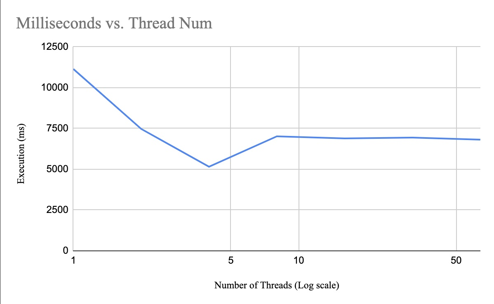

+++
title = "AsyncBril: Enhancing Bril with Asynchronous Programming"
[[extra.authors]]
name = "Andy He"
[[extra.authors]]
name = "Emily Wang"
[[extra.authors]]
name = "Evan Williams"
[extra]
bio="""
Andy He is a junior studying CS and Math. He is particularly interested in systems and compilers development. 

Emily Wang is an M.Eng student studying CS. She is very interested in systems, architecture, and compilers. 

Evan Williams is an M.Eng student studying CS. He is broadly interested in distributed systems and compilers. 
"""
+++
# AsyncBril: Enhancing Bril with Asynchronous Programming and Thread-Style Features
By Andy He, Emily Wang, and Evan Williams

## Overview and Motivation 

In the final lecture of CS 6120, we talked about concurrency and parallelism and 
the challenges they raise for compiler developers in the modern era of 
computing. In particular, we examined how the problem of semantics is 
inherently embedded in shared-memory multithreading and came across a key idea 
by Boehm: threads cannot be implemented as a library. 

The end of Moore's law indicates a need for parallelism to sustain advances 
in computing. Thus, our goal in this project was to implement asynchronous 
programming features for Bril. Modern programming languages rely heavily on 
asynchronous programming and multithreading to optimize performance and manage
complex tasks. We thought the best way to learn about how these features are 
implemented in real languages was to try it for ourselves. Further, Bril's 
easily extensible nature makes it ideal for experimentation. We thought that 
future CS 6120 students would benefit from being able to use our library to 
implement their own synchronization primitives and other asynchronous 
programming features using our extension. 


## Design and Implementation 

In this projet, we added two main features to Bril: promises and atomic 
primitive types (i.e. `atomicint`). Promises are a fundamental 
part of asynchronous programming. They allow the language to handle operations 
that might take an unknown amount of time to complete (like I/O operations) 
without blocking the execution of the rest of the program. Atomic operations are 
crucial for safe concurrency. They ensure that operations on shared data are 
completed as indivisible steps, preventing race conditions where multiple 
threads might try to modify the same data simultaneously.

To implement these new language features we directly modified the Rust 
interpreter for Bril: `brilirs`. We chose to implement the feature in Rust for 
a few reasons. First, the three of us are more experienced with Rust than we 
are with TypeScript, so it seemed the natural choice for us. Second, we wanted 
to take advantage of Rust's safe-concurrency features while implementing the 
asynchronous extensions, since concurrency can be tricky to reason about. 

We did not want to make major changes to the structure of `brilirs`, and wanted our changes to be as modular as possible, as to minimize the changes needed to extend `brilirs` in the future. A major goal of ours while designing and implementing this extension was that we wanted to ensure that future contributors did not have to understand our work to build features that do not require asynchronous programming. For instance, any type extension in Bril will automatically be supported by AsyncBril.

The heap is thread-unsafe, allowing multiple threads to concurrently read/write 
to the heap without checking. This is done using Rust `unsafe` blocks. 
Alternatively, we could've used a `Rw<T>` to lock/unlock the heap when threads 
were modifying it, but we ultimately decided that it would be more performant 
to not implement it this way and provide support for synchronization primitives,
allowing for more flexibility. 

Although the interpreter's heap is not thread safe, calls to `alloc` are still 
made atomically, so no thread can accidentally be assigned the same index 
in `state.heap.memory` when `alloc` is called simultaneously between threads. 

### Promises

We have introduced two critical syntax features to Bril: `Promise<T>` and 
`Resolve`, significantly enhancing its capabilities in threaded execution and
asynchronous programming. The core of this implementation lies in how threads 
are created and managed. Upon encountering a function defined with a 
`Promise<T>` return type, a thread is immediately started. This allows for 
concurrent function execution, enabling the language to handle complex, 
asynchronous tasks more effectively. These threads have local stack and global 
heap access, ensuring independent operation without interfering with each 
other's state. However, they also access a global heap, which is crucial for 
modifying pointers shared across threads.

Here's an example of how our notion of promises is implemented in Bril: 
```
@main {
  size: int = const 4;
  size2: bool = const false;
  prom: promise<int> = call @mod size;
  prom2: promise<bool> = call @mod2 size2;
  x : int = resolve prom;
  y : bool = resolve prom2;
  print x;
  print y;
}

@mod(r: int): promise<int> {
  ret r;
}

@mod2(r: bool): promise<bool> {
  ret r;
}
```

This Bril program exemplifies the newly implemented asynchronous features in 
the language, particularly demonstrating the use of `Promise<T>` and the 
`Resolve` mechanism. In the `@main` function, two promises are created: `prom`
and `prom2`. The `prom` is a promise of an integer (`promise<int>`) and is 
assigned the result of calling the `@mod` function with an integer argument 
(`size`). Similarly, `prom2` is a promise of a boolean (`promise<bool>`) and is 
linked to the outcome of the `@mod2` function, which is called with a 
boolean argument (`size2`).

These promises, once initialized, signify the start of asynchronous operations. 
The `@mod` and `@mod2` functions, defined with return types `promise<int>` and 
`promise<bool>` respectively, indicate that the function will be execute 
asynchronously. Each function simply returns the passed argument, but in a 
real-world scenario, these could represent more complex operations executed in 
separate threads.

The use of the resolve keyword in the `@main` function is critical. `resolve` 
is blocking and waits for the promise to be resolved to a value, synchronizes 
the asynchronous function calls. The variables `x` and `y` are assigned the 
resolved values of `prom` and `prom2`, respectively. The print statements at the 
end of the `@main` function display these resolved values, showcasing how 
asynchronous tasks can be integrated into the main flow of a Bril program.

The `Resolve` feature, synchronized with the promise mechanism, is instrumental 
in managing the life cycle of asynchronous operations. It allows threads to 
signal the completion of tasks and communicate results back to the main 
execution flow. 

Unresolved promises are automatically cleaned up when they go out of scope. This 
is implemented through an atomic flag which indicates to all sub-threads to clean 
up all resources used and abort. However, as this may cause undefined behavior
when interacting with the global heap, a warning is printed to indicate that a 
promise was left unresolved. In general, all promises should be resolved. 

The introduction of these asynchronous capabilities necessitated a medium-sized 
refactor of the `brilirs` interpreter, including parameterizing the types of 
State to accommodate the new features. A significant enhancement is the use of
atomics in the Rust interpreter. The atomics ensure a consistent and thread-safe 
mechanism to increment the dynamic count across all threads, which is crucial 
for tracking and managing active threads. Overall, this implementation not only 
enriches Bril with robust asynchronous programming and safe concurrency 
management but also significantly extends its utility as a tool for learning 
and experimenting with compiler design and parallel computing concepts.


### Atomics 

In the context of Bril, atomic primitives provide a way to perform certain 
operations on integers in a way that is guaranteed to be atomic, meaning that 
the operations are indivisible. This atomicity is crucial in multi-threaded 
environments to prevent race conditions. Race conditions occur when two or more 
threads access shared data and try to change it simultaneously. If one thread's 
operations interleave with another's in an uncontrolled manner, it can lead to 
inconsistent or unpredictable results. Atomics prevent this by ensuring that 
operations like incrementing a value, setting it, or comparing and swapping it 
happen as a single, uninterruptible step.

A particularly powerful application of atomic primitives is in implementing 
mutexes (mutual exclusion locks). Mutexes are a foundational concept in 
concurrent programming, used to prevent multiple threads from accessing a 
critical section of code simultaneously. By using atomic primitives to implement 
mutexes, you can ensure that only one thread can enter a critical section at a 
time, thereby protecting shared resources from concurrent access.

In a typical mutex implementation using atomics, an atomic variable is used as 
a lock flag. Before a thread enters a critical section, it uses atomic 
operations to check and set this flag. If the flag indicates that the mutex 
is already locked, the thread will wait (or "spin") until the flag changes. 
This is often implemented using a compare-and-swap atomic operation, where the 
flag is only set if it is currently in the expected unlocked state. Once the 
thread has finished executing the critical section, it uses another atomic 
operation to set the lock flag back to its unlocked state.

Here's an example of how atomics work in Bril:
```
@main {
  one : int = const 1;
  size : atomicint = newatomic one;
  expect : int = const 1;
  upd : int = const 2;
  res : int = cas size expect upd;

  three : int = const 3;
  res1 : int = loadatomic size;
  res2 : int = swapatomic size three;
  res3 : int = loadatomic size;
  print res;
  print res1;
  print res2;
  print res3;
}
```

In our Bril program, we demonstrate the use of atomic operations to manage a 
shared atomic integer. The program starts by initializing a regular integer 
`one` with a value of 1, which is then used to create an atomic integer `size` 
through the `newatomic` operation. The utilization of atomic integers is crucial 
in concurrent programming environments, as it ensures that the integer can be 
safely read and modified by multiple threads without causing race conditions.

We then perform a compare-and-swap (CAS) operation on the atomic integer `size`. 
This atomic action is essential for achieving synchronization in multi-threaded 
programs. The `cas` operation attempts to update `size` from its expected value 
(`expect`, which is 1) to a new value (`upd`, which is 2). The success of this 
operation, stored in `res`, hinges on whether the current value of `size` 
matches the expected value, ensuring that the update occurs only if `size` has 
not been altered by another thread. We print the result of this operation to 
reflect its success or failure.

Furthermore, we employ the `loadatomic` operation to safely read the current 
value of `size` into `res1`, ensuring a consistent and uncorrupted value. 
Following this, we use the `swapatomic` operation, which atomically swaps 
`size`'s value with `three` (3). The previous value of `size` is captured in 
`res2`. This swap operation is particularly useful for updating a shared 
variable while simultaneously retrieving its old value. Another `loadatomic` 
operation follows, storing the post-swap value of `size` in `res3`.

Finally, our program concludes by printing the results of these operations 
(`res`, `res1`, `res2`, and `res3`). This output showcases the effects of 
atomic operations on the shared atomic integer, providing a clear example of 
how atomics can be used to manage shared state in a concurrent environment 
without the need for complex and potentially cumbersome lock-based 
synchronization mechanisms.

Elaborating more on how our atomics can implement a mutex lock and allow threads
to concurrently modify an array, here is another useful code snippet: 
```
@acquire_lock(lock: atomicint) {
.loop:
  res: int = loadatomic lock; 
  one: int = const 1;
  eq: bool = eq one res;
  br eq .loop .acquire_lock;
.acquire_lock:
  upd: int = add res one;
  old: int = cas lock res upd;
  eq: bool = eq old res;
  br eq .end .loop;
  .end:
  ret;
}

@release_lock(lock: atomicint) {
  zero: int = const 0;
  val: int = swapatomic lock zero;
}
```

The `@acquire_lock` function tries to acquire a lock on a shared resource 
represented by `lock`, an atomic integer. The function first loads the current 
value of `lock` atomically, and then loops to keep retrying to acquire the lock 
if it's already being used by another thread. To attempt to acquire the lock, a
Compare-and-Swap (CAS) operation is used. 

The `@release_lock` function releases the lock. It sets the lock to `0` using 
an atomic swap operation, indicating that the lock is free. The use of atomic 
operations ensures that these lock acquire and release operations are 
thread-safe and prevent race conditions in concurrent environments. 

## Challenges 
The original implementation of `brilirs` was understandably not designed with 
multithreading in mind. As a result, we had to change some of the architecture 
of the data structures and main function headers. To simplify the design, 
`State` no longer has a parameterized lifetime, and instead uses an atomic 
reference counter, `Arc<T>`, to hold the program and environment. Further, to 
implement support for atomic ints, we needed a secondary state variable that
would all the instantiated atomics. We could not repurpose the heap for this, as 
`Value` needs to derive the `Copy` trait, but this is not supported for Rust 
`AtomicI64`. To remedy this, we added an additional data structure, modeled 
after `Heap`, to store all atomics.  

## Evaluation 

To evaluate our extension, we primarily focused on two key attributes: 
correctness and runtime. To evaluate the runtime gains from asynchronous 
programming, consider the following simple benchmark: we use a loop that just 
adds 1 to a variable. On the first thread it performs 2000000 iterations, on 
the second thread it performs 1000000, and so on and so forth. One good example
of when a benchmark like this would be used is in multiplying two large matrices
together. Below, we show the execution time in miliseconds against the number
of threads used in the task: 



We observe that from 1 thread to 5 threads, we see substantial performance 
improvements. This makes sense, as we are taking direct advantage of 
parallelization in our programs. From 5 threads to 50 threads however, there 
is actually a slight increase in the execution time. This also makes sense, 
as increased number of threads requires more careful resource allocation by 
the operating system. Since our implementation requires locks on the global
heap, more threads means more actors vying for the locked resources, 
causing a general slowdown in overall performance. 

To evaluate the correctness of our programs we noted that it is not particularly
useful to use pre-existing Bril benchmarks, as none of them are written with 
asynchronous features in mind. We instead took a different approach. We can look
at asynchronous Bril programs that are implemented *incorrectly* and then 
observe the behavior that is different from the expected behavior. In other 
words, concurrent array accesses with variables that are not atomic will lead
to undefined behavior. Likewise, when atomics are used correctly the result 
of the program is deterministic and predictable. This can easily be observed
by taking the Bril program above used to showcase atomics and removing the 
atomicity of the integer (i.e. make it an `int` instead of an `atomicint`). 
We quickly see why the atomics are necessary, and how it guarantees the 
correctness of the program. 

Overall evaluating asynchronous programming features can be challenging, but 
we believe that through our thorough testing within the interpreter and our 
Bril benchmarks that we have created a robust extension that can be used by 
many future Bril users. 

## Conclusion

Concurrent programming is hard to understand, and it is important to begin 
to understand how to implement concurrent programming features at the compilers 
level. As we noted at the start, threads cannot be implemented as a library - 
threading is inherently embedded into the semantics of the language. We gained 
a lot of experience in this project with asynchronous programming and 
concurrent programming features in Rust. Overall, we are excited to see this 
extension be used in future iterations of CS 6120, and hope that more students 
will build upon the work we've done to create many interesting optimizations
involving parallel programming in Bril. 
