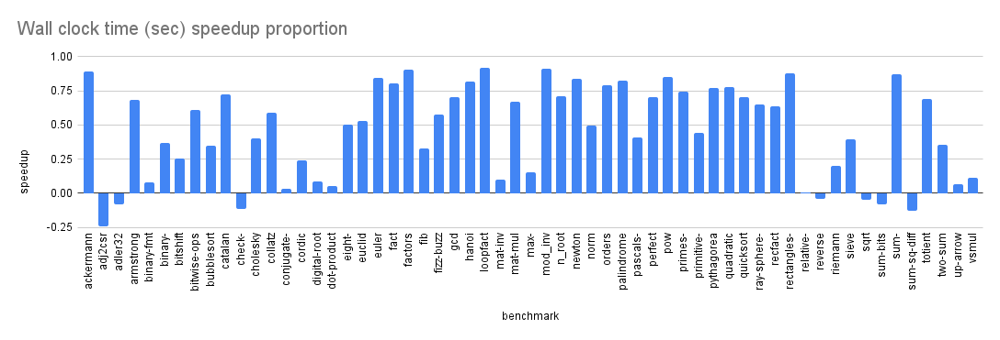

+++
title = "C++ Infrastructure for Bril"
[extra]
[[extra.authors]]
name = "Albert Xiao"
[[extra.authors]]
name = "Ryan Mao"
+++

# C++ Infrastructure for Bril

Albert Xiao & Ryan Mao

## Goal

Our primary aim was to enhance Bril's capabilities by incorporating a C++ interface, equipped with a parser, JSON printer, optimized types for instructions, and streamlined program flow mutations. The focus was squarely on performance, user-friendliness, and the potential to expand the Bril ecosystem with lightning-fast C++ optimizations.

## Overview

We already built a basic C++ interface for our use in the assignments and exercises throughout the course. For our final project, we used this interface as a starting point, and aimed to build off of it to create a successful framework for Bril. First and foremost, we identified critical areas of our interface for improvement: shortcomings in memory safety, performance, and user-friendliness. Our strategy was twofold: retain certain functional aspects while fundamentally revamping the framework to align with our objectives. This overview section talks briefly of our first few steps. The next section has deep dives into our most important and most interesting design decisions. The section after that covers challenges we faced. Then, we have an evaluation of the effectiveness of our framework, and finally future work.

Our initial phase involved a meticulous redesign of Bril's program types within our framework. We restructured our infrastructure around control flow graphs (CFG), because most optimizations operate at this level. This involved functionality to divide functions into basic blocks, and equipping program types with hooks to store analysis information for later optimization. We integrated data encapsulation into our types, in order to ensure memory safety and resistance to implementation changes. The biggest improvement on this aspect is the breakdown of the entire program into Basic Block class instances, and subsequently, interaction with the basic blocks are performed through the use of the class getter and setter functionality, which crucially maintain class invariants.

## Decision Decisions

In this section, we explain some of our design decisions and do a deep dive for each one into the architecture of our infrastructure.

### Homogenous Instructions

Our most interesting design choice was to use homogenous instruction types. Our base class `Instr` is constructed to represent any form of instruction—-be it `Value`, `Const`, or `Effect`—-of the current bril language and its extensions. This means each instruction in our system, regardless of its specific function, shares a common set of attributes: opcode, destination variable, type, functions used, constant literals, argument names, and label names.

We identified a few benefits of this approach to using inheritance as in our initial framework or a product type like a tagged union. Primarily, it streamlines operations involving frequently accessed fields like arguments and destination variables. There's no need for dynamic type checking—or branching at all—like with a tagged union or inheritance. Another major advantage is the class's usability. We can use C++ value semantics our instructions: we can copy, move, and destruct, free from the complexity of virtual dispatch or dynamic type checking. We can store all of our types into a packed array. We tried the tagged union approach for its similar usability benefit, but we found it challenging to debug problems, and access to information was non-homogenous.

### Designing an Efficient `Instr`

To make the homogenous approach feasible and efficient, we used an iterative process. We analyzed every instruction to determine the minimal necessary information for representation. The most demanding instruction by far was the `phi` instruction. It requires a destination name and type, a variable number of arguments, and a variable number of labels. In addition to these fields, our final class only has two additional fields: a function name and constant literal, to handle the `call` and `const` instructions. We identified that only one function name is needed since no instruction used more than one.

To maintain a compact and cache-friendly design, we used `LLVM`'s `SmallVector` instead of `std::vector` to represent our argument and label vectors. `SmallVector` stores a fixed number of elements inside the class before allocating to the heap like `std::vector`. Since most of these vectors are expected to have no more than two elements, `SmallVector` was the natural choice. With these changes our `Instr` base class is indeed compact; its fields only take up 72 bytes.

### Heterogenous Access of the Homogenous `Instr`

Although our base instructions are homogenous, we provide heterogenous access ot different instructions through subclassing and type punning.
Subclasses like `Value`, `Const`, and `Effect` publicly extend from `Instr` and provide a more specific interface. For example, the `Const` class gives specific access to the `lit` field, whereas direct access is disallowed from `Instr`. These subclasses are deisgned to be essentially "aliases"—they shouldn't have any additional fields. Their only purpose is to provide different ways to access the instruction.

These classes are accessed by type punning; the `Instr` pointer is downcasted safely with `bril::cast` (which has a debug-only assertion to make sure the operation is indeed that instruction type) or `bril::dyn_cast` (which behaves like C++'s `dynamic_cast` but uses our type system with opcodes). These two functions are ~~inspired~~ copied from LLVM and are safer and faster than C++'s `static_cast` and `dynamic_cast`. An extension to this that we not yet added is to add a `Phi` subclass, which will, for example, provide an interface to find the node corresponding to an argument or basic block.

**Note:** It's possible that this type punning invokes undefined behavior in C++. We haven't investigated thoroughly, but we don't think any C++ compiler would produce any unexpected code.

### String Pooling, Serial IDs, and Bitsets

To improve performance, one of our key strategies was implementing string pooling, assigning serial IDs to variables and basic blocks, and utilizing bitsets and arrays for analyses.

String pooling, similar to the concept in Java, involves storing only one copy of each distinct string. We created a `StringPool` class for this purpose. Its `canonicalize` method takes a string, stores it if it's new, and then returns a 32-bit integer reference to that string. For variables, we developed a similar system with the `VarPool` class. This setup allows us to assign unique serial IDs to variables and also provides functionality to handle SSA names. Basic blocks in our code are also given serial IDs.

Using serial IDs unlocks several optimization opportunities. For instance, we can represent mathematical sets of variables or basic blocks as bitsets—essentially, compact arrays of bits where each bit corresponds to a variable or block. This method is far more space-efficient than using traditional hashsets or hashmaps. It also simplifies the process, as accessing elements in bitsets or arrays is usually only one or two x86 instructions whereas an access to a hashset or hashmap involves hashing and probing, comparatively very expensive.

We envision almost every analysis or optimization will be able to use these data structures over their hash counterparts. Our implementation of dominator analysis, dominator tree, and dominator front (contained in `dom.cpp`) all extensively use bitsets as the dataflow values. For example, to implement the _dominated by_ dataflow equation $$\text{out}[n]=\{n\}\cup \left(\cap_{n'\prec n} \text{out}[n'] \right),$$
we use something similar to the following code:

```cpp
bool iter(uint32_t bb) {
    dynamic_bitset<> out(n_bbs);
    // computes {intersection of outs of predecessors}
    for (uint32_t pred : preds[bb])
        out &= outs[pred];
    // union with {n}
    out.set(bb);

    // compare against previous value
    if (out == outs[bb]) return false;
    outs[bb].swap(out);

    return true;
}
```

To implement the `live-variable` analysis dataflow equations $$\begin{align*}
\text{out}[n] &= \cup_{n'\succ n} \text{in}[n'] \\
\text{in}[n] &= (\text{out}[n]-\text{def}[n])\cup \text{use}[n],
\end{align*}$$
we have the following code:

```cpp
bool iter(uint32_t bb) {
    // compute out
    dynamic_bitset<> out(n_bbs);
    for (uint32_t succ : exits[bb])
        out |= ins[succ];

    // compute in
    dynamic_bitset<> in = uses[bb];
    in |= (out -= defs[n]);

    // compare against previous value
    if (in == ins[bb]) return false;
    ins[bb].swap(in);
    return true;
}
```

### Miscellaneous

There were many other design decisions that went into the project. For instance, to help with mutability of instruction order and the CFG, our basic blocks and instructions are stored in "intrusive" doubly-linked lists—where the base class stores the pointers itself instead of having separate nodes. For editing CFGs, we designed a helper for certain operations like adding basic blocks on edges.

After the foundational framework was set in place, we iteratively tested and enhanced its usability for implementing optimizations. We implemented a few trivial optimizations in order to evaluate the usability of our framework for implementing optimizations. By iteratively developing in this fashion, we were able to identify design issues and refine the final interface. For example, our initial design did not include information about predecessors for basic blocks, which we found to be annoying when interfacing with our framework.

## Challenges

The most demanding phase was establishing our foundational framework and planning for our improvements for the project. It required substantial time investment, especially in addressing all of the smaller issues and niche details. We frequently found that there were details that our initial plans did not cover, and we had to redesign our approach several times throughout the implementation process to accommodate for these issues. We have a deep dive into one of our first iterations and why it failed in the subsection.

Another critical challenge was striking a balance between the usability of our infrastructure and its optimization potential. The iterative process of testing and enhancing usability for implementing optimizations was very challenging, particularly because it was hard to view our framework from different perspectives to try and accommodate for different needs. Some of the implementation choices of our infrastructure were seemingly at odds with both of these goals; some design choices would be easier and more seamless to integrate with the functionality behind the scenes, but would be more difficult to interface with as a user, and vice versa.

### Data-Oriented Design?

When designing our infrastructure, we wanted to explore a completely data-oriented design. Data-oriented design is a design philosophy that involves thinking of programs as a pipeline of transformations on data. It focuses on how data is structured and accessed, whereas object-oriented programming emphasizes on ecapsulating data and behavior into objects. It is inherently performance-centric, and cache-friendly design thorugh special use of data structures is very common. In practice, this means identifying very common data transformations, and collecting the data required for that into a "struct of arrays" to make the most use of memory locality.

We wanted to explore data-oriented design because compilers are essentially a pipeline of transformations on data. Our initial design had instructions containing very little information: they did not contain arguments, labels, their constant literals, etc. These would instead be contained inside of packed arrays in the basic block class and the instructions would simply contain information about where their fields are within these arrays. We were excited by this design since it would mean a lot of analysis would be very fast: just traversing and operating over an array of integers. We had a design where each instruction took just 32 bytes.

We ultimately decided to not use this approach. It proved to be difficult and annoying to access information in this way. Modifications were near impossible; this design meant that program flow through a basic block would be immutable and had to be copied to be modified. We started on a transaction class to store operations to the instruction array that will commit them later, but this was extremely difficult to implement due to the edge cases involving insertion, deletion, and movement of instructions. We do believe that with more time our original approach could work, but it would be cumbersome to optimization writers to form a mental model about it and use.

## Evaluation

Like the Rust library, we implemented the brili command as a seamless replacements for the current implementation. Success was measured by ensuring these commands pass checks with valgrind and demonstrate comparable runtime performance to existing implementations. Ideally, we aimed to optimize these two programs within our framework to outperform all existing implementations.

For overall usability, we implemented part of partial redundancy elimination. We found that the optimization itself was too complicated, but we felt that our infrastructure was pretty decent to use. We didn’t really have a better way to evaluate this metric.

We found a few memory leaks with our final iteration but our program should still be memory safe.

For runtime performance, we ran the existing `brili` interpreter as well as our own interpreter against the core benchmarks in the course repo. We timed the wall clock runtime of both our interpreter and the existing interpreter over all benchmarks in the folder. We observe that the speedup proportion of our wall clock runtime versus the existing interpreter ranges from a mininum of -0.243 to a maximum of 0.919, with a mean of 0.463 and a standard deviation of 0.342 over the core benchmarks. Overall, we see mostly positive improvement in wall clock runtime over the existing implementation. .

## Future Work

### Unicode support for characters

Implementing Unicode support for characters within Bril would expand its capabilities and usability. Enabling the handling of a broader range of characters can enhance Bril's applicability in various scenarios and programming tasks where Unicode support is essential.

### Revisiting Data-Oriented Design Implementation & Exploring Further Data-Oriented Design for Brili

Despite the initial challenges, exploring data-oriented design remains an intriguing direction for improvement. There's potential in re-evaluating and refining the approach, seeking a balance between performance gains and usability. A reinvigorated exploration might yield insights to leverage memory locality and optimize data transformations more effectively.


### Write more optimizations

Continuing the development of optimization algorithms within the Brili framework is crucial. Admittedly, our testing on this aspect of the framework may have been a bit more lacking compared to the other areas, so expanding the repertoire of optimizations can significantly contribute to identifying areas of improvement, enhancing performance and showcasing the flexibility and efficiency of the infrastructure. Implementing more advanced optimization techniques can showcase the framework's adaptability to various scenarios.

### Refinement of Parsing Mechanism

Finally, improving the parsing mechanism by writing a custom lexer/recursive-descent parser would greatly enhance code readability and maintainability. Addressing the current unreadability in parsing code can streamline the development process and contribute to a more user-friendly interface for Bril.
