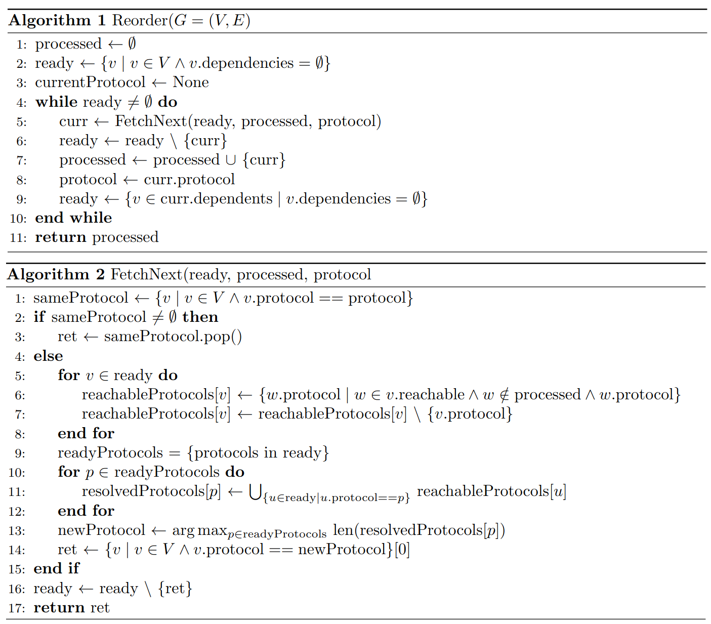
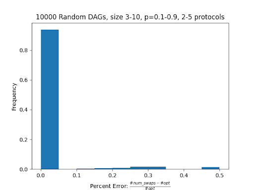
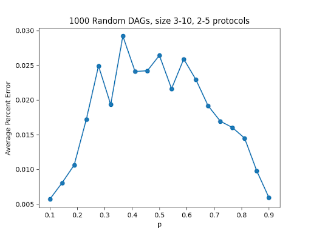

 +++
title = "Array IR for Mixed Cryptography"
[extra]
bio = """
  Vivian Ding is a fourth-year undergraduate studying Computer Science and Mathematics, interested in programming languages and program synthesis.

  William Wang is a fourth-year undergraduate studying Computer Science and Physics, interested in scientific computing.
"""
[[extra.authors]]
name = "Vivian Ding"
[[extra.authors]]
name = "William Wang"
+++

The goal of this project was to add features to [AIRduct](https://squera.github.io/fcs-pdf/dingFCS2023.pdf), the array-based IR for the [Viaduct](https://www.cs.cornell.edu/andru/papers/viaduct/viaduct-tr.pdf) compiler. Viaduct is a compiler which synthesizes secure, distributed programs employing an extensible suite of cryptography. It uses security specifications in the form of information flow labels to select cryptographic protocols that make the compiled program secure. In this project, we assumed this choice was made correctly, and focused on the IR.

AIRduct is unique in that it is an IR for a cryptographic compiler which is capable of representing programs which cannot be implemented as a single cryptographic circuit. This enables support for interactive programs and programs mixing multiple cryptographic back ends and local computation, which is useful for performance. AIRduct represents code employing multiple cryptographic mechanisms as structured control flow over calls to circuit functions. This allows for a separation of impure behavior (I/O) and control flow from pure cryptographic computation, which does not allow complex control flow. We use an array-based IR since this preserves useful structures upon which we can optimize computations.

**We made two contributions to AIRduct.** First, we added support for control flow, dramatically increasing the expressivity of the language. Second, we implemented a grouping optimization in order to reduce the number of calls to circuit functions per program. Grouping cryptographic computations together reduces the overhead of switching between execution of cryptographic and cleartext computation. It also exposes larger contiguous blocks of code to protocol backends, potentially enabling more aggressive optimization. 

We did not complete the proposed task of implementing optimizations for various protocol backends. 

# Control flow
We added three types of statements: `if`, infinite `loop`, and `break`. Implementation was quite straightforward, as anticipated. 

We decided that control flow instructions should be statements rather than expressions. This is because all expressions are associated with a protocol, but control flow must be executed outside of any cryptographic protocol. 

Implementing control flow required a slight change to how “blocks” (sequences of code delimited by curly braces) are represented in our AST. Previously, blocks were only used to represent function bodies, and therefore required that the last statement was always a `return`. We decided to introduce distinct notions of blocks for function bodies and control flow branches. This is because the invariant that each function contains a single unique `return` statement makes code generation far more straightforward, and doesn’t sacrifice expressivity. 

We evaluated this implementation using handwritten tests to ensure all branches through control flow are properly executed.

# Precircuit IR
We then implemented a “pre-circuit IR”. This is intended to be an updated version of the output of the original Viaduct project, which produces a program where each let-binding is annotated with the protocol that will execute it. This had to be implemented separately since AIRduct represents computations differently from the original Viaduct, being more array-based and having support for array operations.

The pre-circuit IR represents functions as a sequence of control flow statements and let-bindings. Circuits are not present in this IR. 

The pre-circuit IR is different from the circuit IR in that:
1. All let-bindings are annotated with a protocol. In the circuit IR, only let-bindings involving a “command” (input, output, and function/circuit calls) are annotated with protocols denoting where results are stored. Let-bindings involving computations occur within circuits, which are annotated with the associated protocol for all included statements. 
2. It includes downgrade nodes. These are explicit violations of secure information flow, such as declassifying secret data or endorsing untrusted values. It is necessary that downgrade instructions are preserved in the precircuit IR, since they enforce a secure ordering on computations.

# Grouping
The grouping procedure places statements of the same protocol together whenever possible. This will enable larger circuit blocks, reducing the overhead of communication between protocols.

This reordering is subject to data and security dependencies. Node `x` is a dependency of node `y` when:
- `x` defines data that is used by `y`,
- `x` is an `input` statement, and `y` an output,
- `x` is an `endorse` statement, and `y` an declassify, or
- `x` is an `output` statement, and `y` an input from the same host.

The first rule corresponds to data dependencies. The second and third rules hold because moving a statement which reveals information before one that commits to data violates security. The last rule preserves the user interface.

We decided to only reorder at top-level within blocks; that is, statements only get swapped if they exist at the same “depth.” For instance, consider the following code:
```
<A>
if (condition) {
	<B>
	<C>
}
```
Then `B` might be reordered with `C`, and the entire `if` block could be reordered with `A`. However, we choose not to allow reorderings where `B` or `C` may be lifted out of the block. This allows us to essentially ignore control dependencies, making reordering simpler.

The grouping procedure constructs a dependency graph for each block (a sequence of code enclosed with curly braces), where nodes are statements. For instance, given the above code, the procedure constructs a dependency graph containing `A` and the `if` statement, and another for `B` and `C`. Reordering occurs only within these two graphs. Notice that these graphs do not need to maintain control-flow information, so statements can be reordered strictly based on data and security dependencies.


We formalize the reordering task as the following problem. Given a directed acyclic graph $G = (V,E)$ where vertices are statements and edges are dependencies, and an assignment of protocols to nodes $p : V \to \mathbb{N}$, we aim to find a sorting $\pi$ of the nodes ($v_{\pi_1}, v_{\pi_2}, \dots, v_{\pi_n}$) such that:
- For all $e = (v_1, v_2) \in E$ (the execution of $v_2$ depends on $v_1$), $v_1$ is ordered before $v_2$
- The number of protocol changes within the sequence is minimized. For each consecutive $v_{\pi_i}, v_{\pi_j}$ in the sort, there is a change if $p(v_{\pi_i}) \neq p(v_{\pi_j})$.

We are unsure of the hardness of this problem. We (unsuccessfully) tried several reductions from NP-Complete problems, and have not yet proven that our polynomial-time algorithm produces an optimum result. This would be an interesting task to pursue in the future. We think the problem might be in P.

Our heuristic algorithm for reordering runs in polynomial time and is as follows:
<p align="center">
    
</p>


Nodes are defined to be “ready” when all their dependencies have been added to the set 	`processed`. Notice that since we aim to have maximally large contiguous swathes of instructions on the same protocol, the problem of picking which node to execute next is equivalent to picking which protocol to execute; once a protocol is chosen, we’ll execute all ready nodes which are associated with that protocol.

The idea behind this algorithm is that we “regret” choosing to execute vertex $v$ on a particular protocol $P$ at time $t$ when some descendant $v’$ of $v$ is on protocol $P$, but has a dependency $d$ which is on a different protocol $P_d$ and was ready at time $t$ — that is, we could have chosen to execute $d$ at time $t$. By choosing $v$ at time $t$, we are forced to pause execution on protocol $P$ and switch to $P_d$ to evaluate $d$ before returning to $P$ to execute $v’$. To minimize this “regret”, when we have a choice of which protocol to choose next, we try to choose one which will resolve the greatest number of dependencies on other protocols.

Reordering performs a topological sort of the nodes; the main portion of the algorithm is the heuristic to determine which is the next node to process (`FetchNext`). 

If we are currently on a certain protocol (lines 1-3), then we will complete any nodes that are ready on that protocol. If there are no nodes left, we choose the next protocol by determining which protocol will “free up” the most dependencies. 
Lines 5-8 find all the reachable nodes for each node in `ready`. Lines 9-12 compute protocols of all nodes that will be resolved if we process a certain protocol. Line 13 then selects the protocol which will resolve the greatest number of dependencies.

This is still a work in progress. We have an idea for a better heuristic which may even produce provably optimum solutions.

## Evaluation
To rigorously evaluate our re-ordering heuristic, we made a mock-up of this problem at this [Github Repo](https://github.com/willwng/colored-tree-grouping). 

This Python code generates a random DAG and assigns a random protocol to each node. The code finds the optimal solution by brute-forcing every topological ordering of the nodes and finding the minimum number of protocol changes required; the limitation of these tests is that they are not very scalable and we could only realistically test on small DAG’s. We then compare this result to our heuristic and find the following “correctness” distribution:
<p align="center">
    
</p>

Here, the error is defined by the number of swaps computed by our algorithm compared to the optimal solution. `p` is defined to be the probability of a DAG edge existing. 

From these results, we see that our heuristic gives an optimal solution nearly 90% (at least for smaller DAG’s). We also estimate that the smallest approximation factor that describes our algorithm is `ɑ=2`, where our algorithm gives twice as many swaps as the optimal solution (number is obtained by a small adversarial example).

We also computed how the average percent error is affected by the connectivity of the DAG:
<p align="center">
    
</p>


These results seem to make sense; sparse graphs are rather uncomplicated and most solutions will already be optimal, and highly-connected graphs have a smaller space of possible topological sorts. It would be interesting to perform a more rigorous analysis of the algorithm to explain the empirical results.

We also tested our implementation on handwritten programs in the pre-circuit language, both based on existing benchmarks for cryptographic compilers and programs which mix multiple protocols in suboptimal orders. For each example, maximally large groupings were constructed. One important task for future work is to test on more representative benchmarks, as many of the existing benchmarks are small and do not use more than two cryptographic protocols.

