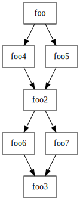
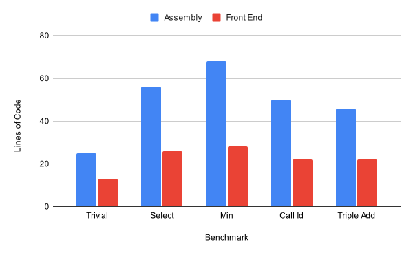

+++
title = "Heterogeneous Programming with the Caiman Front End"
[[extra.authors]]
name = "Stephen Verderame"
link = "https://stephenverderame.github.io/"
[extra]
bio = """Stephen is a senior/MEng student interested in compilers, 
programming languages and architecture.
"""
+++

# Background

Caiman is an IR designed for 
[heterogeneous programming](https://en.wikipedia.org/wiki/Heterogeneous_computing),
with the current target being CPU/GPU computing. 
The goal of Caiman is to more easily explore the
immense design space developers have access to once they introduce multiple
devices to run code on. 

As an example, consider the following function:

```Rust
fn select_sum(a: Buffer<f32>, b: Buffer<f32>, c: Buffer<f32>) -> f32 {
    let val = sum(a);
    if val > 0.0 {
        sum(b)
    } else {
        sum(c)
    }
}
```

If we introduce the GPU as a device we can execute code on, then another way
to write the same thing would be:

```Rust
fn select_sum1(a: Buffer<f32>, b: Buffer<f32>, c: Buffer<f32>) -> f32 {
    let val = gpu_sum(a);
    if val > 0.0 {
        gpu_sum(b)
    } else {
        gpu_sum(c)
    }
}
```

But a GPU can potentially execute multiple sums in parallel, so instead of
forcing a synchronization with a dependency between the first `sum` and
the other two, we can write this equivalently as:

```Rust
fn select_sum2(a: Buffer<f32>, b: Buffer<f32>, c: Buffer<f32>) -> f32 {
    let cond = gpu_sum(a);
    let b = gpu_sum(b);
    let c = gpu_sum(c);
    if val > 0.0 {
        b
    } else {
        c
    }
}
```

This isn't too bad, but you can imagine that a more complicated function, `foo`, might
want to call `select_sum` multiple times. For each call to `select_sum`,
the developer of `foo` can choose which `select_sum` implementation to use. 
But then each permutation of `select_sum` implementations used in `foo` 
characterizes a different `foo` implementation. Now suppose a developer
of `bar` calls `foo` multiple times. They already have so many choices
for invoking `foo` once, and every permutation of these choices 
for the number of calls `bar` makes can characterize
a different implementation of `bar`! This quickly becomes a massive
combinatorial explosion.

So what Caiman provides is a way to abstract where data is stored,
what device computations are invoked on, and when synchronizations are made
between devices. This allows a user to write specifications that are agnostic to 
these details and not subject to the combinatorial explosion. 

For example, the value specification describes what computations are performed,
and doesn't care where or when they are performed. In the value language,
`select_sum` can be specified with something like this:

```
val select_sum(a: array<f32>, b: array<f32>, c: array<f32>) -> f32 {
    sum_b = sum(b)
    sum_c = sum(c)
    returns sum_b if sum(a) > 0.0 else sum_c
}
```

`sum` can be either a CPU or GPU sum and it can be executed in parallel or
sequentially. All the different versions we saw earlier are captured in this
one specification.

A concrete `select_sum` implementation (aka schedule) would implement this
spec, along with a `spatial` spec that specifies how and where data is allocated
and freed and a `timeline` spec that specifies the synchronizations between devices.

Explication (program synthesis) will be used to be able to derive much of 
the implementation from the specs so that a user can write a few different specs
and Caiman can generate a plethora of implementations that adhere to them.

# Introduction

For my project, I've been developing a front-end language for Caiman.
The front-end lowers the high-level Caiman programs into Caiman Assembly,
our mid-level IR. Like LLVM, the assembly does have a textual format that
can be hand-written. However, it's absolutely ungodly (a simple program to return
the smaller of two constants is nearly 70 lines of code). The main cause
for this is that the assembly is in 
[continuation-passing style](https://matt.might.net/articles/by-example-continuation-passing-style/) 
(CPS), which makes executing commands on different devices easier.

CPS can best be described as a way of writing programs where control flow
is made explicit through function calls and all function calls never return.
Instead of a function returning to its caller, a caller will pass a
*continuation* to the callee that the callee will invoke when it's done.
The continuation can be thought of as "the rest of the program". In this style,
all functions effectively become single basic blocks, which we call *funclets*.

As an example, consider the following program:

```Rust
fn min(a: i32, b: i32) -> i32 {
    if a < b {
        return a;
    } else {
        return b;
    }
}
```

In CPS, this would look something like the following:

```Rust
fn min(a: i32, b: i32, continuation: Box<dyn Fn(i32) -> i32>) -> i32 {
    continuation(if a < b { a } else { b })
}
```

Another point of complexity is the machinery in the type system that is
used to match pieces of the implementation with pieces of the specifications.
There is also a part of a variable's type that is used for linear resource management. 
Because of this, Caiman types have a base type (such as `i32`), and then a type
relative to each of the three specification languages. 
Except for the base type, the type of something can also change
throughout a program or basic block. Each specification language tracks
a particular dimension of the implementation via 
[linear types](https://wiki.c2.com/?LinearTypes). Linear
types apply to resources that must be used up in their entirety. For example,
in a linear typing system, a function such as `foo(a, b)` must use `a` exactly
once and it must use `b` exactly once.

So the goal for this project was specifically to develop the part of the
front-end that would lower the imperative, human-writeable source language
into CPS. Furthermore, the user should only have to specify types in situations
that we can't infer them.

Because the specification languages in the source don't have control
flow, lowering them was pretty standard. Therefore, we'll focus on lowering
the scheduling language (implementations) for this post.

# Design

The way I achieved this was by introducing a new high-level IR (HIR) that would
be the target of the front-end AST.


The HIR I designed is somewhat similar to BRIL, however, its canonical
representation is a CFG. The HIR has typical arithmetic and comparison operations,
loads, stores, conditional branches, variable declarations and function calls.
Unlike the AST, it's flattened (no nested expressions or statements)
and divided up into basic blocks, but unlike Caiman Assembly 
it has traditional (non-CPS) control flow, and the inputs and outputs of
funclets aren't explicit. One thing to note is that HIR function calls are considered
basic block terminators, since in CPS a function call must be the last
statement in a function. Furthermore, CFGs are canonicalized so that they have 
a single entry and a single exit block.

Once the AST is in CFG form, we perform a few local transformations as "preprocessing".
Namely, we convert all operators to their typed forms 
(so `add` becomes `_add_i64_i64` for adding two `i64`s) and convert all
mutations of variables to loads and stores of a reference.

One could imagine employing the progressive lowering ideas of CompCert and MLIR
to separate the HIR into two HIRs, one before these transformations and
a second representation afterward. I didn't go this route because it would
involve decent code duplication for the definitions of the two IRs.

# Implementation

As an example, consider the following (toy) example in the high-level front-end:

```
// value specification
val main() -> i64 {
    b :- false
    c :- true
    d :- false
    one :- 1
    two :- 2
    r :- c if b else d
    z :- two if r else one
    returns z
}

// implementation
fn foo() -> i64 @ node(main.z)-usable 
    impls main, time, space
    // adheres to three specifications:
    // * main  (value)
    // * time  (timeline) (not shown)
    // * space (spatial) (not shown)
{
    let b: bool @ node(main.b) = false;
    var r: bool @ none(main);
    if @ node(main.r) b {
        let c: bool @ node(main.c) = true;
        r = c;
    } else {
        let d: bool @ node(main.d) = false;
        r = d;
    }
    @in { r: [node(main.r)-usable, none(space)-save] };
    
    var v: i64 @ none(main);
    if @ node(main.z) r {
        let two: i64 @ node(main.two) = 2;
        v = two;
    } else {
        let one: i64 @ node(main.one) = 1;
        v = one;
    }
    @in { v: [node(main.z)-usable, none(space)-save] };
    return v;
}
```

It's still not pretty on account of the current need to match pieces of 
the implementation back to the spec almost everywhere (denoted with the `@`) 
and keep expressions unnested. However, the schedule in this example has the following
structure:




### CFG Generation

During CFG generation, one piece of information we need to keep around is what
the continuation of each basic block is. In the above example, the
continuation of `foo` is `foo2` and the continuation of `foo2` is `foo3`.
`foo4`, `foo5`, `foo6`, and `foo7` are at the maximum depth in this example, so
when they're done, control is going to pass back to their parent's continuation.

To give this information to each basic block, CFGs are generated
breadth-first instead of depth-first 
(as indicated by the naming of the basic blocks in the diagram).
That way, the continuation of any block is going to be either the block
with the next ID or its parent's continuation. The "parent continuation" of the
root level blocks is just `None`.

Within each basic block of the CFG, we also perform a few local transformations.
In particular, we use source-level type information to convert all operators
to their typed versions. In Caiman, all basic operators must be implemented as
external function calls on a particular target device. The default behavior
is for operators to invoke functions on the local (aka host) device which will
be defined in a standard library. The local/host device is the device that is
running the Caiman program itself. The type information attached to the
operators is used to determine the function to call. For example `true == false`
will call `_eq_bool_bool(true, false)` while `1 == 2` will call 
`_eq_i64_i64(1, 2)`.

We also need to convert the uses of variables to loads and stores
of references. This means we might need to introduce load instructions that turn
something like `return v` into `_v0 = load v; return _v0`. Right now, this 
dereference transformation is applied locally, but in the future, this might become
a global transformation to reduce the amount of loads being inserted.

### Funclet Arguments and Returns

Once lowered into HIR, the next step is identifying the arguments and return
values of each funclet. The way I chose to do this is via a live variables analysis.
Any variable that is live into a basic block must necessarily be a funclet
argument for that block. Consider this part of the example shown earlier:

```
// foo
var r: bool @ none(main);
if @ node(main.r) b {
    // foo4
    let c: bool @ node(main.c) = true;
    r = c;
} else {
    // foo5
    let d: bool @ node(main.d) = false;
    r = d;
}
```

`r` is a variable defined outside the blocks of `foo4` and `foo5`. Since `r`
is live into `foo4` and `foo5`, it must be an argument to both. 
Now, at compile-time, it's not necessarily known whether `foo4` or `foo5` will
be invoked. Therefore, the arguments of both blocks must be the same. In the
assembly, the terminator of the `foo` block looks something like this:

```
schedule-select %b [%foo4, %foo5]
    [value node($val.%r), timeline none($time.%none), spatial none($space.%none)]
    (%r_loc) %foo2;
```

where `(%r_loc)` is the argument to the selected block and `%foo2` is the
continuation.

Therefore, the input arguments must be the set of all variables that are
live-out of all predecessor blocks. For the first block of a function, then
the inputs will be the same as the function inputs instead.

What about the output values? It might seem logical to think that the output
values are simply the live-out set of a given basic block (as I initially did),
but consider the following pseudocode example:

```
// block1
let b = // ...
let cond = // ...
var v;
if cond {
    // block3
    v = b + 1;
} else {
    // block4
    v = b * 2;
}
// block2
// use v
```

`b` and `v` are live out of `block1`, however, only `v` is live into `block2`.
If we think about what's actually happening here in CPS, we might have the following
pseudocode

```
fn block1() {
    %b = // ...
    %v = // ...
    select %b [%block3, %block4] (%b, %v) %block2
}

fn block3(%b, %v, %continuation) {
    %v = %b + 1;
    %continuation(%v);
}

fn block4(%b, %v, %continuation) {
    %v = %b * 2;
    %continuation(%v);
}

fn block2(%v) {
    // use v
}
```

Here we can see that the actual return value of `%block1` is just
`%v`. More generally, a block's return values are the inputs to
its continuation. For the last block in a function, then the
outputs will be the outputs of the function instead.

Luckily, we already know what the continuation of every block is because
we determined this information when we generated the basic blocks from the
source program.

### Funclet Argument and Return Types

Now that we determined what the funclet arguments and return values are, it
should be easy to determine what a funclet's input and output types are, right?
Well, not so much. Without diving into the details too much, the problem is that
while the datatype of a variable won't change, the part of the type
that is mapping a variable back to a specification and the part of the type
that is tracking a linear resource *can* change. You can think of 
these parts of the type as being relative to the current funclet.

The explicator (synthesizer) can determine all the types *within* a basic block. 
However, it's not guaranteed to solve the input and output types across a
funclet boundary. In fact, nothing is. The general case is an undecidable problem.

In the earlier schedule, we can see an example of how the types are changing:

```
var r: bool @ none(main)-dead;
if @ node(main.r) b {
    let c: bool @ node(main.c) = true;
    r = c;
} else {
    let d: bool @ node(main.d) = false;
    r = d;
}
@in { r: [node(main.r)-usable, none(space)-save] };
```

`r` starts as being an empty reference that doesn't map to anything in a 
specification (`none`) and can't be used (`dead`). During the assignments
to `r` in either branch, `r` takes on the value type of what was
assigned to it. 
In the true branch, `r` maps to `main.c` in the value specification,
and in the false branch it maps to `main.d`. In both branches, `r` also becomes
`usable`. Finally, at the join point of the two
branches, `r` maps to `main.r`, which is a node in the value spec 
defined as the output of the conditional.

While the explicator is currently a WIP, for now, I decided to reduce what
needs to be specified by the user using a dataflow analysis. The above example
is actually the reduced level of specification. Annotating every type fully
would look like:

```
var r: bool @ [none(main)-dead, none(space)-save, none(time)-usable];
if @ node(main.r) b {
    let c: bool @ 
        [node(main.c)-usable, none(space)-usable, none(time)-usable] 
        = true;
    r @ [node(main.c)-usable, none(space)-save, none(time)-usable] = c;
} else {
    let d: bool @ 
        [node(main.d)-usable, none(space)-usable, none(time)-usable]
         = false;
    r @ [node(main.d)-usable, none(space)-save, none(time)-usable] = d;
}
@in { r: [node(main.r)-usable, none(space)-save, none(time)-usable] };
```

We can cut down the required type annotations by knowing some information about
the types of different syntactic constructs. For example, uninitialized
variables are `none()-dead` in the value dimension, `none()-save` in the
spatial dimension and `none()-usable` in the timeline dimension. Constants
are `usable` in all three. Assignments to variables change the type in
the value dimension.

These heuristics aren't perfect, and one example where they break down is 
the meet point between the two branches of the `if`. In one branch, `r`
maps to `main.c` and in another, `r` maps to `main.d`. We need the user to 
resolve the conflict with a type annotation. 
In this example, `r` maps to `main.r` after the meet because
this corresponds to the following value specification:

```
val main() -> i64 {
    // ...
    r :- c if b else d
}
```

Future work will allow further simplification, and should require only
the following annotations:

```
var r;
if b {
    r = true;
} else {
    r = false;
}
@in { r: [node(main.r)-usable] };
```

It should be noted that while a user is more than welcome to write every
implementation by hand, the goal is for them to only write bits and pieces of
it. A user can leave holes in the implementation to be filled in by the
explicator. The entire schedule itself could be one big hole. The inferences
made by the front-end are intended to aid the user in things they want
to specify themselves and aid the explicator by taking advantage of
high-level information that isn't available when explication occurs.

### Challenges

The most difficult conceptual task was identifying areas where my assumptions
were incorrect, especially as they related to the type system. For example,
the initial design of my parser did not include any way to specify type
annotations for funclet inputs and outputs because I thought there was enough
structure to deduce them in all cases. Since I'm building up the language as 
I'm going, I'm sure there are cases I haven't considered simply 
because I haven't implemented anything that could generate them.

Another challenge is simply the nature of building a project on top of an
incomplete (and occasionally buggy) base. Some of my tests have revealed bugs 
in the later stages of the Caiman compiler. Furthermore, since I haven't
gotten around to implementing front-end semantic analyses, whenever something
fails I always have to ask:
1. Is the test wrong?
2. Is the front-end wrong?
3. Is a later stage of Caiman wrong?

None of these questions are particularly trivial to answer, which has led to 
"fun" debugging escapades.

## Evaluation

Overall, I would say the front-end so far is a success. I roughly
completed what I planned to accomplish at this point which was
end-to-end compilation for the built-in operators, conditional branching, 
internal functions, and AST flattening. I did not get to AST flattening
in the transformation from AST to HIR, but this is my next step and it should
be pretty straightforward. The way I am currently thinking of doing this
will also introduce the infrastructure necessary to reduce the number
of required type annotations to the level I described as the 
further simplification enabled by future work. 

Every pre-existing assembly benchmark that doesn't involve user-supplied
external functions or device synchronizations has been implemented in the
front-end at a significant reduction in lines of code
(excluding whitespace, as measured with the `C` language settings of
[cloc](https://cloc.sourceforge.net/) 1.90). 5/9 of the assembly
benchmarks meet this description. These limitations are imposed simply because
I haven't implemented these features in the front-end yet.
The front-end versions of each benchmark were translated pretty literally,
with the assembly version being very close to what the front-end version lowers to.



Compilation and benchmark run time also barely changed. Actually, the front-end
compiler is *faster* than the assembly compiler, which is likely becuase they use
different parsers. I ran 5 trials on the `trivial` benchmark, which was 
chosen because
it has the smallest difference in complexity between the front-end and
assembly implementations. The front-end compilation time was an average of
26.0ms with a standard deviation of 4.3ms and the assembly compilation
time was an average of 49.8ms with a standard deviation of 4.6ms.

Overall, the improvements of the front-end over the assembly so far are
quite significant. There is still much work to be done, but the progress so far
has been promising.


