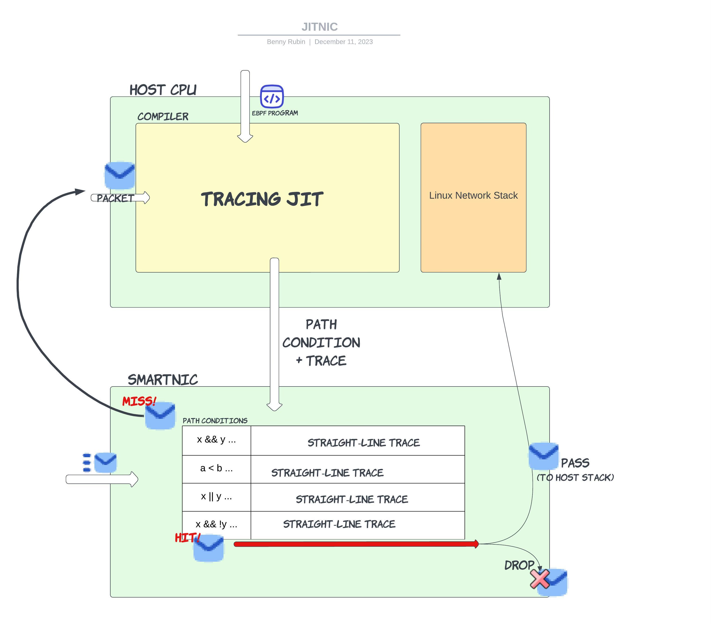
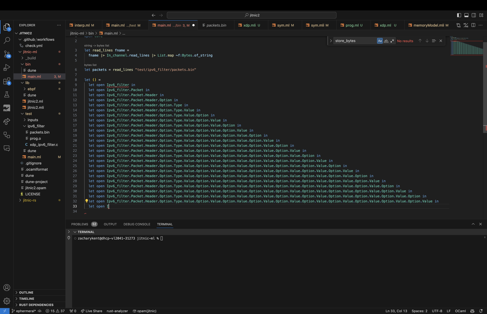

    +++
    title = "JITNIC"
    [extra]
    bio = """
      Zak Kent is a senior interested in programming languages and verification.
      Benny Rubin is a junior interested in networking and systems.
    """
    [[extra.authors]]
    name = "Zak Kent"
    [[extra.authors]]
    name = "Benny Rubin"
    +++

## Summary

For this project, we implemented an eBPF JIT compiler to share eXpress Data Path (XDP) network programs between a host CPU and a smartNIC. The fundamental idea behind this design is to use runtime information to compile and run straight-line traces of eBPF code on a smartNIC. Straight line traces of code enable both compiler level and hardware level optimizations. The key challenge to this approach is to decide if a given trace can correctly run on a packet and to dynamically recompile a new trace if not. We develop the idea of a “path condition” - a predicate over fields of a packet. Each trace has a corresponding unique minimal path condition that is sufficient to determine the set of incoming packets that can be run on it. Finally, we evaluate our approach by looking at worst case and best case trace compilation rates, where fewer recompilations is better for performance. We find in practice that XDP programs require few traces installed on a NIC to cover the majority of incoming packets for realistic workloads.

Code available [here](https://github.com/cornell-netlab/jitnic2).

## Background and Motivation

The Linux host networking stack is often a bottleneck for high throughput networked applications. The stack is incredibly complex with layers that handle NIC→Host memory DMA, transport layer re-ordering, flow control, and error detection. The kernel must also employ expensive operations such as memory allocation and data copy between kernel and user space. Hence, it has become a popular paradigm to “bypass” the kernel networking stack and implement whatever necessary transport behavior in userspace. While this can lead to a significant speedup, it requires re-implementing a lot of the complex, error-prone behavior already implemented in the kernel. Perhaps more importantly, it gives up the protections and standardization provided by the linux kernel. 

Another approach to speeding up network throughput is to optimize the Linux networking stack with techniques like the eXpress Data Path (XDP). XDP leverages eBPF (Extended Berkeley Packet Filter), an in-kernel language, tool-chain, and Virtual Machine for running programs within the Linux Kernel networking stack. Originally developed for the networking stack, eBPF has evolved into a rich and versatile technology with a broad range of uses within the Linux kernel such as performance monitoring, networking, security, and more. One of the most appealing characteristics of eBPF is that it does not require the kernel to be recompiled in order to run programs. The kernel has a number of hooks where you can run eBPF programs upon the arrival of a certain event. To ensure safety, before a program can be loaded into the virtual machine, there is a verifier that restricts the set of possible programs to ones that terminate, don’t crash, etc.

The eBPF hook we explored in our project is the XDP hook. XDP allows users to run programs on packets within the networking driver before all of the expensive transport layer processing, memory allocation, and data copy has occurred. These programs can read/write header fields, route packets out the Tx (transmit) datapath, let packets continue along the kernel networking stack, drop packets, and even store state with the use of eBPF maps, a restricted form of memory. XDP is especially powerful for programs where the common case is dropping or forwarding (i.e. filters, load-balancers), as the majority of packets will not be processed by the kernel networking stack. 

The use of a smartNIC can further accelerate this processing. A programmable smartNIC is a piece of networking hardware that operates as a NIC, but can be reprogrammed on the fly, rather than just implementing a fixed set of behaviors decided by the hardware vendor. By running an XDP program on a smartNIC, a packet fated to be dropped does not need to be DMA (Direct Memory Access) written to host memory, saving on end-to-end latency, and PCIe and memory bandwidth. We call this the Extra Express eXpress Data path. 
An important piece of prior work is hXDP, which implements an eBPF interpreter on an fpga smartNIC, allowing it to run arbitrary XDP programs. While this is a great innovation, due to the complex and non-specialized hardware, they were not able to measure any significant throughput increases. This approach also does not allow for a program to be “split” between the CPU and the NIC – instead, all of the XDP program processing is happening on the NIC. 

## JITNIC System



Our approach, JITNIC, dynamically compiles straight line traces of eBPF code to be run on a smartNIC. This allows program processing to be split by the CPU and the NIC - the compiler can dynamically change what is run on the NIC. Additionally, straight-line traces can be heavily optimized by the compiler. In a real implementation of this system, the eBPF trace will be lowered to a real ISA where the instructions could be further optimized. The hardware can also be specialized to run straight-line traces of code, which we believe would lead to dramatic speedups.  
The JITNIC system can be seen in the diagram shown above. When a packet arrives at the NIC there are two possibilities: 

- A packet experiences a “hit” in the trace cache, meaning an existing compiled trace can be correctly run on the packet. 
  The straight line trace can be run on the packet and the final forwarding decision will be made. There are a number of possible XDP actions, but two straightforward ones are dropping the packet and passing it to the Linux Network Stack to be further processed and given to the application. 
- A packet experiences a “miss”.
  In this case, it must be sent to the compiler on the host CPU to be traced. 
  The JIT compiler will trace the program, generating the path condition – a set of conditions on the packet header for a packet to take the same path in the program– along with the trace itself. The CPU does not need to send the packet back to the NIC, as it can execute the XDP action itself. Finally, the CPU installs the path condition and trace into the trace cache, ejecting an element, using any preferred cache replacement policy, if necessary.

For this project, we focus on the compiler and implement the “hardware” NIC as an eBPF simulator. For this reason, we do not go into detail about the hardware implementation of certain features. Our system is built in ~1400 of Ocaml code, along with some tools for parsing out the eBPF byte code of an object file and turning PCAP (packet capture) files into byte streams. There are also about ~450 lines of an experimental Rust implementation that is now defunct.

We are actively working on different memory consistency models – sharing memory between a smartNIC and CPU gets very complicated, but for the sake of the system we implemented for this class, we assume the programs are stateless and there are no memory reads/writes outside of the input packet data. This also removes the problem of having memory reads in path conditions for memory locations that are also written to (you can quickly see how complicated this would get…). 

## Case study: Ipv6 Filter

The following C code is an XDP program that filters all non-ipv6 traffic. This will call the XDP_DROP action on any packets that do not match the ipv6 protocol in their ethernet header. Any ipv6 packets, or malformed packets that do not pass the bounds check will be passed onto the linux kernel networking stack. 
```C
int xdp_ipv6_filter_program(struct xdp_md *ctx) 
{ 
Void *data_end = ctx->data_end; /* pointer to where the packet ends in memory */
Struct ethhdr *eth = ctx->data; /* packet as an ethernet struct */
If ((void *) eth + sizeof(*eth) > data_end) /* out of bounds check for packet read */
	Return XDP_PASS;
} 

If (eth->protocol == 0x86dd) /* bytes of eth type ipv6 */
	Return XDP_PASS;
Else 
	Return XDP_DROP;
```

For the sake of simplicity, and to avoid introducing eBPF assembly, we will keep this example at the level of C. Note every C instruction has an analogous few instructions in eBPF. 

Starting from the beginning, let’s assume a packet arrives that has an ipv4 ethernet header. Taking the execution model from the diagram, this will be a cold miss as the cache is empty. The JIT compiler on the CPU will trace the program with the packet as input and produce the following trace:
```C
Void *data_end = ctx->data_end; /* pointer to where the packet ends in memory */
Struct ethhdr *eth = ctx->data;
Return XDP_DROP; 
```
The path condition will be `eth + sizeof(*eth) <= data_end && eth->protocol != 0x86dd` – notice that when tracing conditions just become part of the path condition. (Also note: in C this is `eth->protocol` but in eBPF this becomes a lookup to an offset within the packet. Similarly sizeof(*eth) is a constant and eth and data_end are given as input). At this point, the CPU will drop the packet. 

This trace and path condition will get installed onto the NIC. Now, if a packet arrives at the NIC and it matches the path condition, it will simply run the straight line trace. A simple DCE pass could remove any instructions that are only used in conditions. More complex programs might also do some packet writes in the trace, producing longer traces than just a forwarding decision. 

Finally, if an ipv6 packet arrives, it will not match the path condition and need to be sent to the host CPU to be compiled. After tracing, the CPU will install a new trace and path condition on the smartNIC. At this point, ipv6 and ipv4 packets will match their respective path conditions and can be run on the NIC without going to the compiler.

## Evaluation

Considering our smartNIC is just a software simulator, it does not make sense to evaluate the runtime performance of our system. Instead, we focus on the “cache” performance we can obtain. In real hardware the size and replacement policy of the cache could vary and have important ramifications for system performance – every cache miss requires the compiler to run and install new rules into the smartNIC. 

The cache performance depends on the path conditions and the sequence of packets arriving at the NIC. If a large number of packets arrive that all match the same few path conditions, we will have a great cache hit rate. There is a worst case scenario where the size of the cache is less than the number of possible traces of a program and a bad sequence of packets causes misses to continuously occur. We call this behavior “cache thrashing”. In the ipv6 filter case study, considering only well formed packets, we only need 2 traces to handle the entire state space of input packets. However, if a badly formed, non-ethernet, packet arrives, the program will fail the bounds check and need to be traced by the compiler. Assuming the trace cache on the NIC has 2 entries, this new trace will evict one of the previous entries. Without loss of generality, assume it is the ipv6 case. Now, if an ipv6 packet arrives the program will need to be re-traced, which will evict another trace, etc. It is clear how an “unlucky” ordering of packets can lead to continuous misses. 

This emphasizes the importance of tuning the cache size - which could potentially dynamically change depending on the program. It also shows that the replacement policy can potentially affect the probability of experiencing cache thrashing. In practice, we find XDP programs to be quite short and not have many conditions, meaning a small trace cache can fit most possible traces. 

Despite the limitations in conducting a thorough evaluation of real system performance, we conclude with a key observation: even a simple stateless filtering program can – with few traces compiled onto the NIC – significantly reduce end to end latency (by avoiding DMA and the kernel networking stack), reduce contention on the PCIE and memory buses, and save on CPU cycles.

## Optimizations and Future work

Currently, our system does not very closely resemble a realistic hardware implementation. There are several steps that remain in order to port our software simulator to a real NIC. First and foremost, we must design the instruction set that will be executed by the pipeline; this is where we will have maximum flexibility in optimizing performance. At this point, we are considering how to compile eBPF to a very long instruction width (VLIW) architecture, which exploits the instruction-level parallelism in a program by deciding statically which instructions can be executed in parallel. Many of the memory accesses in eBPF programs–those to packet headers, for example, can be easily parallelized. We will also have to nail down the exact structure of the pipeline, possibly testing different layouts to observe which is most effective. This will require deciding how many memory units are in the pipeline, for example.

The lowering to a VLIW instruction set is also why we decided against focusing on optimizing eBPF itself; the eBPF bytecode produced by clang is already tightly optimized, and additional optimizations at this level would likely not be exceedingly fruitful.

Additionally, we will have to examine the behavior of more eBPF programs to decide upon how to best deal with the difficulties resulting from a realistic distributed memory model, as opposed to the unrealistic shared memory model we currently operate under. Coordination between the host and NIC to ensure memory consistency would be extremely costly, and like outweigh the benefits of JIT’ing code at all.


## GAI Acknowledgement

We used GitHub Copilot through the project, which often did not produce particularly helpful suggestions. It was useful, however, for producing some of the boilerplate needed to write module signatures both in interface and source files. It was also useful for writing documentation. The autocomplete suggestions were at times humorously incorrect, like the following pyramid:



We also attempted to use ChatGPT to generate code for handling IO in OCaml, but it proved either incorrect or too verbose. This code did not make it into the final submission.

For example, ChatGPT generated the following code for finding all of the file names in a directory:

```OCaml
let read_directory (name : string) : string list =
   let dir_handle = Core_unix.opendir name in
   let rec loop (acc : string list) : string list =
     match Core_unix.readdir_opt dir_handle with
     | Some entry -> loop (entry :: acc)
     | None -> Core_unix.closedir dir_handle; acc
   in
   loop []
```

In contrast, we were able to accomplish the same much more concisely:

```OCaml
let read_directory dname =
  dname 
  |> Sys_unix.ls_dir 
  |> List.map ~f:(Filename.concat dname)
```

The suggestions produced by ChatGPT resemble those of a new CS 3110 student still trying to shake an imperative way of thinking.