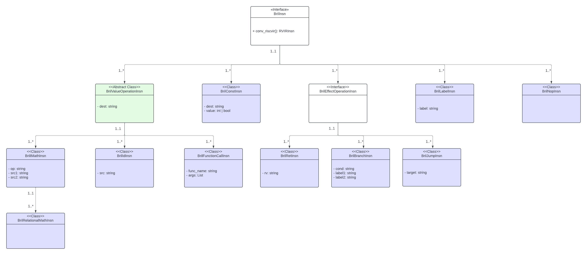

+++
title = "Bril to RISC-V Lowering System"
[extra]
bio = """
John Rubio is a 2nd year MSCS student interested in hardware and compilers. In his free time, he trains Brazilian Jiu-Jitsu. 
Arjun Shah is a senior undergraduate majoring in CS. Arjun is a Java enthusiast who is interested in [ultra-large-scale software systems](https://en.wikipedia.org/wiki/Ultra-large-scale_systems). In his free time, Arjun trains for competitive weight-lifting.
"""
latex = true
[[extra.authors]]
name = "John Rubio"
[[extra.authors]]
name = "Arjun Shah"
+++

# Summary
Bril (TODO: ADD LINK) is a user-friendly, educational intermediate language. Bril programs have typically been run using the Bril interpreter (TODO: ADD LINK). Compiling Bril programs to assembly code that can run on real hardware would allow for more accurate measurements of the impacts of compiler optimizations on Bril programs in terms of execution time or clock cycles. Thus, the goal of [this project](https://github.com/JohnDRubio/CS_6120_Advanced_Compilers/tree/main/rv32_backend) was to write a RISC-V backend. That is, to write a program that lowers the [core subset of Bril](https://capra.cs.cornell.edu/bril/lang/core.html) to TinyRV32IM (TODO: ADD LINK), a subset of RV32IM (TODO: ADD LINK). The objective was to ensure semantic equivalence between the source program and the generated RISC-V code by running it on a RISC-V emulator. At the outset of this project, one of the stretch goals was to use Crocus (TODO: ADD LINK) to verify the correctness of the Bril-to-RISC-V lowering rules. Another stretch goal was to perform a program analysis step that would aid in instruction selection, allowing the lowering phase to take place in an M-to-N fashion as opposed to the more trivial 1-to-N approach. The authors regret to inform you that these stretch goals were not completed during the semester, however, the primary goal was achieved. The primary goal was to generate semantically equivalent RISC-V assembly code from a Bril source program using a dead simple approach: 1-to-N instruction selection, trivial register allocation, and correct calling conventions.

## Representing Bril Programs

The first stage in the lowering pipeline is a preprocessing step. Source Bril programs are provided as input in JSON format. The program is parsed and, for each function, each Bril instruction is translated to one [__BrilInsn__](https://github.com/JohnDRubio/CS_6120_Advanced_Compilers/tree/main/rv32_backend/BrilInsns) object. Each BrilInsn is an instance of a subclass of the BrilInsn class hierarchy as depicted in __Figure 1__ below. The reasoning behind the structure of the BrilInsn class hierarchy lies in the fact that [many Bril instructions have similar formats](https://capra.cs.cornell.edu/bril/tools/text.html). This observation motivated a more conventional, Object-Oriented (OO) approach since the common Bril instruction formats could be implemented as parent classes and the special cases of these common formats could be captured in the form of child classes. The BrilInsn class hierarchy lends itself to exploiting some of the main benefits of OO, namely minimal changes and maximal code reuse. For example, a [value operation](https://capra.cs.cornell.edu/bril/lang/syntax.html#:~:text=string%3E%22%2C%20...%5D%3F%2C%0A%20%20%22labels%22%3A%20%5B%22%3Cstring%3E%22%2C%20...%5D%3F%20%7D-,A%20Value%20Operation,-is%20an%20instruction) is a general type of Bril instruction that takes arguments, performs some computations, and produces a value. Several types of Bril instructions fall under the umbrella of value operations, namely arithmetic and logical operation instructions, ID assignments, and function calls. This inherent hierarchical structure is a perfect opportunity for subclassing. The one attribute each of these Bril instruction types have in common is a destination field which is why __Figure 1__ shows the *BrilValueOperation* abstract class with a single `dest` field. The specifics of the computations that arithmetic & logical instructions, ID assignments, and function calls differ enough to justify each of these instruction types being their own subclass of the *BrilValueOperation* class. Using an OO approach allowed us to minimize the amount of time dedicated to common scaffolding among classes and focus more on implementation details specific to a class.

 __Figure 1__

## Representing RISC-V Programs

As mentioned above, a __1-to-N__ instruction selection approach was used for lowering. Thus, for each Bril instruction, one or more relatively simple RISC-V instructions would be used. The subset of RISC-V being used is TinyRV32IM which only consists of about thirty non-privileged RV32IM instructions. After some consideration, we felt the most straightforward way to group these instructions was the following:

- Register-Register Arithmetic Instructions
- Register-Immediate Arithmetic Instructions
- Memory Instructions
- Unconditional Jump Instructions
- Conditional Jump Instructions

Each of these groups corresponds to a class in the RISC-V Intermediate Representation (RVIR) [implementation](https://github.com/JohnDRubio/CS_6120_Advanced_Compilers/tree/main/rv32_backend/RVIRInsns). RISC-V instructions are fundamentally simple, thus there was no need for a class hierarchy other than each RVIR instruction inheriting from the [RVIRInsn abstract class](https://github.com/JohnDRubio/CS_6120_Advanced_Compilers/blob/main/rv32_backend/RVIRInsns/RVIRInsn.py).

## Progressive Lowering

With the proper infrastructure in place, it is possible to perform the first of three lowering passes. As shown in __Figure 1__, each BrilInsn instance implements a *conv_riscvir* method. As the name implies, this method converts each BrilInsn instance to one or more RVIRInsn instances, thus implementing the 1-N instruction selection design. See __Table 1__ below for translation details. Each RVIRInsn instance corresponds to a single RISC-V IR instruction. For each function in the source Bril program, this pass returns a list of RVIRInsn instances representing a semantically equivalent RVIR function. It is worth noting that the only difference between RIVR instructions and true RISC-V instructions is that RVIR instructions do not use RISC-V registers (TODO: ADD LINK). To lower to true RISC-V from RVIR, a register allocation pass is required.

| Bril                            | RISC-V Abstract Asm                |
| ------------------------------- | --------------------------------- |
| `x: int = const 1`               |`addi x, x0, 1`                  |
| `x: int = add y z`                | `add x, y, z`                       |
| `x: int = mul y z`                | `mul x, y, z`                       |
| `x: int = sub y z`                | `sub x, y, z`                      |
| `x: int = div y z`                | `div x, y, z`                       |
| `x: bool = eq y z`                |`  beq y, z, .eq`   `  addi x, x0, 0`   `  jal x0 .exit_cond`   `.eq:`   `  addi x, x0, 1`   `.exit_cond:`|
| `x: bool = lt y z`                |`  blt y, z, .lt`   `  addi x, x0, 0`   `  jal x0 .exit_cond`   `.lt:`   `  addi x, x0, 1`   `.exit_cond:` |
| `x: bool = gt y z`                |`  blt z, y, .gt`   `  addi x, x0, 0`   `  jal x0 .exit_cond`   `.gt:`   `  addi x, x0, 1`   `.exit_cond:` |
| `x: bool = le y z`                |`  bge z, y, .le`   `  addi x, x0, 0`   `  jal x0 .exit_cond`   `.le:`   `  addi x, x0, 1`   `.exit_cond:` |
| `x: bool = ge y z`                |`  bge y, z, .ge`   `  addi x, x0, 0`   `  jal x0 .exit_cond`   `.ge:`   `  addi x, x0, 1`   `.exit_cond:` |
| `x: bool = not y`                 |`xori x, y, 1`                      |
| `x: bool = and y z`               |`and x, y, z`                       |
| `x: bool = or y z `               |`or x, y, z`                        |
| `jmp .label`                      |`jal x0, .label`                    |
| `br cond .label1 .label2`         |`  addi tmp, x0, 1`   `  beq cond, tmp, .label1`   `  jal x0, .label2`   `.label1:`   `  ...`   `  jal x0 .exit`   `.label2:`   `  ...`   `.exit:` |
| `ret x`                           |`addi a0, x, 0`   `jalr x0, x1, 0` |
| `ret`                             |`jalr x0, x1, 0`                    |
| `x: int = id y `                  | `addi x, y, 0`                      |

 __Table 1__

## Trivial Register Allocation

At this stage of compilation, the source Bril program has been lowered to a list of RVIR instructions. Now the compilation unit is ready for the second main pass: register allocation. During the register allocation pass, the abstract registers are replaced with actual RISC-V ISA registers (TODO: ADD LINK). Before discussing implementation details, we will provide a brief overview of trivial register allocation.

### Overview

The key insight behind trivial register allocation (TRA) is that any RISC-V instruction will use at most three registers. Therefore, as long as each time a variable is defined the corresponding register is pushed to the stack, register allocation can be performed by replacing all abstract registers with one of three possible RISC-V registers. Generally speaking, the pattern is to assign unique offsets within the stack to each abstract register in a particular RVIR function. Whenever an abstract register is used, its current value is loaded from the stack into one of the three TRA registers. Whenever an abstract register is defined, it is stored back in its designated slot in the call frame. Undoubtedly, TRA results in an explosion in excess loads and stores. We hope to implement a more elegant register allocation algorithm in the future. In the meantime, the relative performance improvements of Bril programs across various compiler optimizations can still be examined without issue.

### Implementation

Our [implementation](https://github.com/JohnDRubio/CS_6120_Advanced_Compilers/tree/main/rv32_backend/TrivialRegAlloc) used the same pattern described above. To map each abstract register to a specific offset, we added a new IR-to-machine class (TODO: ADD LINK) which stores a mapping of abstract registers to offsets. Note that each offset is a multiple of four since TinyRV32IM is a 32-bit architecture. 

Next, TRA is performed on each RVIR function. This point is important - TRA takes place on a _per-function_ basis. This means that if two Bril functions contain a variable, `a`, each `a` variable is mapped to a specific offset within a separate call frame. During the TRA pass, each RVIR instruction is examined. As described above, each variable _used_ by a given RVIR instruction has its value loaded from the stack. This is now possible since each variable has been assigned a unique offset. Each RVIR instruction that _defines_ a variable has the updated value stored to the stack at the location corresponding to the defined variable.

At this point, the compilation unit has been lowered to RISC-V which can be assembled, linked, and executed! However, so far we've failed to mention the third main lowering pass: the calling conventions pass. That is because this pass takes place in parallel with the __BrilInsn -> RVIRInsn__ pass since the insertion of calling convention instructions takes place when the _conv_riscvir_ method is called on relevant BrilInsns. Furthermore, certain implementation details of the calling conventions pass only make sense if it's understood that TRA will take place next. Now let's explore the details behind the implementation of calling conventions into the RVIR program.

## Calling Conventions

We based our implementation on the RISC-V calling conventions taught in [Cornell's CS 3410: Computer System Organization and Programming](https://www.cs.cornell.edu/courses/cs3410/2019sp/schedule/). To oversimplify four lectures' worth of material, the essence of RISC-V calling conventions can be distilled into three main phases:

1. **Prologue (Function Entry Setup):** Before entering the function body, a set of preparatory actions, known as the prologue, must take place. These include the creation of the stack frame. The size of the stack frame usually needs to be known ahead of time, considering the space needed to accommodate the return address, frame pointer, any overflow arguments, and local variables that must be pushed onto the stack. Additionally, all callee-save registers that will be utilized during the function execution should be pushed onto the stack at this stage.

   This is the approach we used in our [implementation](https://github.com/JohnDRubio/CS_6120_Advanced_Compilers/tree/main/rv32_backend/util/prologue.py). Recall that the source Bril program is converted to a list of BrilInsn objects on a per-function basis. That is, the initial _Bril JSON -> BrilInsn_ pass converts each Bril function to an individual list of BrilInsn objects. It is at this point, that we inserted a pass that calculates the frame size required for the function in question. The frame size is calculated by 
   counting the number of _slots_ the function requires where a slot is simply a four-byte space on the stack. The _get_frame_size_ pass counts the number of slots by first reserving slots for the return address and frame pointer. Next, slots are reserved for any 
   overflow arguments. As a quick aside, RISC-V reserves eight registers for arguments used in a function call. Additional arguments must be pushed to the stack. Therefore, the get_frame_size pass determines which function call within the current function uses the 
   highest number of arguments. If the number of arguments is greater than eight, then space on the stack will be reserved for all overflow arguments. Lastly, the get_frame_size pass counts the number of slots required for local variables. We decided to naively reserve 
   a slot for every local variable in the function. Undoubtedly, this is inefficient and future implementations will use live variable analysis to determine the maximum number of local variables live at any given time within the function in question.

   With the frame size available, we were able to implement the rest of the prologue in the fashion described in the [CS 3410 Calling Convention Lectures](https://www.cs.cornell.edu/courses/cs3410/2019sp/schedule/). First, the frame is created by decrementing the stack pointer by the calculated frame size. Next, the return address and the old frame pointer are both pushed to the stack. The frame pointer register is then updated with the location of the top of the new stack frame. Referring to objects on the stack frame through the frame pointer instead of the stack pointer is a matter of preference, however, we found it easier to reference objects via the frame pointer since the frame pointer's location is fixed throughout the lifetime of the function being executed. Importantly, the callee-save registers are pushed to the stack at this point as this is how we avoid squashing the caller's local data. Finally, we move arguments that were passed to the function being executed into the [RISC-V saved registers](https://en.wikichip.org/wiki/risc-v/registers). This allows the argument registers to be overwritten during the lifetime of the function being executed without squashing the original arguments provided. 

2. **Function Call Instruction Preparation:** In the [_BrilFunctionCallInsn_ implementation](https://github.com/JohnDRubio/CS_6120_Advanced_Compilers/tree/main/rv32_backend/BrilInsns/BrilFunctionCallInsn.py), we added the necessary RISC-V calling convention logic to ensure preservation of state within the caller function. Prior to a function call instruction, we needed to be sure that certain steps would be taken to guarantee correct transfer of control and data from the caller to the callee. The first step is placing function arguments into the designated argument registers. Overflow arguments are pushed to the stack. The first overflow argument is placed in the slot that the stack pointer points to since the stack pointer points to the last slot in the call frame. Each subsequent overflow argument is placed an additional four bytes above the stack pointer. This convention allows the callee function to access overflow arguments via the frame pointer since the frame pointer will point to the slot directly below the location of the first overflow argument. Next, the function call instruction is executed, initiating the transfer of control to the callee. Lastly, the return value, if any, is moved to the destination register. An important note is that caller-save registers are not pushed to the stack prior to the function call in our implementation. This is because trivial register allocation takes care of most of this work for us. For instance, all of the registers used by a function in our implementation will either be argument registers which are moved to the RISC-V saved registers as described above, RISC-V saved registers which are preserved by actions taken in the prologue and epilogue, and the trivial register allocation registers which are guaranteed to load local variables from the stack prior to a __def__ or a __use__ and to push local variables to the stack afterward.

3. **Epilogue (Clean-up):** The third key piece of this calling convention puzzle is the clean-up step, or the epilogue. After the instructions in the function body have finished executing, the epilogue is responsible for restoring the stack to its original state and releasing any resources allocated during the prologue. This includes popping the stack frame, restoring the values of callee-save registers, and ensuring a smooth return to the calling function. We followed these steps in our [implementation](https://github.com/JohnDRubio/CS_6120_Advanced_Compilers/tree/main/rv32_backend/util/epilogue.py) as follows. We implemented the epilogue such that the first action that takes place is the restoration of the callee-save registers. This is accomplished by loading their respective values from the stack. Next, the frame pointer is restored to its previous location on the stack, and the callee's return address is loaded into the return address register. Lastly, the call frame is destroyed by incrementing the stack pointer by the size of the call frame and control returns to the location stored in the return address register.

# Challenges Along the Way

While implementing the initial translations from Bril to RVIR, some subtle details were tricky to get right. For example, conditional assignments such as `x: bool = lt y z` were implemented using a sequence of RVIR instructions that included a branch, two labels, and a jump. A set of fresh labels needed to be generated for each conditional assignment statement, otherwise the program could contain two or more identical labels, causing the program to fail at runtime.

A meta-problem we ran into was finding an environment that runs basic, 32-bit RISC-V assembly code. Due to a lack of foresight, we underestimated the amount of work required to get such an environment set up. In any case, we ended up settling on a few RISC-V interpreters that display the architectural state at the end of each program execution. Note that we did not add support for `print` instructions. Using an admittedly error-prone and somewhat monotonous procedure, we lowered Bril [programs](https://github.com/JohnDRubio/CS_6120_Advanced_Compilers/tree/main/rv32_backend/test) to RISC-V using our implementation. Next, we wrote C++ programs that were semantically equivalent to the same Bril programs and obtained the compiled RV32 code using [Compiler Explorer](https://godbolt.org/). Lastly, we ran both our RISC-V program and the Compiler Explorer RISC-V program on RISC-V interpreters and compared the end architectural state of each program. When deciding which programs to test, we used an incremental approach. First, we used single-instruction Bril programs and their C++ equivalents, thus ensuring that all Bril instructions we claim to support can truly be lowered to RISC-V. We repeated this process for sequences of conditional statements and iteration to test that the conditional and unconditional jumps were implemented correctly. Next, we tested basic function calls followed by the recursive factorial Bril program (TODO: ADD LINK). These categories of programs were selected because they use basic programming constructs commonly used in most modern programming languages (e.g. arithmetic and logical operators, control structures such as conditional statements and loops, functions, etc.).  On the programs we tested, our RISC-V programs yielded identical architectural states to the Compiler Explorer programs, save quite a few more items on the stack in our case since we used trivial register allocation. Obviously, there are some issues with this approach - it does not provide a high degree of coverage and it does not provide any details on performance. We concede these two points. At the very least, this approach does show that our lowering system can produce RISC-V programs that are semantically equivalent to a [suite](https://github.com/JohnDRubio/CS_6120_Advanced_Compilers/tree/main/test/benchmarks) of non-trivial Bril programs. We would've liked to explore performance speedups in further detail and plan to do so using a RISC-V emulator in the future.

# Reflection

Our original goals were to: (1) implement a RISC-V lowering system, (2) implement Bril-to-RISC-V lowering rules using Cranelift's ISLE DSL, and (3) use Crocus to verify the semantic equivalence of our lowering system against that of Cranelift. We learned that we were a bit overambitious in these goals and that implementing the Bril-to-RISC-V lowering rules in Cranelift's ISLE DSL requires enough overhead to warrant being its own project. So we were unsuccessful in achieving goals (2) and (3), but we were successful in achieving goal (1). During the implementation phase, we prioritized building a minimum viable version before extending the project with compiler optimizations. We opted for a unit testing style approach when we began testing our design. We tested individual modules (Bril instructions) to confirm that the lowered RISC-V instructions were semantically equivalent. Once we felt confident that individual Bril instructions were being properly lowered, we tested more extravagant test cases that involved non-trivial control flow and function calls.

To highlight the results as best we can at the time of writing, we leave you with a [collection](https://github.com/JohnDRubio/CS_6120_Advanced_Compilers/tree/main/rv32_backend/asm) of RISC-V programs generated from [source Bril programs](https://github.com/JohnDRubio/CS_6120_Advanced_Compilers/tree/main/test/benchmarks).
