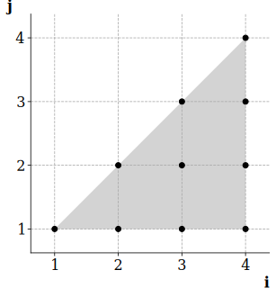

+++
title = "Implementing the Polyhedral Model"
[extra]
latex = true
[[extra.authors]]
name = "Benjamin Carleton"
+++

## Introduction

The oft-repeated wisdom that programs spend most of their time in loops motivates the need for a wide variety of loop optimizations. A challenge is finding a representation that can efficiently reason about the large sets of operations arising from loop programs, whose number and schedule may also depend on dynamic parameters.

In the polyhedral model, executions of a statement within a loop nest are represented by points within a convex integer polyhedron, with loop bounds and other constraints forming the boundaries of the polyhedron. Formally, the iteration domain is given by
$$
\mathcal{D} = \\{ x \in \mathbb{Z}^n \mid Ax + b \geq \mathbf{0} \\},
$$
where $n$ is the depth of the loop nest, which admits a compact representation in terms of $A$ and $b$. The points $x$ may be viewed as possible assignments to the iteration vector
$$
\begin{bmatrix} x_1 & x_2 & \cdots & x_n \end{bmatrix}^\mathrm{T},
$$
where the $x_j$ are the induction variables of the loop nest. For example, consider the following program:

```c
for (int i = 0; i < n; i++) {
    a[i][0] = 1;
    for (int j = 1; j <= i; j++) {
        a[i][j] = a[i - 1][j - 1] + a[i - 1][j];
    }
}
```

The iteration domain for the innermost statement can be visualized as a two-dimensional region:

<p style="text-align: center">
  
</p>

(where we have fixed $n = 5$ for the purpose of visualization), and the region may be described compactly by a system of affine inequalities:
$$
\begin{bmatrix} 0 & 1 \\\\ 1 & -1 \\\\ 1 & 0 \\\\ -1 & 0 \end{bmatrix} \begin{bmatrix} i \\\\ j \end{bmatrix} + \begin{bmatrix} -1 \\\\ 0 \\\\ 0 \\\\ n - 1 \end{bmatrix} \geq \mathbf{0}.
$$
The execution order is a simple lexicographic ordering of the points. A wide range of loop transformations can be represented by a simple change of basis producing a new lexicographic ordering. A larger class of loop transformations may be represented by affine transformations of the polyhedron.

## Goals and Design Considerations

The goal of this project was to implement a simple optimization such as loop interchange via the polyhedral framework, with emphasis on implementing interesting parts of the model rather than plumbing together existing tools.

There exist varying approaches for many parts of the polyhedral framework. In this work, I closely followed the approach outlined by Cédric Bastoul in his thesis on the polyhedral model.[^1]

### Intermediate Representation

The polyhedral model requires reasoning about loops at a high level of abstraction; a good intermediate representation should make it easy to query high-level information such as loop bounds, steps, and nesting. A low-level IR that represents loops only implicitly through unstructured control flow would thus be inappropriate. Similarly, memory references should expose their subscript expressions explicitly rather than via low-level pointer arithmetic.

The above considerations motivate the choice of [MLIR](https://mlir.llvm.org/) for our intermediate representation. MLIR's multi-level design admits dialects that can represent all the above features explicitly. In particular, the `scf` dialect represents structured control flow such as `if` statements and `for` loops, while the `memref` dialect represents (possibly multidimensional) array accesses.

For example, consider the following program fragment:

```c
for (int i = 0; i < 10; i++)
    for (int j = 0; j < 10; j++)
        a[i][j] = i + j;
```

and its translation into MLIR:

```mlir
%c10 = arith.constant 10 : index
%c0 = arith.constant 0 : index
%c1 = arith.constant 1 : index
scf.for %arg1 = %c0 to %c10 step %c1 {
  %0 = arith.index_cast %arg1 : index to i32
  scf.for %arg2 = %c0 to %c10 step %c1 {
    %1 = arith.index_cast %arg2 : index to i32
    %2 = arith.addi %0, %1 : i32
    memref.store %2, %arg0[%arg1, %arg2] : memref<?x10xi32>
  }
}
```

As polyhedral compilation was one of the original motivating applications for MLIR, there even exists an `affine` dialect which embeds certain polyhedral representations directly into the IR. Since the goal of this project was to implement substantial portions of the polyhedral framework from scratch, I avoided using the `affine` dialect in my implementation.

To obtain MLIR from benchmarks written in C, I used the existing [Polygeist](https://polygeist.llvm.org/) frontend configured to emit the `scf` dialect.

## Implementation

I was less than successful (to put it charitably) in realizing the goal of an end-to-end optimization pass. The current implementation performs, I believe, the bulk of the translation into the polyhedral model, but notably lacks any facilities for obtaining transformed code out of the model, and the computation of the legal transformation space is incomplete.

The implementation currently performs the following analyses, each of which is described in detail below.

- Detect static control parts.
- Construct the polyhedral representation of each statement's iteration domain.
- Construct the dependence polyhedra for a given pair of memory references.

### Building Static Control Parts

Control flow in the polyhedral model comprises a restricted class of loop nests whose bounds can be specified as a set of affine inequalities, such that the iteration domain forms a convex polyhedron. The class of program fragments amenable to polyhedral representation (that is, with convex polyhedral iteration domain) is said to have *static control*. A maximal region with static control is referred to as a *static control part*.

The first step in our analysis is thus the identification of these program regions. We follow the basic algorithm given by Bastoul:

1. Walk the IR, identifying operations with static control: loops with affine bounds and unit step, conditionals whose conditions are affine inequalities, and memory references with affine subscripts. In all of the these cases, affine functions may depend only on surrounding induction variables, constants, and parameters not mutated within the SCoP.
2. Merge consecutive operations with static control into static control parts.

The result is a list of the SCoPs within a given function. Implementing this analysis in MLIR is relatively straightforward due to the IR's explicitly nesting regions.

### Building Iteration Domains

Having identified regions with polyhedral domain, the next step is to construct those domains explicitly in a format that can be manipulated by integer programming tools. We use [isl](https://libisl.sourceforge.io/) to build sets from affine constraints and discharge queries such as emptiness checking.

For a given operation, we begin by determining the space in which its iteration domain should be constructed. The space defines the iteration vector (whose elements are called *dimensions* in isl's terminology) and any symbolic constants (*parameters*) referenced by the system of constraints. It is selected according to the SCoP in which the operation resides: loop induction variables within the SCoP correspond to dimensions of the space, while other variables correspond to parameters.

To construct the iteration domain, we traverse the loop nest moving outwards from the operation, accumulating constraints imposed by loop bounds and `if` conditions, until we reach the root of the SCoP. Each constraint we encounter introduces an inequality between affine expressions. We convert these expressions from MLIR `Value`s into isl's internal representation of affine functions, construct integer sets corresponding to the inequalities, and finally compute the intersection across all constraints.

In the implementation, this analysis is wrapped up in an MLIR pass that annotates each operation in the IR with an attribute encoding the operation's iteration domain. For example, the two stores in the program from the introduction have their iteration domains annotated as follows, where the domain is encoded as a string in [isl notation](https://libisl.sourceforge.io/user.html#isl-format):

```mlir
scf.for %arg3 = %c0 to %arg2 step %c1 {
  memref.store %c1_i32, %arg0[%arg3, %c0]
    {domain = "[arg2] -> { [arg3] : 0 <= arg3 < arg2 }"} : memref<?x10xi32>
  ...
  scf.for %arg4 = %c1 to %3 step %c1 {
    ...
    memref.store %11, %arg0[%arg3, %arg4]
      {domain = "[arg2] -> { [arg4, arg3] : arg4 > 0 and arg3 >= arg4 and 0 <= arg3 < arg2 }"} : memref<?x10xi32>
  } {domain = "[arg2] -> { [arg3] : 0 <= arg3 < arg2 }"}
} {domain = "[arg2] -> { [] :  }"}
```

In this simple example, the constraints correspond directly to the loop bounds as specified in the source program, though that might not be the case in general.

### Building Dependence Polyhedra

Testing the legality of transformations in the polyhedral model requires encoding dependence relations between statement executions. Dependences arise from accesses to a common memory location, where one access is a store. There are many techniques for identifying such dependences; following Bastoul, we take the approach of dependence polyhedra.

A dependence polyhedron, for a given pair of statements, encodes dependences between executions of the respective statements as integer points, such that the polyhedron is precisely the set of possible dependences. The question of whether the statements are free of dependences then amounts to an emptiness check on the polyhedron.

We construct the dependence polyhedron via a system of constraints with the following components, as described by Bastoul:

1. An equality constraint between the subscript functions from each access to the shared array.
2. The constraints describing the iteration domain of each statement, as computed above.
3. A set of *precedence constraints* which, admittedly, I don't fully understand. Roughly speaking, these encode information about the ordering of the statements' executions.

The implementation reuses much of the infrastructure needed for the previous analyses. One inconvenient technical issue that arose in the implementation was the need to build constraints between affine expressions that live in different spaces. I was able to get by with some trial and error, but likely there were better ways of handling this.

## Evaluation

Unfortunately, the project has not reached a point where it is practical to perform a systematic evaluation across a wide range of benchmarks. To check correctness, I have thus far relied on manual inspection of the internal data structures. I've tested with a modest set of examples from the literature, with mostly encouraging results. These include most of Bastoul's examples from Chapters 2–3 and a few other standard programs such as matrix multiplication, which exercise the various features of the implementation described above. Altogether they contain various shapes of loop nests, with both static and non-static control, with and without loop-carried dependencies.

### Challenges

There was a considerable amount of background material to learn before and throughout the project, given that I had no prior experience with polyhedral compilation. Learning the requisite infrastructure (MLIR, isl) was also occasionally troublesome. In particular, figuring out how to do relatively simple things in isl sometimes required lots of experimenting with sparsely documented functions.

With respect to the implementation itself, construction of the dependence polyhedra was certainly the trickiest part, and is also the part of the implementation in whose correctness I'm least confident. And as I mentioned above, testing is currently limited to manual inspection of internal data structures (though I did write utilities to visualize those structures where appropriate).

[^1]: Cédric Bastoul. *Improving Data Locality in Static Control Programs.* PhD thesis, University Paris 6, Pierre et Marie Curie, 2004.
