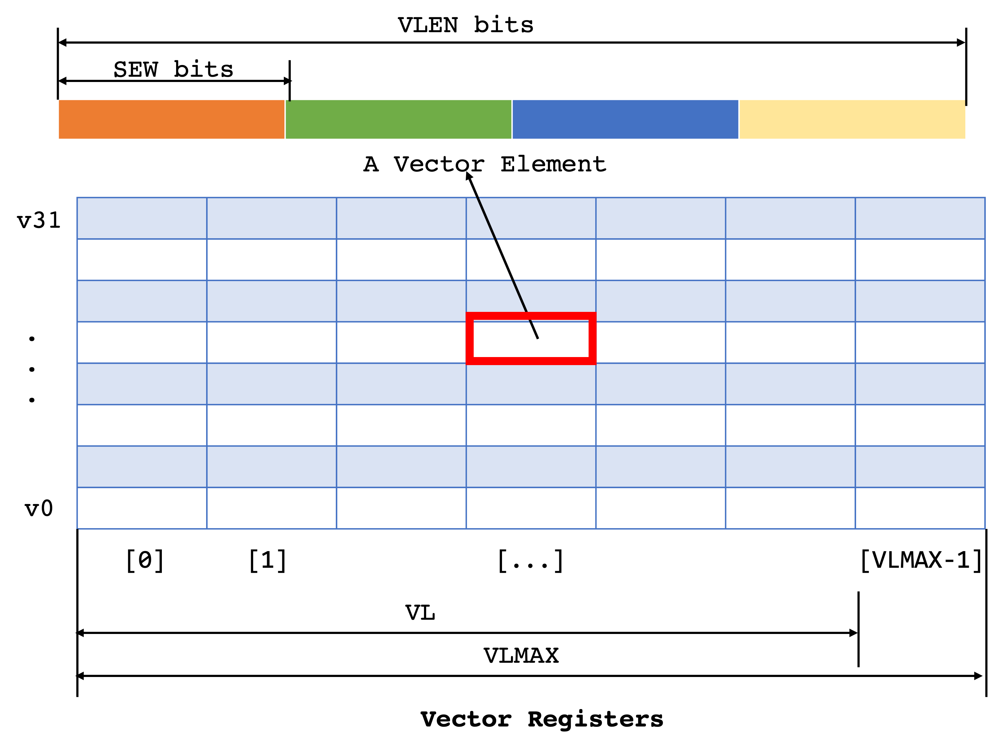
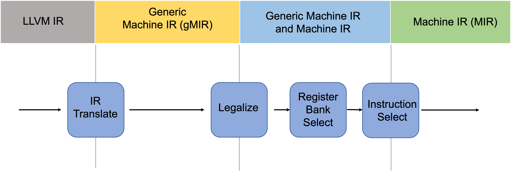

+++
title = "Support LLVM GlobalISel for RISC-V Vector Extension on Partial ALU Instructions"
[extra]
bio = """
  Jiahan Xie is a first-year CS MS student at Cornell whose interests lie in Compilers and Computer Architecture.

  Michael Maitland was a student in Cornell CS 6120 Advanced Compilers and he's now working at SiFive.
"""
[[extra.authors]]
name = "Jiahan Xie"
[[extra.authors]]
name = "Michael Maitland"
+++

# Introduction

The open [RISC-V instruction set architecture (ISA)](https://riscv.org/technical/specifications/) has an interesting extension, [the RISC-V "V" Vector Extension](https://github.com/riscv/riscv-v-spec/blob/master/v-spec.adoc). The unique part of RISC-V Vector Extension is that its vector instructions can deal with flexible vector lengths, VL, which makes programming in RISC-V Vector Extension agnostic to the vector register sizes. This feature really distinguishes the RISC-V Vector Extension from the traditional SIMD extensions, such as [x86 SSE](https://en.wikipedia.org/wiki/Streaming_SIMD_Extensions) (with a fixed size 128-bit vector length)/[AVX](https://en.wikipedia.org/wiki/Advanced_Vector_Extensions) (256-bit), and [Arm NEON](https://developer.arm.com/Architectures/Neon) (128-bit). Traditional SIMD extensions with fixed vector lengths face challenges when dealing with the changing data sizes. They must maintain compatibility and support all existing fixed-size vector lengths in their instruction set architectures. This often leads to inefficiencies, especially in loop operations where the data size/loop stride may not align perfectly with the fixed vector size, necessitating additional scalar processing for the remaining elements. And the most suitable size for the number of elements to be processed in the vector loop is hard to decide ahead of time. In contrast, the RISC-V Vector Extension eliminate this concern with its vector length agnostic principle. Particularly in loop scenarios, the RISC-V's ability to adaptively handle varying data sizes stands out. For instance, in a simple loop adding two arrays, the RISC-V can dynamically adjust the vector length for each iteration by dynamically setting the vector length. This means it can process as many elements as possible in each pass, depending on the hardware capabilities and the remaining data. This adaptive approach really simplifies the code by eliminating the need for separate scalar loops for the leftover elements.

# What Was the Goal?
The goal was to support LLVM Global Instruction Selection, a framework that operates on whole function for instruction selection, for the RISC-V Vector Extension on some ALU operations, such as `vadd`, `vsub`, `vand`, `vor`, and `vxor`.


# A Primer on the RISC-V Vector Extension
There are a lot of instructions and cool features in the [RISC-V "V" Vector Extension Spec](https://github.com/riscv/riscv-v-spec/blob/master/v-spec.adoc), I will only pick the most relevant and important parts to explain. 

The most important parameters are undoubtly `SEW`, `VLEN`, `VL`, and `LMUL`; and one of the most interesting and powerful instructions is `vset{i}vl{i}`.

Let's begin with the crucial parameters:
- `SEW`: Selected Element Width (in bits), set dynamically by the programmers. It sets the width/length of a single element in a vector element/register. Each vector element can compose `VLEN`/`SEW` single elements.
- `VLEN`: Vector register LENgth (in bits). The number of bits in a single vector register. It is hardware dependent. 
- `VL`: Vector element Length (in bits) that the programmers actually deal with, which can be treated as the vector operation building blocks. It implies how many vector registers/elements the vector operations will execute. As will be discussed below, `VL = min(AVL, VLMAX)`, which means there's no fixed relationship between `VL` and `VLEN`. `VL` might be greater than, less than, or equal to `VLEN` depending on the value of `AVL`, `LMUL`, and `SEW`. 
- `LMUL`: The vector Length MULtiplier. It is used for grouping vector registers. It is a power of 2 and it ranges from 1/8 to 8. For instance, when `LMUL=8`, the ABI imposes that only `v0`, `v8`, `v16`, and `v24` indices are allowed to used, as for example, group `v8` encodes 8 vector elments `v8v9`...`v15`. Note it can also be fraction numbers because sometimes we want to use only parts of the vector registers.
  
After introducing these basic and the most important parameters, there are still two paramters we will be dealing with, `AVL` and `VLMAX`:
- `AVL`: Application Vector Length. The application specifies the total number of elements to be processed as a candidate for `VL`.
- `VLMAX`: MAXimum Vector Length. Although programmers can dynamically select vector register lengths, they cannot be set to arbitrary numbers because they might be larger than the hardware constraints, which is imposed by `VLMAX`. Specifically, `VLMAX = (LMUL × VLEN) / SEW`. For example, if the length of a single basic elment is 32 bit, and this specific hardware supports `VLEN`=256 bit, there are 8 elements that can fit in vector register. And we want to group every `LMUL`=2 vector elements, `VLMAX`=(2 × 256) / 32 bits = 16 bits.  As a result, the actual value `VL` is the smaller value of the desired application vector length `AVL` and the vector length value constrained by the hardware `VLMAX`: `VL = min(AVL, VLMAX)`.

The visualization of vector registers is shown below: 

One of the most interesting instructions is `vset{i}vl{i}`, which configures the vector length. The `vset{i}vl{i}` instructions set the `vtype` and `VL` based on arguments, and write the new value of `VL` into `rd`. Take `vsetvli` as an example, the spec of `vsetvli` is:
```
vsetvli rd, rs1, vtypei   # rd = new vl, rs1 = AVL, vtypei = new vtype setting
```

Say we have a `vsetvli` instruction:
```
vsetvli	t0, a0, e64, m2, ta, ma
```
The SEW is therefore 64-bit (`e64`); the vector length multiplier is 2 (`m2`); the `AVL` is held in `a0`; the new `VL = min(AVL, VLMAX)` is stored in `t0`; the tail and mask policy is tail agnostic (`ta`) and mask agnostic (`ma`), which is not our concern in this blog.

# A Primer on LLVM Global Instruction Selection
LLVM Global Instruction Selection ([GlobalISel](https://llvm.org/docs/GlobalISel/index.html)) is a framework that provides a set of reusable passes and utilities for instruction selection — translation from LLVM IR to target-specific Machine IR (MIR). It is "global" in the sense that it operates on the whole function rather than a single basic block. 

GlobalISel is intended to be a replacement for [SelectionDAG](https://llvm.org/docs/CodeGenerator.html#introduction-to-selectiondags) and [FastISel](https://llvm.org/doxygen/classllvm_1_1FastISel.html), to solve performance, granularity, and modularity problems. GlobalISel does not need to introduce a new dedicated IR as in SelectionDAG so GlobalISel can provide faster code generation; GlobalISel operates on a function, whereas SelectionDAG only considers a basic block, losing some global optimization opportunities; in addition, GlobalISel enables more code reuse for instruction selection for different targets.

[The pipeline of GlobalISel](https://llvm.org/docs/GlobalISel/Pipeline.html#pipeline) composes of four major passes:
1. [IRTranslate](https://llvm.org/docs/GlobalISel/IRTranslator.html): Converts LLVM IR into [Generic MachineIR (gMIR)](https://llvm.org/docs/GlobalISel/GMIR.html), which has the same data strucures as [MachineIR](https://llvm.org/docs/MIRLangRef.html) but is less constrained. The constraints will be incrementally enforced along with the pipeline, transforming gMIR to MIR in the end.
2. [Legalize](https://llvm.org/docs/GlobalISel/Legalizer.html): This pass replaces unsupported operations with supported ones. So there will be no illegal instructions after this step.
3. [Register Bank Select](https://llvm.org/docs/GlobalISel/RegBankSelect.html): This pass assigns the corresponding [Register Banks](https://llvm.org/docs/GlobalISel/GMIR.html#gmir-regbank) to the [generic virtual registers](https://llvm.org/docs/GlobalISel/GMIR.html#gmir-gvregs) in the gMIR. In essence, Register Bank is a framework for grouping and managing different sets of registers in a target architecture. 
4. [Instruction Select](https://llvm.org/docs/GlobalISel/InstructionSelect.html): This is the final pass, it selects target MIR instructions based on the gMIR instructions. As mentioned above, the gMIR has been constrained enough that it becomes MIR at this point.

A visualization of the pipeline is shown below: 

Please note that Combiner is not in the scope of this blog.

# What Did I Do?
Let's start with a minimum code generation example that we want to support in LLVM GlobalISel:
```
define <vscale x 1 x i8> @vadd_vv_nxv1i8(<vscale x 1 x i8> %va, <vscale x 1 i8> %b) {
  %vc = add <vscale 1 x i8> %va, %vb
  ret <vscale x 1 x i8> %vc
}
```
Here, we define a vector-vector add function that takes in two vector arguments, and returns the sum. For the background knowledge of LLVM [vector types](https://llvm.org/docs/LangRef.html#vector-type), it has both fix-length vectors and scalable vectors. We will be focusing on scalable vectors not only because it's more complex and flexible, it also fits into our abovementioned discussion regarding flexible-widths RISC-V vector registers. The form of scalable vectors in LLVM is as follows:
```
<vscale x M x primitive data type>
```
where `M` is the minimum number of elements in the vector; a primitive data type; and `vscale` is a constant multiple of the specified number of vector elements, and `vscale` is unknown at compile time. For example, `<vscale x 4 x i32>` represents a scalable vector, which is a multiple of 4 32-bit integer values.


Since there are four passes in the LLVM GlobalISel core pipeline, my design and implmentation are also based on these four passes.

## IRTranslator
IRTranslator is the first pass of GlobalISel pipeline. The goal of this pass is to translate LLVM IR into gMIR. And the essential thing that is happening in this pass is call lowering according to the ABI rules of the target, which is RISC-V in our case. The proposal of vector calling convention can be found [here](https://github.com/riscv-non-isa/riscv-elf-psabi-doc/pull/389).

If we recall our example, what we want to get out of the first pass is something like:
```
%vc:_(<vscale x 1 x i8>) = G_ADD %va:_(<vscale x 1 x i8>), %vb:_(<vscale x 1 x i8>)
```

To achieve this, we need to first support parsing scalable vectors and to implement three main parts in call lowering, namely `lowerReturn`, `lowerFormalArguments`, and `lowerCall`. The functionalities of these three main parts are as what their names have suggested:
1. `lowerReturn` enables functions to return scalable vector types. To be specific, scalable vector types in the input LLVM IR programs can be lowered into physical vector registers MIR based on the RISC-V vector calling conventions for return instructions. To implement this, we just write a function that translate to a return MIR if the return value is a scalable vector. It used to fall back to SelectionDAG before we implement this, now we can directly enable it in GlobalISel. [This patch](https://github.com/llvm/llvm-project/pull/71587) implements this functionality.
2. `lowerFormalArguments` supports passing scalable vectors as arguments. We do it by implementing a function that takes in type information and returns true/false based on the type and other relevant information, such as if the target hardware supports vector instructions, and so forth. The existing argument-lowering function can take this as a helper function and enables passing scalable vectors as function arguments. [This patch](https://github.com/llvm/llvm-project/pull/70882) supports lowering formal arguments.
3. `lowerCall` is used to lower the given call instruction according to the ABI. Note that `lowerCall` is not yet implemented for vectors on RISCV since it was not a blocker to do CodeGen for vector add.

## Legalizer
After the IRTranslator translates the input program written in LLVM IR into:
`%vc:_(<vscale x 1 x i8>) = G_ADD %va:_(<vscale x 1 x i8>), %vb:_(<vscale x 1 x i8>)`, we want to legalize all the types and operations. 

Before explaining our work, let's define what does "legal" mean in LLVM GlobalISel. An instruction is legal if the target (RISC-V in our case) will later be able to select it to a target-specific MIR instruction.

Prior to our support, the `G_ADD` operation is legal for scalar types. Scalable vectors as Low Level Types are theoretically legal in GlobalISel, but it has not been legalized, so we focused on legalizing the LLTs. Just as a note, [Low Level Type (LLT)](https://llvm.org/doxygen/classllvm_1_1LLT.html) is intended to replace the usage of Extended Vector Type (EVT) in SelectionDAG. LLTs are specified in terms of whether they are scalar or vector, and their widths; but they don't differentiate between integer and floating values.  For example, `LLT s16` is simply defined as `LLT::scalar(16)`. For scalable vector types, if we want to define `nx4s32` (`<vscale x 4 x s32>`), it's nothing but `LLT::scalable_vector(4, s32)`.

Since we just brought up LLT, I'd like to introduce how to concretely associate the `VLEN`, `LMUL` things we discussed before with LLVM scalable vector types. Please note that as the date of this blog post, the LLVM community only has comprehensive support when `vscale == VLEN/64`, and that we only have partial support for `VLEN=32` using intrinsics when `vscale` is not used and there is no spill/reload of vectors. Supporting `VLEN=32` would require twice as many instruction selection patterns in `RISCVGenDAGISel.inc` which is already a very large table so the community hasn't done it. With that being said, I can present the chart of how RISC-V vector types are mapped to LLVM types for integers:
```
LMUL
/           MF8    MF4     MF2     M1      M2      M4       M8
SEW       
i64         N/A    N/A     N/A     nxv1i64 nxv2i64 nxv4i64  nxv8i64
i32         N/A    N/A     nxv1i32 nxv2i32 nxv4i32 nxv8i32  nxv16i32
i16         N/A    nxv1i16 nxv2i16 nxv4i16 nxv8i16 nxv16i16 nxv32i16
i8          nxv1i8 nxv2i8  nxv4i8  nxv8i8  nxv16i8 nxv32i8  nxv64i8
```
The complete chart can be found in [this `RISCV/RISCVRegisterInfo.td` file](https://github.com/llvm/llvm-project/blob/75d6795e420274346b14aca8b6bd49bfe6030eeb/llvm/lib/Target/RISCV/RISCVRegisterInfo.td). And note that `MF` stands for fractional `LMUL` and `M`s are integer `LMUL`s.

Some values are `None` because currently RISC-V vectors assume `VLEN=64`. Take the combination (`MF8`, `i16`) as an example. If we were to write it in terms of LLVM scalable vectors, it would be `nx1/2i16` ((64 x 1/8) / 16 = 1/2), which is illegal. Now consider a legal (`LMUL`, `SEW`) combination: (`i32`, `M4`). Since `VLEN` = 64 and `SEW` = 32, there are 64/32 = 2 elements that can fit in a single vector element. And since the grouping factor is 4, there are 2*4 = 8 multiples of elements, hence `nxv8i32 == <vscale x 8 x i32>`.

The legal scalable vector types in the chart should all be legalized in the `legalize` pass. To implement this, we use the `getActionDefinitionsBuilder` function in [the `LegalizerInfo` class](https://llvm.org/doxygen/classllvm_1_1LegalizerInfo.html). In addition, we utilize [the `LegalityQuery` structure](https://llvm.org/doxygen/structllvm_1_1LegalityQuery.html) to query and filter the input LLTs. 

It is noteworthy that some target hardwares only support `ELEN` = 32; on the other hand, `nxv1i64`, `nxv2i64`, `nxv4i64`, and `nxv8i64` require `hasVInstructionsI64` as we want to support max 64-bit vector elements in these cases. For example, in [Zve, Vector Extensions for Embedded Processors](https://github.com/riscv/riscv-v-spec/blob/master/v-spec.adoc#182-zve-vector-extensions-for-embedded-processors), `Zvex32` does not provide support for `SEW` = 64. To this end, we need to have extra separate files when the target hardwares are different, which will be discussed further in the evaluation part.

[This patch](https://github.com/llvm/llvm-project/pull/71400) implements the legalize pass.

## Register Bank Select
[RegisterBankSelector](https://llvm.org/docs/GlobalISel/RegBankSelect.html) essentially binds generic virtual registers to register banks. A virtual register, in LLVM, is a temporary, abstract placeholder representing a storage location that's not yet mapped to a specific physical hardware register. And generic virtual registers means they are virtual registers but yet have not assigned with Register Class constraints. Basically, Register Banks are sets of register classes defined by a target architecture, used to optimize register allocation by clustering related data into specific register files, thus minimizing data copying and accommodating operation-specific constraints.

Therefore, the goal in this pass is to take the input as the results of the legalizer, `%vc:_(<vscale x 1 x i8>) = G_ADD %va:_(<vscale x 1 x i8>), %vb:_(<vscale x 1 x i8>)`, and assign register banks for the results and the operands. At the end of this pass, we expect to see `%vc:vrb(<vscale x 1 x i8>) = G_ADD %va:vrb(<vscale x 1 x i8>), %vb:vrb(<vscale x 1 x i8>)`, where `vrb` stands for vector register banks. Just to provide complete context and background information, there are three types of register banks in RISC-V:
- `GPRRegBank`: general purpose registers RegBank;
- `FPRRegBank`: floating point registers RegBank;
- `VRRegBank`: vector register RegBank.

At the end of the day, to assign the instructions with proper register banks, we will utilize the function [`getInstructionMapping`](https://llvm.org/doxygen/classllvm_1_1RegisterBankInfo.html#a5b7e84a2ea3cdb118f44543cdb33f670) and call it on the opcodes we are working on. To make sure we are mapping our instructions to their correct register banks, we still need more helper functions to achieve that. 

Remarkably, we need a function to map operands values to register banks by using the [`ValueMapping` structure](https://llvm.org/doxygen/structllvm_1_1RegisterBankInfo_1_1ValueMapping.html). And we will create the mapping based on the size of the incoming operands. The rule here is we have 4 different sizes in the mapping for the 4 different integer `LMUL` register size cases. We pick based on the known minimum size of the register type, 64, 128, 256, and 512. We map any size less than 64 to 64 as well. And the reason being is `MF8`, `MF4`, and `MF2` have similar behaviors as `M1`; but `M2`, `M4`, and `M8` do not. Consider we have two instructions that use `vsetvli` to set `LMUL` to 1/2 (`MF2`) and 1 (`M1`) respectively. Assume we want to read a vector register in the first instruction. We can only read/extract the first half of that vector register, say `v1`, out of it since we have fractional `LMUL` `MF2`. In that sense, regardless of using `MF2` or `M1`, we are essentially using the whole registers so they all take one cycle to process even in the case of fractional `LMUL`s. However, if we set `LMUL` to 2, if we were reading `v1`, we end up reading a group of 2 registers: `{v1, v2}`. And this behavior is fundamentally different from the former case.

## Instruction Select
Now that we have assigned the correct register banks, we are ready to implement the last pass, [InstructionSelect](https://llvm.org/docs/GlobalISel/InstructionSelect.html), to select the target MIR using the gMIR! 

Let's recall the result produced by the Register Bank Select pass: `%vc:vrb(<vscale x 1 x i8>) = G_ADD %va:vrb(<vscale x 1 x i8>), %vb:vrb(<vscale x 1 x i8>)`. We'd like to use the corresponding MIR of RISC-V vector add instruction to replace the generic add `G_ADD` instruction. Please note that I said "the corresponding MIR" because we will not be generating the actual RISC-V `vadd` or `vsetvli` in the current pass. It's because the process of instruction selection involves transforming code into target-specific MIR/machine instructions. Later down the pipeline, the `RISCVInsertVSETVLI` function, for example, will execute. Additionally, the `RISCVAsmPrinter` will translate MIR into MCInst at later stage, representing the final assembly language form. With that being said, what we actually want to get out of instruction selection pass is in this form: `%vc:vr = PseudoVADD_VV_MF8 %va, %vb, -1, 3 /* e8 */, 3 /* ta, ma */`, where `PseudoVADD_VV_MF8` is a RISCV specific vector instruction pseudo for vector-vector add with `LMUL` = 1/8, the position where -1 stands is for the `VL` operand and -1 means `VLMAX`, the first 3 stands for `SEW` as log2(8) = 3, and the second 3 is the encoding for the policy tail agnostic and mask agnostic. RISC-V vector instruction pseudos in LLVM are essentially used for efficiently handling the complex, `vtype`-dependent behavior of vector instructions, such as in register allocation.

Implementation-wise, the [`select` function](https://llvm.org/doxygen/classllvm_1_1InstructionSelector.html#a50058a922d4f75ed765c34742c5066c6) is invoked, which in turns call [the corresponding RISC-V `selectImpl` function](https://github.com/llvm/llvm-project/blob/d96f46dd20157be9c11e16d8bdd3ebf900df41fc/llvm/lib/Target/RISCV/GISel/RISCVInstructionSelector.cpp#L56). To achieve this final phase, there are essentially four steps to take. First is to identify the vectorized opcode/gMIR; then we create the lowered version of that gMIR using the vector instruction pseudos; and we need to erase the old instruction once the lowered version has been picked; finally we constrain the type of the virtual register so that register allocation has enough information to convert this virtual register into a physical register. For this final phase in GlobalISel, if there exist LLVM TableGen patterns that can map to RISC-V opcode by going through SelectionDAG, we can just use it out-of-the-box; otherwise, we need to implement extra logics to customize the selection pass outlined above. Luckily, TableGen does have this pattern and we only need to implement some helper functions to mesh everything together.

[This patch](https://github.com/llvm/llvm-project/pull/74114) implements both Register Bank Select and Instruction Select passes. 


# What Were the Hardest Parts?

Definitely learning the whole LLVM and its GlobalISel infrastructure, and it was also hard to understand the vector length agnostic features/instructions in the RISC-V vector extension.

LLVM is a huge project and it was hard to navigate at the beginning. They have the TableGen file, all the CodeGen GlobalISel source code, and the target-specific (RISC-V in our case) implementations. They also have all the regression tests infrastructure that I had to learn at the beginning. Besides, the GlobalISel infrastructure is also rather new and under active development as well. And since we are one of the earliest people start supporting RISC-V vector extension in LLVM GlobalISel, there had been some extensive research and discussion going on. And we didn't have that many existing work to refer to, so we had to start pretty much from scratch. My initial strategy was to look at AArch64 GlobalISel for their vectors because AArch64 is one of the pioneers in GlobalISel and their work is pretty mature. 

Learning the RISC-V vector extension was also a headache at the beginning because I had to figure out the difference between RISC-V vector extension with standard SIMD vector instructions. Learning the semantic meaning of `vsetvli`, differentiating the concepts of `ELEN`, `VLEN`, and how `SEW`, `LMUL`, `VLMAX` come into play was also confusing.

# Were You Successful?

This project is a success and we have become one of the first developers to support GlobalISel for the RISC-V vector extension, as well as the first developers to support scalable vectors in GlobalISel for any target.

We evaluate our work using LLVM [Regression tests](https://llvm.org/docs/TestingGuide.html#regression-tests). The regression tests are driven by [lit](https://llvm.org/docs/CommandGuide/lit.html), LLVM Integrated Tester. Each pass of GlobalISel is testable (that's also one of the advantages of GlobalISel over SelectionDAG). The root test directory for RISC-V GlobalISel is located in [`llvm/test/CodeGen/RISCV/GlobalISel`](https://github.com/llvm/llvm-project/tree/main/llvm/test/CodeGen/RISCV/GlobalISel), in which it has  `irtranslator`, `legalizer`, `regbankselect`, and `instruction-select` directories to test each pass. We first make sure that our implementation still pass all the existing regression tests. Then, we generate more regression test assertions using Python scripts `update_llc_test_checks.py` and `update_mir_test_checks.py` located under `llvm/utils/`. We test for every pass, for all the opcodes we intend to support, and for all the scalable vector `LLT` types available in the RISC-V vector extension. And as a result, we achieve 100% correctness. Although didn't "optimizie" anything explicitly, when I compare our GlobalISel outputs with the outputs from SelectionDAG, which is typically used as the ground truth for now, and they turn out to be the same, meaning we have an "optimal" code generation implementation.

There are numerous benefits of this work. As we have mentioned before, GlobalISel is intended to replace SelectionDAG and FastISel to solve some major problems. Since GlobalISel operates on the whole function, supporting GlobalISel for RISC-V vector extension can allow for more efficient code generation globally tailored to the unique features of this extension, such as variable vector lengths and diverse operation types. GlobalISel also eliminates the use of dedicated IRs as in SelectionDAG, it streamlines the compilation process by providing this more unified and efficient approach to instruction selection, which can be particularly beneficial for the complex operations involved in vector processing. Last but not least, as GlobalISel is built in a way that enables code reuses, our work also provides a foundation of the framework that can be extended and customized for future work, enabling long term reusability and adaptability.

# Future Work?

It's absolutely been a fun and rewarding experience, and I plan to keep supporting more opcodes, such as vector load/store, in LLVM GlobalISel for the RISC-V vector extension. When more opcodes are supported and we are ready to write actual interesting high-level language programs, I will also try to write some, for example, C programs, and run them on simulators like [Spike](https://github.com/riscv-software-src/riscv-isa-sim).


# Reference
1. [Portability across Arm NEON and SVE vector instruction sets using the NSIMD library: a case study on a Seismic Spectral-Element kernel](https://hal.science/hal-03533584#:~:text=Traditional%20SIMD%20instruction%20sets%20like,%2Dbit%20for%20AVX%2D512.)
2. [RISC-V "V" Vector Extension Spec](https://github.com/riscv/riscv-v-spec/blob/master/v-spec.adoc)
3. [Tutorial: RISC-V Vector Extension Demystified - 2020 RISC-V Summit](https://www.youtube.com/watch?v=oTaOd8qr53U)
4. [2017 LLVM Developers' Meeting: "GlobalISel: Past, Present, and Future"](https://www.llvm.org/devmtg/2017-10/#talk11)
5. [LLVM Global Instruction Selection](https://llvm.org/docs/GlobalISel/index.html)
6. [2023 EuroLLVM - Tutorial: GlobalISel by example](https://www.youtube.com/watch?v=PEP0DfAT_N8)