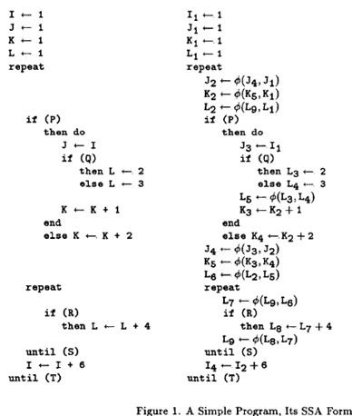
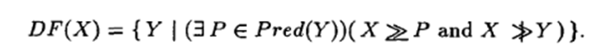
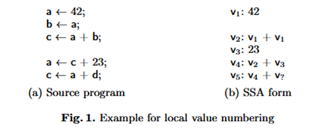
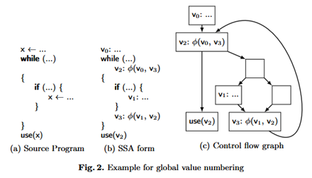

+++
title = "Simple and Efficient Construction of Static Single Assignment Form"
[[extra.authors]]
name = "Dev Patel"
[[extra.authors]]
name = "Neel Patel"
+++
# Background

[Single static assignment (SSA) form](https://compilers.cs.uni-saarland.de/ssasem/talks/Kenneth.Zadeck.pdf) and the [first efficient conversion algorithm](http://www.cs.utexas.edu/~pingali/CS380C/2010/papers/ssaCytron.pdf) emerged in the 1980's. A program in SSA form has the property that every variable assignment has a unique name. It provides a convenient way of thinking about programs which makes some optimizations more efficient. Generally, compilers put programs into SSA form before performing optimizations.

The [first published algorithm](https://dl.acm.org/doi/pdf/10.1145/75277.75280) for SSA construction, written by Cytron et al., proceeds in two steps. The first places phi functions throughout the program, indicating ambiguities in assignments due to control flow. The second renames variables to ensure SSA’s single assignment property is satisfied.
Importantly, Cytron et al.'s algorithm takes the CFG representation of the program as input. To create phi functions, it relies on calculation of the dominance frontier -- “the set of all CFG nodes Y such that X dominates a predecessor of Y but does not strictly dominate Y”:

# Contributions of [Braun et al.’s algorithm](https://c9x.me/compile/bib/braun13cc.pdf)

In “Simple and Efficient Construction of Static Single Assignment Form”, Braun et al. present an alternative algorithm for SSA construction. The main benefit to their algorithm is that it goes straight from the abstract syntax tree (AST) representation of a program to SSA form, and eschews calculation of some auxiliary data structures, like the dominance frontier.

The algorithm calculates phi nodes lazily using recursion. The main steps are (1) local value numbering to lookup values defined in the same basic block and (2) global value numbering to recursively lookup values defined in the predecessors of a basic block.

  

  

During global value numbering trivial phi functions that just reference themselves and one other value are removed. The algorithm also enables local, on-the fly optimizations such as constant folding, copy propagation, arithmetic simplification, and common subexpression elimination. If arbitrary control flow is possible (e.g., goto statements), strongly connected components of redundant phi functions (groups of phis that only reference each other and one other incoming definition from outside the group) are also removed.

# Discussion
### An efficient algorithm with nice properties
It is often the case that constructing alternative program representations and data structures incurs significant overhead -- memory for the data structures must be allocated and the corresponding construction algorithm must be executed. By eliminating the construction of the dominance-related data structures, there is an opportunity for reducing the end-to-end compilation time.
Moreover, the on-the-fly optimizations could be useful when compiling in time-constrained scenarios (e.g., just-in-time compilers), where there may not be time to run a separate pass to perform an optimization.
Some compilers enthusiasts in CS6120 found the algorithm to be unique and thought the proofs of some of its properties were elegant. Specifically, we appreciated the use of recursion to calculate phi nodes lazily and the use of strongly connected components to prove that the algorithm minimized the number of phi functions placed throughout the SSA IR.

### Potential for maintainence challenges
Because Braun et al.'s algorithm goes straight from the AST to SSA form, the compiler's front-end may become more complex. Specifically, any modularity afforded by first converting a language-dependent AST into a CFG is lost. While this may be fine for compilers targeting a single language, compiler frameworks, like LLVM, implement front-ends for multiple languages. It may become burdensome for front-end developers to always have to implement Braun et al.'s algorithm. Some developers may prefer to transform the AST into a different IR, like a non-SSA CFG, and a framework that separates these concerns seems simpler to maintain.

### Loss of data structures which may be useful for other passes
Since Braun et al.'s algorithm does not rely on the dominance frontier or dominator tree, these data structures would not be created at SSA construction time. If later analyses or optimizations that use these data structures are performed, much of the speedup from Braun et al.'s algorithm may be lost to subsequent passes. For example, the "dominates" relation is used to determine whether it is safe to perform [loop-invariant code motion](https://www.cs.cornell.edu/courses/cs6120/2025sp/lesson/8/) and the dominator tree is used for [contification](https://dl.acm.org/doi/10.1145/507635.507639), which can expose function inlining opportunities.

### Compile-time speedups? - Probably
It certainly seems reasonable that a front-end based on Braun et al.'s algorithm could significantly speed up end-to-end compilation. However, Braun et al.'s implementation in LLVM 3.1 only executed 0.28% fewer instructions when compiling all programs in the SPEC CINT2000 suite. It is worth noting that their implementation was not as highly tuned as the baseline LLVM implementation they compared against.
It is also worth noting that [some compilers and tools](#historical-context) have begun adopting Braun et al.'s algorithm for SSA conversion, lending credence to the author's claim that direct AST-to-SSA conversion could provide non-negligible speedups.

# Historical Context
SSA form and the first efficient conversion algorithm emerged in the 1980's, whereas the simple and efficient algorithm discussed in class was published in 2013. One question discussed in class was why Cytron et al.'s implementation has been the de facto SSA conversion scheme, used in the [LLVM](https://llvm.org/docs/LangRef.html) IR and other languages’ compiler toolchains (e.g., [Rust](https://github.com/rust-lang/rust/blob/master/compiler/rustc_mir_transform/src/ssa.rs)). Its ~25 year head start is one likely reason.
A few projects have adopted Braun et al.'s algorithm for SSA construction, suggesting that the algorithm may be gaining traction in the compiler community.
For example, a [SPIR-V-Tools](https://github.com/KhronosGroup/SPIRV-Tools/blob/ada1771a9f7a125573aa94fe551fdc44b45769bd/source/opt/ssa_rewrite_pass.h#L40C3-L40C3) pass converts SPIR-V functions directly into SSA form using Braun et al.'s algorithm. The [Memory SSA analysis](https://github.com/llvm/llvm-project/blob/main/llvm/lib/Analysis/MemorySSAUpdater.cpp#L29), which builds an SSA-like representation for LLVM memory operations, also uses the marker algorithm presented by Braun et al. Also, the [MIR project](https://github.com/vnmakarov/mir), which focuses on building JIT compilers currently uses Braun et al.'s algorithm for SSA construction.

Perhaps in spring of 2049, CS6120 students will be debating whether a new SSA construction algorithm will replace the marker algorithm in their favorite JIT compilers.