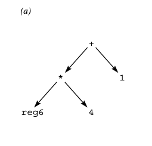
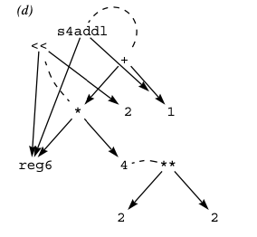

+++
title = "Superoptimization: a quest for -O∞"
[[extra.authors]]
name = "Mark Barbone"
[[extra.authors]]
name = "Zihan Li"
[[extra.authors]]
name = "Samuel Breckenridge"
+++

The -O flag makes your program faster. -O2 makes it faster still, and ideally, -O3 squeezes out even more speed, and the cost of being slower to compile. What if we could keep going? -O4, -O5, or even -O∞, getting the fastest program ever (at the expense of perhaps the slowest compiler)? This is the goal of superoptimization. In this blog post we’ll discuss the paper “[Denali: A Goal-directed Superoptimizer](https://dl.acm.org/doi/10.1145/543552.512566)”.

## Background

Although in general compilers “optimize” code while translating it to machine language, in most cases the resulting machine language will not be optimal in the sense of calculating the desired result in the fewest possible cycles. However, for some critical paths in some programs for which a programmer truly desires the best possible performance, this notion of true optimality might be appropriate. In these cases, one option is to resort to hand-written machine code. Clearly for hand-written code to approach optimality the programmer requires expert knowledge of the underlying architecture, and time to devote to iterations of optimizing and testing. If we could rely on automatic code generation to produce truly optimal code, we would be able to save expert programmer time and costs both when writing new code and when porting highly optimized code between different architectures. Denali, as a “superoptimizer”, aims to do exactly this.

Two tools that Denali uses to do superoptimization, for which some background is helpful, are e-graphs and satisfiability solvers.

### E-graphs 

An e-graph is a DAG that represents the computation of a program. Its key feature is that it allows for equivalence relations to be specified between nodes in the graph so that it may represent many equivalent versions of the same program compactly. Today, there’s been a resurgence of interest from the PL research community in this idea, in part due to the very nice [egg](https://egraphs-good.github.io/) library for e-graphs.

### Boolean Satisfiability (SAT) Solvers

Denali was one of the earliest applications of SAT solvers to code generation, an approach which has since become widely adopted in the field. For example, [Sketch](https://people.csail.mit.edu/asolar/papers/Solar-Lezama09.pdf) and [Brahma](https://people.eecs.berkeley.edu/~sseshia/pubdir/synth-icse10.pdf) both use solvers for program synthesis, although they use more general satisfiability modulo theory (SMT) solvers which in contrast to SAT solvers are not limited to just boolean formulas. At the time the Denali paper was written, SAT solvers were improving at an insane rate: for at least 10-15 years, SAT algorithms were getting faster at about the same rate as Moore’s law.  Today’s SAT solvers solve problems with ~tens of millions of variables.

## Contributions

The first attempt at automatic superoptimization came many years prior to Denali, in Massalin’s 1987 paper “[Superoptimizer: a look at the smallest program](https://courses.cs.washington.edu/courses/cse501/15sp/papers/massalin.pdf)”. However, whereas the original superoptimizer proceeded by brute force search over all possible code sequences, Denali uses a more efficient goal-directed search: first, it generates an e-graph representing a vast space of possible implementations of the desired operation by continuously applying equality preserving axioms to the input program, and second, it encodes the problem of finding the best such implementation (i.e., fewest cycles) as a SAT solver query. Although both of these techniques had been employed on their own before Denali, Denali was the first to apply both to the problem of superoptimization.

To build the e-graph, Denali starts with a very simple e-graph representing the desired behavior, and extends it incrementally with more and more equivalent ways to compute it. For this, it relies on axioms about available operations. These can be either mathematical, describing functions that are relevant to many architectures (e.g., that addition is commutative), or architectural, describing architectural operations in mathematical terms. The matcher is responsible for using the axioms to augment the e-graph with new ways the program might be computed. The below images depict the e-graph for a basic program computing (reg6*4)+1, where the second e-graph has been augmented by the matcher. Dashed lines represent that the two nodes are equivalent.

  
  

The e-graph is then converted to a system of constraints using an architecture specific timing model that encodes the cost of each operation. These constraints request a SAT solver to either prove “No program computes the result in k cycles”, or give a counterexample program. Denali uses binary search to find the least value of k that works.  The paper reports results from applying Denali to the problem of swapping the 4 lower bytes of a register, for which it took 1 minute to identify an optimal 5-cycle solution, as well as to a more complicated program computing a checksum which required 4 hours to solve.

## Is the cost prohibitive?

Clearly, Denali is limited by its relatively high running time. As illustrated by their checksum example, with a time budget of minutes to hours, they were only able to output relatively small programs, on the order of a couple dozen instructions. While both computers and tools have gotten faster over time, the problem is still fundamentally exponential: there will always be a point past which the superoptimization approach is infeasible.

However, there are still situations when pouring a lot of resources into small pieces of code can be very useful, and techniques from superoptimization can influence / inspire normal compilers as well. This [overview of recent e-graph applications](https://github.com/philzook58/awesome-egraphs?tab=readme-ov-file#program-optimization) shows a bunch of recent (mainly academic) projects using e-graphs for program optimization, in varied domains, such as compiling tensor graphs, SQL queries, and GPU kernels.

Not all of these are superoptimization: some just aim to apply similar techniques, but with the same goals as normal program optimization. In addition, algorithms originally developed for superoptimization have [been adapted](https://cfallin.org/pubs/egraphs2023_aegraphs_slides.pdf) for parts of the Cranelift compiler backend. On this note, it’s interesting to consider how superoptimization can be of use for normal compilers, more broadly. The paper “[Automatic Generation of Peephole Superoptimizers](https://theory.stanford.edu/~aiken/publications/papers/asplos06.pdf)” explored ways in which superoptimized general-purpose code snippets can be used to generate a database of transformations, and showed that it can enable signficant speed-ups for compiled code.

## The inputs to Denali

Denali’s approach takes these ingredients:

1. A program you want to be faster
2. A complete set of mathematical / architectural axioms (to find other equivalent programs)
3. A cycle-accurate CPU cost model

We are in no short supply of the first.

For (2), an incomplete set of axioms leads only to potentially missed optimizations, and they’re a pretty one-time cost: once you have a good set of axioms for an ISA, they don’t need much maintenance. It does seem that in most cases a detailed understanding of the ISA is necessary to develop complete/correct architectural axioms. In a world where Denali-style superoptimization was more prevalent we could perhaps imagine axioms being packaged as part of the specification: there are incentives for manufacturers to enable as much optimization of code on their platforms as possible, and in many cases they seem best positioned to produce these inputs. Although incomplete axioms might only lead to missed opportunities, incorrect axioms (e.g. specifying an operation as commutative when it is not) might lead to incorrect execution, so approaches to test user-specified axioms or even synthesize them in a way that is provably correct could be worth exploring. 

On the other hand, (3) seems to require quite a bit of effort: not only is designing such a cost model imposingly difficult, it also seems like an uphill battle: by the time you’re done, there’ll be a new processor to re-start the process with. The practical options seem to be either abandoning precise cycle-count as a cost model or using physical measurements to evaluate it (as [Souper](https://arxiv.org/pdf/1711.04422) and [STOKE](https://theory.stanford.edu/~aiken/publications/papers/asplos13.pdf) do, respectively).

## Scaling to different architectures and optimization targets

For some optimization targets, such as code size, it might be straightforward to come up with a precise cost model, while for targets like power consumption, it might be impossibly hard. When porting existing Denali frameworks to other architectures, many of the mathematical axioms can be reused, but extra human efforts for rewriting the architectural axioms are still required. 

If we take the approach of optimizing on the IR level, as [Souper](https://arxiv.org/pdf/1711.04422) does, we can potentially make our cost model more scalable across different architectures and efficient given the reduced search space since most of the architectural details are abstracted away. But that gain might come at the price of being more imprecise. Maybe superoptimization is in some sense not scalable by definition. We really need architecture specific information to find the optimal solution for a given target. 

## Other related work	
	
**[Superoptimizer -- A Look at the Smallest Program (1987)](https://courses.cs.washington.edu/courses/cse501/15sp/papers/massalin.pdf)**

Massalin’s original superoptimizer brute forces all enumerations of machine code sequence in a BFS manner, and accepts the shortest program that generates the correct result for all test suites. Correctness of the output program cannot be guaranteed, even if all prepared test suites are passed. The huge search space limits the length of the synthesized code sequence and the number of opcodes to explore. This approach only succeeded in finding impressive short code sequences with length around half-a-dozen instructions. With the restriction of limiting the opcodes to consider between 10-15, it can find solutions of length up to a dozen instructions. 

**[STOKE: Stochastic Superoptimization (2013)](https://theory.stanford.edu/~aiken/publications/papers/asplos13.pdf)**

The STOKE superoptimizer formulates the superoptimization task as a stochastic search problem and search with MCMC. The cost function is defined as a combination of correctness and perf improvement. This approach trades off between completeness and the size of search space. Some human annotations are required to help generate random program input used to approximate the cost function value. The level of human intervention is considered to be light work compared with the other two approaches we mentioned and expert knowledge is not required. This approach is able to handle CISC ISA (x86_64) with over 400 opcodes.

**[Souper: A Synthesizing Superoptimizer (2018)](https://arxiv.org/pdf/1711.04422)**

Souper takes a different approach to the other superoptimizers discussed, in that instead of outputting assembly, its output is IR: it both takes in, and produces as output, LLVM IR. Its algorithm is CEGIS: enumeration and testing, like Massalin’s superoptimizer, but in a loop with a verification tool that can add tests. It’s designed to be used mainly by compiler engineers, to help improve compiler optimizations: both LLVM and MSVC include optimizations inspired by suggestions from the output of Souper.

There is a body of other superoptimization work focusing on more domain specific settings ([tensor computation](https://arxiv.org/abs/2101.01332) optimization in a deep learning setting) and more restricted search spaces ([SIMD instructions](https://arxiv.org/abs/2306.00229)).