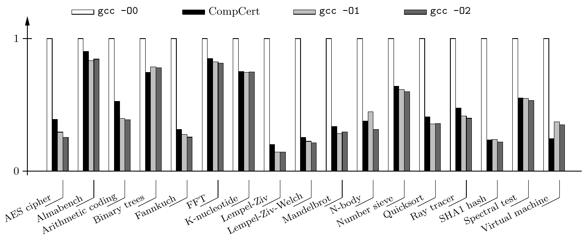

+++
title = "Verifying Software Systems: Theory and Practice"
[[extra.authors]]
name = "Edmund Lam"
[[extra.authors]]
name = "Mahmoud Elsharawy"
[[extra.authors]]
name = "Jonah Bernard"
[extra]
latex = true
bio = """
Edmund is an M.Eng student studying Electrical and Computer Engineering. He has been working in Prof. Sampson's lab on Filament and loves designing cool compilers.
"""
+++

In this blog post, we will be discussing CompCert, a verified compiler in C. We will discuss what it means for a compiler to be *verified*, how CompCert achieves this, and its comparison to other compilers.

# Trusting your compiler

Software developers generally assume that compilers preserve *semantics*&mdash; in other words, we assume that the compiled machine code behaves exactly as described by the semantics of the source program. As is true with all pieces of software, however, compilers can have bugs. In practice, complex optimizing compilers are often intensively tested, but bugs [are still being found](https://debbugs.gnu.org/db/ix/full.html). This, naturally, leads to the question of whether it is possible and useful to *formally verify* a compiler: qualitatively, is there a way to *prove* that a compiler always does what we developers expect it to?

In order to tackle this problem, we need to first look at what it really means for a compiler to be *verifiably correct*. To start, we can look at a single source program $S$ that compiles to a program $C$. What does it mean for $C$ to preserve the semantics of $S$? Naturally, we expect $C$ to *behave* the same way that $S$ would. These behaviors can be neatly summarized into three groups:

1. Termination
2. Producing a correct output
3. Crashing or "going wrong" during execution (such as accessing an array out of bounds)

Generally, programmers expect a slightly relaxed version of "always producing the same behavior." Particularly, because crashing behaviors can sometimese be optimized away, we care most about producing correct outputs and termination behavior. This leads us to our property of semantic preservation
$$\forall B \not\in \mathrm{Wrong}, S \Downarrow B \iff C \Downarrow B$$
which states that $S$ has some (non-crashing) behavior $B$ if and only if $C$ exhibits this same (non-crashing) behavior.

Another method of looking at this problem is through the lens of functional specifications. When we consider semantic preservation, what we are actually interested is in whether both $S$ and $C$ satisfy the functional specification of their behavior. Suppose we present these specifications as a predicate $\text{Spec}$, and notate $S \vDash \text{Spec}$ to mean that $S$ satisfies the predicate $\text{Spec}$. Then, we get another method to represent semantic preservation:
$$S\vDash\text{Spec} \implies C\vDash\text{Spec}$$
which says that if $S$ satisfies the specifications, so must $C$.

For a more concrete example, we may look at the implementation of a `pow` function:
```py
# performs a^b for two integers a and b
# and b >= 0
def pow(a: int, b: int):
  if b == 0:
    return 1
  return pow(a, b-1) * b
```
Naturally, our functional specification of this function is simple: we expect that the result exactly equals $a^b$. Therefore, the statement $S \vDash \text{Spec}$ can be rewritten $\forall a \in \mathbb Z, b \in \mathbb N, S(a, b) = a^b$. Therefore, $C$ would be semantic-preserving if $S(a, b) = a^b \implies C(a, b) = a^b$.

# Proving Semantic Preservation

Now that we have a notion of "correctness," we can discuss how to design a compiler that is *verifiably* correct. To do this, we rely on the existence of proof assistant languages like Coq. These languages allow developers to write software along with describing theorems and assertions about this software that are automatically checked by the proof assistant. CompCert is implemented in Coq and thus comes with the necessary proofs to ensure its accuracy.

We can view a compiler as a function $Comp(S) = \text{OK}(C)$, a compiled result, or $Comp(S) = Error$ a compile-time error. This means that for a compiler to be verifiably correct, we must have that
$$\forall S, C, Comp(S) = \text{OK}(C) \implies S \approx C,$$
or if the compiler compiles $S$ without error to $C$, we must have that $S$ and $C$ have the same semantics.

With these tools, we can now tackle proving semantic preservation using a number of approaches. CompCert uses $3$ general approaches to these proofs:

### Verified compilers
The first and generally most complex method is writing fully verified compiler code. This means that we apply proof assistant tools to thte compiler source itself, ensuring that the compiler itself maintains specifications.

### Verified Validators
A second method is to create a verified *validation* function that checks whether two programs $S$ and $C$ are equivalent. In other words, a validator function $Validate$, is verified if 
  $$\forall S, C, Validate(S, C) = \text{true} \implies S \approx C.$$
A verified compiler using this method can be easily created by throwing an error whenever $Validate(S, C)$ is not true.

### Proof-carrying code and certifying compilers

The final method uses the approach of proof-carrying code (PCC). PCC uses a *certifying compiler*, which is a compiler $CComp$ that produces a result $C$ along with a proof $\pi$ (the certificate) of the property $C \vDash \text{Spec}$. Therefore, a verified compiler can be constructed from a certifying compiler by formally verifying a client-side proof checker.

# CompCert

CompCert takes the processes we have discussed above and applies them to a realistic compiler. The formally verified CompCert compiler translates from CompCert C to PowerPC abstract syntax. CompCert C is a subset of C99 supporting all but the following:
1. Unstructured `switch` statements are unsupported by default, although this can be toggled via a commandline option `-funstructured-switch`.
2. `longjmp` and `setjmp`, which allow for non-local jumps (jumps into different program contexts).
3. Variable-length arrays.

Note that this is different from the original subset described in the CompCert paper, which instead compiles from Clight, a subset of C that excludes more features such as extended-precision arithmetic and arbitrary control flow through `goto`.

The formally verified CompCert compiler translates from CLight to PowerPC abstract syntax.

## The CompCert Compiler Pipeline


The CompCert compiler consists of a number of compiler passes that convert between $8$ different intermediate representations. In this blog post, we will discuss select passes in the CompCert compiler and how they are verified. As the CompCert project has evolved since its original paper, we will be discussing the original versions described in the paper.

#### Clight $\to$ C#minor
The first pass transforms Clight into C#minor, an IR similar to C that is typeless, meaning distinct operators are created for integers, pointers, and floats. Additionally, `while` and `for` loops are simplified away into infinite loops.

### Cminor $\to$ CminorSel
Cminor is similar to C#minor but with the distinction between scalar local variables (candiates for register allocation) whose addresses are never taken, and explicitely stack-allocated variables in the activation record.

Cminor is converted to CminorSel using an instruction selection pass, which recognizes some peephole optimizations for combined arithmetic instructions, as well as different addressing modes.

### CminorSel $\to$ RTL
RTL is a register transfer language represented by a CFG, with each node in the graph being a single machine-level instruction operating on pseudo-registers. CminorSel is converted to RTL simply by generating this control flow graph.

### Dataflow passes (RTL $\to$ RTL)

At the time of the paper, there were two dataflow analyses implemented on RTL: constant propogation and common subexpression elimination. Both these optimizations are implemented using a generic dataflow equation solver. Theorems proved about this solver and its behavior are reused in both dataflow implementations.

### RTL $\to$ LTL

RTL is converted to LTL, which is a very similar language to RTL, except with hardware registers (and stack locations) rather than abstract temporaries. Register allocation starts by finding the liveness of abstract pseudo-registers through a dataflow pass. Doing so makes it possible to build an interference graph of pseudo-registers where registers are nodes and edges between registers exist if they are live at the same time. Finally, a graph coloring algorithm is run to find a set of hardware registers (and stack locations).

To formally verify this pass, the authors use the dataflow verification, as well as a verified validator method on the graph coloring algorithm. This is because although it is difficult to directly prove that the graph coloring heuristic they use is correct, it is very easy to verify whether a graph is properly colored simply by making sure that no neighbors have the same color (register).

# Results

CompCert verifies its compiler as correct hinging on the correctness of the unverified parts of the toolchain:
1. The parsing pass of the compiler
2. Assembling and linking
3. Coq and its proof assistant algorithms must be correct
4. The Coq to Caml extractor (and thus Caml's compiler)
5. PowerPC specifications being accurate (for the specific chips used)
6. Developer software!

Although this seems like still many different points of weakness, existing projects are actively formally verifying Coq and sthe Coq to OCaml extractor. There also exists work to create a verified Caml to C#minor compiler, which takes care of the Caml compiler.

## Performance



One of the major limitations of CompCert is its relative simplicity compared to industry standard compilers like `gcc`. CompCert is competitive with `gcc -O1`, performing approximately `10%` slower than GCC $4$ at optimization level $1$.

Despite this, CompCert is still highly relevant in embedded systems for safety-critical domains such as avionics, where correctness outweighs raw performance. As it is common for safety-critical code to be compiled with minimal optimizations (due to the difficulty of source to object tracing), it is still likely that CompCert's guarantees provide significant optimizations, especially with much lower developer overhead. 
