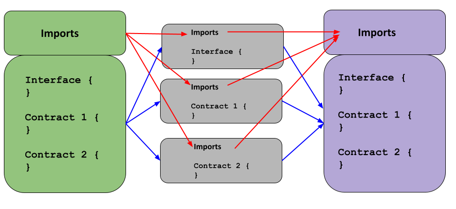

+++
title = "Implementing Multiple Contracts and Error Messaging For a Compiler for Smart Contracts"
[extra]
bio = """
  Noah Schiff is a just-graduated undergrad / CS MEng student interested in applied programming languages and optimizing software engineering.<br>
  Kabir Samsi is a third-year undergrad, interested in building programming languages and compilers that can 
  target new areas.br>
  Stephanie Ma is a first-year MS student interested in PL and compilers.<br>
"""
latex=true
[[extra.authors]]
name = "Noah Schiff"
[[extra.authors]]
name = "Kabir Samsi"
[[extra.authors]]
name = "Stephanie Ma"
+++

## Background

Our project focuses on improving and adding new features to the compiler for [Scif](https://arxiv.org/pdf/2407.01204) – a language for representing smart contracts with secure control flow. SCIF as a programmming language uses information flow and its type system to help to prevent control-flow attacks and improve improve secure smart contracts.

As both a language design and implementation paper, the [SCIF technical report](https://arxiv.org/abs/2407.01204) extensively discusses the SCIF compiler and the correctness and performance of the Solidity code it generates for SCIF programs. As such, its authors hope to eventually publish the compiler as a research artifact similar to what is required for a [PLDI Research Artifact](https://pldi25.sigplan.org/track/pldi-2025-pldi-research-artifacts) or [OOPSLA Artifact](https://2025.splashcon.org/track/splash-2025-oopsla-artifacts). The [ACM discusses different badges](https://www.acm.org/publications/policies/artifact-review-and-badging-current) an artifact can be awarded. The goal for SCIF is that the compiler can be easily setup and run by any open source contributor and that the compiler can easily validate results described in papers.

In our project, we focused on a few primary aspects – adding on the much-desired feature of defining **multiple contracts in one file**, and allowing this to work with our the compiler's current control flow and functionality; improving the quality of error messaging for malformed files; and improving the structure of the compiler's build system.

The existing compiler is frustrating to setup and finicky to run. Furthermore, for potential contributors, it's challenging to know if they introduce a regression or improvement to the codebase. We aim to improve the experience for users and contributors.

## Implementation and Features

### Multiple Contracts

A significant push involved extending our compiler to be able to properly handle multiple contracts. We implemented both a **parsing** phrase by extending our language's grammar, and then extended SCIF's typechecker and compilation to handle the delicate change with defining multiple contracts in the same file.

**Imports and Multiple Contracts**

SCIF syntax currently enables programmers to define, in a single file, either a **contract** or an **interface** – whose relationship is roughly analagous to that of a class and interface in Java. Interfaces specify signatures within contracts, who can later implement them.

More importantly, interface/contract files currently allow **importing** of definitions from other files – that is to say, other contracts and interfaces. The syntax for this is via including a series of `import` statements at the top of the relevant file. Previously, a given file was isomorphic to a given contract or interface – thus, this would cleanly bring into scope the relevant definition.

An important check earlier was to verify no circular imports – that is to say, 
This was verified by building a [topological ordering](https://en.wikipedia.org/wiki/Topological_sorting) of imported file names, and rejecting a program whose imports formed a cycle in the coresponding graph.

Updating this to work with a one-to-many relationship between files and contracts was a new challenge.

**Parsing**

SCIF presently uses [Cup](https://www2.cs.tum.edu/projects/cup/) as its parsing mechanism to define its grammar. Previously we defined a grammar mechanism that would allow for any number of imports, followed by either a single contract definition or a single interface definition – this would be parsed as a `SourceFile`, a superclass of both `ContractFile` and `InterfaceFile`. 

Our new infrastructure now parses a single source file importing multiple contracts into a list of `Sourcefiles`.It does so by initially creating a new term, `SourceFiles` without imports defined initially. Subsequently, we then
map all defined imports for a given file onto each of the generated files, for each contract. Notably, while we previously implemented a one-to-one `(Filename, ContractFile)` mapping, we now implement a `(Filename, List<ContractFile>)` which reflects the larger set of contracts being brought into scope.

**Typechecking and Circular Import Validation**

An important step in the typechecking process is ensuring smooth information flow, and ensuring that scoping makes sense. As described above, we ensure that imports logically make sense and do not get stuck, by ensuring a clear ordering of them – via a topological ordering.

When we initially parse a multi-contract file into a series of files, we map the original file name to the list now containing a series of source files, each of which **still preserves the isomorphic mapping from file to contract**. With each of these files now defined, we are able to now run a modified version of the compiler's existing `buildRoots` algorithm to construct the import tree, which both verifies no cycles and then determines which contracts and interfaces to bring into scope.

To accomodate **state**, we map current contracts to a given environment that can be accessed at any time. While previously this had been done simply via the filename, we extend this now to work with a serialized version of the filename itself, followed by the relevant contract name.

**Compilation**

At the final step of compilation, with code generation, we need to ensure that when we ultimately compile to the target language, Solidity, we don't have excessive mentioning of the same imports. This is only a relevant step once typechecking, and program validation (especially verification of no cyclic imports) has run.

Though we initially parse and then verify each file separately, this is only for the purpose of intermediate representation and validation – in the target language, we fuse these contracts and their interfaces back together in solidity.

To do so, we mark the 'first' `ContractFile` or `InterfaceFile` defined in our series of source files, based on which was defined first in the original code, with the `firstInFile` tag. Subsequently, in the resultant solidity code, we remove imports for all but the `firstInFile` attribute. Code generation then only uses `firstInFile` to generate the relevant import information, while all subsequently fused files only retain the contracts and interfaces defined within them.

Below we show an informal pipeline of the process of going from SCIF $\rightarrow$ Analysis $\rightarrow$ Solidity.




### Build System for Research Artifact

SCIF uses [SHErrLoc](https://www.cs.cornell.edu/projects/SHErrLoc/). It is written in Java but uses a different build system and uses different versions of the same dependencies that SCIF uses. Previously, SHErrLoc was duplicated in the repo and not properly linked as a submodule, causing conflicts with compiled bytecode class versions. The build system also did not properly include SHErrLoc, and conflicting versions of CUP could cause sporadic compilation and runtime issues. We work to fix this.

Previously, SCIF had no public reference manual for users. We introduce CI to build and publish a public language reference manual. Additionally, SCIF had no sanity checkers for contributors. We introduce GitHub actions to verify compilation and running of the compiler.

Finally, SCIF is currently only runnable through Gradle. This requires users to checkout the repository (and submodule), install Java and Gradle, and understand how to set up the repository. This seriously hinders the usability of SCIF as a language, as most users of a compiler simply want to run it. We begin work to untangle hardcoded paths to the local filesystem and package the compiler as a reusable, compiled JAR for distribution. 
<!-- We additionally are working to improve the build and run time of the compiler. We've began to see small improvements from our better integration of SHErrLoc, andNumerous builtin contracts are recompiled on every execution, and SHErrLoc ShAdditionally, builtin contract files are recompiled every time the compiler runs, which is un -->
The work here is still ongoing, but this will be a top priority and integral to larger SCIF project's continued success.

## Performance, Results and Testing

For multi-contract supports, we wrote 12 tests, ranging from the most simple multi-contract structure, to real-world applications like `Uniswap` with >400 LOC and containing multiple contracts. We also tested complicated import relationship and it compiles successfully without errors. For example,

```
[File 1]
import "file2.scif";
import "file3.scif";
interface B {...}
contract A {...uses B, C, D, E...}

[File 2]
import "file4.scif";
interface C {...uses E...}

[File 3]
interface D {...}

[File 4]
interface E {...}
```

This thing would compile. However, if interface `B` uses `A`, interface `C` uses `B`, or interface `C` uses `D`, the compilation will fail. 

## Challenges

Our two biggest challenges can both generally be summarized as having needed to work in a time-crunch, due to changing our project track later in the game; and the difficulties of adding on optimizations onto a codebase which was not entirely our own. We were able to get over the time hurdle by readjusting the scope of the project and working concurrently in a couple of sprints; it was also helpful to divide up tasks based on expertise and familiarity with the SCIF project. Working wtih the codebase was challenging due to the somewhat sparse documentation in places; to this effect, we've added as a part of our goal with this compiler to improve overall documentation of methods going forward.

## Conclusions

Overall, this was a fascinating project that allowed us to apply a mix of our compilers-related skills and software engineering knowledge to add a few new features and optimizations onto a language. Moreover, it was a great experience getting to work on a DSL targeted at a niche area with unique architecture, with our work having a tangible benefit from a research perspective.

There were portions of our project which are tangentially related, if not directly, to the compiler-optimization and analysis focused portion of 6120 itself; however, our work with parsing, feature design and types most definitely go hand-in-hand with much of the content. Put together, this experience has developed a strong portfolio in working with and improving compilers.