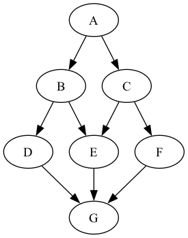
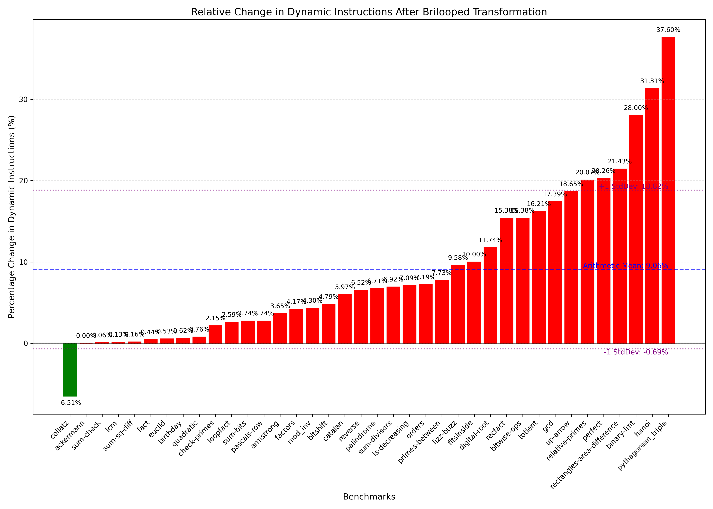
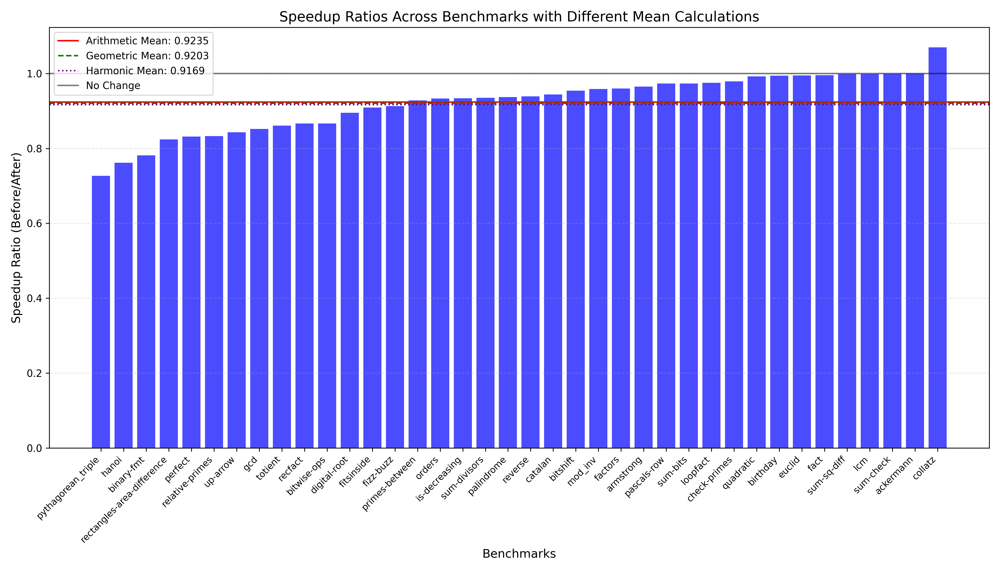
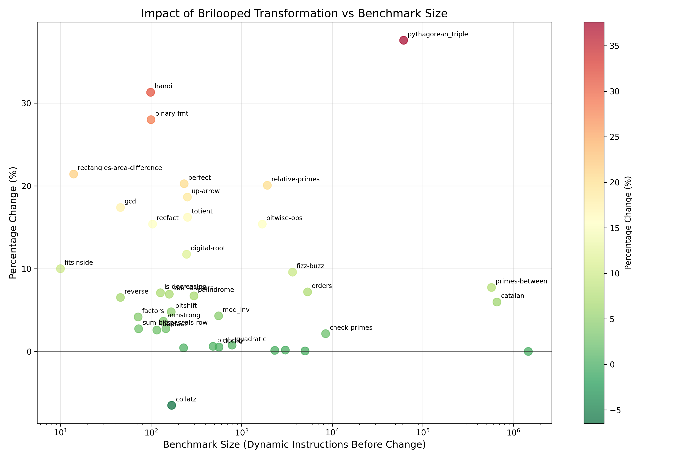

+++
title = "Brilooped"
[[extra.authors]]
name = "Gerardo Garcia Teruel Noriega"
[[extra.authors]]
name = "Dev Patel"
+++

# Brilooped

## Abstract

In this project we introduce Briloop, an extension into the [Bril programming language](https://capra.cs.cornell.edu/bril/) that supports structured control flow, this allows bril programs to use if-then-else, while, and block statements instead of relying on jumps and branches. We also implemented Ramsey's [Beyond Relooper](https://dl.acm.org/doi/10.1145/3547621) to translate bril programs into briloop automatically, having a an average performance penalty of 9% when using the core bril benchmarks. Brilooped not only enables programmers to write bril programs with structured control flow, but also enables a translation from Bril into WebAssembly.

## Representing Briloop Programs

Brilooped programs extends the Bril instruction set with the following op codes: while, block, if, break, and continue.
Brilooped extends the Bril instruction set with new control flow operations that provide structured alternatives to jumps and labels. These new op codes allow programmers to write more readable and maintainable code with familiar control flow constructs like loops and conditionals. This structured control flow can also be useful for specific applications such as WASM.

### `while`

The `while` operation introduces a structured loop into Bril programs:

- It takes exactly one argument: a string containing the name of a boolean variable that serves as the loop condition.
- It includes an additional `children` field that contains an array of arrays of `Instr` objects representing the loop body.
  - Note: this is an array of arrays to make the language a little more uniform (children field is used in both while loops and if-then-else statements)
- The condition is evaluated before each iteration. If true, the body executes; if false, the loop terminates.
- The instructions within the loop body are responsible for potentially updating the condition variable.

Example usage:

```json
{
  "args": [
    "cond"
  ],
  "children": [
    [
      {
        "args": [
          "a",
          "b"
        ],
        "dest": "temp",
        "op": "add",
        "type": "int"
      },
      {
        "args": ["b", "ten"],
        "dest": "cond",
        "op": "le",
        "type": "bool"
      }
    ]
  ],
  "op": "while"
},
```

```
ten: int = const 10;
a: int = const 1;
b: int = const 0;
cond: bool = id true;
while cond {
    b: int = add a b;
    cond: bool = le b ten;
}
```

### `if`

The `if` operation implements conditional execution:

- It takes exactly one argument: a string containing the name of a boolean variable that serves as the condition.
- It includes a `children` field with an array of arrays of `Instr` objects.
  - This will contain 1 or 2 arrays, belonging to the True and False blocks respectively.
  - When the condition is true, the first array of `Instrs` objects in the `children` is executed.
  - When it is false, the second array is executed.

Example usage:

```json
{
  "args": ["cond"],
  "children": [
    [
      {
        "args": ["a", "b"],
        "dest": "temp",
        "op": "add",
        "type": "int"
      }
    ],
    [
      {
        "args": ["a", "b"],
        "dest": "temp",
        "op": "sub",
        "type": "int"
      }
    ]
  ],
  "op": "if"
}
```

```
cond: bool = id true;
if cond
then {
    temp: int = add a b;
}
else {
    temp: int = sub a b;
}

```

### The `break` and `continue` Operations

Two additional operations provide finer control within loops:

- `break`: Takes one constant argument and exits `value` loops. This brings execution to the top of this loop.
- `continue`: Takes one constant argument and exits `value` loops. This continues execution at the following instruction.

For example the following program will print 1 and 2 forever:

```
cond: bool = const true;
one: int = const 1;
two: int = const 2;
while cond {
    print one;
    while cond {
        print two;
        continue 1;
    }
}
```

Whereas this program will print 1 followed by infinite twos:

```
cond: bool = const true;
one: int = const 1;
two: int = const 2;
while cond {
    print one;
    while cond {
        print two;
        continue 0;
    }
}
```

## Interpreter Changes

### New Language Constructs

We expanded Bril's control flow capabilities by introducing five new constructs to the interpreter type system:

- `while` - For creating loops
- `block` - For grouping instructions
- `if` - For conditional execution
- `break` - For exiting loops
- `continue` - For skipping to the next loop iteration

### Implementation Challenges

The implementation complexity varied across these new constructs. The `break` and `continue` instructions were relatively straightforward as they act as terminals in the evaluation pipeline - they simply return an action to be handled by their parent control structure.

However, the other three constructs (`while`, `block`, and `if`) demanded more sophisticated handling:

```typescript
case "if": {
    if (cond) {
        return evalBlock(children[0], state);
    }
    else {
        return evalBlock(children[1], state);
    }
}

case "block": {
    const result = evalBlock(children[0], state);
    if (result.action == "break") {
        if result.level > 0 {
            return { action: "break", level: result.level - 1 };
        }
        else {
            return NEXT;
        }
    } else if (result.action === "continue") {
        if (result.level > 0) {
            return { action: "continue", level: result.level - 1 };
        } else {
            return NEXT;
        }
    } else {
        return result;
    }
}

case "while": {
    while true {
        if (!cond) {
            return NEXT:
        }
        const result = evalBlock(children[0], state);
        if (result.action == "break") {
            if (result.level > 0) {
                return { action: "break", level: result.level - 1 };
            } else {
                return NEXT;
            }
        } else if result.action == "continue" {
            if (result.level > 0) {
                return { action: "continue", level: result.level - 1 };
            } else {
                continue;
            }
        } else if (
            result.action === "end" ||
            result.action === "speculate" ||
            result.action === "commit" ||
            result.action === "abort"
        ) {
            return result;
        }
    }
}

```

This evalBlock function was an additional evaluation helper function that was used to evaluate a block of instructions and return the resulting action. It was used to handle blocks of instructions in the children arrays:

```typescript
function evalBlock(instrs: bril.Instruction[], state: State): Action {
  for (let i = 0; i < instrs.length; ++i) {
    const instr = instrs[i];
    if ("op" in instr) {
      const action = evalInstr(instr, state);

      switch (action.action) {
        case "next":
          break;
        case "break":
        case "continue":
        case "end":
        case "speculate":
        case "commit":
        case "abort":
          return action;
        default:
          unreachable(action);
          throw error(`unhandled action ${action.action}`);
      }
    }
  }
  return NEXT;
}
```

The multi-level breaks and continues proved particularly challenging to implement, especially ensuring the correct bubble-up mechanism through nested control structures. Our solution hinged on the `level` counter, which elegantly tracks how many loop boundaries a `break` or `continue` statement needs to cross. During development, we encountered several cases where improper handling of the recursive evaluation caused programs to become trapped in infinite loops. These issues were difficult to debug — we ultimately resorted to execution profiling to trace the interpreter's control flow and identify where it was getting stuck. The resulting implementation not only handles complex control flow patterns correctly but does so with minimal additional overhead on the interpreter.

## Beyond Relooper

The Beyond Relooper algorithm was described by Ramsey as a way to translate Cmm sources into WebAssembly, for this project we adapted the algorith to translate Bril into Briloop. We'll start by providing a high level overview of the algorithm and some of the adaptations we did as the source and target languages are different from what are presented in Ramsey's paper.

The Beyond Relooper algorithm takes as input the Dominator Tree of a Control Flow Graph, with the important characteristic that the children in the tree are sorted in descending reverse post order, and produces the Briloop Program as an output. It is implemented as a recursive function over the structure of the dominator tree, where the current node is translated into either a while statement, a list of briloop instructions, or a block statement:

- A basic block is translated into a while statement if it is a loop header, we use Ramsey's definition of a block header being a loop header if it has a predecessor with a larger reverse post order than itself rather than the more standard definition of a loop header being a node that has a predecessor that it dominates.
- If a basic block is a merge node it is translated into a briloop block statement, to support breaking.
- Otherwise, the basic block is translated into a flat list of briloop instructions.

Detecting the different kinds of translations allows us to only introduce the minimal number of blocks needed for the translation.

### Merge nodes

Identifying merge nodes is a key part of the briloop algorithm, they are defined as nodes that have at least 2 in edges from nodes with a smaller reverse post order. This means that in the original control flow, there are two basic blocks that jump into it and that thse nodes do not form a loop. Detecting them is important since we need to rely on block statements and break instructions in order to reach them (see Theorem three in Peterson, Kasami, and Tokura for more info).

To see why this is needed, consider the following example (based on Ramsey):


This translation proves difficult to translate without block and break statements as two basic blocks navigate to the same basic block, in this example both B and C are connected to E. If this were expressed in a language with no go to statements, programmers might rely on duplicating the E block in both branches:

```Java
// Block A
public void foo(boolean l, boolean r) {
    System.out.println("Block A");
    if (l) {
        if (r) {
            System.out.println("Block B");
        } else {
            System.out.println("Block E");
        }
    } else {
        if (r) {
            System.out.println("Block E");
        } else {
            System.out.println("Block F");
        }
    }
    System.out.println("Block G");
```

But we want our translation to be minimal, and not rely on duplicate blocks. The beyond relooper algorithm allows this to happen by using `break n;` statements (Peterson et. al.) refer to them as multi-level exit instructions:

```code
@foo(l: bool, r: bool) {
    print a;
    block {
        block {
            if (l)
            then {
                if (r)
                then {
                    print b;
                    break 1;
                } else {
                    break 0;
                }
            }
            else {
                if (r)
                then {
                    break 0;
                }
                else {
                    print f;
                    break 1;
                }
            }
        }
        print e;
        break 0;
    }
    print g;
    ret;
}
````

This translation may not be what programmers in languages like Java may write, but since the source contains an arbitrary control flow graph and those allow these kind of statements, we need a correct way to translate them.

### Loop Nodes

Loop nodes are easier to translate, and only two conditions need to be met:

- Loop headers must be translated into while statements.
- When jumping to a loop header we use a `continue n;` instruction, where n is how many control flow statements we need to skip.

The use of while loops introduces a couple of quirks, one to the language and one to the translation from bril to briloop programs. The language quirk is that not only are you able to execute continue inside of block statements (in which case it behaves just like a break), but you the level passed to the continue statement must take into account block statements. In the following example we can see the behavior at play, foo will print a, b, c repeatedly whereas bar will print a, b
repeatedly.

```
@foo(cond: bool) {
    while cond {
        print a;
        block {
            print b;
            continue 0;
        }
        print c;
    }
}

@bar(cond: bool) {
    while cond {
        print a;
        block {
            print b;
            continue 1;
        }
        print c;
    }
}
```

The quirk from the translation to bril to briloop is that we rely on all while loops to execute forever and rely on break statements to terminate the loop execution. This has the unfortunate consequence of worsening performance for loops (especially nested ones) as we introduce a true variable before every while translation.

## Results

### Impact of Brilooped Transformation on Dynamic Instruction Count

Our analysis of the Bril to Brilooped transformation using the relooper algorithm shows significant variations in dynamic instruction count across different benchmarks. As shown in Figure 1, the majority of benchmarks (37 out of 38) experienced an increase in dynamic instruction count after transformation, with only the `collatz` benchmark showing a reduction (-6.51%) due to `br` and `jmp` instructions making up a majority of the functionality. The changes in dynamic instruction count ranged from minimal increases (below 1%) for benchmarks like `sum-check` and `lcm` to substantial increases exceeding 30% for benchmarks such as `binary-fmt` (28.00%), `hanoi` (31.31%), and `pythagorean_triple` (37.60%).



The blue dashed line in Figure 1 is the average (9.06%) change in dynamic instructions after the transformation. 11 of the benchmarks were significantly above (>15%) this average while 9 were significantly below (<1%), leading to a large standard deviation (9.75%).

### Execution Time Analysis Across Benchmarks

Figure 2 presents the speedup ratios (Before/After) across all benchmarks. The majority of speedup ratios fall below 1.0 (collatz is the only outlier), indicating an increase in execution time after transformation to Brilooped. The average performance across all benchmarks shows:

- Arithmetic Mean: 0.9235 (7.65% slowdown)
- Geometric Mean: 0.9203 (7.97% slowdown)
- Harmonic Mean: 0.9169 (8.31% slowdown)



The speedup ratios vary considerably across benchmarks, with `pythagorean_triple` showing the most significant slowdown (speedup ratio of approximately 0.73 or 27% slowdown), while benchmarks like `collatz` exhibited speedup ratios near or slightly above 1.0, indicating slight improvement to performance. Benchmarks like `pythagorean_triple` struggle in this category due to nested loops.

### Relationship Between Benchmark Size and Transformation Impact

Figure 3 illustrates the relationship between benchmark size (measured in dynamic instructions before the transformation) and the percentage change in dynamic instructions. This shows some interesting patterns:



1. The most substantial percentage increases occurred in benchmarks of varying sizes, with `pythagorean_triple` (largest at ~10,000 instructions) showing a ~37% increase, `hanoi` (~100 instructions) showing a ~31% increase, and `binary-fmt` (~100 instructions) showing a ~28% increase.

   - Briloop syntax seems to be causing lots of overhead in the smaller examples
   - Nested loops are very expensive
   - Recursion can be very expensive

2. There doesn't seem to be any strong correlation between benchmark size and the magnitude of impact from the Brilooped transformation. Both small and large benchmarks showed varying degrees of change. Benchmarks clustered around the 10^2 instruction count range had the greatest variance, ranging from approximately -6% to +31%.
   - Note: this could be a product of the benchmark suite.

### Before vs. After Comparison with Percentage Changes

Figure 4 provides a comparison of the total dynamic instructions before and after the Brilooped transformation on a logarithmic scale, along with the percentage changes for each benchmark. The top graph demonstrates that while the absolute instruction count increases for almost all benchmarks, the relative differences vary significantly.


### Summary of Findings

1. The Brilooped transformation using the relooper algorithm resulted in increased dynamic instruction counts for 37 out of 38 benchmarks, with increases ranging from negligible to substantial (up to 37.60%).

2. The overall performance impact was a modest slowdown, with average execution time increases between 7.65% and 8.31% depending on the mean calculation method.

3. The benchmarks most affected by the transformation were `pythagorean_triple`, `hanoi`, and `binary-fmt`, while `collatz` was the only benchmark that saw reduced instruction count after transformation.

4. **Most importantly, all benchmarks in the test suite produced correct results after transformation to Brilooped**, confirming the semantic correctness of our implementation of the relooper algorithm.

These results suggest that while transforming Bril code to Brilooped using the relooper algorithm introduces some overhead in most cases, the structured control flow benefits of Brilooped come with a reasonable performance cost. The high variance in impact across different benchmarks indicates that the transformation's efficiency depends significantly on the specific control flow patterns in the original code. This tradeoff seems acceptable, especially considering that all benchmarks maintained their functional correctness.

### References

Peterson, Kasami, Tokura. "On the capabilities of while, repeat, and exit statements". https://dl.acm.org/doi/10.1145/355609.362337

Ramsey, Norman. "Beyond Relooper: recursive translation of unstructured control flow to structured control flow (functional perl)". https://dl.acm.org/doi/10.1145/3547621

Leroy, Xavier. "The birth of control structures: from 'goto' to structured programming". https://xavierleroy.org/CdF/2023-2024/1.pdf
