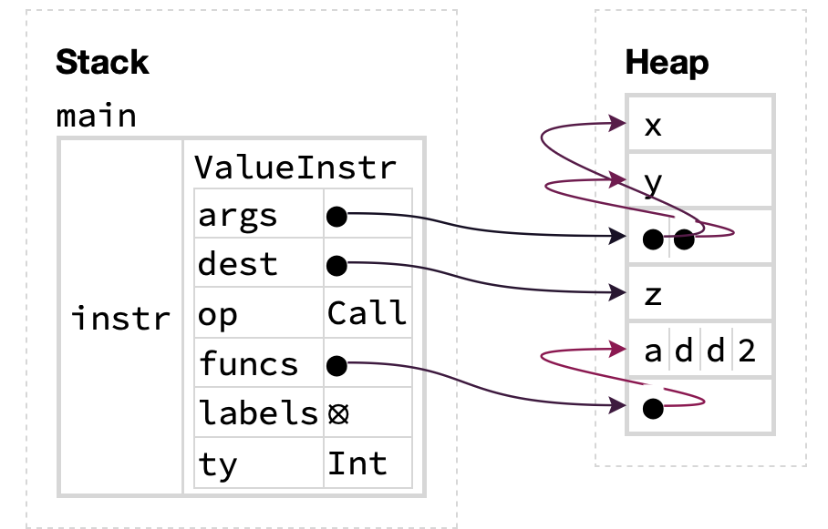
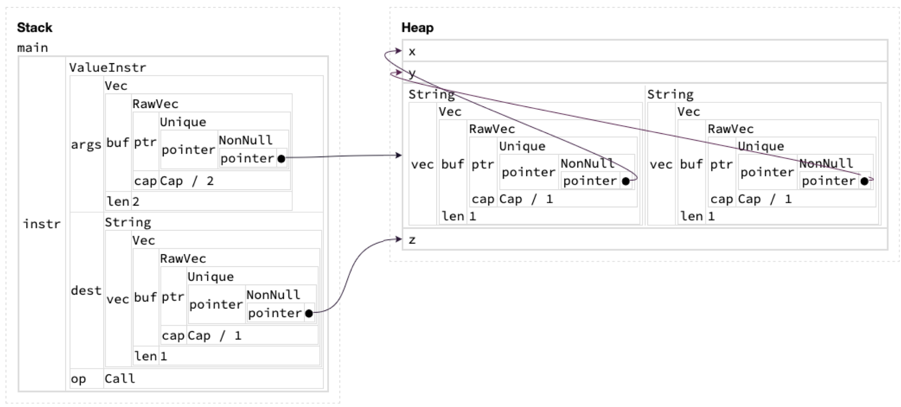
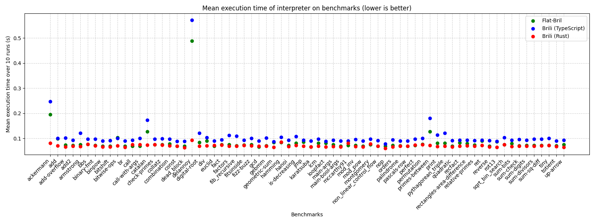
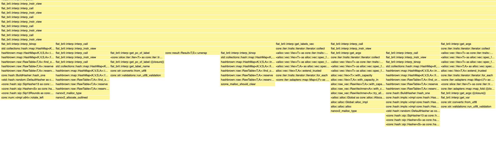
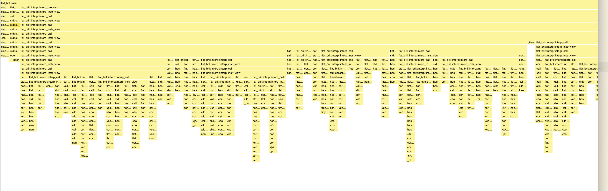

+++
title = "A Flattened Representation for Bril"
[extra]
bio = """
  Ernest, Katherine and Sam are all 1st-year CS PhD students at Cornell. Ernest & Katherine work on PL research, while Sam works on security.
"""
[[extra.authors]]
name = "Ernest Ng"
[[extra.authors]]
name = "Katherine Wu"
[[extra.authors]]
name = "Samuel Breckenridge"
+++

Typically, the way to implement an interpreter is to create an explicit AST data type, but this requires allocating AST nodes on the heap. Instead, as demonstrated in [this blogpost](https://www.cs.cornell.edu/~asampson/blog/flattening.html) by Adrian, we can flatten the AST into an array, i.e. pack all AST nodes into one single contiguous array, and refer to children in the AST using array indices (as opposed to pointers). This has enormous performance benefits!

Since Bril is based on commands rather than expressions, there are no ASTs to flatten. However, in the existing Rust interpreter, programs, functions and instructions are all represented using `struct`s that contain pointers to the heap. For instance, this is the representation of a value instruction (lightly modified for clarity):

```rust
struct ValueInstr {
  args: Vec<String>,
  dest: String,
  funcs: Vec<String>,
  labels: Vec<String>,
  op: Op,
  op_type: Type,
}
```

`Vec`s and `String`s in Rust are both implemented using pointers, so the representation is clearly not flat even before considering that functions contain pointers to instructions and programs contain pointers to functions. To make this point explicit, consider how the Bril instruction `z: int = call @add2 x y` is represented using this Rust `datatype`. We have the following:
```rust 
let instr = ValueInstr {
  args: vec!["x", "y"],
  dest: "z",
  funcs: vec!["add2"],
  op: Call,
  ...
};
```
This `struct` is represented in memory like so:
<div style="display: flex; justify-content: center; gap: 10px;">
  
</div>

(Figure generated using the [Aquascope](https://cel.cs.brown.edu/aquascope/) visualizer for Rust programs.)

Note that the `args`, `dest` and `funcs` fields are all pointers to the heap! In particular, since `args` has type `Vec<String>`, to fetch a string containing a variable name, we have to do two layers of indirection, one to get the heap pointer corresponding to the start of the `Vec`, then another to reach the actual string containing the argument. Clearly, this representation is *not* flat. This phenomenon is especially apparent when we get Aquascope to reveal the contents of the `Vec` and `String`s in the diagram above: 

<div style="display: flex; justify-content: center; gap: 10px;">
  
</div>

(In Rust, the `Vec<T>` and `String` types carry around metadata like their capacity alongside the pointer to the actual data elements.)

Hopefully, you can see by how flattening data structures is a worthwhile endeavor! (Sidenote: flattening data structures is a fruitful area of research in the PL community! The [Gibbon](https://drops.dagstuhl.de/opus/volltexte/2017/7273/pdf/LIPIcs-ECOOP-2017-26.pdf) compiler translates a functional language to a flattened representation, and there's even [work](https://arthi-chaud.github.io/posts/packed/) appearing at [ECOOP](https://2025.ecoop.org) this year about offering library-level support for data structure flattening!)

For this project, our goal was to adopt the same approach of flattening data structures and packing them into a single contiguous array for Bril. The resulting representation of Bril programs is then a flat file containing these arrays that can be directly mapped into memory and interpreted, analogous to the approach laid out in [another blogpost](https://www.cs.cornell.edu/~asampson/blog/flatgfa.html) by Adrian. This requires two main components:

1. Infrastructure to convert existing Bril JSON files to/from our flattened format
2. An alternate Bril interpreter that operates directly on the flattened data structure (as opposed to the existing interpreter `brili`, which has to parse JSON)

Our implementation is [available on GitHub](https://github.com/ngernest/flat-bril/tree/main).

## Design

### Flat data structures

A key design decision was what the flattened data structures would look like. We clearly need similar fields to those of the original representation, but we need a strategy for flattening `Vec`s and `String`s and other non-flat types. Instead of storing variables, labels and function names as `String`s and `Vec<String>`s we aggregate all the names referenced throughout a function into three contiguous arrays of bytes that are stored in our function representation. Then instead of using `String`s, our instruction representation stores pairs of indices that can be used to extract the relevant name from the function-level contiguous array. One subtlety here is that if we want to use a `Vec`, we cannot just index into the array containing all the names, we would not know where the boundaries between each name are! We need to use an intermediary array that stores indices into the top-level name array.

For instance, in a function with three variable names `"v1"`, `"v2"` and `"v3"`, the function-level variable array `arg_store` would look like `["v1v2v3....."]`, stored as a contiguous sequence of bytes. If an instruction has two arguments `"v1"` and `"v2"`, our representation stores a pair of indices `(start, end)` (inclusive) into an intermediate array `arg_idxes_store` that itself contains pairs of indices, such that if `arg_idxes_store[start..=end] = [(v1_start, v1_end), (v2_start, v2_end)]`, then `arg_store[v1_start..=v1_end] = "v1" and arg_store[v2_start..=v2_end] = "v2"`. We store the pair `(start, end)` as the start/end index for all the arguments used in our flattened instruction datatype. (In our implementation, we enforce the invariant that all arguments for the same instruction must be stored in one contiguous region in the `args_store` array, and their indexes in the interstitial `arg_idxes_store` array must also be stored contiguously.)

We applied these same ideas consistently across the original Bril representation to produce flattened versions of functions and instructions:

```Rust 
// Flattened datatype for Bril instructions
struct Instr {
    op: u32,
    label: Option<(u32, u32)>,
    dest: Option<(u32, u32)>,
    ty: Option<Type>,
    value: Option<BrilValue>,
    args: Option<(u32, u32)>, // Indirect: indexes into `args_idxes_store`
    instr_labels: Option<(u32, u32)>, // Indirect: indexes into `labels_idxes_store`
    funcs: Option<(u32, u32)>,
}

// Flattened datatype for Bril functions
struct Function {
    func_name: Vec<u8>, // Strings are represented as sequence of bytes (`u8`s)
    func_args: Vec<FuncArg>, // `FuncArg` is a flattened function argument (definition omitted)
    func_ret_ty: Option<Type>,
    var_store: Vec<u8>,
    args_idxes_store: Vec<(u32, u32)>, // Intermediate array: indexes into `var_store`
    labels_idxes_store: Vec<(u32, u32)>, // Intermediate array: indexes into `labels_store`
    labels_store: Vec<u8>,
    funcs_store: Vec<u8>,
    instrs: Vec<Instr>,
}
```

Although our function representation does contain `Vec`s to enable construction, these will be flattened to slices once the entire Function has been created.

### A flat file format

Once we have flattened all of the functions and instructions in a Bril program, we are left with an array of functions, which is a full Bril program! We needed to come up with a way of writing this array to a file so that our interpreter could read the file and recover the flat data structures. To do so we first associated a table of contents with each function. As our flat function representation consists solely of arrays of bytes or arrays of indices into other arrays, what we need to record is the size of each array. We prepend this to every function, then as the table of contents has a fixed length it can be used to recover each of the function’s individual arrays. We confront a similar problem for the program itself, as it consists of an array of functions. We address this using the same approach; the beginning of every flattened bril file contains a fixed size header that stores the size of each table of contents + flat function element in the byte array that makes up the rest of the file.

## Implementation

### Zerocopy

In order to facilitate conversion between slices of bytes and our flat data structures we used the [`zerocopy`](https://docs.rs/zerocopy/latest/zerocopy/) crate. In practice, this meant adding the [`IntoBytes`](https://docs.rs/zerocopy/latest/zerocopy/trait.IntoBytes.html) and [`FromBytes`](https://docs.rs/zerocopy/latest/zerocopy/trait.FromBytes.html) traits to our flat representations, and specifying their byte representations using Rust's [`repr` attribute](https://doc.rust-lang.org/nomicon/repr-rust.html). It ended up being quite challenging to get this working. Zerocopy was quite finicky about what was allowable in a struct using the `zerocopy` traits. We ended up needing to create new “extra-flat” versions of many of our data structures to get this to work and experimenting with different `repr` options. For instance we discovered that `zerocopy` could not convert pairs of `u32`s, or `Option`s to bytes, so we needed to create a new `I32Pair` struct that itself implemented the `zerocopy` traits (`i32` as opposed to `u32` because we used `-1` to represent the case where the `Option` is `None`). We probably could have used these extra-flat data structures everywhere, rather than converting between multiple versions, but since we had written most of our flattening logic using the original data structures we decided to stick with using new extra-flat versions. 

Our final representation of a function that worked with `zerocopy`:

```Rust
#[repr(packed)]
#[derive(Immutable, IntoBytes, ...)]
struct FunctionView<'a> {
    func_name: &'a [u8],
    func_args: &'a [FlatFuncArg],
    func_ret_ty: FlatType,
    var_store: &'a [u8],
    arg_idxes_store: &'a [I32Pair],
    labels_idxes_store: &'a [I32Pair],
    labels_store: &'a [u8],
    funcs_store: &'a [u8],
    instrs: &'a [FlatInstr],
}
```

Once we finally made `zerocopy` happy about all our data structures we were able to convert seamlessly between the in memory representations and bytes which we could directly `mmap` to disk, enabling the flat file format we envisioned as one of our goals.

When deserializing from our flat file format back to our flat data structures, we ran into a very nasty bug. On some programs we would get alignment errors when attempting to convert bytes to our data structures, but we could fix/break programs just by changing the variable names! We eventually realized that a program would crash if the total bytes used to represent all variable names (or labels, or functions) was not a multiple of 4! This was because our top-level arrays just stored all names contiguously, and so would be unaligned unless the total bytes to represent all names was a multiple of 4. To fix this we just padded all of these top level arrays with null bytes.

### Interpreting flat Bril

Once we had finished implementing our infrastructure for flat Bril representations, we implemented an interpreter that operated directly on the flat data structures. We built this interpreter from the ground up rather than trying to adapt the existing Rust interpreter. This was mostly straightforward, and we were able to model our logic after the TypeScript interpreter. The main challenges were introduced by needing to keep track of which array each pair of indices in our flat data structures was referring to. We had a few bugs caused by assuming that some indices referred to the top-level name arrays, when in fact we needed to go through an intermediate array. In hindsight we could have done a better job with our naming conventions to avoid this.

## Evaluation

For our evaluation, we decided to test flat Bril on 70 core Bril benchmarks. To check the correctness of our implementation, we used [Turnt](https://github.com/cucapra/turnt/tree/main) to verify that all benchmarks using our flat bril interpreter returned the same result as that of the reference Brili interpreter, for which we were successful. Additionally, to check the correctness of our infrastructure converting JSON files to/from our flattened format, we manually checked that the final JSON output converted back matched that of the original. To measure the performance impacts, we did the following using Hyperfine:

1. Measured the CPU wall clock time for the flat Bril, [TypeScript](https://capra.cs.cornell.edu/bril/tools/interp.html), and [Rust Brili](https://capra.cs.cornell.edu/bril/tools/brilirs.html) interpreters, comparing their performance
2. Measured the CPU wall clock time for JSON roundtrips (JSON -> flat -> JSON). (Although there wasn’t a specific baseline for this)

Below is a table showing the time taken for JSON roundtrips. We tested this on all the core benchmarks, but due to space constraints, we only list a few here. These are averaged over 10 runs, with a warmup of 3. 

(Aside: We measured these times using [Hyperfine](https://github.com/sharkdp/hyperfine) with the intermediate shell disabled using `--shell=none`. Hyperfine [corrects for the shell spawning time](https://github.com/sharkdp/hyperfine?tab=readme-ov-file#intermediate-shell) by default, and since we noticed that the JSON roundtrip occurs relatively quickly, the shell startup overhead correction would produce a decent amount of noise, so we explicitly disable this behavior in Hyperfine.)

<center>

| **Command**  | **Mean [ms]** | **Min [ms]** | **Max [ms]** |
|--------------|--------------:|-------------:|-------------:|
| `bitshift`   |     6.4 ± 1.0 |          4.5 |         11.4 |
| `call`       |     6.1 ± 0.7 |          4.6 |          9.2 |
| `catalan`    |     6.0 ± 0.8 |          4.5 |          9.2 |
| `euclid`     |     6.0 ± 0.9 |          4.2 |         10.1 |
| `main-args`  |     5.9 ± 0.8 |          4.1 |          9.4 |
| `montgomery` |     7.2 ± 4.4 |          3.5 |         84.7 |
| `nop`        |     9.7 ± 3.0 |          4.1 |         59.1 |
| `perfect`    |     9.1 ± 1.7 |          5.6 |         15.8 |
| `reverse`    |     9.2 ± 2.0 |          5.0 |         20.6 |
| `rot13`      |     9.2 ± 2.1 |          3.4 |         15.7 |

</center>

We used [Hyperfine](https://github.com/sharkdp/hyperfine) to compare the runtime of our interpreter over our flattened (`mmap`-ed) representation of Bril files, versus the [TypeScript](https://capra.cs.cornell.edu/bril/tools/interp.html) and [Rust Brili](https://capra.cs.cornell.edu/bril/tools/brilirs.html) interpreters on the JSON representation of Bril files. We ran the three interpreters on 70 Core Bril benchmarks, and for each benchmark, measured the mean execution time of the interpreter over 10 runs. From the scatter plot below, we see that Flat-Bril’s execution time is consistently in-between the TypeScript and Rust Brili interpreters (closer to the latter in many cases).  
(Benchmarks were run on a 2023 M4 Macbook Pro.)

Rust Brili outperforms our flattened interpreter for the vast majority of benchmarks, although our interpreter has the lowest execution time out of the three interpreters for a few benchmarks (`call`, `call-with-args`, `mccarthy91`). 

The benchmarks where there was the biggest discrepancy between the three interpreters’ execution time were programs with many recursive calls (`delannoy`, `ackermann`, `catalan`, `primes-between`). For these benchmarks, we notice that Rust Brili significantly outperforms both our interpreter & TypeScript Brili. Examining the source code for Rust Brili, we suspect this is because they maintain an explicit call stack data structure and associate each function with appropriate stack pointers, whereas when our interpreter handles function calls, we create brand new `HashMap`s to represent the local variables in each function, which is perhaps more expensive than their approach. 

<div style="display: flex; justify-content: center; gap: 10px;">
  
</div>

Besides comparing our interpreter with the other Brili implementations, we also used the [Samply](https://github.com/mstange/samply) profiler to figure out where our interpreter was spending most of its time. The stack chart below (obtained from the Firefox Profiler UI) demonstrates how our interpreter exectuable spends its time on the benchmark `catalan.bril` – we chose to highlight this benchmark since it has many recursive function calls and the difference between our interpreter and the TypeScript/Rust Brili interpreters’ performance is noticeable. 

The stack chart shows that most of the runtime of the executable spent was in the interpreter-related functions: `mmap`-ing the flat file  format was relatively quick, and so was converting the JSON to a flat file format (omitted from the screenshot). Zooming into the stack chart (second screenshot below) and focusing on the function calls towards the bottom, we see that when interpreting individual individual instructions, our interpreter calls a lot of standard library functions that manipulate `HashMap`s and `Vec`s. This is because the environment datatype in our interpreter is defined as `HashMap<&str, BrilValue>` (mapping variable names to a Bril value), i.e. keys in the hashmaps are (references to) strings. We realized that strings were the canonical way to represent variables in the environment, since different indexes in the arguments field of an instruction may point to the same underlying variable. However, the fast Rust Brili interpreter canonicalises variable names into a numerical representation (as described in [their blogpost](https://www.cs.cornell.edu/courses/cs6120/2019fa/blog/faster-interpreter/)), allowing for faster look-ups in their environment. We suspect that this is one of the reasons why the Rust Brili interpreter out-performs our flat interpreter. 

<div style="display: flex; justify-content: center; gap: 10px;">
  
</div>


<div style="display: flex; justify-content: center; gap: 10px;">
  
</div>

We also used `/usr/bin/time -l` to compare the memory usage of our interpreter to both reference Brili interpreters (the results below are also for `catalan.bril`): 

<center>

|                                   | Flat Bril | Brili (TypeScript) | Brili (Rust) |
|-----------------------------------|-----------|--------------------|--------------|
| Maximum Resident Set Size (bytes) | 18923520  | 57262080           | 19382272     |
| Page Reclaims                     | 3810      | 6401               | 3823         |
| Page Faults                       | 250       | 2036               | 203          |
| Voluntary Context Switches        | 158       | 126                | 89           |
| Involuntary Context Switches      | 210       | 2480               | 176          |

</center>

Our interpreter compares favorably to Rust Brili in terms of peak physical memory usage (max resident set size). Notably, our interpreter has an order of magnitude fewer page faults and involuntary context switches compared to the TypeScript interpreter (250 vs 2036 and 210 vs 2480), although it’s unclear whether this is due to our choice of implementation language (Rust vs TypeScript) as opposed to our data structure flattening strategy, since Rust Brili also has similar metrics. 

### What else could be done?
At the moment, our implementation creates `Vec`-based buffers to store the variables/labels it sees within a Bril program. Since Bril programs are unlikely to contain excessively large number of variables/labels, perhaps we could use Rust’s [`smallvec`](https://docs.rs/smallvec/latest/smallvec/) or [`arrayvec`](https://docs.rs/arrayvec/latest/arrayvec/) crates to create these buffers instead of the standard library’s `Vec` data structure. The aforementioned libraries offer specialized short vectors which minimize heap allocations, which might offer performance benefits over heap-allocated `Vec`s. However, we would need to properly benchmark these supposed benefits to see if swapping to these libraries is worth it.

We could also come up with a better way to determine the right capacity for the `Vec`-based buffers – we initialize these buffers using `Vec::with_capacity` to avoid the `Vec` from re-sizing excessively. At the moment, we use ad-hoc heuristics to pick “large enough” capacities to store all the variables/labels in the program, but perhaps we could de-duplicate variables to minimize `Vec` capacities / find a way to dynamically compute the right capacity. 
