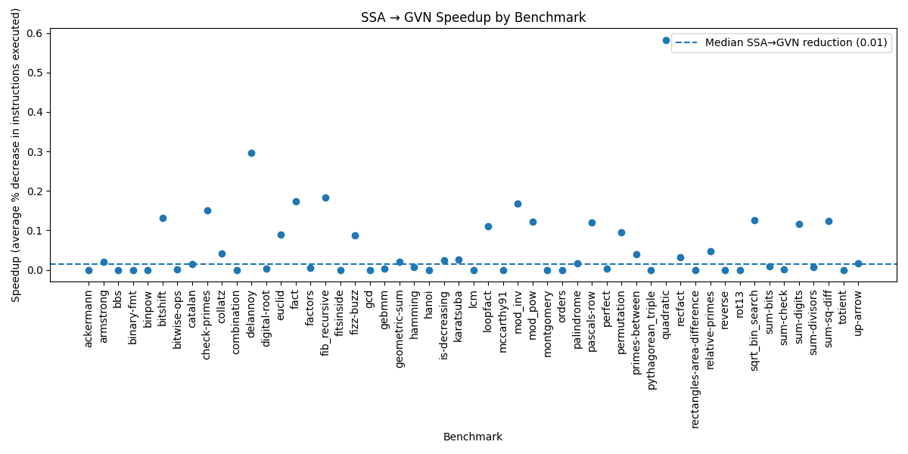

+++
title = "Welcome to CS 6120!"
[extra]
bio = """
  Allen Wang is a CS M.Eng student at Cornell University. He's pretty tired right now.
"""
[[extra.authors]]
name = "Allen Wang"
+++

### Overview

The goal of this project was to implement global value numbering for Bril programs using value partitioning. I then used this to perform redundancy elimination using available expressions and benchmarked the performance impact.

 ### Value Numbering

Value numbering is a family of program analysis techniques that involve assigning an identifying (value) number to each expression, where expressions that are guaranteed to evaluate to the same value have the same identifying number. By separating values from expressions, we can find duplicate expressions that are syntactically different but evaluate to the same value as already-existing expressions, then remove them. For example, we can use value numbering on this program:
```
sum1 : int = add a b;
sum2 : int = add b a;
prod: int = mul sum1 sum2;
```
To find out that sum1 and sum2 evaluate to the same value, then optimize it to:
```
sum1 : int = add a b;
prod: int = mul sum1 sum1;
```
We went over one value numbering algorithm [here](https://www.cs.cornell.edu/courses/cs6120/2025sp/lesson/3/). However, this algorithm assumes a single linear control flow, which means it's only suitable for local value numbering within blocks. 

### Global Value Numbering

Global value numbering is a set of techniques which perform value numbering at the level of a function, rather than a single block. [This paper](https://www.cs.tufts.edu/~nr/cs257/archive/keith-cooper/value-numbering.pdf) goes over hash-based and partitioning implementations of global value numbering. There's already a hash-based implementation for Bril and it's very conceptually similar to local value numbering, so I decided to implement value partitioning instead. 

### Value partitioning

Instead of hashing expressions to values like local value numbering, value partitioning works by directly computing congruence classes of expressions, where two expressions are congruent if they have the same opcode all their arguments are congruent with each other. To perform value partitioning, we first put a program into SSA to ensure that each value has a unique variable associated with it.  We assume that all operations of a type are in the same congruence class, then repeatedly partition congruence classes where this cannot be true until we obtain a maximum fixed point.

We implemented this algorithm for value partitioning, which was given in the paper:  
```
Initial partition: all values computed by the same opcode are in the same congruence classes

worklist = classes in initial partitio
while worklist is not empty:
	select a class c from worklist
	for each possible arg position p:
		touched = ∅
		for each value v:
			if arg p of v is in c, add v to touched
			for each class s where some but not all members are touched:
				n = s & touched
				s = s - n
				if s in worklist:
					add n to worklist
				else:
					add smaller of n and s to worklist
  ```
After this, we pick a representative for each congruence class, then replace every operation of that type with the representative.

### Redundancy Elimination
After standardizing our program to use values instead of expressions, we still need to convert this into a performance improvement. To do this, we use an available expressions dataflow analysis to calculate which values are available at each point in the program. Fortunately, the properties of the renaming algorithm make it very easy to define the analysis for calculating available expressions.

- The initial input is the empty set.
- The transfer function takes the union of a block's input and every expression in the block. If an expression already exists, it's redundant and can be removed.
- The merge function takes the intersection of all the outputs of a block's predecessors.

I also tried implementing partial redundancy elimination, which moves computations that are redundant along some execution paths back through the control graph to turn them fully redundant and optimize them away. This can be accomplished by performing global analyses to determine where computations can be safely moved and where moving them would save time, but I didn't have time to fully wrap my head around this and fix the bugs.

  

#### Implementation Notes

Getting GVN right was very finicky and required reading the text very carefully. My biggest struggles in the end were first understanding the processing algorithm, then figuring out and debugging all the edge cases that arose from not reading the paper carefully enough.
  

### evaluation

For correctness, I ran my optimizations on the core benchmarks with different inputs to test whether they would cause problems. I also wrote a series of test cases for various edge cases and optimizations GVN should be able to identify.

For performance, I tested against the core benchmarks, using the same inputs as the correctness tests. I found that using only the AVAIL-based removal resulted in a median improvement of 1.5% less instructions executed over base SSA and a max speedup across runs of around 58% less instructions executed. Most of the benchmarks were written directly in Bril, so they were relatively optimized and there were few opportunities to identify congruence classes across blocks. 

