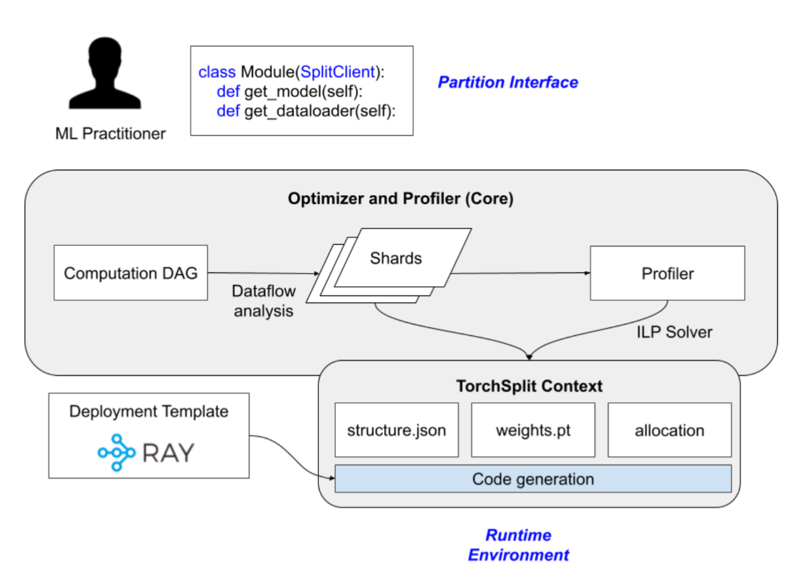
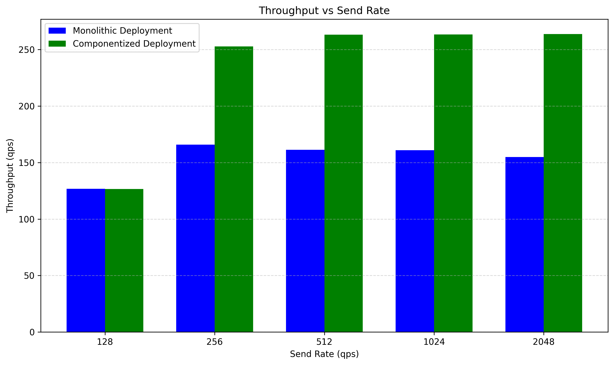
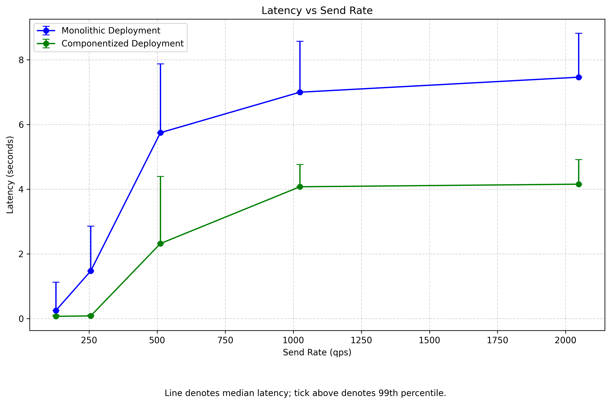

+++
title = "Torchsplit: a Compiler Analysis for Graph Decomposition and Parallel Execution on Neural Networks"

[[extra.authors]]
name = "Jeffrey Qian"
[[extra.authors]]
name = "Ann Zhang"
+++

## Context and Problem Statement

Modern machine learning (ML) systems increasingly rely on multimodal models that combine multiple data sources into a single inference pipeline. These model types are extremely useful because of their flexibility, but they also pose an interesting systems challenge: how can we efficiently serve them at scale on multi-GPU hardware?

In practice, many deployments treat these models as monolithic black boxes. If a model is too large to fit on a single GPU, ML practitioners typically rely on model parallelism techniques such as pipeline parallelism (where different layers are executed on different GPUs), tensor parallelism (where a single layer is distributed across multiple GPUs), or data parallelism (where multiple replicas each process a minibatch). While effective, this approach ignores the internal structure of multimodal models, often leading to poor resource utilization and unnecessary bottlenecks.

In this blog post, we explore the idea that multimodal models are not monolithic—they are structured dataflow graphs with branches, joins, and components that have different compute and memory characteristics. If these components could be identified, separated, and scheduled independently, a serving system could exploit this component-level parallelism and allocate resources to alleviate bottlenecks. However, doing this is nontrivial: it requires extracting a model’s internal structure, determining which subgraphs can be safely split without changing semantics, understanding how each component’s performance scales with available GPU memory, and allocating components across GPUs in a way that improves end-to-end performance.

To address this challenge, we present TorchSplit, an end-to-end system that automatically decomposes PyTorch multimodal models into parallelizable components and optimizes their deployment across multi-GPU hardware. TorchSplit combines static dataflow analysis, profiling under memory constraints, and optimization-based resource allocation, and integrates with a production serving framework to execute the resulting deployment plan. The goal of TorchSplit is not to change model accuracy or architecture, but to improve serving throughput and latency by better leveraging existing hardware.

This post reports on the design, implementation, and evaluation of TorchSplit. We describe how the system extracts safe-to-split components from PyTorch models, profiles and allocates GPU resources to those components, and executes them in a distributed serving environment using Ray Serve. We then evaluate TorchSplit on a real multimodal model and show that componentized serving can significantly outperform a traditional monolithic deployment under high load.

## Implementation

TorchSplit is implemented as a tool that takes a PyTorch model as input and produces a componentized serving configuration. The process begins by tracing the model’s forward pass using Torch FX, which converts the execution into FX graph intermediate representation (IR). This is a graph IR, each node corresponds to a specific (op)eration and edges represent the dataflow between operations through targets (variable names).  Because Torch FX cannot trace control flow with fake tensors, the user must provide concrete tensors with known dimensions. Torch FX can represent control flow using phi nodes. From this traced representation, TorchSplit constructs an internal directed acyclic graph (DAG) in which nodes represent values and edges represent dataflow. 

To determine which parts of the model can be safely separated, TorchSplit analyzes the graph to identify Single Entry Single Exit (SESE) regions, defined by two nodes, A and B. To form a SESE region, A must dominate B (All paths from entry to B must go through A), and B must postdominate A (All paths from A to exit must go through B). In a dataflow graph, this property ensures that the interior of the region has no incoming edges from outside the region, allowing it to be extracted as an independent component with A acting as the input boundary and B as the output boundary.

We compute dominators and post-dominators using the Lengauer–Tarjan algorithm and enumerate all O(n^2) candidate node pairs to identify valid SESE regions. Since many such regions may exist, the system greedily selects the largest disjoint regions, which typically correspond to meaningful model components such as modality-specific encoders. The remaining nodes form smaller coordination regions that handle data routing between components.

Once the model has been decomposed into components, TorchSplit profiles each component independently to understand how its performance scales with available GPU memory. Using PyTorch’s profiler and NVIDIA’s APIs, the system measures execution time, throughput, and memory usage across a range of batch sizes while explicitly capping the memory available to each process. This produces a function for each component that maps memory availability to achievable throughput, enabling TorchSplit to reason about trade-offs among replication, memory slices, and overall system performance.

Given these profiles and a target multi-GPU environment, TorchSplit formulates resource allocation as an optimization problem. Each GPU can be partitioned into memory slices e.g. [8,8,8,8,8] GB slices for a 40 GB A100 GPU, each of which can host a replica of a component if the slice is large enough. The optimizer selects one memory layout per GPU and assigns component replicas to slices; the objective is to find the allocation, subject to resource constraints, which maximizes the minimum throughput across all pipeline components. The result is a concrete deployment plan that specifies how many replicas of each component to run and how GPU memory should be allocated. This ILP problem is formulated and solved using Gurobi via the gurobipy Python API. 

Finally, TorchSplit exports each selected component as an independent serialized PyTorch module, along with a context file that describes the global dataflow graph and execution plan. At serving time, a runtime loads only the components required for each replica. The system integrates with Ray Serve and uses. GPU allocations derived from the ILP solver. 

## Evaluation

We ran experiments on one Perlmutter node with 4 40GB NVIDIA A100 GPUs. We used the HuggingFace food101 image classification dataset; each item consists of an image and a classification label which is converted to a text prompt. This image, text pair forms the input to the CLIP model. We deployed our models on Ray Serve. 

We measure the performance of a monolithic deployment of the CLIP model as our baseline. Specifically, this configuration places one copy of the full CLIP model on each of the 4 GPUs; this is the naive way of replicating across available resources, and is standard for model inference. 

The deployment configuration for the split CLIP model is somewhat more complicated. The goal is to efficiently pack components onto the available GPU resources to achieve better performance. We do this using an ILP solver following the procedure described in the previous section. A quick note -- for this project, we made a couple of simplifications: we did not consider batching, and we set the GPU memory requirements for each component to be 8GB, since that’s the maximum that any component needs (and some require far less). This means that our allocation is actually less than optimal, and we can do even better; see some more comments on this in the ‘Future Work’ section. 

The allocation that this yields has 9 copies of component A, 8 copies of component B, and 3 copies of component C; intuitively, we can validate that this seems reasonable, since our profiling results showed that component C has the highest throughput. Ray allows us to manually configure model deployments by specifying the number of replicas and GPU resources for each component; we assigned each copy of each component 0.2 GPUs, per our assumption above that 8GB is sufficient. 

We measure end-to-end latency, throughput, and GPU utilization across a few different send rates. We run each experiment for 5 seconds (5 * qps queries). Latency is the time elapsed between when a client sends a query and when it receives the response; throughput is calculated as the total number of queries divided by the total time elapsed between when the first query is sent and the last response is received. 

We observed that the componentized deployment does indeed outperform the monolithic baseline at higher send rates. At the lowest send rate (128 qps), both are able to reach throughput almost equal to send rate, meaning the servers are able to meet load requirements. The monolithic deployment is unable to sustain a throughput of more than around 165 queries per second; the componentized deployment hits its limit at about 260 queries per second, about 57% higher. 

The componentized deployment also achieves much lower latencies at higher send rates than the monolithic one. The bulk of these multi-second latencies is queueing time; the actual model runtime for a single request is on the order of 10ms. Even with the stage-to-stage handoffs required in the componentized deployment, it performs much better. 

Finally, we found that the componentized deployment achieves better GPU resource utilization. We queried GPU utilization % and memory usage statistics for each GPU (using nvidia-smi) every 100ms while the program was running. The monolithic deployment averaged about 25% utilization and 1215 MiB memory; the componentized one attained 46% utilization and 5100 MiB memory. There’s definitely still a lot of room for improvement here; this goes back to optimizing the allocation. 

## Future Work

There are a lot of things we can do to further improve performance. As mentioned previously, we can do a better job of allocating components to GPUs. This would involve doing more thorough profiling; since many ML models scale well with batching, benchmarking throughput and GPU utilization at different batch sizes would allow us to determine the optimal max batch size and specify inputs to the ILP based on that.  MIG partitioning and finer grained GPU profiling could also help us get to better resource utilization and performance.

Stage to stage handoffs introduce overheads in a componentized deployment which do not exist for a monolithic application, so minimizing them is important. Ray stage to stage handoffs are done via TCP; this is slow, and different model serving platforms may offer the opportunity to use RDMA. Depending on the hardware platform, NVLink might also be possible. 
