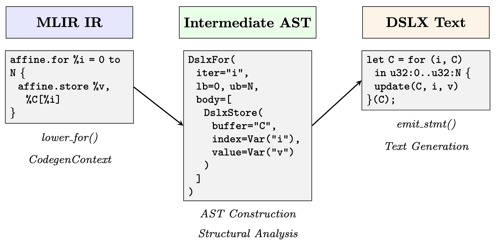
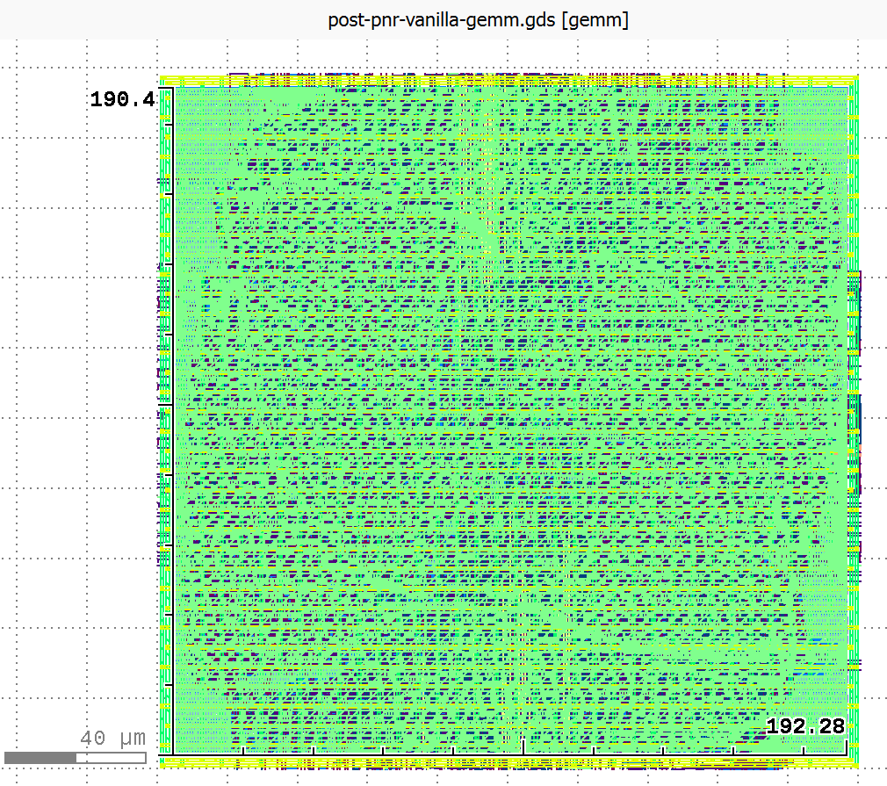
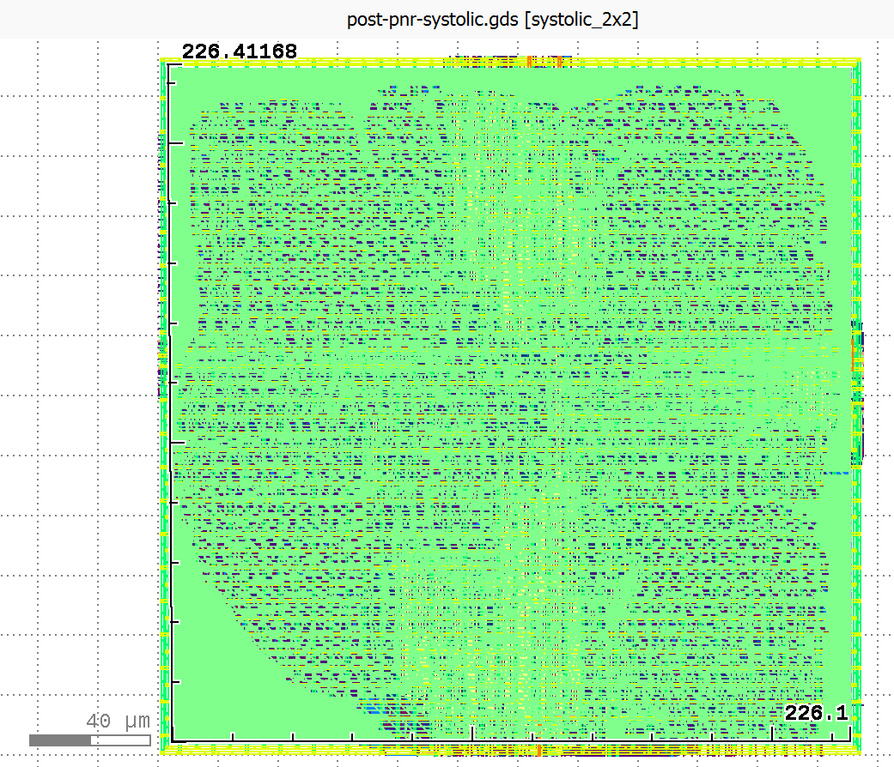

+++
title = "From Allo to XLS: Bridging Hardware Accelerator DSLs Through Traditional Compilation to ASIC Backends"

[extra]
latex = false
bio = """
Cynthia Shao is an undergraduate junior studying ECE and CS at Cornell. In her free time she likes to crochet, knit, make fun matcha drinks, rock climb, and perform Chinese martial arts. 

Nikil Shyamsunder is an undergraduate junior studying Math and CS at Cornell. In his free time he likes trying to solve gerrymandering with algorithmic game theory, listen to Agatha Christie audio books, and go on scenic walks. 
"""

[[extra.authors]]
name = "Cynthia Shao"
[[extra.authors]]
name = "Nikil Shyamsunder"
+++

## What's the Goal?

Hardware accelerator design increasingly relies on portable compilation flows that can target diverse backends without extensive manual retargeting. This project explores building a compilation pathway from Allo, a Pythonic MLIR-based hardware accelerator DSL, to Google's XLS hardware synthesis ASIC backend. 

Our compiler implements lowering passes from Allo's intermediate representation to both DSLX (XLS's Rust-inspired hardware DSL) and XLS IR.

We focus on two major compilation challenges:
1. **Feedforward function lowering**: Translating imperative Allo kernels with mutable memory into XLS's pure-dataflow (`fn`) representations.
2. **Systolic array generation**: Mapping more complex Allo kernels with special customization and scheduling constructs to XLS's stateful `proc` representation that models hardware as Kahn process networks with FIFO channel communication. To make this problem tractable for the purposes of a course project, we focus specifically on systolic arrays for matrix multiplication.

We split this goal into a few benchmarks:

**Stage 1: Naive Matrix Multiplication**  
Direct triple-nested loop with reduction over the shared inner dimension. This established the basic lowering pathway: loops, types, indexing, etc. from Allo IR into DSLX or XLS IR.

**Stage 2: Optimized Matrix Multiply Kernels**  
Tiled, reordered, and pipelined variants that Allo can express. These introduced loop tiling and reordering transformations, as well as handling Allo kernel compositions. This demonstrated our backend could handle realistic optimization styles.

**Stage 3: Small Fixed-Size Systolic Arrays**  
A 2×2 grid of processing elements representing Allo's dataflow patterns. This required recognizing local data movement through FIFOs and mapping to XLS procs connected through channels.

We originally wanted to commit to supporting: static loop nests, reductions, simple grid loops, temporary buffers, and basic arithmetic over various integer and float types. While we were able to hit most of these, our current implementation only supports `u32` for types in `fn` lowering, and due to limited support for memory integration XLS, we decided against handling memory optimizations. 

## Implementation

The full implementation is open source at [https://github.com/Nikil-Shyamsunder/allo-xls-backend/blob/main/allo/backend/xls/README.md]. 

### Feedforward Function Lowering (Source to DSLX)

DSLX functions served as our initial compilation target, providing a high-level functional representation within the XLS ecosystem. DSLX functions are fully unrolled and turned into pure dataflow that can be pipelined by the XLS compiler. We started with source to DSLX (partially because the Allo MLIR is quite similar in structure to DSLX, and partially because we were struggling to build XLS from source initially and the available binaries included the DSLX interpreter, but not the IR interpreter).

Our lowering pass implements an AST-mediated translation in two phases. First, the `MlirToDslxLowerer` class walks the MLIR function body, dispatching each operation to specialized lowering methods that construct an intermediate abstract syntax tree. A `CodegenContext` object tracks MLIR-to-AST value bindings, memref shapes, and loop nesting structure. Only after the entire function transforms into AST form do we recursively generate the serialized DSLX.

Below is a visualization of an example flow from Allo MLIR excerpt through to AST, which emits DSLX code via a serializer.


### XLS IR Lowering

XLS IR serves as an alternative, lower-level compilation target. Unlike DSLX, which requires parsing and compilation, XLS IR can be directly interpreted or JIT-compiled using XLS's `eval_ir_main` tool. XLS IR is a pure dataflow representation in SSA form. Because of the regularity of the IR, we can generate this code while we walk the MLIR, without having to create an in-memory AST, simplifying the flow.

Where DSLX preserves loop structure through functional for-expressions, XLS IR eliminates loops entirely through unrolling. Multi-dimensional arrays are represented as one-dimensional arrays in XLS IR, requiring explicit linearization. For a 2D memref of shape N×M, a load `affine.load %A[%i, %j]` translates to computing `linear_idx = i * M + j`, then `array_index(A, indices=[linear_idx])`. Array updates are more intricate, and for each store we generate a fresh array name, and the lowerer must rebind all subsequent references.

### Systolic Array Generation (Method 1)

XLS organizes computation as communicating processes based on Kahn process network semantics. A `proc` represents a stateful concurrent process with three components:
- A `config` function declaring and wiring communication channels
- An `init` function establishing initial state values  
- A `next` function implementing a single state transition by consuming inputs, updating state, and producing outputs

Rather than attempt general lowering from arbitrary Allo programs to explicit state machines (an intractably hard problem), we adopt a pattern-matching approach that specifically recognizes systolic array structures in MLIR and generates corresponding XLS grid implementations. We extracted metadata from the MLIR that drives a builder. The builder constructs DSLX proc ASTs for the PE and for the systolic grid that is then serialized.

To see the generated XLS, see this link: https://github.com/Nikil-Shyamsunder/allo-xls-backend/tree/main/allo/backend/xls/examples/systolic

### Meta-Systolic Arrays (Method 2)

Beyond the basic pattern-matching approach for library-style systolic arrays, we developed a lowering strategy for systolic arrays expressed using Allo's metaprogramming constructs. However, the key challenge is that Allo's `meta_if` constructs are compiled away before we see them—by the time our compiler receives the MLIR, the conditional code generation has already happened.

When Allo compiles a dataflow kernel like:
```python
@df.kernel(mapping=[P0, P1])
def gemm(A, B, C):
    i, j = df.get_pid()
    with allo.meta_if(i == 0):
        # Load B columns
        ...
    with allo.meta_elif(j == 0):
        # Load A rows
        ...
    with allo.meta_else():
        # Interior PE: MAC computation
        ...
```

The resulting MLIR contains separate functions for each grid position: `gemm_0_0`, `gemm_0_1`, `gemm_1_0`, `gemm_1_1`, etc. Each function has different code depending on which `meta_if` branch was selected for that `(i, j)` coordinate at compile time. The challenge of this approach was that we had to reverse-engineer the spatial structure and PE types from this unrolled representation by analyzing the behavior of each generated function.

To solve this, we utilized pattern matching using `SystolicDetector.is_metaif_systolic()` method by searching for multiple `gemm_i_j` functions, functions containing multiply-accumulate logic (interior PEs), and functions with only loads or stream operations (edge handlers). A meta-if systolic array is detected when there are ≥4 `gemm_i_j` functions and at least one contains MAC computation. The `MetaIfSystolicTranslator` analyzes each unrolled function to classify its role (MAC PEs, input loaders, and drain PEs). From the function names, we extract grid dimensions. We also extract the K loop bound from interior PE functions. Once we have this metadata, we plug this into the builder from Method 1.

## Challenges

### The lowering passes
For lowering Allo kernels into DSLX `fn`s, the biggest conceptual challenge was bridging the semantic gap between Allo's imperative memory model and XLS's functional purity constraint. Allo programs freely perform `affine.load` and `affine.store` operations on memref buffers, treating arrays as mutable storage. DSLX forbids in-place mutation. To bridge this gap, we translate each `affine.store` into a DSLX `update` expression. For a 2D store like `C[i][j] = value`, the lowering emits `update(C, i, update(C[i], j, value))`, constructing a new array rather than mutating in place.

Meanwhile, the systolic array lowering is brittle in ways that feel unsatisfying from a compiler engineering perspective. We rely heavily on syntactic heuristics (e.g. substring matching on function and buffer names, regular expression parsing of stringified MLIR expressions, hardcoded assumptions about argument positions and nesting depths) rather than true semantic analysis. A robust solution would require either significantly more sophisticated pattern recognition using static analysis and dataflow analysis or a general IR transformation framework capable of inferring process networks from arbitrary imperative code. Both are substantially harder problems than we could tackle in this project. Our approach works for the systolic arrays Allo generates today, but it's fragile.

### XLS Toolchain Quirks

Getting systolic arrays to compile through XLS's full pipeline (DSLX → IR → optimized IR → pipelined Verilog) required substantial debugging. We had to systematically debug by isolating which XLS passes were failing, then examining the intermediate IR representations and optimizations applied.  This debugging process was time-consuming and required deep understanding of XLS's internal pipeline stages. Documentation was sparse for these advanced features, so we relied on reading XLS source code and experimenting with minimal test cases. Professor Sampson's pointer to the [XLS matmul_4x4 example](https://github.com/google/xls/blob/main/xls/examples/matmul_4x4/matmul_4x4.x) and the [proc tutorial](https://google.github.io/xls/tutorials/how_to_use_procs/#channel-arrays-and-loop-based-spawning) proved invaluable for understanding channel arrays and loop-based spawning patterns. In the midst of lowering the designs to Verilog, we found a bug in the default fifo configurations, which was fixed the next day! But, during the process of this project we found out that the golden matmul example couldn't properly lower to Verilog, as XLS's scheduling created circular dependencies within their fifo configuration. Thus, we had to create our own XLS systolic array example by playing around with DSLX and seeing what could actually get lowered to Verilog.

### Verilator Simulation Infrastructure

Setting up cycle-accurate simulation required building a complete testbench infrastructure. We created generic design under test (DUT) files for Verilator, and scripts to run the Verilator test file under different matrix sizes and codegen with different pipeline stages. We additionally implemented cycle-by-cycle output checking, and added scripts to generate CSVs to output the cycles in a digestible manner. For systolic arrays, this was particularly complex because we needed to feed matrix data into edge channels following the correct protocol, respect valid/ready handshaking on FIFO channels, collect results at the right time after K iterations complete, and verify correctness despite cycle-level timing variations. Getting the timing right required careful analysis of the generated Verilog to understand XLS's channel implementation and synchronization behavior.

## Did It Work?

### Function Lowering: Correctness Results

Our feedforward DSLX lowering successfully compiles a range of GEMM kernels with varying matrix dimensions and Allo scheduling transformations. We generated correct DSLX for 2×2, 4×4, and 32×32 matrix multiplications, exercising different Allo scheduling primitives:
- `bench_simple`: unscheduled baseline
- `bench_split_outer`: outer loop tiling  
- `bench_split_inner`: inner loop tiling
- `bench_split_both`: two-level tiling
- `bench_split_reorder`: loop reordering
- `bench_compose`: composed transformations

Each variant produces syntactically and semantically correct DSLX functions that pass validation via the DSLX interpreter on handwritten tests, that produce analogous outputs to tests run at the Allo level.

For XLS IR generation, we successfully generated unrolled XLS IR for 4×4 GEMM benchmarks across all scheduling variants. The generated IR executes correctly under `eval_ir_main` (the XLS IR interpreter) under similar tests as those run at the DSLX level, and which once again provide equivalent outputs to analogous tests run at the Allo level.

### Systolic Lowering: Correctness Results

Both the library-style systolic lowering and the meta-systolic system successfully generates synthesizable XLS procs for 2×2, 3×3, and 4×4 grids validated at the DSLX level through handwritten DSLX test procs for floats and integers, and through Verilator simulation for integers. These tests cover edge and naive cases like multiplying by the identity matrix and multiplying by the 0 matrix, as well as non-trivial matrix multiply examples that yield identical outputs at the Allo/Python level.

Our systolic array lowering was also synthesizable.

 

Above are schematics of final place and route for the manually compiled vanilla 2x2 uint32 gemm and the 2x2 uint32 manually compiled systolic design from the Allo library. 

### Performance Results: Cycle-Accurate Simulation 

We performed Verilator simulation on several designs to validate functional correctness and measure performance. Here are the key results for our manually-compiled baseline GEMM and various systolic configurations (the library-style and meta-if systolic designs in Allo all lowered have the same latency because they use the same builder):

**2×2 Designs (K=2):**

| Design | Type | Pipeline Stages | Cycles |
|--------|------|----------------|---------|
| Combinational GEMM | uint32 | 5 | 5 |
| Systolic | uint32 | 2 | 18 |
| Systolic | uint32 | 3 | 19 |
| Systolic | uint32 | 5 | 22 |
| Systolic | float32 | 2 | 16 |
| Systolic | float32 | 3 | 17 |
| Systolic | float32 | 5 | 18 |

The combinational GEMM designs complete in just 5 cycles regardless of source-level optimizations. This is because XLS's optimization passes completely unroll all the high-level structural variations in loops. These loop optimizations would probably only make a difference in conjunction with more complex memory optimizations and pipelining. All Allo scheduling transformations (split, reorder, compose) produce identical cycle counts after synthesis.

Systolic arrays show higher latency (16-30 cycles for 2×2) but scale better for larger matrices. The latency increases with pipeline depth as expected, with deeper pipelines trading latency for higher maximum frequency. Notably, all designs with pipeline depth 1 failed Verilog generation. It seems that XLS requires at least 2 pipeline stages for proc networks to synthesize correctly.

**Larger Grid Results:**

| Design | Rows×Cols | K | Type | Pipeline Stages | Cycles | Status |
|--------|-----------|---|------|----------------|---------|--------|
| Systolic | 3×3 | 2 | uint32 | 2 | 26 | PASS |
| Systolic | 3×3 | 2 | uint32 | 3 | 27 | PASS |
| Systolic | 3×3 | 2 | uint32 | 5 | 30 | PASS |
| Systolic | 3×3 | 2 | uint32 | 7 | 41 | PASS |
| Systolic | 4×4 | 4 | int32 | 2 | 38 | PASS |
| Systolic | 4×4 | 4 | int32 | 3+ | - | NO OUTPUT |

The 3×3 design scales as expected, with cycle count growing roughly with grid size. However, the 4×4 design with K=4 fails to produce valid output for pipeline depths ≥3, hitting the 1480-cycle timeout. This suggests XLS's scheduling algorithms struggle with larger proc networks at higher pipeline depths, possibly due to channel synchronization deadlocks or state space explosion in the scheduler.

The 18-cycle systolic latency breaks down into:
1. PE pipeline execution across K=2 iterations (~8-10 cycles)
2. State machine coordination overhead (~3 cycles)  
3. Result collection (~4 cycles) for sequential gathering from all PEs


**Scalability Implications:**

For 2×2 matrices, combinational designs dominate, at least with our XLS systolic array design. However, extrapolating to larger matrices there may be an inflection point where systolic arrays begin to dominate.

## Future Directions
1. Handling more Allo Constructs: in particular, more of the Allo customization and scheduling primitives, particularly those having to do with memory.

2. Extending Pattern Coverage: the current systolic array pattern matcher could be extended to recognize other regular structures, or generalized to handle more complex systolic layouts and massage them into `proc`s. 

3. Choosing between `fn`s and `proc`s : Currently, our `fn` passes and our `proc` passes our disjoint. It would be nice if a user could specify what they want to lower into pure dataflow `fn`s vs. what they want to be a proc. Perhaps we could allow a pre-codegen flag in the MLIR that a user can specify to make this decision. Or we can use loop trip count analysis to decide between unrolling and proc-based iteration.

5.  Automated Design Space Exploration: The meta-systolic system demonstrates automated variant generation, but we could extend this to use synthesis results to guide further generation (iterative optimization)


## Aside: Surprising Findings compared to the LLM Generation

Our research partners explored an alternative compilation approach using LLM-based agents (see [our project video](https://www.youtube.com/watch?v=OcR5Z9o5RB4&list=PLRvJfry30-22JzxHU2XuGQe0oJeMk-9bm&index=11) for details). Remarkably, they found that LLM-generated DSLX code, after passing through XLS's optimization and synthesis pipeline, converged to **identical hardware implementations** as our manually-compiled code. All designs are 2x2 uint32 matmuls, vanilla gemms pipelined to 5 stages, and the library systolic to 2 (empirically evaluated to be the best), with cycle counts from Verilator, and the area, clock, and power from commercial tools. 

| Design | Area (µm²) | Clock (ns) | Power (mW) | Cycles |
|--------|-----------|-----------|-----------|--------|
| **Compiler GEMM** | 36,480 | 4.06 | 17.38 | 5 |
| **Claude GEMM** | 36,480 | 4.06 | 17.38 | 5 |
| **GPT GEMM** | 36,480 | 4.06 | 17.37 | 5 |
| **Compiler Systolic** | 51,076 | 4.10 | 16.74 | 18 |

Both Claude Opus 4.5 and GPT-generated correct code for the simple gemm examples eventually. In this case, XLS's unrolling passes completely normalized all high-level variations. However, the agent was unable to generate correct systolic arrays in XLS given an Allo input. We were able to develop a compiler pass that was faster, had broader scope, and higher accuracy than the agentic system build with the same development timeline. 

## GenAI Statement

We used Claude to generate shell scripts and testing scripts, which it's quite good at! We also used Claude to diagnose DSLX errors and search the XLS code base to see what kind of flags to use when performing each lowering pass from DSLX to Verilog, particularly when debugging the procs. We also used Claude during the preliminary Agentic research to generate DSLX examples of the vanilla GEMM, which it was suprisingly good at doing!