+++
title = "Optimizing Bril with Global Value Numbering: Final Report"
[extra]
latex = true
bio = """
Jake Hyun, Tobi Weinberg, and Adnan Armouti are CS PhD students at Cornell Tech.
"""
[[extra.authors]]
name = "Jake Hyun"
[[extra.authors]]
name = "Tobi Weinberg"
[[extra.authors]]
name = "Adnan Armouti"
+++

# Optimizing Bril with Global Value Numbering

This project implements **Global Value Numbering (GVN)** for Bril, following the dominator-tree–based, hash-table approach described by Cooper, Briggs, and Simpson. Our goal was to eliminate redundant computations across basic blocks while preserving correctness, and to evaluate whether GVN can produce *net* performance wins in Bril despite the overhead introduced by SSA conversion and lowering.

A central theme of this project is that, in Bril, implementing GVN is inseparable from dealing with SSA engineering costs. While GVN itself removes redundancy, naïve SSA conversion can introduce significant overhead through phi nodes and copy instructions. A large portion of our effort therefore focused on making SSA practical enough that GVN’s benefits dominate its costs.

All code for this project can be found at [this repository](https://github.com/adnan-armouti/cs6120/tree/main/final_project). Some components have been recycled (and extended) from previous class assignments.

## 1. Overview of the GVN Approach

We implement the **dominator-tree value numbering with tables (DVNT)** variant of GVN. The algorithm traverses the dominator tree in depth-first order while maintaining a scoped table that maps canonicalized expressions to value numbers. Expressions computed in a block are visible to its dominated descendants but not to siblings, ensuring that table membership corresponds to dominance-based availability.

Each SSA name is assigned a value number (VN). Two expressions receive the same VN if and only if they are proven equivalent by the algorithm. When a redundant expression is encountered, it is rewritten as a copy from a dominating representative when safe; otherwise, the expression is retained but unified at the VN level so that future redundancies may still be detected.

We restrict value numbering to **pure operations** (arithmetic, logical, and comparison operations). Any effectful instruction—such as memory operations or calls—is treated as a barrier and conservatively clears the expression table. This choice is safe given Bril’s lack of alias or purity information, but it limits optimization opportunities in memory-heavy programs.

## 2. Expression Canonicalization

To maximize redundancy detection, expressions are canonicalized before lookup:

* Commutative operations (e.g., `add`, `mul`) sort operands by value number.
* Relational operators are normalized (e.g., `gt(a,b)` is rewritten as `lt(b,a)`), reducing equivalent comparison forms.
* Types are included in expression keys to prevent cross-type equivalences.

Constants are treated as expressions keyed by their literal value and type. Copy (`id`) instructions are not treated as expressions; instead, they are handled separately by copy propagation and elimination passes.

## 3. Phi Nodes and Loops

We represent control-flow merges using **explicit SSA phi nodes**, rather than Bril’s alternative `get`/`set`-based encoding. This choice aligns more directly with the presentation in the Cooper–Briggs GVN literature and allows phi nodes to participate naturally in value numbering.

Phi nodes are processed before other instructions in each block, consistent with SSA semantics. Our GVN pass handles three important cases:

1. **Meaningless phis**: If all phi arguments have the same value number, the phi is redundant and the destination is assigned that VN.
2. **Redundant phis**: If two phis have identical argument VN patterns, they receive the same VN.
3. **Loop header phis**: If a block has an incoming backedge, we conservatively assign fresh VNs to its phi nodes. This avoids unsound reasoning about loop-carried dependencies, at the cost of missing some equalities that partition-based algorithms could discover.

Using real phi nodes simplifies reasoning about dominance and equivalence, compared to the `get`/`set` framework, which obscures merge semantics behind memory-like operations and makes value numbering significantly harder to express cleanly.

This design choice mirrors the limitations of single-pass, hash-based GVN in cyclic SSA regions and reflects a deliberate tradeoff between simplicity and optimization power.

## 4. SSA Construction and Its Costs

GVN operates most naturally on SSA form, but converting Bril programs to SSA and lowering them back introduces overhead—primarily in the form of phi nodes and copy instructions. A naïve (minimal) SSA construction placed phi nodes at all dominance frontiers, leading to extreme code bloat and negating GVN’s benefits.

To address this, we implemented **pruned SSA**, which places phi nodes only for variables that are live at join points. This required a standard backward liveness analysis over the control-flow graph. In practice, pruned SSA reduced the number of phi nodes by over 80% on average, making SSA-based optimization viable.

## 5. Copy Propagation and Elimination in SSA

After GVN, many redundancies are rewritten as copy instructions. While in SSA form, copy propagation is always safe: each variable has exactly one definition, and every definition dominates all of its uses. We therefore aggressively propagate copies—including into phi arguments—before lowering SSA.

We then apply a dominator-tree–based copy elimination pass, which walks the dominator tree while maintaining a rename environment. Copies whose destinations are not phi results are eliminated, and their uses are rewritten to refer directly to the source. This pass removes many remaining SSA-level copies without risking unsound cross-branch propagation.

## 6. SSA Lowering and Parallel Copies

Lowering SSA requires translating phi nodes into copies along predecessor edges. This introduces **parallel copy** problems, where multiple assignments must conceptually occur simultaneously. A naïve sequentialization can be incorrect in the presence of cycles (e.g., value swaps).

We implemented a correct parallel-copy sequentialization algorithm that:

* Emits copies whose sources are not overwritten by remaining assignments.
* Detects cycles when no safe copy exists.
* Breaks cycles using temporary variables.

Fixing this logic was essential for correctness and avoiding infinite loops during lowering.

## 7. Copy Coalescing and SSA Overhead Recovery

Even with careful SSA construction and copy elimination, phi lowering introduces many copies—especially at loop entry and backedges. These copies were responsible for many benchmarks becoming worse after “optimization.”

To address this, we implemented **copy coalescing**:

* A simple local pass handles cases where a value is copied immediately after its definition and never used again.
* A global pass uses instruction-level liveness analysis to detect non-interfering live ranges and safely merge variable names.

We take care never to coalesce away function parameters, which would violate calling conventions and break correctness.

Additional targeted optimizations further reduce SSA overhead:

* Renaming parameters when they feed only a single entry-block copy.
* Fusing constant definitions with their single-use copies.
* Propagating phi destination names backward into entry-block definitions when safe.

Together, these passes transform SSA from a net liability into a net win for GVN.

## 8. Empirical Evaluation

We evaluated our implementation on the Bril benchmark suite, measuring both static instruction count and dynamic instruction count. All optimized programs were verified to produce identical outputs to their unoptimized counterparts.

Across the full benchmark set, our pipeline achieves:

* **~16% reduction in static instruction count (geometric mean)**
* **~18% reduction in dynamic instruction count (geometric mean)**

Compute-heavy benchmarks benefit the most, while memory-heavy benchmarks see limited improvement due to our conservative treatment of effectful operations.

Crucially, while SSA conversion alone introduces significant overhead, the full GVN pipeline more than recovers this cost, yielding net improvements on roughly half of all benchmarks.

### Plots

The following plots summarize our results and diagnostics (generated by `generate_figures.py`).

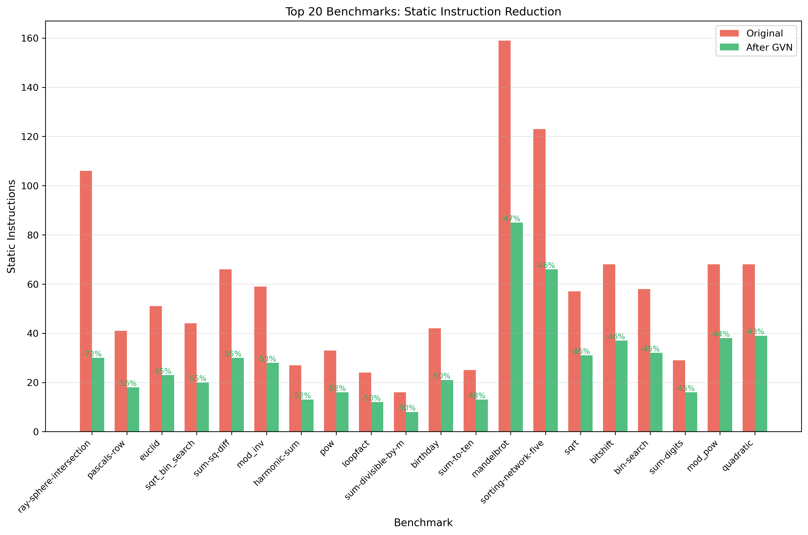

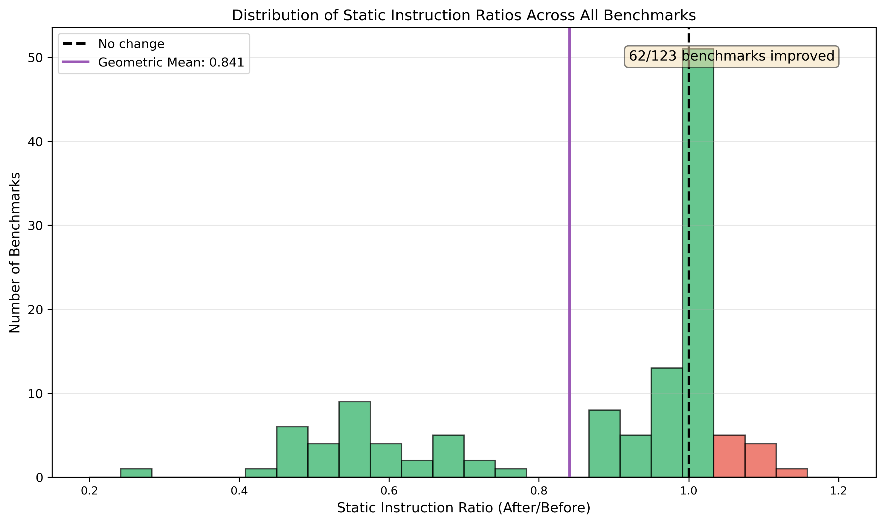

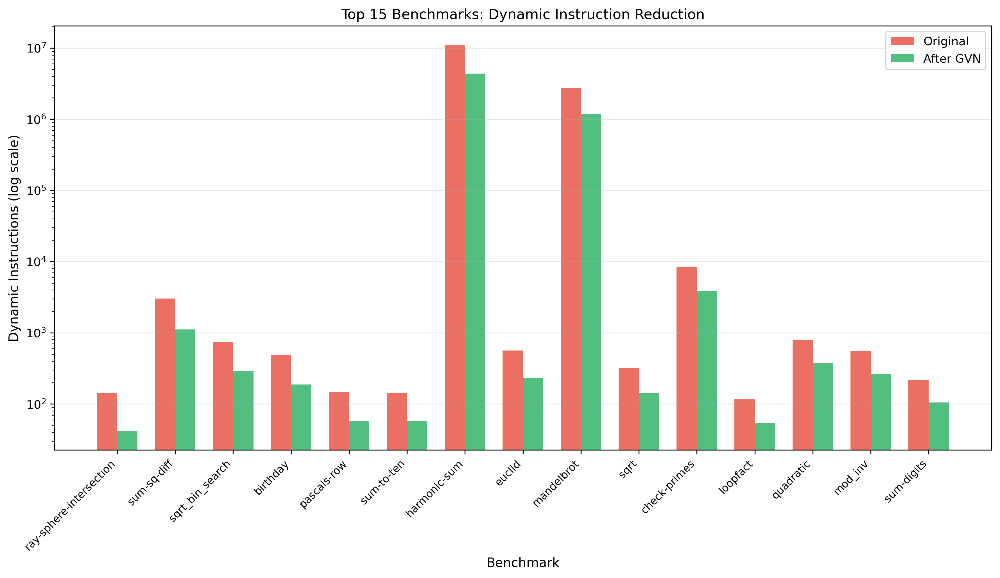

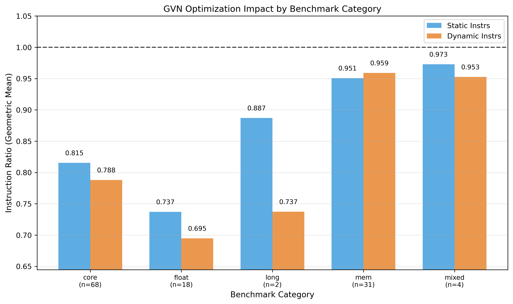

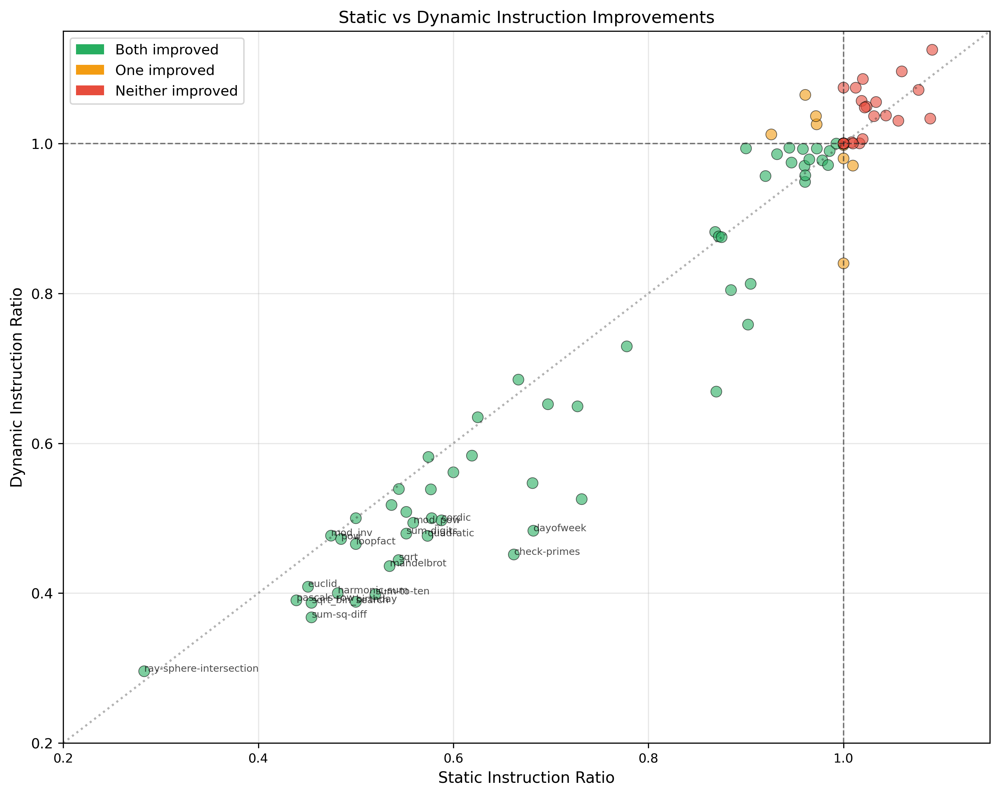

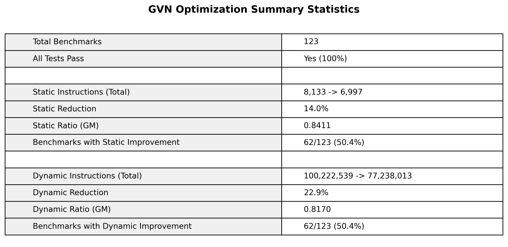

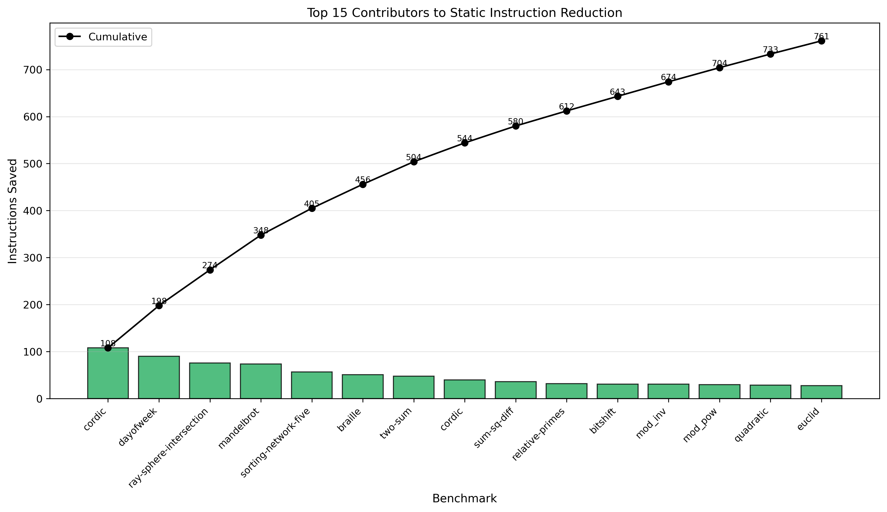

### SSA overhead diagnostics

These plots focus specifically on SSA round-trip overhead and how much the full pipeline recovers.

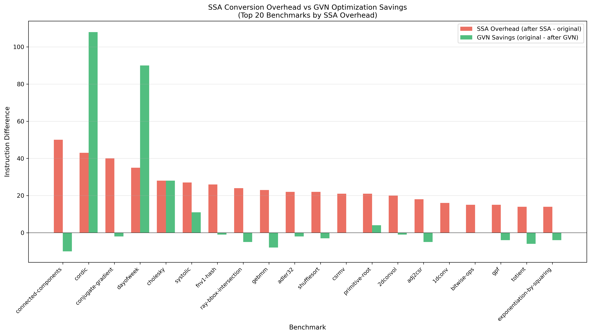

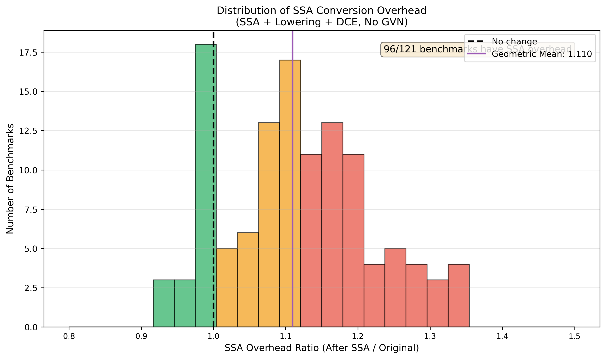

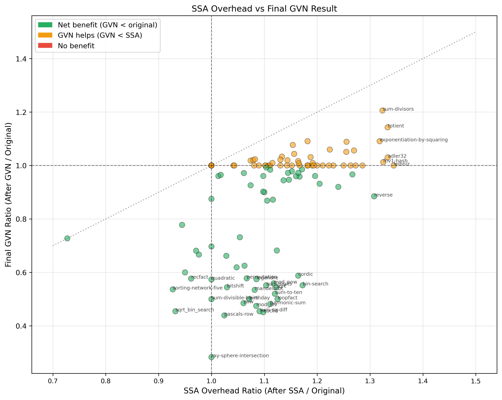

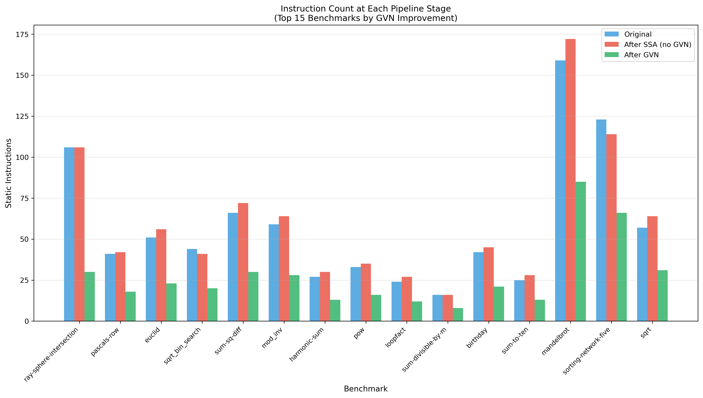

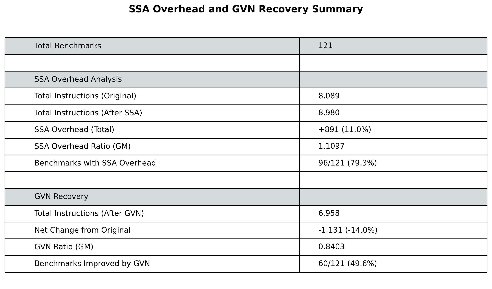

## 9. Comparison with Cooper–Briggs GVN

Our implementation closely follows the paper’s **dominator-tree, hash-based value numbering** strategy:

* Dominator-tree traversal with scoped expression tables
* Canonicalization of expressions
* Value numbering and elimination of redundant and meaningless phi nodes

We do **not** implement the paper’s partition-based (AWZ-style) algorithm, which can reason more precisely about cyclic SSA regions. We also do not implement AVAIL-based removal or PRE-style code motion. Instead, we rely on copy propagation and coalescing to realize most eliminations.

Compared to the paper, our design is more conservative in two respects: we assign fresh value numbers to loop-header phis, and we treat all effectful operations as global barriers. These choices simplify the implementation and ensure correctness in Bril, at the cost of reduced optimization power in some cases.

## 10. Reflections

Several lessons stood out in this project:

* **GVN is easy; making it pay off is hard.** The core algorithm is compact, but SSA construction and lowering dominate engineering effort.
* **SSA overhead matters in educational IRs.** Unlike production compilers, Bril requires explicit SSA round-tripping, making overhead elimination essential.
* **Conservatism buys correctness.** Treating loops and side effects conservatively avoided subtle bugs, even though it limited optimization scope.

With more time, the most impactful extensions would be better loop reasoning (e.g., limited iterative refinement for phi nodes) and memory versioning to enable redundancy elimination across loads.

## 11. Conclusion

We implemented dominator-tree–based Global Value Numbering for Bril and showed that, with careful SSA engineering, it yields substantial reductions in both code size and dynamic instruction count. Beyond GVN itself, this project highlights the practical importance of pruned SSA, correct phi lowering, and aggressive copy coalescing in making SSA-based optimizations effective in real compilers—even small ones like Bril.

## 5. Generative AI Usage

### 5.1 Tools Used

We used **Claude** and **ChatGPT** as AI assistants during development. Claude was primarily used via a command-line interface in the development environment, while ChatGPT was used through its web interface.

### 5.2 How We Used AI

The AI tools were used as part of the development workflow, primarily to support reasoning rather than to generate final artifacts. Their use fell into several categories:

* **Debugging**: When encountering complex bugs (such as the parallel copy sequentialization infinite loop), we used AI tools to help reason through the algorithm’s behavior and identify likely failure modes.
* **Algorithm clarification**: We asked for explanations of SSA concepts and implementation details, particularly distinctions such as minimal versus pruned SSA.
* **Code review**: After implementing components, we used AI tools to help surface potential edge cases and sanity-check logic.
* **Documentation**: The AI assisted in structuring the report and ensuring comprehensive coverage of relevant topics.

### 5.3 Illustrative Example

One representative interaction occurred while debugging the parallel copy sequentialization algorithm. We presented the failing case:

> **Us**: The parallel copy `(x, y, z) := (y, z, x)` causes an infinite loop.
>
> **Claude**: Let me trace through your algorithm...
>
> The issue is that the cycle detection checks whether a destination appears in the set of sources. In a 3-way cycle, *all* destinations are also sources. To make progress, the algorithm needs to break the cycle by saving one value to a temporary variable.
>
> A correct fix is:
>
> 1. Identify a variable that appears in both the source and destination sets (a cycle member)
> 2. Save that value to a temporary
> 3. Rewrite remaining copies to use the temporary where appropriate
> 4. This guarantees that at least one copy becomes safe to emit

This reasoning directly informed the corrected implementation of parallel copy sequentialization.

### 5.4 When AI Was Unhelpful

The AI tools occasionally suggested solutions that were overly complex for our setting. For example, when asked about copy elimination, they initially proposed constructing a full interference graph with graph coloring—an approach appropriate for register allocation but unnecessary for copy propagation. In practice, a simpler dominator-tree-based walk was sufficient.

The tools also sometimes lost track of pipeline phase distinctions (e.g., SSA vs. post-SSA), leading to suggestions that would have been unsound if applied directly. Such cases required careful verification against dominance and correctness invariants.

### 5.5 Assessment

Overall, the AI tools were useful as *pair-programming assistants* for explanation, debugging, and review. In practice, they worked best when their suggestions were treated as starting points rather than final answers, requiring the authors to reason through correctness, phase ordering, and SSA invariants themselves. This combination of AI-assisted exploration and human validation was necessary to arrive at sound implementations and reliable results.
