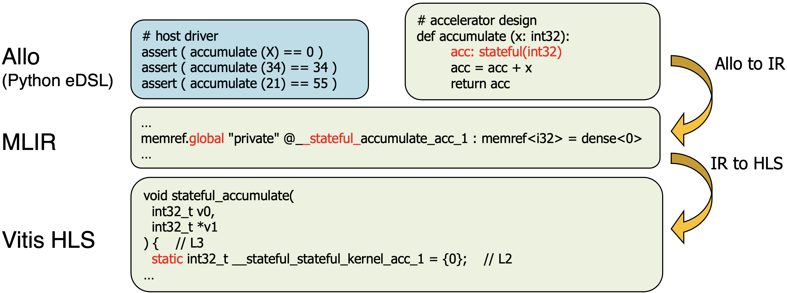

+++
title = "Modeling Stateful Accelerators in Allo"
[extra]
bio = """
  Sunwoo Kim is interested in AI hardware and is pursuing an ECE PhD at Cornell.
"""
[[extra.authors]]
name = "Sunwoo Kim (sk3463)"
link = "https://sunwookim028.github.io/"
+++

# Abstract
Allo is a composable programming model that lets users write algorithms in Python and generate hardware designs. Its original model is stateless, so local variables reset every call, hence on-chip memory elements cannot be modeled. We add the original `stateful(T)` type qualifier in the Python frontend and carry it through MLIR to generate static storage in Vitis HLS C++. A recent update adds the equivalent `@ Stateful` annotation; this report uses `stateful(T)` throughout for consistency.

Stateful variables let kernels retain intermediate values across invocations. This improves programmability (e.g., flexible tiling and multi-kernel programs) and reduces host-device copies. We demonstrate this with a parameterized TPU design in Allo and show up to a 1.22x speedup through reduced host-TPU data copy on a scalar accumulator on a Xilinx Alveo U280 FPGA.

It’s been merged into the upstream Allo.
Our PR here: [cornell-zhang/allo#487](https://github.com/cornell-zhang/allo/pull/487). The newer, functionally equivalent syntax is in [cornell-zhang/allo#509](https://github.com/cornell-zhang/allo/pull/509).

# Motivation
Modern accelerators optimize performance profile for targeted domains, at the cost of design complexity. Allo [1] addresses this by separating algorithm specification from hardware customization: users write Python kernels, Allo lowers them to an MLIR [2] dialect, and then emits synthesizable HLS C++ code.

However, Allo kernels are stateless: locals reset each call and there is no built-in way to persist state across invocations. This blocks common patterns like accumulators, shift registers, scratchpads, and tiled GEMM where partial results must persist. Users end up shuttling data on and off chip between calls, which adds overhead and complicates code.

To address this, we add a `stateful(T)` qualifier in the Python frontend (e.g., `acc: stateful(int32) = 0`) and propagate it through type inference, MLIR, and the HLS backend. Stateful variables become name-mangled MLIR `memref.global`s and are emitted as function-local `static` variables in HLS C++ [3]. The figure below summarizes the flow, and the next two sections detail the implementation.



# Allo to IR
We define a variable as stateful if it retains its value across kernel invocations. Stateful variables therefore have local scope but global lifetime, mirroring the behavior of C/C++ `static` variables.

## Syntax and Type System
To mark a variable `foo` of Allo data type `T`(e.g., scalars, arrays, structs) as persistent, we use the syntax `foo: stateful(T)`. Listing 1 shows the minimal user-facing change: a local accumulator now persists across calls. In CPython this local would still reset each call, so the qualifier explicitly asks the compiler to allocate persistent hardware state without relying on module-level globals.

**Listing 1: Stateful Kernel Definition**
```python
# A kernel that accumulates values across invocations
def stateful_kernel(x: int32) -> int32:
    # 'acc' retains its value between calls
    acc: stateful(int32) = 0
    acc = acc + x
    return acc
```

We extended the core type system (`AlloType`) in `types.py` with a boolean `stateful` flag and added a `stateful(dtype_spec)` helper. The helper returns a marker tuple that the type inference engine recognizes, so it can set `.stateful = True` on the underlying type. Treating statefulness as a qualifier (not a new type) keeps it compatible with all existing Allo types (scalars, arrays, structs).

The type inference engine in `infer.py` parses the `stateful(...)` marker in `visit_type_hint`, extracts the inner type, and instantiates it with the flag set. We also enforce in `visit_FunctionDef` that stateful types cannot be function arguments; to behave like hardware registers or C-static globals, they must be internal to the kernel.

## MLIR Generation
When the builder (`builder.py`) sees an annotated assignment for a stateful variable (`build_AnnAssign`), it emits a module-level `memref.global` so the storage outlives the function. We set `constant = false` and initialize the value via a `DenseElementsAttr` (e.g., `0` or a constant array).

Inside the function, we emit `memref.get_global` instead of `memref.alloc`, so all loads/stores use a handle to the persistent global. We name globals `__stateful_{func_name}_{variable_name}_{counter}` to avoid collisions and keep state local to a kernel's namespace. Future work is to replace the naming convention with an explicit custom attribute field. Listing 2 shows the MLIR.

**Listing 2: MLIR Translation of Stateful Kernel**
```mlir
module {
  // Global storage (persistent)
  memref.global "private" @__stateful_stateful_kernel_acc_1 : memref<i32> = dense<0>
  func.func @stateful_kernel(%arg0: i32) -> i32 {
    // 2. Local handle to storage
    %0 = memref.get_global @__stateful_stateful_kernel_acc_1 : memref<i32>
    // 3. Load/store operations using the handle
    %1 = affine.load %0[] {from = "acc"} : memref<i32>
    // ... arithmetic operations ...
    affine.store %5, %0[] {to = "acc"} : memref<i32>
    return %6 : i32
  }
}
```

## Hardware Instantiation and Isolation
In hardware, each kernel instance needs its own state. If the MLIR is cloned naively, multiple instances would point to the same `memref.global`, causing shared state and races. We fix this in `customize.py` by extending `compose()` to duplicate each referenced global per instance and rewrite the corresponding `memref.get_global` uses. Listing 3 shows two accumulator instances (`A1`, `A2`) with isolated state.

**Listing 3: Composition Requiring Instance Isolation**
```python
# A generic stateful accumulator kernel
def acc[T_in](x: "T_in") -> "T_in":
    state: stateful(T_in) = 0
    state = state + x
    return state

# Top-level driver calling the accumulator twice
def top(x: int32, y: int32) -> int32:
    # Explicitly naming instances "A1" and "A2"
    res1 = acc[int32, "A1"](x)
    res2 = acc[int32, "A2"](y)
    return res1 + res2

# Schedule construction
s1 = allo.customize(acc, instantiate=[int32])
s2 = allo.customize(acc, instantiate=[int32])
s = allo.customize(top)
# The compose step triggers the isolation logic
s.compose(s1, id="A1")
s.compose(s2, id="A2")
```

# HLS Codegen
The MLIR-to-HLS backend builds on Allo's existing stateless lowering. It walks the MLIR module and emits HLS C++ for loops, arithmetic, memrefs, and streams, adding pragmas for pipelining, unrolling, dataflow, and partitioning.

To support state, we treat `memref.global`s whose names include `_stateful_` as persistent variables (we plan to replace the naming convention with a custom attribute field). The emitter detects these, avoids top-level emission, and instead declares them as `static` inside the HLS top function. This preserves state across invocations while remaining synthesizable and does not affect stateless kernels. Listing 4 shows the resulting HLS code for Listing 1.

**Listing 4: HLS Translation of Stateful Kernel**
```cpp
void stateful_kernel(
  int32_t v0,
  int32_t *v1
) {    // L3
  static int32_t __stateful_stateful_kernel_acc_1 = {0};    // L2
  // placeholder for const int32_t __stateful_stateful_kernel_acc_1    // L4
  int32_t v3 = __stateful_stateful_kernel_acc_1;    // L5
  ap_int<33> v4 = v3;    // L6
  ap_int<33> v5 = v0;    // L7
  ap_int<33> v6 = v4 + v5;    // L8
  int32_t v7 = v6;    // L9
  __stateful_stateful_kernel_acc_1 = v7;    // L10
  *v1 = __stateful_stateful_kernel_acc_1;    // L11
}
```

# Evaluation
We built on upstream Allo at commit `794fb76` and tested on a Xilinx Alveo U280 FPGA using Vitis HLS 2023.2. We evaluated the correctness and performance and programmability gains of stateful Allo.

## Correctness
We manually wrote tests to check the stateful operations are functional and generates correct HLS code. An example is in Listing 5.

**Listing 5: Correctness tests for Stateful Kernel**
```
def test_stateful_scalar():
    """Test stateful scalar accumulator"""

    def acc_stateful(x: int32) -> int32:
        acc: int32 @ stateful = 0
        acc = acc + x
        return acc

    s = allo.customize(acc_stateful)
    mod = s.build(target="llvm")

    # Test: stateful should accumulate across calls
    result1 = mod(5)
    result2 = mod(10)
    result3 = mod(3)
    assert result1 == 5, f"Expected 5, got {result1}"
    assert result2 == 15, f"Expected 15, got {result2}"
    assert result3 == 18, f"Expected 18, got {result3}"
    print("test_stateful_scalar passed!")


def test_stateful_scalar_hls():
    """Test HLS code generation for stateful scalar"""

    def test_stateful_scalar(x: Int(4)) -> Int(4):
        acc: Int(4) @ stateful = 0
        acc = acc + x
        return acc

    s = allo.customize(test_stateful_scalar)
    mod = s.build(target="vhls")
    code = mod.hls_code

    # Static qualifier must be present for stateful variables
    static_count = len(re.findall(r"\bstatic\b", code))
    assert (
        static_count >= 1
    ), f"Expected at least one static variable for stateful state, found {static_count}"

    # Static variable should be of correct type (ap_int<4>)
    assert re.search(
        r"static\s+ap_int<4>", code
    ), "Expected static variable with ap_int<4> type"

    # Static variable should be initialized to 0
    static_init_pattern = r"static\s+ap_int<4>\s+\w+\s*=\s*\{?0\}?"
    assert re.search(
        static_init_pattern, code
    ), "Expected static variable to be initialized to 0"

    print("test_stateful_scalar_hls passed!")
```

## Performance
As on-chip state saves shuttling intermediate results, a stateful kernel should run faster than a stateless equivalent by the amount of data movement time. As a simple example to demonstrate this, we deployed the stateless and stateful scalar accumulator design on a Xilinx Alveo U280 FPGA using Vitis HLS 2023.2. We report host wall-clock times measured around kernel invocations after warm-up.

Results show 1.22x speedup (Table 1), which would’ve came from reduced host-device  passing and managing the prior accumulator value each call. Keeping state on-chip enables faster successive invocations and better data reuse.

**Table 1. Execution time of accumulating int32 type data on FPGA 100 times.**

| Implementation | Execution time (after warm-up) |
| --- | --- |
| Stateless (baseline) | 11.2 ms |
| Stateful (ours) | 9.2 ms |

## Programmability
To demonstrate stateful kernels in more realistic context, we implemented a parametrized Tensor Processing Unit (TPU) with a stateful scratchpad. This also shows that composed kernels can share a stateful memory.

Now TPU software can be constructed with multiple TPU kernels sharing variables. For instance, three kernels are sharing `H_device` in Listing 5.

This shows that our feature enables modeling shared memory architecture and also hardware that supports composable kernel launches, offering programmability gains.

**Listing 5: TPU (stateful(T) syntax)**
```python
def tpu(...):
    scratchpad: stateful(int32[MEM_CAP]) = 0
    ...
    if instr == MM:
        mxu(...)
    elif instr == VOP_VADD:
        vpu(...)
    ...

# software
H_device = tpu.alloc(size)
tpu.launch(matmul, X_device, W_device, H_device)
tpu.launch(vadd, size, H_device, A_device, H_device)
tpu.launch(relu, H_device, Y_device)
```


# Conclusion
We extended the Allo DSL with the `stateful(T)` qualifier so persistent hardware state can be expressed in Python and preserved through MLIR lowering and HLS code generation. The change spans the frontend type system, MLIR lowering, scheduling/instantiation, and the MLIR-to-HLS backend, where stateful variables become isolated globals and are emitted as function-local `static` variables in Vitis HLS C++.

We demonstrate a programmable accelerator and show that keeping state on-chip is more efficient than round-tripping through the host. We hope this makes Allo more practical for ASIC-style programmable accelerators.

# Acknowledgements
This report builds on a team submission for ECE6775 with Jenny Lee, Joseph Maheshe, and Jifeng Wu; that submission provided much of the content here. We also thank Professor Zhiru Zhang and the Allo leads Hongzheng Chen and Niansong Zhang for guidance and feedback.

# References
[1] H. Chen & N. Zhang et al., *Allo: A Programming Model for Composable Accelerator Design*, PLDI 2024.

[2] C. Lattner et al., *MLIR: Scaling Compiler Infrastructure for Domain Specific Computation*, CGO 2021.
