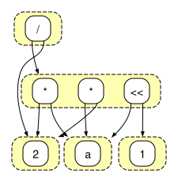

+++
title = "Technology Mapping with Egraphs"
[extra]
bio = """
  Arnav Muthiyan is a <!--TODO -->. 
  Neel Patel is a first year PhD student interested in computer architecture and systems. 
"""
[[extra.authors]]
name = "Arnav Muthiyan"
[[extra.authors]]
name = "Neel Patel"
+++

## Introduction
### E-graphs and Equality Saturation
E-graphs efficiently represent equivalence classes of expressions. This makes them useful for superoptimization, where, given an input program, we seek to find the sequence of optimizations that emits the *best* program. The example below shows an arithmetic expression a * 2 / 2 represented as an e-graph.

In *equality saturation*, we apply pattern-based *rewrites* to repeatedly produce equivalent expressions. Each rewrite grows the e-graph, without losing the previous versions of the expression. Upon saturation, an e-graph will have undergone enough rewrites to reach a fixed point where it encodes all possible expressions simultaneously.
<!--- -->
Equality saturation has found applications in compiler optimization and, recently RTL synthesis. The E-graphs Good (egg) library provides a fast and extensible implementation of equality saturation, enabling the use of E-graphs in more applications.
<!--- -->
The benefit of equality saturation is that it avoids the problem of finding the optimal order in which to apply optimizations (the phase-ordering problem) by encoding all possible optimizations within the e-graph. The catch is that a separate procedure, called *extraction*, is required to actually select the best term from the e-graph according to a user-provided cost function.

<!--- -->
For some simple cost functions, the optimal expression can be found by applying a greedy, bottom-up, extraction procedure, but, in general, the problem of extracting an optimal solution has been shown NP-hard. Currently, Egg implements two extractors.
The first is a [heuristic greedy extractor](https://github.com/egraphs-good/egg/blob/v0.10.0/src/extract.rs) which expresses the cost of an e-node as the aggregate cost of its children.
The second is an [exact extractor](https://github.com/egraphs-good/egg/blob/v0.10.0/src/lp_extract.rs) which formulates extraction as a mixed integer linear programming problem and solves it using the [COIN-OR](https://github.com/coin-or/Cbc) Branch-and-cut solver.
<!--- The former has been shown to select terms with suboptimal costs, while the latter does not scale well to larger problems, leading to a poor scalability-quality tradeoff [[Cai et al. 2025](https://www.csl.cornell.edu/~zhiruz/pdfs/smoothe-asplos2025.pdf)]. -->

### E-graphs for Technology Mapping
<!--TODO: Change depending on whether we can run ASIC flow or explain the issues.-->
The task of technology mapping in logic synthesis is to express a given Boolean function as a network of gates from a standard cell library (for ASICs) or programmable LUTs (for FPGAs) so that an objective function, such as total area or delay, is optimized.

<!--TODO: Explain what the state-of-the-art in technology mapping i.e., ABC and heuristic algorithms -->

<!--TODO: Explain why e-graphs are a good way to represent designs and which (if any) prior works -->

### Contributions
<!--TODO: Then explain our contributions
1) Correct formulation of a cost model for area-optimization of ASIC designs for use in ILP extraction
2) Comparison of greedy and ILP extraction for superoptimization of RTL targetting both FPGAs and ASICs
-->
In this project, we completed the integration of an exact extractor into the *msynth* electronic design automation tool, which transforms designs specified in verilog into area-optimal designs using components from a standard cell library.
Both msynth, and its sister tool, *lvv* -- which produces FPGA netlists -- now support greedy and exact extraction.
We compare the performance of both of these tools in terms of time to extract a design and quality of the resulting design.

## Optimizing RTL using E-Graphs

### Specifying an RTL Design
Below we give an example of a half-adder written in a domain-specific, circuit-specification language called *LutLang*. lvv takes a verilog program as input, but represents the program as a LutLang expression to perform optimizations before converting back to verilog and emitting the optimized design.
<!-- TODO: Example of a circuit written in LUTLang -->

### Equality Saturation
<!-- TODO: Show how the circuit is represented as an egraph-->
The e-graph of the original design, before equality saturation, looks like:

<!-- TODO: Show the rewrite rules and how the rewrites are applied to the egraph  -->
During equality saturation, rewrite rules transform the two-input gates into programmable LUTs, specified by three parameters: a program (numeric e-node), and two operands (a and b).

### Design Extraction

During extraction, an optimal design is produced using either the greedy or exact approach explained in the [E-graphs and Equality Saturation](#e-graphs-and-equality-saturation) section.

## Results

* We compare the number of LUTs in the designs extracted using greedy and ILP extraction on the ISCAS85 verilog design benchmarks. Since Exact LUT count fails to find a solution once the number of rewrite iterations becomes large (the size of the e-graph gets too big), we attempted to run each benchmark to 10 rewrite iterations. Some, like c3540, c6288, and c7552 did not complete 10 iterations.

| Benchmark | No Optimization LUT Count  | Greedy LUT Count | Exact LUT Count (# Rewrite Iterations) |
|-----------|----------------------------|------------------|-----------------|
| c1355     | 96                         | 94               | 94 (10)         |
| c17       | 2                          | 2                | 2 (10)          |
| c1908     | 86                         | 85               | 86 (10)         |
| c2670     | 120                        | 119              | 118 (10)        |
| c3540     | 265                        | 260              | 258 (3)         |
| c432      | 51                         | 50               | 50 (10)         |
| c499      | 90                         | 90               | 90 (10)         |
| c5315     | 267                        | 266              | 264 (10)        |
| c6288     | 520                        | 512              | 511 (8)         |
| c7552     | 335                        | 325              | 328 (9)         |

* We compare the time to perform greedy and ILP extraction on the ISCAS85 verilog design benchmarks when extracting designs targeting an ASIC.

| Benchmark | Greedy Time       | Exact Time       |
|-----------|-------------------|------------------|
| c1355     | 0.014683506       | 592.576364288    |
| c17       | 0.000015339       | 0.047621979      |
| c1908     | 0.013643256       | 580.703048272    |
| c2670     | 0.014628216       | 592.308684103    |
| c3540     | 0.027794132       | 6.183054221      |
| c432      | 0.009021587       | 588.374009831    |
| c499      | 0.012706906       | 586.398412895    |
| c5315     | 0.016442          | 583.762630907    |
| c6288     | 0.033019137       | 88.027779099     |
| c7552     | 0.021390077       | 590.099322901    |
| c880      | 0.015240757       | 0.074230685      |

* We compare the area of the designs extracted using greedy and ILP extraction on the ISCAS85 verilog design benchmarks using a standard cell library. Since the logic needs to be synthesized to a standard cell library, a set of rewrite rules is required to convert the LUT-based representation to a standard cell representation. We therefore do not include a No Optimization LUT Count column in this table.

| Bench   | Greedy Area   | Exact Area   |
|---------|---------------|--------------|
| c1355   | 429.32428     | 323.45593    |
| c17     | 6.9160004     | 6.118        |
| c1908   | 438.36798     | 345.53387    |
| c2670   | 669.25555     | 563.6538     |
| c3540   | 1091.3983     | 724.58307    |
| c432    | 188.5938      | 158.00392    |
| c499    | 273.44772     | 238.8677     |
| c5315   | 1352.5999     | 1320.1482    |
| c6288   | 1244.3474     | 176.88991    |
| c7552   | 1218.539      | 958.1368     |
| c880    | 297.91995     | 229.02611    |

* We compare the time to perform greedy and ILP extraction on the ISCAS85 verilog design benchmarks when extracting designs targetting an ASIC.

| Benchmark | Greedy Time   | Exact Time |
|-----------|---------------|------------|
| c1355     |               |            |
| c17       |               |            |
| c1908     |               |            |
| c2670     |               |            |
| c3540     |               |            |
| c432      |               |            |
| c499      |               |            |
| c5315     |               |            |
| c6288     |               |            |
| c7552     |               |            |
| c880      |               |            |