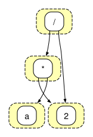
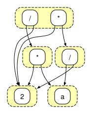
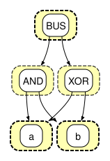
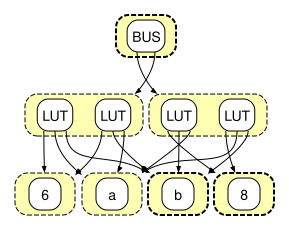

+++
title = "Technology Mapping with Egraphs"
[extra]
bio = """
  Arnav Muthiayen is a third year undergraduate student interested in computer architecture.<br>
  Neel Patel is a first year PhD student interested in computer architecture and systems.<br>
"""
[[extra.authors]]
name = "Arnav Muthiayen"
[[extra.authors]]
name = "Neel Patel"
+++

## Introduction
### E-graphs and Equality Saturation
[Equality-graphs](https://en.wikipedia.org/wiki/E-graph), or more simply, e-graphs, efficiently represent equivalence classes of expressions. This makes them useful for superoptimization, where, given an input program, we seek to find the sequence of optimizations that emits the *best* program, minimizing some user-provided cost function. E-graphs are directed graphs with edges from expressions (*e-nodes* in an e-graph), to a group of e-nodes (an *e-class* in an e-graph, where all the e-nodes contained are equivalent expressions). To efficiently maintain and merge these equivalence classes, e-graphs rely on a union-find data structure. The example below shows an arithmetic expression `a * 2 / 2` represented as an e-graph.



In [*equality saturation*](https://arxiv.org/pdf/1012.1802), we apply pattern-based *rewrites* to repeatedly produce equivalent expressions. Each rewrite grows the e-graph, without losing the previous versions of the expression. So if two expressions always evaluate to the same result, they belong in the same e-class. As long as the rewrites do not lead to unbounded e-graph expansion, the e-graph will reach a saturated state where all possible programs resulting from all rewrite rules are represented within the e-graph.


Using the previous example expression, `a * 2 / 2`, three (among many other) rewrite rules can be applied:
1. Division associativity
2. Constant folding
3. Multiplicative identity

As rewrite rules are applied to the expression `a * 2 / 2`, each transformation produces an equivalent form: first rewriting it as `a * (2 / 2)` using division associativity, then simplifying to `a * 1` via constant folding, and finally reducing to `a` using the multiplicative identity. Though the expression changes, all versions are equivalent. It's important to note that applying more rewrite rules, such as multiplicative commutativity or replacing `x * 2` with `x << 1`, doesn’t erase existing expressions. Instead, it expands the e-class by adding more equivalent expressions. The e-graph grows to represent several equivalent expressions, giving the optimizer more options to choose from.



Equality saturation has found applications in compiler optimization and, recently, RTL synthesis. The [E-graphs Good](https://egraphs-good.github.io/) (egg) library provides a fast and extensible implementation of equality saturation, enabling the use of E-graphs in more applications.
The benefit of equality saturation is that it avoids the problem of finding the optimal order in which to apply optimizations (the phase-ordering problem) by encoding all possible optimizations within the e-graph. The catch is that a separate procedure, called *extraction*, is required to actually select the best term from the e-graph according to a user-provided cost function.

For some simple cost functions, the optimal expression can be found by applying a greedy, bottom-up, extraction procedure, but, in general, the problem of extracting an optimal solution has been shown NP-hard. Currently, Egg implements two extractors.
The first is a [heuristic greedy extractor](https://github.com/egraphs-good/egg/blob/v0.10.0/src/extract.rs) which expresses the cost of an e-node as the aggregate cost of its children.
The second is an [exact extractor](https://github.com/egraphs-good/egg/blob/v0.10.0/src/lp_extract.rs) which formulates extraction as a mixed integer linear programming problem and solves it using the [COIN-OR](https://github.com/coin-or/Cbc) Branch-and-cut solver.

### E-graphs for Technology Mapping
The task of [technology mapping](https://course.ece.cmu.edu/~ee760/760docs/lec10.pdf) in logic synthesis is to express a given Boolean function as a network of gates from a standard cell library (for ASICs) or programmable LUTs (for FPGAs) so that an objective function, such as total area (or number of LUTs), is optimized.

Traditional technology mapping tools like [ABC](https://people.eecs.berkeley.edu/~alanmi/abc/) rely on cut enumeration and dynamic programming to select optimal gate implementations. ABC supports both FPGA and ASIC targets and can operate on logic networks with structural choices—precomputed alternative implementations of subcircuits. Its recent addition of a priority-cut-based mapper improves performance by only considering the most promising cuts per node, reducing memory use and runtime. However, the mapper's effectiveness still depends heavily on the initial circuit structure, which may limit optimization potential.

E-graphs offer a more expressive alternative. Rather than selecting cuts locally, they grow a graph of equivalent expressions using rewrite rules. This enables the representation of many circuit topologies simultaneously, effectively enumerating structural choices upfront. After saturation (or a time limit is reached), extraction selects an implementation based on a cost model. Prior work has demonstrated the promise of this approach. [E-Syn](https://arxiv.org/pdf/2403.14242) integrates e-graph rewriting into a delay- and area-aware mapping, showing measurable improvements over standard AIG-based pipelines in delay and area savings. [ROVER](https://ieeexplore.ieee.org/iel8/43/10762795/10549954.pdf) applies e-graphs to RTL datapath optimization and uses ILP-based extraction to achieve up to 63% area savings. These results validate e-graphs as a competitive backend for logic synthesis, capable of exploring larger design spaces than traditional mappers.

### Contributions
In this project, we integrate multiple linear programming solvers into an e-graph-based electronic design automation (EDA) tool. By using the [good_lp](https://github.com/rust-or/good_lp) library to implement an exact extractor in the [egg](https://github.com/egraphs-good/egg) library, the EDA tool can now use a larger set of solvers. Our good\_lp-based exact extractor is [available](https://github.com/neel-patel-1/egg) and can be used by any projects using the egg library (not just logic synthesis for FPGAs/ASICs).
We evaluate the performance of our exact extractor in the context of logic synthesis using the EDA tool, which transforms designs specified in the Verilog hardware description language into designs targetting FPGAs or ASICs.

## Optimizing RTL using E-Graphs

### Specifying an RTL Design

For this project, we use an ongoing research compiler in the Zhang research group, called `lvv`. lvv performs optimizations on a domain-specific, circuit-specification language called *LutLang*.
Here is a rough outline of the grammar defined by LutLang:
```
<LutLang> ::= <Program> | <Node> | BUS <Node> ... <Node>

<Node> ::= <Const> | x | <Input> | NOR <Node> <Node> | MUX <Node> <Node> <Node>
            | LUT <Program> <Node> ... <Node> | REG <Node> | ARG <u64> | CYCLE <Node>

<Const> ::= false | true // Base type is a bool

<Input> ::= <String> // Any string is parsed as an input variable

<Program> ::= <u64> // Can store a program for up to 6 bits
```

lvv takes Verilog as input, but converts it into LutLang before performing optimizations and then converts it back into Verilog.

Below we give an example of a half-adder written in LutLang:

`(BUS (AND a b) (XOR a b))`


### Equality Saturation
An e-graph representation of the original design using boolean logic, is shown below:



The two-input gates are first transformed into programmable LUTs specified by three parameters: a truth table (numeric e-node), and two operands (a and b). During equality saturation, rewrite rules are applied until all possible designs are encoded in the e-graph.




### Design Extraction

During extraction, an optimal design is produced using either a greedy or exact (linear programming) method as explained in the [E-graphs and Equality Saturation](#e-graphs-and-equality-saturation) section.
To apply linear programming to the e-graph extraction problem, a set of constraints and objective function must be specified.
We use the mixed integer linear programming problem formulation specified by [Yang et al.](https://arxiv.org/pdf/2101.01332):

Let:
- `i = 0, ..., N - 1` be the set of e-nodes in the e-graph.
- `m = 0, ..., M - 1` be the set of e-classes in the e-graph.
- `e_m` denote the set of e-nodes within e-class `m`: `{i | i ∈ e_m}`.
We introduce a binary integer variable `x_i` for each e-node `i`. A node `i` is selected if `x_i = 1`, and not selected otherwise.
#### Objective Function:
Each e-node is associated with a cost `c_i`. The objective is to minimize the total cost of the selected nodes:
#### Subject to:
1. `x_i ∈ {0, 1}` for all `i`.
2. `Σ x_i = 1` for all `i ∈ e_0` (root e-class).
3. For all `i ∈ h_i` and `m ∈ h_i`, `x_i ≤ Σ x_j` for all `j ∈ e_m`.
4. Acyclicity constraints: For all `i, m ∈ h_i`, `t_g(i) - t_m - c + A(1 - x_i) ≥ 0`.
5. Bounds on Acyclicity variables: `0 ≤ t_m ≤ 1`.

Currently, egg's LP extractor is written to use the [COIN-OR Branch-and-Cut](https://github.com/coin-or/Cbc) (cbc) ILP solver, but there are a number of ILP solvers which have been shown to perform well -- some of which have already been applied to the e-graph extraction problem -- so it is not yet clear whether other solvers perform better the ILP formulation of e-graph extraction. At the same time, an ILP solver must support any possible valid set of constraints, variables, and objective function. Complex, yet-unseen problems -- which will arise frequently when applying e-graphs to domains like code optimization and RTL synthesis -- can trigger [unexpected behaviors](https://github.com/coin-or/Cbc/issues/478) in the solver, leading to errors which are difficult to reason about. As we show in [Results](#results), such errors occur frequently when applying cbc to e-graph-based ASIC logic synthesis.

To sidestep such issues, and enable efficient performance testing of multiple solvers on logic synthesis problems, we chose to use the good\_lp rust crate to implement an LP extractor with multiple solver backends.
The good\_lp rust crate provides a clean API for expressing problem variables, constraints, and objective function. It also provides multiple solver backends, including [HiGHs](https://highs.dev/), [SCIP](https://scipopt.org/#scipoptsuite), [microlp](https://github.com/Specy/microlp/), and COIN-OR Branch-and-Cut, which can be selected at compile- or run-time.
good\_lp will transform the programmer-provided problem specification into the implementation-specific data structures and method invocations to solve the problem using the chosen LP solver. By writing our exact extractor using good\_lp, the implementation is agnostic to the solver backend and the problem variables, constraints, and objective function are easy to read and understand in the code.

## Results

### FPGA Synthesis

We first compare the number of LUTs in the designs synthesized using greedy and exact extraction on the [ISCAS85](https://github.com/matth2k/synth-benchmarks/tree/main/verilog/iscas85) design benchmarks. E-graph-based tech mapping is performed after an initial FPGA synthesis using [Yosys](https://yosyshq.readthedocs.io/projects/yosys/en/0.46/cmd/synth_xilinx.html), which does an initial tech mapping using the ABC tool. Since finding an exact solution quickly becomes prohibitive in terms of extraction time (the size of the e-graph and corresponding linear programming problem gets too large) we fix a 2000 node limit on the size of the e-graph and time out the solver after (roughly) 10 minutes.

| Benchmark | Yosys (w/ ABC) | Greedy LUT Count | HiGHS LUT Count | CBC LUT Count | egg CBC LUT Count |
|-----------|-------|------------------|-----------------|---------------|-------------------|
| c1355     | 96    | 94               | 96              | 96            | 96                |
| c17       | 2     | 2                | 2               | 2             | 2                 |
| c1908     | 86    | 85               | 85              | 85            | 85                |
| c2670     | 120   | 119              | 120             | 120           | 120               |
| c3540     | 265   | 260              | 264             | 264           | 264               |
| c432      | 51    | 50               | 49              | 49            | 49                |
| c499      | 90    | 90               | 90              | 90            | 90                |
| c5315     | 267   | 266              | 266             | 267           | 267               |
| c6288     | 520   | 512              | 520             | 520           | 520               |
| c7552     | 335   | 325              | 334             | 335           | 335               |
| c880      | 84    | 81               | 80              | 80            | 80                |

The times to solution (in seconds) are reported in the table below:

| Benchmark | Greedy Time | HiGHS Time | CBC Time | egg CBC Time |
|-----------|-------------|------------|----------|--------------|
| c1355     | 0.018       | 59.74      | 598.38   | 7.23         |
| c17       | 0.00003     | 0.017      | 0.007    | 0.09         |
| c1908     | 0.017       | 21.28      | 601.29   | 4.17         |
| c2670     | 0.020       | 8.07       | 0.868    | 0.87         |
| c3540     | 0.035       | 18.29      | 0.592    | 0.59         |
| c432      | 0.012       | 41.42      | 602.13   | 101.40       |
| c499      | 0.016       | 52.84      | 606.19   | 7.21         |
| c5315     | 0.019       | 12.10      | 0.624    | 0.62         |
| c6288     | 0.045       | 23.51      | 605.03   | 0.80         |
| c7552     | 0.027       | 9.62       | 0.425    | 0.42         |
| c880      | 0.016       | 11.45      | 605.36   | 2.15         |

We observe a scalability-quality tradeoff for exact extraction. Exact extraction requires orders of magnitude longer to produce a solution and very rarely produces better designs than the greedy extractor. This is likely due to the restrictions we place on the size of the e-graph and solver. Without restrictions on running time and e-graph size, it may be worthwhile to use exact extraction, but we are unable to show significant improvements with this setup -- only 2/11 benchmarks show any improvement over the greedy extractor.
We also observe that egg's CBC solver outperforms our good\_lp-based solver in terms of time to solution. We believe this to be due to differences in how the two implementations handle cycles. As specified in the constraints in [Design Extraction](#design-extraction), a subgraph extracted from an e-graph should not contain cycles. To address this, Egg's cbc solver filters cycles before formulating a linear programming problem and solving it with COIN-Or Branch-and-Cut's solver. Our good\_lp solver handles cycles with an acyclicity constraint which must be respected by solver. [Prior work](https://arxiv.org/pdf/2101.01332) has shown that the acyclity constraint is the main bottleneck for linear-programming-based e-graph extraction.

### ASIC Synthesis

We also compare the area (µm²) of synthesized ASIC designs extracted using greedy and exact extraction. We use another e-graph-based logic synthesis tool, called msynth, which operates similarly to lvv, but can synthesize ASIC designs using a standard cell library. Synthesizing an ASIC design using exact extraction becomes prohibitive faster than synthesis targetting an FPGA due to the larger design search space. The transformation from digital logic to standard cells is encoded in the rewrite rules, so both transformation from logic gates to standard cells and optimization take place simultaneously. We also compare against the Synopsys commercial design compiler to show the design quality a tuned EDA tool can achieve.

<!--./scripts/msynth-iscas85.sh (with -n 1, then -n 4 until c17-highs and c17-egg_cbc improve improves and ) ;./scripts/parse_msynth.sh   -->
| Benchmark | Greedy Area | HiGHS Area | egg CBC Area | CBC Area   | Synopsys |
|-----------|-------------|------------|--------------|------------|----------|
| c1355     | 296.86      | 434.11     | Infeasible   | 439.17     | 254.56   |
| c17       | 7.18        | 6.92       | Infeasible   | 7.18       | 6.92     |
| c1908     | 305.10      | 401.93     | 423.47       | Infeasible | 229.29   |
| c2670     | 592.12      | 762.89     | 781.51       | Infeasible | 424.00   |
| c3540     | 895.36      | 979.95     | Infeasible   | Error      | 537.59   |
| c432      | 185.93      | 176.36     | 187.53       | 187.53     | 107.46   |
| c499      | 259.08      | 272.38     | 272.38       | 272.38     | 255.63   |
| c5315     | 1327.07     | Error      | Infeasible   | Error      | 813.43   |
| c6288     | 3264.89     | Error      | Infeasible   | Error      | 1239.83  |
| c7552     | 1617.00     | Error      | Infeasible   | Error      | 913.18   |
| c880      | 257.22      | 265.73     | Infeasible   | Error      | 224.24   |

| Benchmark | Greedy Time | HiGHS Time | egg CBC Time | egg CBC Time |
|-----------|-------------|------------|--------------|------------|
| c1355     | 0.020       | 0.484      | Infeasible   | 0.209      |
| c17       | 0.009       | 0.039      | Infeasible   | 143.69     |
| c1908     | 0.035       | 193.03     | 603.74       | Infeasible |
| c2670     | 0.025       | 277.81     | 611.29       | Infeasible |
| c3540     | 0.037       | 100.99     | Infeasible   | Error      |
| c432      | 0.028       | 127.04     | 604.09       | 178.49     |
| c499      | 0.024       | 39.59      | 19.22        | 0.197      |
| c5315     | 0.136       | Error      | Infeasible   | Infeasible |
| c6288     | 0.627       | Error      | Infeasible   | Error      |
| c7552     | 0.108       | Error      | Infeasible   | Error      |
| c880      | 0.032       | 8.49       | Infeasible   | Error      |

As shown in the tables, many designs generate problems the cbc solver cannot handle. The entries labelled infeasible indicate the solver (mistakenly) identified the problem to be infeasible. When running with an alternative solver (e.g., HiGHs) a correct design is generated, which we verify with Yosys [equivalence checking](https://yosyshq.readthedocs.io/projects/yosys/en/latest/cmd/equiv_simple.html). Not all solvers implement support for [descriptive error messages](https://stackoverflow.com/questions/37593986/cbc-know-why-a-program-is-infeasible), making it is difficult to determine the source of the error, and how we might modify the problem formulation to work with the solver. The issues are not only found in egg's exact extractor implementation using cbc -- we find similar issues when using cbc through good\_lp.
Some errors (e.g., errors when using HiGHS) occur due to time limitations. Since we are unable to perform exact extraction over large e-graphs, we must restrict the size of the e-graph by limiting the number of rewrites. By doing so, it is possible for some logic not to be mapped to standard cells. In this scenario, the tool emits an error instead of an incorrect design.
Through this evaluation, we observe that greedy extraction cannot achieve the design quality of optimized EDA tools, but it is impractical to achieve high quality designs using exact extraction, due to its poor scalability. This motivates novel extraction approaches that find a better trade between solution quality and scalability.

## Conclusion

The end goal of the project changed after the proposal. Initially, we aimed to integrate an efficient extraction algorithm, called [SmoothE](https://www.csl.cornell.edu/~zhiruz/pdfs/smoothe-asplos2025.pdf), into the EDA tool used throughout this project. As a stepping stone towards an implementation, we decided to first implement a linear programming-based extraction algorithm.
Getting our LP solver implementation to emit correct results took more effort than expected. At the same time, the EDA tool had only recently added support for ASIC logic synthesis using a standard cell library, so exact extraction had not yet been fully implemented and tested. For this reason we decided to focus on developing a correct implementation of LP extraction. Despite the less ambitious end goal, there were numerous challenges.

Long synthesis times for exact extraction made debugging challenging. Working with simple, fast-to-synthesize test cases is not enough. Simple test cases' e-graphs are not representative of complex designs with thousands of e-nodes, hundreds of thousands of constraints, and many cycles.
The size and complexity of logic synthesis for ASICs revealed the limitations of solver libraries, which we sought to address by making the the EDA tool's exact extraction implementation agnostic to the solver.